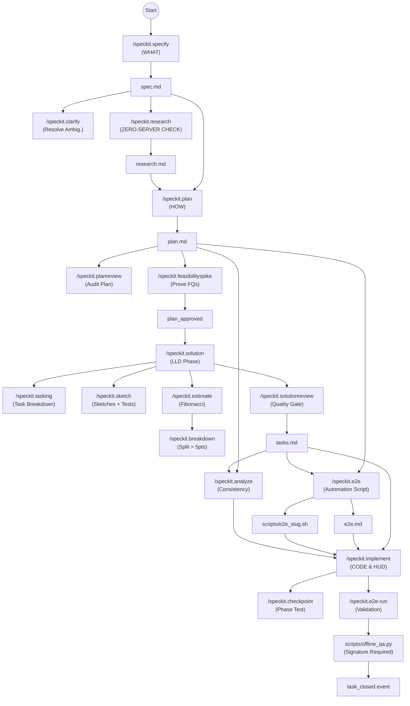

# ib-trading Pipeline Workflow (State Machine)

This is the authoritative, **hard-gated** step order for every new feature. Behavior is physically blocked by artifact existence at each gate.

For structured command metadata (input artifacts, output artifacts, audit events), see the **Full Feature Pipeline Matrix** in `constitution.md`.
