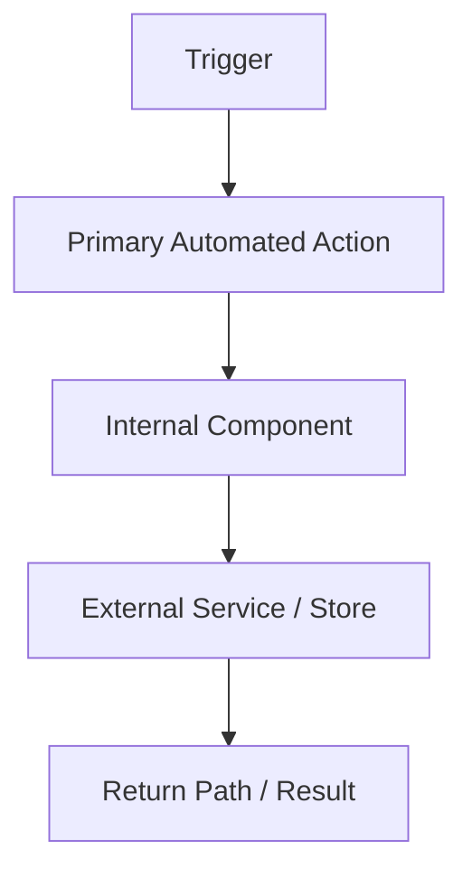

# Implementation Plan — [FEATURE_NAME]

_Date: [DATE]_  
_Feature: `[FEATURE_ID]`_  
_Source Spec: `spec.md`_  
_Artifact: `plan.md`_

## Summary

### Feature Goal

[Describe the feature in one paragraph from an architecture/planning perspective.]

### Architecture Direction

[State the chosen architecture direction in plain language.]

### Why This Direction

[Explain why this architecture is the preferred fit for the feature, given requirements, research, and repo constraints.]

---

## Technical Context

| Area | Decision / Direction | Notes |
|------|-----------------------|-------|
| Language / Runtime | [value] | [notes] |
| Technology Direction | [category + constraints] | [notes] |
| Technology Selection | [chosen tools/libraries/platforms] | [notes / evidence] |
| Storage | [value] | [notes] |
| Testing | [value] | [notes] |
| Target Platform | [value] | [notes] |
| Project Type | [value] | [notes] |
| Performance Goals | [value] | [notes] |
| Constraints | [value] | [notes] |
| Scale / Scope | [value] | [notes] |

### Async Process Model

[Describe async/background/task-worker expectations, or state N/A.]

### State Ownership / Reconciliation Model

[Describe authoritative state, mirrored state, reconciliation checkpoints, and fail policy, or state N/A.]

### Local DB Transaction Model

[Describe transaction boundaries, rollback/no-partial-write behavior, idempotency expectations, or state N/A.]

### Venue-Constrained Discovery Model

[Describe metadata-first discovery / validation model where applicable, or state N/A.]

### Implementation Skills

- [Skill / concern 1]
- [Skill / concern 2]
- [Skill / concern 3]

---

## Repeated Architectural Unit Recognition

### Does a repeated architectural unit exist?

[Yes / No]

### Chosen Abstraction

[Name the repeated unit, e.g. Phase Contract / Artifact Contract / Pipeline Node, or explain why no explicit abstraction is needed.]

### Why It Matters

[Explain why this abstraction should be treated as first-class in the architecture.]

### Defining Properties

- [Property 1]
- [Property 2]
- [Property 3]
- [Property 4]

---

## Reuse-First Architecture Decision

### Existing Sources Considered

| Source Type | Candidate | Covers Which FRs / Needs | Use Decision | Notes |
|-------------|-----------|---------------------------|--------------|------|
| [Repo / package / script / template / command / pattern] | [name] | [coverage] | [Reuse / Extend / Reject] | [notes] |

### Preferred Reuse Strategy

[Describe what is reused as-is, what is extended, and what is net-new.]

### Net-New Architecture Justification

[Explain why any net-new pieces are necessary.]

---

## Pipeline Architecture Model

### Recurring Unit Model

[Describe how the recurring unit appears in the system architecture.]

### Unit Properties

| Property | Description |
|----------|-------------|
| Name | [value] |
| Owned Artifacts | [value] |
| Template / Scaffold Relationship | [value] |
| Events | [value] |
| Handoffs | [value] |
| Completion Invariants | [value] |

### Downstream Reliance

[Explain what later phases may rely on if this unit completes successfully.]

---

## Artifact / Event Contract Architecture

| Architectural Unit / Phase | Owned Artifacts | Template / Scaffold | Emitted Events | Downstream Consumers | Notes |
|----------------------------|----------------|---------------------|----------------|----------------------|------|
| [unit / phase] | [artifacts] | [template/script] | [events] | [consumers] | [notes] |

### Manifest Impact

[State whether manifest updates are expected, not needed, or unknown pending later grounding.]

---

## Architecture Flow

### Major Components

- [Component 1]
- [Component 2]
- [Component 3]

### Trust Boundaries

- [Boundary 1]
- [Boundary 2]

### Primary Automated Action

[Name the primary automated action and where it appears in the flow.]

### Architecture Flow Notes

[Describe the main architecture/data/event flow in prose, or reference the diagram block below.]

---

## External Ingress + Runtime Readiness Gate

| Gate Item | Status | Rationale |
|-----------|--------|-----------|
| [Gate row] | [✅ Pass / ❌ Fail / N/A] | [rationale] |
| [Gate row] | [✅ Pass / ❌ Fail / N/A] | [rationale] |

### Readiness Blocking Summary

[If any row is `❌ Fail`, state what blocks implementation readiness.]

---

## State / Storage / Reliability Model

### State Authority

[Describe what system is authoritative for major state categories.]

### Persistence Model

[Describe storage approach and persistence boundaries.]

### Retry / Timeout / Failure Posture

[Describe architecture-level failure handling expectations.]

### Recovery / Degraded Mode Expectations

[Describe recovery and degraded-mode expectations.]

---

## Contracts and Planning Artifacts

### Data Model

[Summarize expected `data-model.md` scope.]

### Contracts

[Summarize expected `contracts/` scope.]

### Quickstart

[Summarize expected `quickstart.md` scope.]

---

## Constitution Check

| Check | Status | Notes |
|-------|--------|-------|
| [Constitution rule] | [✅ Pass / ❌ Fail / N/A] | [notes] |
| [Constitution rule] | [✅ Pass / ❌ Fail / N/A] | [notes] |

---

## Behavior Map Sync Gate

| Runtime / Config / Operator Surface | Impact? | Update Target | Notes |
|------------------------------------|---------|---------------|-------|
| [surface] | [Yes / No] | [target path or N/A] | [notes] |

---

## Open Feasibility Questions

- [ ] **FQ-001**: [question]  
  **Probe:** [minimal proof needed]  
  **Blocking:** [what architecture element depends on it]

- [ ] **FQ-002**: [question]  
  **Probe:** [minimal proof needed]  
  **Blocking:** [what architecture element depends on it]

---

## Handoff Contract to Sketch

### Settled by Plan

- [Decision 1]
- [Decision 2]
- [Decision 3]

### Sketch Must Preserve

- [Architecture Flow assumption]
- [Trust boundary assumption]
- [Artifact/event contract assumption]
- [Reuse-first decision]

### Sketch May Refine

- [Repo-grounded surfaces]
- [Touched files/symbols]
- [Implementation seams]
- [Design slices]

### Sketch Must Not Re-Decide

- [Settled architecture choice]
- [Settled trust boundary]
- [Settled primary automated action]
- [Feasibility-proven technology decision]

---

## Phase 1 Planning Artifacts Summary

| Artifact | Status | Notes |
|----------|--------|-------|
| `plan.md` | [created/updated] | [notes] |
| `data-model.md` | [created/updated/N/A] | [notes] |
| `contracts/` | [created/updated/N/A] | [notes] |
| `quickstart.md` | [created/updated/N/A] | [notes] |

---

## Plan Completion Summary

### Ready for Plan Review?

- [ ] Architecture direction is explicit
- [ ] Repeated architectural unit is modeled or explicitly unnecessary
- [ ] Reuse-first decision is explicit
- [ ] Architecture Flow is complete
- [ ] Trust boundaries are explicit
- [ ] Artifact/event contract architecture is explicit
- [ ] Open feasibility questions are isolated
- [ ] Sketch handoff contract is explicit

### Suggested Next Step

`/speckit.planreview`