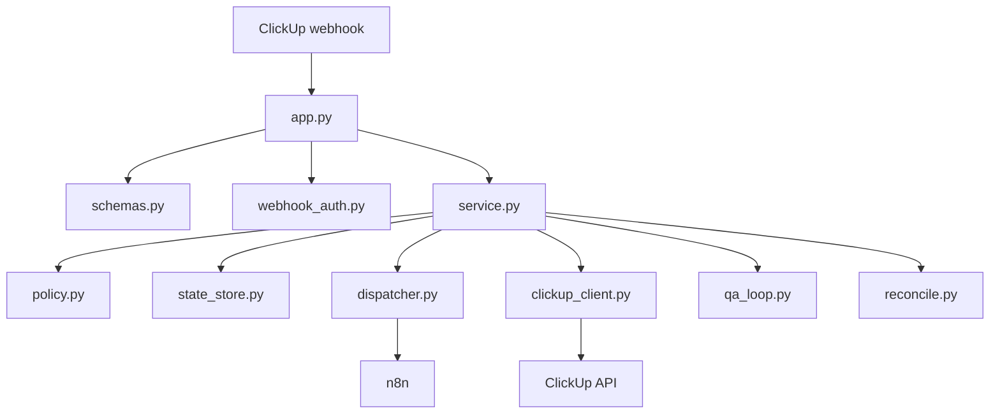

# ClickUp Control Plane

Status: canonical
Last reviewed: 2026-05-09
Owner: clickup control plane

## What This Subsystem Does

`src/clickup_control_plane` receives ClickUp webhook traffic, evaluates routing and QA policy, coordinates stateful dispatch to n8n, and processes workflow completion callbacks.

## Files And Roles

- `src/clickup_control_plane/app.py`: FastAPI entrypoint, runtime wiring, request validation, startup reconciliation, and route registration.
- `src/clickup_control_plane/service.py`: Core orchestration for policy, state transitions, reconciliation checkpoints, and dispatch decisions.
- `src/clickup_control_plane/dispatcher.py`: n8n request building, workflow path resolution, and dispatch client behavior.
- `src/clickup_control_plane/clickup_client.py`: ClickUp API interactions for task status and workflow outcome updates.
- `src/clickup_control_plane/policy.py`: Declarative routing and dispatch policy decisions.
- `src/clickup_control_plane/qa_loop.py`: QA retry loop gating and attempt-resolution behavior.
- `src/clickup_control_plane/reconcile.py`: Startup/runtime reconciliation checks against external task state.
- `src/clickup_control_plane/state_store.py`: Active and paused task-run persistence abstractions.
- `src/clickup_control_plane/schemas.py`: Pydantic request/response contracts.
- `src/clickup_control_plane/webhook_auth.py`: Signature verification and webhook authentication rules.

## Ownership Diagram

## Key Invariants

- Webhook payloads are validated before orchestration.
- Signature verification is part of the ingress contract.
- Dispatch behavior flows through policy and state, not direct route handlers.
- Reconciliation is a first-class runtime concern, not an afterthought.

## External Dependencies

- FastAPI
- `httpx`
- ClickUp APIs
- n8n dispatch endpoints

## How To Read It

1. `src/clickup_control_plane/app.py`
2. `src/clickup_control_plane/service.py`
3. `src/clickup_control_plane/policy.py`
4. `src/clickup_control_plane/dispatcher.py`
5. `src/clickup_control_plane/state_store.py`
6. `src/clickup_control_plane/reconcile.py`

## Where To Change Things

- New ingress or route-level behavior: `app.py`
- Dispatch decision rules: `policy.py`
- n8n request or transport behavior: `dispatcher.py`
- QA retry logic: `qa_loop.py`
- Persistence or run-state behavior: `state_store.py`
- ClickUp response/update behavior: `clickup_client.py`

## Related Tests

- `tests/unit/clickup_control_plane/`

