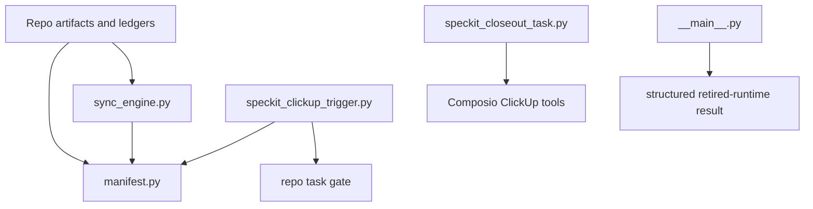

# MCP ClickUp

Status: canonical
Last reviewed: 2026-05-09
Owner: mcp clickup

## What This Subsystem Does

`src/mcp_clickup` maintains the repo-owned ClickUp mapping manifest and trigger/closeout contracts, while live ClickUp mutations are now agent-owned through the connected Composio ClickUp tools.

## Files And Roles

- `src/mcp_clickup/__main__.py`: retired direct-runtime entrypoint that now returns a structured agent-owned-runtime result instead of calling ClickUp directly.
- `src/mcp_clickup/sync_engine.py`: manifest reconciliation and deterministic mapping logic for folder/list/task/subtask projections.
- `src/mcp_clickup/clickup_client.py`: legacy direct ClickUp API client retained only for compatibility during runtime retirement.
- `src/mcp_clickup/manifest.py`: local manifest load/save helpers and manifest-key generation.
- `src/mcp_clickup/artifact_parser.py`: repository artifact discovery and parsing for feature/task sync inputs.

## Ownership Diagram

## Key Invariants

- Sync behavior must be able to recover or fail clearly on ambiguous external state.
- Required routing metadata fields are enforced before sync completion.
- Manifest persistence is atomic and versioned.
- CLI error output redacts token-like content.
- Repo ledger state remains authoritative when ClickUp status drifts.
- Direct token-based ClickUp runtime calls are retired; live external updates happen through agent-owned Composio execution.

## External Dependencies

- connected Composio ClickUp toolkit for live external updates
- local `specs/`
- local `.speckit/clickup-manifest.json`

## How To Read It

1. `src/mcp_clickup/__main__.py`
2. `src/mcp_clickup/sync_engine.py`
3. `src/mcp_clickup/manifest.py`
4. `src/mcp_clickup/artifact_parser.py`
5. `src/mcp_clickup/clickup_client.py`

## Where To Change Things

- trigger/closeout agent behavior and operator experience: `scripts/speckit_clickup_trigger.py`, `scripts/speckit_closeout_task.py`, `__main__.py`
- reconciliation and mapping-retirement semantics: `sync_engine.py`
- manifest format or persistence: `manifest.py`
- feature/task artifact interpretation: `artifact_parser.py`
- legacy direct transport compatibility: `clickup_client.py`

## Related Tests

- `tests/unit/mcp_clickup/`
