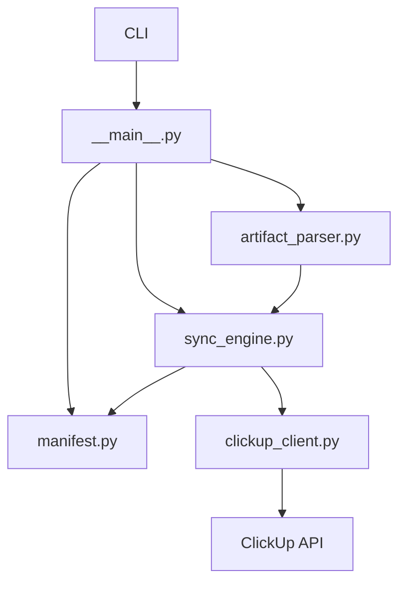

# MCP ClickUp

Status: canonical
Last reviewed: 2026-05-09
Owner: mcp clickup

## What This Subsystem Does

`src/mcp_clickup` synchronizes repo feature/task artifacts into ClickUp structures and maintains a local manifest recording the external object mapping.

## Files And Roles

- `src/mcp_clickup/__main__.py`: CLI entrypoint, environment loading, error surfacing, and top-level operational commands.
- `src/mcp_clickup/sync_engine.py`: orchestration for folder/list/task/subtask creation, update, reconciliation, and required routing metadata checks.
- `src/mcp_clickup/clickup_client.py`: ClickUp API client boundary.
- `src/mcp_clickup/manifest.py`: local manifest load/save helpers and manifest-key generation.
- `src/mcp_clickup/artifact_parser.py`: repository artifact discovery and parsing for feature/task sync inputs.

## Ownership Diagram

## Key Invariants

- Sync behavior must be able to recover or fail clearly on ambiguous external state.
- Required routing metadata fields are enforced before sync completion.
- Manifest persistence is atomic and versioned.
- CLI error output redacts token-like content.

## External Dependencies

- ClickUp API
- local `specs/`
- local `.speckit/clickup-manifest.json`

## How To Read It

1. `src/mcp_clickup/__main__.py`
2. `src/mcp_clickup/sync_engine.py`
3. `src/mcp_clickup/manifest.py`
4. `src/mcp_clickup/artifact_parser.py`
5. `src/mcp_clickup/clickup_client.py`

## Where To Change Things

- CLI flow or operator experience: `__main__.py`
- reconciliation and object creation/update semantics: `sync_engine.py`
- manifest format or persistence: `manifest.py`
- feature/task artifact interpretation: `artifact_parser.py`
- ClickUp transport details: `clickup_client.py`

## Related Tests

- `tests/unit/mcp_clickup/`

