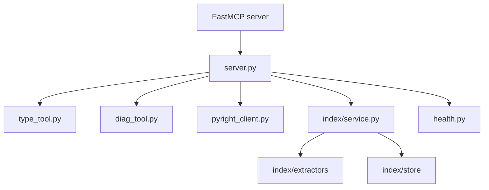

# MCP Codebase

Status: canonical
Last reviewed: 2026-05-09
Owner: mcp codebase

## What This Subsystem Does

`src/mcp_codebase` exposes codebase intelligence services for agents:

- Pyright-backed diagnostics and type lookup
- vector index build/query/refresh operations
- FastMCP server registration
- graph and index health classification

## Files And Roles

- `src/mcp_codebase/server.py`: FastMCP server wiring, tool registration, logging, and Pyright/vector-index lifecycle.
- `src/mcp_codebase/__main__.py`: CLI entrypoint for `python -m src.mcp_codebase`.
- `src/mcp_codebase/type_tool.py`: get-type tool implementation.
- `src/mcp_codebase/diag_tool.py`: diagnostics tool implementation.
- `src/mcp_codebase/pyright_client.py`: Pyright process wrapper and protocol boundary.
- `src/mcp_codebase/health.py`: graph/index health classification.
- `src/mcp_codebase/index/service.py`: vector index orchestration for build/query/refresh/status.
- `src/mcp_codebase/index/config.py`: index path and runtime configuration.
- `src/mcp_codebase/index/extractors/`: file-type specific extraction logic for Python, Markdown, shell, and YAML.
- `src/mcp_codebase/index/store/`: vector index persistence layer.
- `src/mcp_codebase/orchestration/shadow_compare.py`: orchestration comparison support.

## Ownership Diagram

## Key Invariants

- Server lifecycle owns the Pyright client lifecycle.
- Index operations are routed through the vector index service rather than ad hoc file scanning logic.
- File extraction is type-specific and bounded by the indexable suffix contract.
- Health status is surfaced explicitly rather than inferred informally.

## External Dependencies

- FastMCP
- Pyright
- Chroma / vector index storage
- embedding/index tooling configured under `src/mcp_codebase/index/`

## How To Read It

1. `src/mcp_codebase/server.py`
2. `src/mcp_codebase/type_tool.py`
3. `src/mcp_codebase/diag_tool.py`
4. `src/mcp_codebase/pyright_client.py`
5. `src/mcp_codebase/index/service.py`
6. `src/mcp_codebase/index/extractors/`

## Where To Change Things

- MCP tool registration or lifecycle: `server.py`
- type inference behavior: `type_tool.py`, `pyright_client.py`
- diagnostics behavior: `diag_tool.py`, `pyright_client.py`
- vector index extraction or refresh behavior: `index/service.py`, `index/extractors/`, `index/store/`
- health classification: `health.py`

## Related Tests

- `tests/integration/test_codebase_vector_index.py`
- `tests/integration/test_codebase_vector_index_performance.py`
- `tests/integration/test_codegraph_health.py`
- `tests/integration/test_codegraph_recovery.py`
- `tests/unit/test_read_code_*`
- `tests/unit/test_vector_index_domain.py`
- `tests/unit/test_shadow_compare.py`

