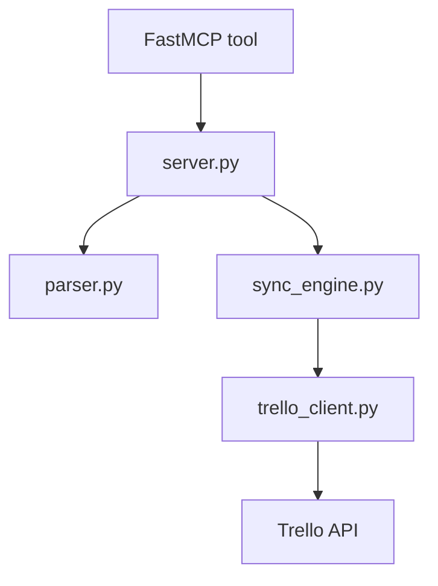

# MCP Trello

Status: canonical
Last reviewed: 2026-05-09
Owner: mcp trello

## What This Subsystem Does

`src/mcp_trello` exposes a Trello bridge that syncs `tasks.md` phases and tasks into Trello lists and cards with deterministic deduplication markers.

## Files And Roles

- `src/mcp_trello/server.py`: FastMCP server, path validation, credential checks, and top-level tool exposure.
- `src/mcp_trello/__main__.py`: CLI entrypoint for module execution.
- `src/mcp_trello/parser.py`: `tasks.md` parsing into internal phase/task structures.
- `src/mcp_trello/sync_engine.py`: Trello board/list/card reconciliation, label handling, and fail-fast sync orchestration.
- `src/mcp_trello/trello_client.py`: Trello API client boundary.

## Ownership Diagram

## Key Invariants

- Input paths must resolve within the working tree and target a real Markdown file.
- Sync is idempotent through deterministic card markers.
- Duplicate list names are treated as ambiguous and abort the run.
- Transient upstream API failures abort quickly instead of masking partial state.

## External Dependencies

- FastMCP
- Trello API
- local `tasks.md` artifacts

## How To Read It

1. `src/mcp_trello/server.py`
2. `src/mcp_trello/parser.py`
3. `src/mcp_trello/sync_engine.py`
4. `src/mcp_trello/trello_client.py`

## Where To Change Things

- MCP tool contract or input validation: `server.py`
- markdown interpretation rules: `parser.py`
- board/list/card sync behavior: `sync_engine.py`
- Trello transport behavior: `trello_client.py`

## Related Tests

- `tests/unit/` for Trello-related sync and parser coverage

