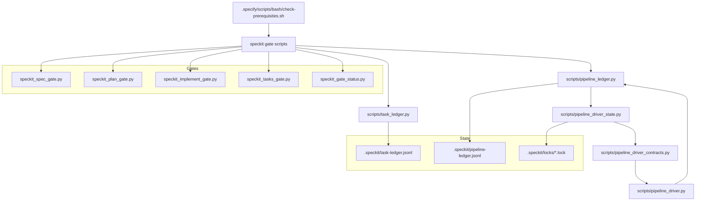

# Pipeline Driver README

This document is a map of the pipeline-driver stack, the files it touches, and how those files hand work off to each other.

There is no standalone `pipeline_state.py` in this repo. The state helper lives in `scripts/pipeline_driver_state.py`.

## What The Stack Does

The pipeline-driver stack coordinates feature-level phase execution, task-level start gates, manifest-driven routing, and append-only audit ledgers.

The stack has two layers of state:

- Feature-level state: stored in `.speckit/pipeline-ledger.jsonl`
- Task-level state: stored in `.speckit/task-ledger.jsonl`

The stack also has two gate families:

- Prerequisite and spec/plan/implement/task gates that block work before execution
- Runtime driver routing that chooses deterministic, generative, or legacy execution paths

## Files And Roles

- `scripts/pipeline_driver.py`: Main CLI and orchestrator. It resolves the current phase, validates the requested phase, routes the command, runs deterministic or generative work, emits compact status, and appends success events back to the pipeline ledger when a routed step completes.
- `scripts/pipeline_driver_state.py`: Feature-state helper module. It loads the pipeline ledger, resolves the ledger-authoritative phase, detects drift, manages feature locks in `.speckit/locks/`, and exposes the `advance_phase` mapping used by the driver.
- `scripts/pipeline_driver_contracts.py`: Manifest contract loader. It reads `.specify/command-manifest.yaml`, normalizes driver modes, resolves script paths, and exposes command routing metadata to the driver and tests.
- `scripts/pipeline_ledger.py`: Append-only feature ledger CLI. It defines `PipelineState`, validates phase transitions, appends feature-level events, and exposes the `assert-phase-complete` gate used to block phase progression until the expected event exists.
- `scripts/task_ledger.py`: Append-only task ledger CLI. It validates task event sequencing, appends per-task events, and exposes `assert-can-start` so only the right actor can start the right task in the right order.
- `scripts/speckit_gate_status.py`: High-level gate status reporter. It summarizes whether the current feature is ready for plan or implement progression based on the required artifacts and checklist state.
- `scripts/speckit_spec_gate.py`: Spec gate validator. It checks spec checklist status, extracts clarifications, and validates clarification-question formatting.
- `scripts/speckit_plan_gate.py`: Plan gate validator. It checks research prerequisites, required plan sections, and design-artifact presence.
- `scripts/speckit_implement_gate.py`: Implement gate validator. It checks task preflight, offline QA payloads, task evidence, and phase-close requirements.
- `scripts/speckit_tasks_gate.py`: Task-file validator. It checks `tasks.md` formatting, phase headers, task ordering, marker consistency, and description shape.
- `.specify/scripts/bash/check-prerequisites.sh`: Consolidated prerequisite script. It resolves the feature directory from the branch, checks that the required docs exist for the current phase, and lists optional docs that are available for the feature.
- `docs/governance/pipeline-driver-handoff.md`: Feature-specific handoff note for the pipeline-driver stack. It describes the implementation state and the migration context for feature 019.

## Ownership Diagram

Reading it left to right:

- `check-prerequisites.sh` and the `speckit_*` gate scripts decide whether work may start.
- `task_ledger.py` owns task ordering and per-actor start checks.
- `pipeline_ledger.py` owns feature-phase transitions and phase-complete assertions.
- `pipeline_driver_state.py` derives the current phase from the pipeline ledger and manages feature locks.
- `pipeline_driver_contracts.py` translates manifest data into a route table.
- `pipeline_driver.py` executes the selected route and writes the success event back to `pipeline_ledger.py`.

## How The Pieces Interact

- `check-prerequisites.sh` runs first in the spec-driven workflow. It discovers the feature directory, confirms `plan.md` exists, and optionally requires `tasks.md` before implementation work starts.
- `speckit_spec_gate.py`, `speckit_plan_gate.py`, `speckit_implement_gate.py`, and `speckit_tasks_gate.py` provide deterministic gate checks around spec, plan, implementation, and task-format readiness.
- `task_ledger.py assert-can-start` blocks a task if the ledger is invalid, if a prior task is still open, if the same actor already owns another open task, or if the task is not ready in the declared order.
- `pipeline_ledger.py assert-phase-complete` blocks phase progression until the required feature-level event is present in the ledger and the event sequence is valid.
- `pipeline_driver.py` asks `pipeline_driver_state.py` for the ledger-authoritative phase before it does anything else.
- `pipeline_driver_state.py` reads the feature ledger, derives the current phase from the most recent event, checks for drift, and marks the feature blocked when the ledger and the feature artifacts disagree.
- `pipeline_driver.py` then asks `pipeline_driver_contracts.py` how the current phase should be routed.
- If the manifest says the command is `deterministic`, the driver runs the declared script path with a timeout.
- If the manifest says the command is `generative`, the driver builds a handoff payload, runs the handoff runner, validates the generated artifact, and only then appends a success event.
- If the manifest says the command is `legacy` or has no usable route metadata, the driver falls back to the legacy blocked path instead of pretending the migration is complete.
- After a successful routed step, `pipeline_driver.py` calls back into `pipeline_ledger.py` to append the manifest-selected success event, then refreshes phase state from the ledger again so `next_phase` is computed from the committed state, not from the caller's guess.

## Driver Execution Flow

1. Parse CLI arguments in `scripts/pipeline_driver.py`.
2. Resolve feature phase and drift from `scripts/pipeline_driver_state.py`.
3. Reject invalid feature IDs, invalid phases, or phase drift.
4. Resolve the routing mode from `scripts/pipeline_driver_contracts.py`.
5. Enforce approval breakpoints when the route requires them.
6. Execute the route:
   - deterministic route: run the script declared by the manifest
   - generative route: run the handoff runner and validate the generated artifact
   - legacy route: return a blocked legacy response
7. Append the success event to `scripts/pipeline_ledger.py` when the route succeeds.
8. Emit compact human status and optional JSON for downstream tooling.

## Ledger And State Details

- `PipelineState` in `scripts/pipeline_ledger.py` tracks the current feature event, plan approval, solution approval, and analysis cleanliness while validating the event chain.
- `resolve_phase_state` in `scripts/pipeline_driver_state.py` reads the ledger, finds the active feature record, derives the phase from the last event, and checks required artifacts for drift-sensitive events like `plan_approved`, `solution_approved`, `analysis_completed`, and `e2e_generated`.
- `acquire_feature_lock` and `release_feature_lock` in `scripts/pipeline_driver_state.py` implement single-flight feature locking with stale-lock takeover.
- `cmd_append` in `scripts/pipeline_ledger.py` writes immutable feature events and rejects invalid transitions before anything is appended.
- `cmd_validate` in `scripts/pipeline_ledger.py` prints a compact feature summary from the ledger so the audit trail can be inspected without manually reading JSONL.
- `cmd_append` in `scripts/task_ledger.py` writes immutable task events and keeps task-level metadata such as attempts, actor ownership, PR/CI references, and QA verdicts.
- `cmd_validate` in `scripts/task_ledger.py` reports open, closed, and actor-active tasks per feature.

## Gate Surface Details

- `speckit_gate_status.py` is the fastest way to answer "are we ready to move?" for plan or implement. It gathers the relevant checklist and artifact state into a compact status report.
- `speckit_spec_gate.py` keeps the spec phase honest by forcing checklist completeness and structured clarification questions.
- `speckit_plan_gate.py` makes the plan phase prove it has the required research, sections, and artifacts before implementation begins.
- `speckit_implement_gate.py` ensures implementation work has the right preflight conditions, the right evidence, and the right phase-close conditions.
- `speckit_tasks_gate.py` ensures `tasks.md` is machine-readable and internally consistent before task-led work starts.

## Related Verification

These tests exercise the stack end to end:

- `tests/unit/test_pipeline_driver.py`
- `tests/integration/test_pipeline_driver_feature_flow.py`
- `tests/contract/test_pipeline_driver_contract.py`

## Practical Reading Order

If you are tracing a bug or following a phase change, read the files in this order:

1. `.specify/scripts/bash/check-prerequisites.sh`
2. `scripts/speckit_spec_gate.py`
3. `scripts/speckit_plan_gate.py`
4. `scripts/speckit_implement_gate.py`
5. `scripts/speckit_tasks_gate.py`
6. `scripts/task_ledger.py`
7. `scripts/pipeline_ledger.py`
8. `scripts/pipeline_driver_state.py`
9. `scripts/pipeline_driver_contracts.py`
10. `scripts/pipeline_driver.py`

That order matches the actual dependency chain: prerequisites, gates, task ordering, feature state, routing contracts, and finally execution.
