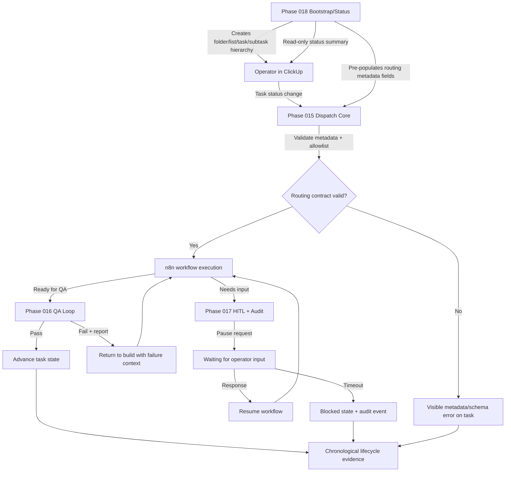

# Implementation Plan: ClickUp + n8n Operational Control Plane (Super-Spec)

**Branch**: `014-clickup-n8n-control-plane` | **Date**: 2026-04-02 | **Spec**: [spec.md](spec.md)
**Input**: Super-spec from `/specs/014-clickup-n8n-control-plane/spec.md`

## Summary

This plan defines how phases `015` through `018` are delivered as one coherent control-plane system. It is an orchestration plan, not a duplicate of phase-level implementation plans. The super-plan sets phase sequencing, cross-phase contracts, integration gates, and production-readiness checkpoints.

## Super-Spec Scope

- Define canonical phase order and dependencies.
- Define non-negotiable cross-phase contracts (routing metadata, lifecycle semantics, failure loop rules).
- Define entry and exit gates per phase.
- Define integrated end-to-end validation before production rollout.
- Define merge and rollback strategy for multi-phase delivery.

Out of scope:
- Rewriting implementation details already owned by phase specs.
- Replacing phase-level research, data model, and task breakdown artifacts.

## Phase Dependency Map

| Phase | Branch | Spec | Role | Depends On |
| :---- | :----- | :--- | :--- | :--------- |
| 015 | `015-control-plane-dispatch` | [spec.md](../015-control-plane-dispatch/spec.md) | Event-driven dispatch core + routing metadata contract | None |
| 016 | `016-control-plane-qa-loop` | [spec.md](../016-control-plane-qa-loop/spec.md) | QA verification and automated rework loop | 015 |
| 017 | `017-control-plane-hitl-audit` | [spec.md](../017-control-plane-hitl-audit/spec.md) | Human-in-the-loop pause/resume + lifecycle auditability | 015 |
| 018 | `018-speckit-clickup-sync` | [spec.md](../018-speckit-clickup-sync/spec.md) | Bootstrap and read-only status synchronization | 015 (routing metadata contract) |

Recommended execution order:
1. `015` first (establishes dispatch and metadata contract).
2. `018` next (consumes `015` contract to bootstrap tasks correctly).
3. `016` and `017` in either order after `015` (both extend runtime control-plane behavior).
4. Integrated super-spec checkpoint on `014` after all phase exit gates pass.

## Cross-Phase Contract Matrix

| Contract | Producer | Consumers | Enforcement |
| :------- | :------- | :-------- | :---------- |
| Routing metadata schema and valid values | 015 | 016, 017, 018 | Contract tests + runtime validation errors |
| Single active workflow per task | 015 runtime | 016, 017 | Runtime guard + idempotency tests |
| QA failure loop semantics and attempt policy | 016 | 017, operator runbooks | End-to-end QA cycle tests |
| Pause/resume payload shape for HITL | 017 | 015 orchestration path | Integration test with simulated operator response |
| Bootstrap idempotency and ID manifest shape | 018 | Operator workflow + future reruns | Manifest validation + repeat-run tests |
| Lifecycle/audit event visibility on task | 017 + 016 + 015 | Operators and incident review | Audit timeline assertions in e2e |

## Integrated Delivery Gates

### Phase Entry Gates

| Phase | Entry Gate |
| :---- | :--------- |
| 015 | No gate; foundational phase |
| 016 | `015` routing metadata contract finalized and documented |
| 017 | `015` dispatch event model and lifecycle states stable |
| 018 | `015` routing metadata contract finalized and field names frozen |

### Phase Exit Gates

| Phase | Exit Gate |
| :---- | :-------- |
| 015 | Triggered dispatch works on allowlisted tasks, idempotency proven, metadata validation enforced |
| 016 | QA pass/fail routing loop verified, 3-fail escalation rule enforced |
| 017 | Pause/resume and timeout-to-blocked behavior verified, lifecycle history trace complete |
| 018 | Bootstrap is idempotent, no duplicate ClickUp item creation, read-only status summary verified |

### Super-Spec Exit Gate (014 Close Condition)

`014` is complete only when:
1. All phase exit gates above are satisfied.
2. End-to-end operator flow is proven: intake -> build dispatch -> QA pass/fail routing -> HITL pause/resume -> final audit trail.
3. Runbook-grade operational evidence exists for failure handling and recovery paths.

## Technical Context

**Language/Version**: Python 3.12 for CLI/runtime modules; n8n workflow runtime for orchestration.
**Primary Dependencies**: ClickUp API, n8n, `httpx`, `pydantic`, `pytest`.
**Storage**: ClickUp as operational source of truth; `.speckit/clickup-manifest.json` for bootstrap ID mapping.
**Testing**: Phase-local tests + integrated e2e across dispatch/QA/HITL/bootstrap paths.
**Target Platform**: GitHub + developer workstation + n8n deployment target.
**Project Type**: Multi-phase control-plane feature delivery.
**Performance Goals**: Stable event handling and deterministic state transitions over throughput optimization.
**Constraints**: Strict idempotency, explicit human safety gates, no secret leakage, no silent failures.
**Scale/Scope**: Multi-phase system with shared contracts across four specs.

## Constitution Check

| Principle | Status | Notes |
| :-------- | :----- | :---- |
| I. Human-First | ✅ Pass | Operator is explicit decision-maker at HITL gates and escalations |
| II. AI Planning | ✅ Pass | Super-plan coordinates phase plans without bypassing phase checks |
| III-a. Security: no secrets in code/logs/committed files | ✅ Pass | Secret handling remains phase-local and env-scoped |
| III-b. Security: secrets from env vars at runtime | ✅ Pass | Enforced in runtime and CI behaviors |
| III-c. Security: least privilege | ✅ Pass | ClickUp/n8n permissions scoped to required operations only |
| III-d. Security: zero-trust boundaries identified | ✅ Pass | ClickUp webhook/API and n8n boundaries explicitly modeled |
| III-e. Security: external inputs validated | ✅ Pass | Webhook signature + schema validation remain required |
| III-f. Security: errors don't expose internals | ✅ Pass | User-facing error summaries only |
| IV. Parsimony | ✅ Pass | Super-plan adds coordination only; no duplicate implementation layers |
| V. Reuse | ✅ Pass | Reuses phase artifacts and established CLI/workflow patterns |
| VI. Spec-First | ✅ Pass | `014` spec drives orchestration order and gates |
| VIII. Reuse Over Invention | ✅ Pass | Existing phase outputs remain source of implementation truth |
| IX. Composability | ✅ Pass | Contract boundaries between phases are explicit |
| X. SoC | ✅ Pass | Super-spec orchestration separated from phase-level implementation |
| XIV. Observability | ✅ Pass | Lifecycle/audit visibility is a global gate |
| XV. TDD | ✅ Pass | Integration validation is required before super-spec closure |
| XVIII. Async Process Management | ✅ Pass | Async behavior remains phase-owned and validated by integration tests |
| XIX. State Safety and Reconciliation | ✅ Pass | ClickUp authoritative state + manifest reconciliation constraints retained |
| XX. Local DB ACID and Transactional Integrity | ✅ Pass | No local DB in super-spec scope |
| XXI. Venue-Constrained Discovery | ✅ Pass | Discovery constraints remain phase-enforced where applicable |

## Behavior Map Sync Gate *(mandatory)*

| Check | Status | Notes |
| :---- | :----- | :---- |
| Runtime/config/operator-flow impact assessed (`src/csp_trader/`, `config*.yaml`, runbooks/scripts) | ✅ No impact | Control-plane phases do not modify trading runtime behavior |
| If impacted, update target identified: `specs/001-auto-options-trader/behavior-map.md` | N/A | No impact |

## Architecture Flow *(mandatory)*



## Integrated Test Strategy

1. Contract-level tests confirm routing metadata schema compatibility between `015` and `018`.
2. Scenario tests validate `015 -> 016` QA pass/fail loop with attempt counting and escalation.
3. Scenario tests validate `015 -> 017` pause/resume and timeout-to-blocked behavior.
4. End-to-end test validates full operator lifecycle with audit trail continuity.
5. Regression tests ensure rerun idempotency for bootstrap and dispatch dedupe behavior.

## Rollout and Merge Strategy

1. Merge phases independently behind green CI and phase exit gates.
2. Keep a super-spec tracking issue/checklist that references each phase PR and gate evidence.
3. Run integrated validation checkpoint before declaring `014` complete.
4. Promote runbooks and incident playbooks alongside final integration merge.

Rollback policy:
- Roll back by phase boundary, not by partial mixed rollback.
- Preserve audit evidence and task comments; do not delete operational history.
- For bootstrap rollback, preserve manifest backup before any destructive recovery actions.

## Project Structure

### Documentation (super-spec)

```text
specs/014-clickup-n8n-control-plane/
├── spec.md
├── plan.md
└── checklists/
    └── requirements.md
```

### Linked Phase Specs

```text
specs/015-control-plane-dispatch/
specs/016-control-plane-qa-loop/
specs/017-control-plane-hitl-audit/
specs/018-speckit-clickup-sync/
```

**Structure Decision**: `014` remains the orchestration umbrella with no duplicate phase implementation details. Execution details stay in each child phase spec and task set.

## Complexity Tracking

No constitution violations identified in this super-plan.
