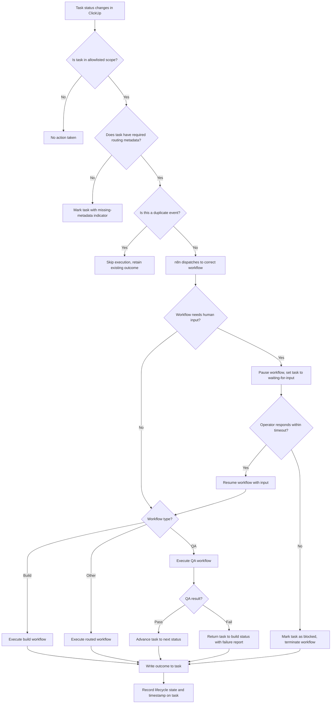

# Feature Specification: ClickUp + n8n Operational Control Plane

**Feature Branch**: `014-clickup-n8n-control-plane`
**Created**: 2026-04-01
**Status**: Superseded
**Input**: User description: "Use ClickUp as the operational control plane for work intake, task state, QA routing, and human review. Use n8n as the automation and orchestration layer that reacts to ClickUp events, launches agentic workflows, records outcomes, and routes failed work back to the correct build step."

## One-Line Purpose *(mandatory)*

An operator uses ClickUp task state changes to trigger n8n-orchestrated agentic workflows that execute scoped work, write results back to the originating task, and automatically route QA failures to the correct build step.

## Consumer & Context *(mandatory)*

The operator interacts with ClickUp as the single pane of glass for work intake, review, and status, while n8n workflows consume task events and execute agent actions in the background.

## Clarifications

### Session 2026-04-01

- Q: Should the system support concurrent workflows on the same task? → A: No. One workflow at a time per task; new triggers are rejected while a run is active.
- Q: How should the webhook endpoint verify requests are genuinely from ClickUp? → A: Verify ClickUp webhook signature on every request; reject unsigned or invalid requests.
- Q: What happens when n8n is unavailable and webhook delivery fails? → A: Rely entirely on ClickUp's built-in webhook retry behavior; no additional handling.
- Q: What is the maximum number of QA rework cycles before escalation? → A: After 3 failed QA cycles, block further automated rework; require human intervention to unblock.
- Q: What happens when an operator manually moves a task out of a workflow-controlled status mid-execution? → A: Treat as a cancel signal; terminate the running workflow gracefully and record the cancellation on the task.
- Q: What happens when a workflow targets a ClickUp field or status that no longer exists (schema drift)? → A: Fail the workflow and mark the task as blocked with a "schema mismatch" indicator describing the missing field/status.

## User Scenarios & Testing *(mandatory)*

### User Story 1 - Trigger Agent Workflow from Task Status Change (Priority: P1)

An operator moves a ClickUp task to a trigger-eligible status (e.g., "Ready for Build"). The system detects this change, validates that the task belongs to an allowlisted scope and contains required routing metadata, then dispatches the task to the correct n8n workflow. The workflow executes the scoped work and writes a human-readable outcome summary back to the ClickUp task.

**Why this priority**: This is the foundational capability — without event-driven dispatch and outcome recording, no other workflow can function.

**Independent Test**: Can be fully tested by creating a task with valid metadata, moving it to a trigger status, and verifying that the correct workflow runs and writes its outcome back to the task.

**Acceptance Scenarios**:

1. **Given** a task in an allowlisted list with valid routing metadata, **When** the task status changes to "Ready for Build", **Then** n8n receives the event, dispatches the correct workflow, and writes a structured outcome update to the task within the configured timeout.
2. **Given** a task in an allowlisted list missing required routing metadata, **When** the task status changes to a trigger status, **Then** the system does not execute a workflow and marks the task with a visible "missing metadata" indicator specifying which fields are absent.
3. **Given** a task in a non-allowlisted list, **When** the task status changes to a trigger status, **Then** no workflow is dispatched and no state change occurs on the task.
4. **Given** a duplicate webhook delivery for the same task event, **When** n8n receives the duplicate, **Then** the system does not re-execute the workflow and the task retains its existing outcome.

---

### User Story 2 - QA Verification with Automatic Pass/Fail Routing (Priority: P2)

An operator moves a completed build task to a QA-triggering status (e.g., "Ready for QA"). The system runs a QA workflow that evaluates the task against its acceptance criteria. If QA passes, the task advances to the next configured state. If QA fails, the task is automatically returned to the build state with a structured failure report describing the issue, expected behavior, observed behavior, and reproduction context.

**Why this priority**: Automated QA feedback loops with automatic backflow to build eliminate manual triage overhead and prevent failed work from stalling in review queues.

**Independent Test**: Can be fully tested by creating a task with defined acceptance criteria, triggering QA, and verifying both the pass path (task advances) and fail path (task returns to build with failure details).

**Acceptance Scenarios**:

1. **Given** a task in "Ready for QA" with defined acceptance criteria, **When** the QA workflow evaluates and all criteria pass, **Then** the task moves to the next configured status and the QA outcome is recorded on the task.
2. **Given** a task in "Ready for QA" with defined acceptance criteria, **When** the QA workflow evaluates and one or more criteria fail, **Then** the task is moved back to the build status and a structured failure report is attached containing: issue description, expected behavior, observed behavior, and reproduction context.
3. **Given** a task that has failed QA and been returned to build, **When** the build workflow completes rework, **Then** the task can re-enter QA and the QA workflow can see the prior failure context.
4. **Given** a task that has failed QA three times, **When** the third QA failure occurs, **Then** the system blocks further automated rework, marks the task as requiring human intervention, and preserves the cumulative failure history on the task.
5. **Given** a task blocked after 3 QA failures, **When** a human manually unblocks it, **Then** the task can re-enter the build → QA cycle and the failure counter resets.

---

### User Story 3 - Human-in-the-Loop Pause and Resume (Priority: P3)

A workflow encounters a point where it needs human input — a clarification, approval, or decision. The system pauses execution, writes a structured request for input to the ClickUp task, and waits. When the operator provides a response (via comment or field update following a defined convention), the system resumes the correct workflow with the provided input.

**Why this priority**: Many agentic workflows cannot proceed without human judgment at specific decision points; without pause/resume, the system either blocks indefinitely or makes unauthorized decisions.

**Independent Test**: Can be fully tested by triggering a workflow that requires human input, verifying the task shows a clear request, providing a response, and verifying the workflow resumes and completes.

**Acceptance Scenarios**:

1. **Given** a running workflow that reaches a human-input gate, **When** the workflow pauses, **Then** the task status changes to a "waiting for input" state and the task contains a structured description of what input is needed.
2. **Given** a task in "waiting for input" state, **When** the operator provides a response following the defined convention, **Then** n8n detects the response and resumes the paused workflow with the provided input.
3. **Given** a task in "waiting for input" state, **When** no response is provided within the configured timeout, **Then** the task is marked as "blocked" with a visible timeout indicator and the workflow is terminated cleanly.

---

### User Story 4 - Workflow Lifecycle Visibility and Auditability (Priority: P4)

Every workflow run has a visible lifecycle state on its ClickUp task (queued, running, waiting for input, passed, failed, blocked). The task preserves a clear history of all status changes, workflow runs, and outcomes so that an operator can trace any task from trigger to final result.

**Why this priority**: Without lifecycle visibility, operators cannot diagnose failures, track progress, or trust the system's state.

**Independent Test**: Can be fully tested by running a workflow end-to-end and verifying that all lifecycle states were recorded on the task and can be reviewed in chronological order.

**Acceptance Scenarios**:

1. **Given** a workflow that runs to completion, **When** an operator reviews the task, **Then** the task shows the complete lifecycle: trigger time, workflow start, execution steps, and final outcome with timestamps.
2. **Given** a workflow that fails mid-execution, **When** an operator reviews the task, **Then** the task shows the failure point, error context (without exposing internal system details), and the state the task was left in.
3. **Given** multiple workflow runs on the same task (e.g., build → QA fail → rework → QA pass), **When** an operator reviews the task, **Then** all runs are visible in chronological order with their individual outcomes.

---

### Edge Cases

- What happens when ClickUp's webhook delivery is delayed or out of order?
- How does the system handle a workflow that is already running when a new trigger event arrives for the same task? → Only one workflow runs per task at a time; new triggers are rejected while a run is active.
- What happens when n8n is temporarily unavailable when ClickUp sends a webhook? → System relies on ClickUp's built-in webhook retry behavior; no custom retry infrastructure.
- How does the system behave when a task is manually moved out of a workflow-controlled status by an operator mid-execution? → Treated as a cancel signal; workflow terminates gracefully and cancellation is recorded.
- What happens when a workflow's target ClickUp custom field or status does not exist (e.g., schema drift)? → Workflow fails and task is marked as blocked with a "schema mismatch" indicator.

## Flowchart *(mandatory)*

## Data & State Preconditions *(mandatory)*

- A ClickUp workspace exists with at least one space, folder, or list configured as an allowlisted trigger scope.
- Trigger-eligible statuses (e.g., "Ready for Build", "Ready for QA") are defined in the ClickUp workspace.
- Required routing metadata fields (workflow type, specification/context reference, execution policy) are defined as custom fields on eligible task types.
- An n8n instance is running and reachable from the network where ClickUp webhooks are delivered.
- ClickUp webhook subscriptions are configured to send task status change events to the n8n endpoint.
- The operator has permission to move tasks between statuses and to provide human-in-the-loop responses.

## Inputs & Outputs *(mandatory)*

| Direction | Description | Format |
| :-- | :-- | :-- |
| Input | Task event from ClickUp containing task identifier, status change, custom field values, and scope identifiers | Caller-defined |
| Output | Structured outcome update written back to the originating ClickUp task containing what ran, what changed, what was produced, and what needs attention | Caller-defined |

## Constraints & Non-Goals *(mandatory)*

**Must NOT**:
- Must NOT execute workflows for tasks outside the allowlisted scope, even if metadata is present.
- Must NOT expose internal system state, stack traces, or raw API responses in task updates visible to operators.
- Must NOT allow a workflow to exceed the action scope defined for the task type.
- Must NOT silently fail — every failure must leave a visible indicator on the task.

**Adopted dependencies**:
- ClickUp — provides the operational UI, task state management, webhook event delivery, custom fields, and comment/update surfaces. Requires: workspace configuration, webhook setup, custom field definition, status workflow design.
- n8n — provides the workflow automation engine, webhook reception, workflow routing, and execution orchestration. Requires: instance deployment, workflow design, webhook endpoint configuration, credential management.

**Out of scope**:
- Designing the internal logic of agent prompts or agent tool implementations.
- ClickUp workspace design (space/folder/list hierarchy, custom field schema, status workflow naming) — this spec defines the behavioral contract, not the ClickUp configuration.
- n8n workflow internal design (node layout, credential wiring, error retry configuration) — this spec defines the observable behavior, not the n8n implementation.
- Multi-tenant or multi-workspace support.
- Real-time collaboration features beyond the existing ClickUp comment/update model.

## Requirements *(mandatory)*

### Functional Requirements

- **FR-001**: System MUST dispatch a workflow only when a task status change matches a configured trigger status AND the task belongs to an allowlisted scope.
- **FR-002**: System MUST validate that required routing metadata is present on the task before dispatching a workflow; if metadata is missing, the task MUST be marked with a visible indicator specifying which fields are absent.
- **FR-003**: System MUST route each eligible task to the correct workflow based on task metadata (workflow type, execution policy).
- **FR-004**: System MUST be idempotent with respect to duplicate webhook deliveries — repeated events for the same task state change MUST NOT cause duplicate workflow executions.
- **FR-005**: System MUST write a human-readable outcome update to the originating ClickUp task after every workflow run, including: what ran, what changed, what was produced, and what needs attention.
- **FR-006**: System MUST record a visible lifecycle state on the task for each workflow run phase (queued, running, waiting for input, passed, failed, blocked).
- **FR-007**: System MUST automatically return a QA-failed task to the build status with a structured failure report containing: issue description, expected behavior, observed behavior, and reproduction context.
- **FR-008**: System MUST allow rework cycles (build → QA → fail → build → QA) to repeat without manual task recreation, preserving prior failure context on the task.
- **FR-009**: System MUST support pausing a workflow to request human input, setting the task to a "waiting for input" state with a structured description of what is needed.
- **FR-010**: System MUST detect an operator's response (via a defined comment or field convention) and resume the paused workflow with the provided input.
- **FR-011**: System MUST mark a task as "blocked" and terminate the workflow cleanly if no human response is received within the configured timeout.
- **FR-012**: System MUST preserve a chronological history of all workflow runs, status changes, and outcomes on each task for auditability.
- **FR-013**: System MUST mark a task with a visible failure or blocked state if a workflow cannot run or fails after triggering, retaining enough context for retry without losing prior work.
- **FR-014**: System MUST attach or link generated artifacts, reports, or references to the originating ClickUp task.
- **FR-015**: System MUST enforce one active workflow run per task at a time; if a new trigger event arrives while a run is active, the system MUST reject the new trigger and leave the task unchanged.
- **FR-016**: System MUST verify the webhook signature on every incoming request from ClickUp; unsigned or invalid requests MUST be rejected without dispatching a workflow.
- **FR-017**: System MUST block further automated rework after 3 consecutive QA failures on the same task and mark it as requiring human intervention; a human must explicitly unblock the task to resume the build → QA cycle.
- **FR-018**: System MUST treat an operator's manual status change on a task with an active workflow as a cancellation signal — the running workflow MUST be terminated gracefully and the cancellation recorded on the task.
- **FR-019**: System MUST fail the workflow and mark the task as blocked with a "schema mismatch" indicator if a write targets a ClickUp custom field or status that does not exist.

### Key Entities

- **Task**: A ClickUp task that represents a unit of work; carries routing metadata, lifecycle state, and outcome history.
- **Workflow Run**: A single execution of an n8n workflow tied to one task; has a lifecycle (queued → running → outcome) and produces an outcome record.
- **Routing Metadata**: Custom field values on a task that determine which workflow to execute, where context lives, and what execution policy applies.
- **Outcome Record**: A structured update written to the task containing run results, artifacts, and next-action guidance.
- **Failure Report**: A structured QA failure record containing issue, expected behavior, observed behavior, and reproduction context.

## Success Criteria *(mandatory)*

### Measurable Outcomes

- **SC-001**: An operator can trigger, monitor, and review a complete build → QA → pass workflow without leaving ClickUp.
- **SC-002**: A QA failure automatically returns the task to the build step with actionable failure context — no manual triage or task recreation required.
- **SC-003**: Duplicate webhook deliveries do not cause duplicate workflow executions for the same task event.
- **SC-004**: Every workflow run is traceable from trigger to final result via the task's recorded lifecycle history.
- **SC-005**: A paused workflow resumes correctly when the operator provides input, and times out visibly if no response is given.
- **SC-006**: Tasks with missing routing metadata are surfaced for correction — no silent failures.

## Definition of Done *(mandatory)*

In production, an operator can move a ClickUp task through a complete build → QA → pass/fail cycle with automatic workflow dispatch, outcome recording, QA backflow on failure, and full lifecycle auditability — all without leaving ClickUp or manually recreating tasks.

## Open Questions *(include if any unresolved decisions exist)*

- ~~**OQ-1**~~: Resolved — after 3 failed QA cycles, block automated rework; require human intervention to unblock.
- ~~**OQ-2**~~: Resolved — one workflow at a time per task; concurrent triggers rejected while a run is active.

## Split Into Phases

This spec was split on 2026-04-01 because its XL size warranted independent delivery phases.
The source spec is retained for reference but superseded by the phase specs below.

| Phase | Branch | Spec | Estimated Size |
| :---- | :----- | :--- | :------------- |
| Phase 1 — Event-Driven Workflow Dispatch | `015-control-plane-dispatch` | [spec.md](../015-control-plane-dispatch/spec.md) | L |
| Phase 2 — QA Verification & Rework Loop | `016-control-plane-qa-loop` | [spec.md](../016-control-plane-qa-loop/spec.md) | M |
| Phase 3 — Human-in-the-Loop & Lifecycle Auditability | `017-control-plane-hitl-audit` | [spec.md](../017-control-plane-hitl-audit/spec.md) | M |
