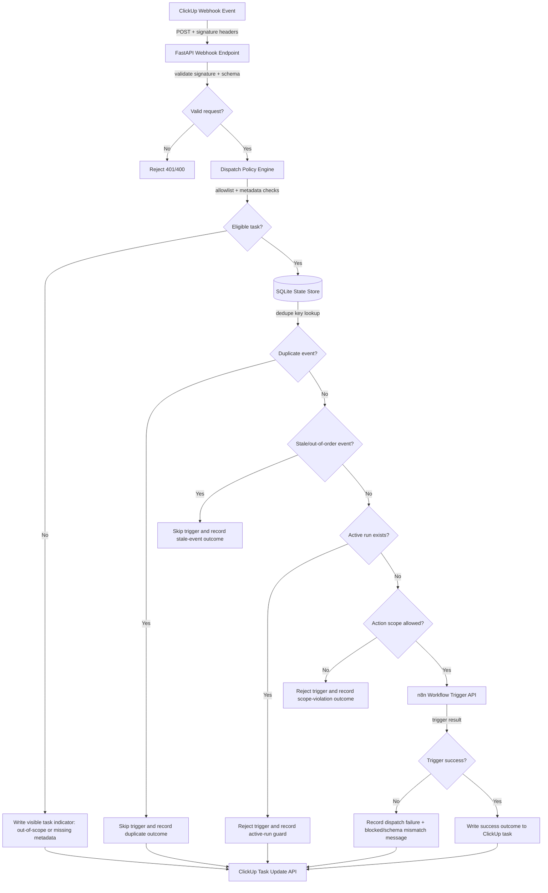

# Implementation Plan: ClickUp + n8n Operational Control Plane — Phase 1: Event-Driven Workflow Dispatch

**Branch**: `015-control-plane-dispatch` | **Date**: 2026-04-02 | **Spec**: [spec.md](spec.md)
**Input**: Feature specification from `/specs/015-control-plane-dispatch/spec.md`

## Approval Record

- Plan reviewed and approved by author on 2026-04-02.

## Summary

Implement a webhook-driven dispatch service that validates ClickUp task events, enforces allowlist and routing metadata constraints, deduplicates duplicate deliveries, guarantees single active run per task, and triggers the mapped n8n workflow. Every successful or failed dispatch path writes a visible operator-facing outcome back to the originating ClickUp task.

## Technical Context

**Language/Version**: Python 3.12
**Primary Dependencies**: `fastapi>=0.115.0`, `uvicorn>=0.30.0`, `httpx>=0.28.1`, `pydantic>=2.0,<3.0`, `aiosqlite>=0.20,<1.0`, `pyyaml>=6.0,<7.0`
**Storage**: Local SQLite state store (dedupe + active-run lock state) under `.speckit/control-plane.db`
**Testing**: `pytest`, `pytest-asyncio`, `httpx.MockTransport`
**Target Platform**: Self-hosted service; local dev on macOS 14+ and production on Linux x86_64 with Python 3.12 under systemd-managed uvicorn
**Project Type**: Backend service module + integration adapters
**Performance Goals**: Signature+policy decision p95 < 300ms (excluding outbound ClickUp/n8n latency), dedupe/lock DB operations p95 < 50ms, and zero duplicate dispatches under replay burst test of 100 identical webhook events
**Constraints**: Signature validation on every webhook, no silent failures, no secrets in logs, strict idempotency
**Scale/Scope**: One workspace/operator team, hundreds to low-thousands of task events per day
**Async Process Model**: Single FastAPI async server process, request-scoped async handlers, timeout/cancel boundaries for outbound ClickUp and n8n calls, graceful shutdown waits for inflight requests
**State Ownership/Reconciliation Model**: ClickUp task state is source-of-truth; local DB owns dedupe and active-run guard artifacts only. Reconciliation at startup verifies stale `running` locks against live ClickUp state and clears orphaned locks.
**Local DB Transaction Model**: Transaction per webhook decision path: insert dedupe key + acquire lock + record dispatch intent atomically, rollback on failure before n8n trigger commit, finalize state on completion/failure update.
**Venue-Constrained Discovery Model**: N/A (task entities are provided by ClickUp webhook payload and verified with live ClickUp API fetch)
**Implementation Skills**: Reuse patterns from `src/mcp_trello` for client layering, typed errors, and safe logging boundaries.

## Constitution Check

| Principle | Status | Notes |
|-----------|--------|-------|
| I. Human-First | ✅ Pass | Operator-triggered task status transitions remain primary control signal |
| II. AI Planning | ✅ Pass | Plan focuses on minimal phase-1 scope with explicit reuse-first choices |
| III-a. Security: no secrets in code/logs/committed files | ✅ Pass | Token-bearing headers redacted; no token persistence |
| III-b. Security: secrets from env vars at runtime | ✅ Pass | ClickUp and n8n credentials loaded from env only |
| III-c. Security: least privilege | ✅ Pass | Tokens scoped to minimum read/write capabilities for task comments/status |
| III-d. Security: zero-trust boundaries identified | ✅ Pass | ClickUp webhook ingress and n8n egress modeled as explicit trust boundaries |
| III-e. Security: external inputs validated | ✅ Pass | Webhook signature, schema validation, and allowlist checks required before dispatch |
| III-f. Security: errors don't expose internals | ✅ Pass | Contracted error envelopes expose action-guiding messages only |
| IV. Parsimony | ✅ Pass | Implements only phase-1 dispatch guarantees, defers QA/HITL to later phases |
| V. Reuse | ✅ Pass | Reuses FastAPI/httpx stack already in repo and `mcp_trello` adapter patterns |
| VI. Spec-First | ✅ Pass | Implementation boundaries map directly to 015 FR-001..FR-010 |
| VIII. Reuse Over Invention | ✅ Pass | Existing SDKs evaluated; direct client chosen only after viability scan |
| IX. Composability | ✅ Pass | Webhook adapter, dispatcher, policy evaluator, and API clients are separable modules |
| X. SoC | ✅ Pass | Request validation, decision engine, transport clients, and persistence are isolated |
| XIV. Observability | ✅ Pass | Structured decision logs + operator-visible ClickUp outcomes for every terminal path |
| XV. TDD | ✅ Pass | Unit + integration-first validation planned for dedupe/signature/dispatch branches |
| XVIII. Async Process Management | ✅ Pass | No nested loops, explicit timeout/cancel policy for external calls |
| XIX. State Safety and Reconciliation | ✅ Pass | Local lock state reconciled against ClickUp on startup |
| XX. Local DB ACID and Transactional Integrity | ✅ Pass | Atomic dedupe+lock write boundaries with rollback on failed dispatch paths |
| XXI. Venue-Constrained Discovery | ✅ Pass | N/A |

## Behavior Map Sync Gate *(mandatory)*

| Check | Status | Notes |
|-------|--------|-------|
| Runtime/config/operator-flow impact assessed (`src/csp_trader/`, `config*.yaml`, runbooks/scripts) | ✅ No impact | Work is isolated to new control-plane module and docs; trading runtime untouched |
| If impacted, update target identified: `specs/001-auto-options-trader/behavior-map.md` | N/A | No impact |

## Architecture Flow *(mandatory)*



## Project Structure

### Documentation (this feature)

```text
specs/015-control-plane-dispatch/
├── spec.md
├── plan.md
├── research.md
├── data-model.md
├── quickstart.md
└── contracts/
    └── webhook-and-dispatch-contract.md
```

### Source Code (repository root)

```text
src/
└── clickup_control_plane/
    ├── __init__.py
    ├── app.py                 # FastAPI entrypoint
    ├── service.py             # Decision orchestration across policy/state/dispatch clients
    ├── webhook_auth.py        # Signature verification + header parsing
    ├── schemas.py             # Pydantic request/response models
    ├── policy.py              # Allowlist + routing metadata validation
    ├── dispatcher.py          # n8n trigger orchestration
    ├── clickup_client.py      # Task update client (operator-visible outcomes)
    ├── state_store.py         # SQLite dedupe + active-run guard
    └── reconcile.py           # startup stale-lock reconciliation

tests/
├── contract/
│   └── test_clickup_control_plane_contract.py
├── unit/
│   └── clickup_control_plane/
│       ├── test_webhook_auth.py
│       ├── test_policy.py
│       ├── test_state_store.py
│       └── test_dispatcher.py
└── integration/
    └── clickup_control_plane/
        └── test_webhook_to_dispatch_flow.py
```

**Structure Decision**: Add a focused module under `src/` to keep control-plane behavior isolated from trading and existing MCP adapters, while still reusing common client/error patterns.

## Complexity Tracking

No constitution violations identified.
