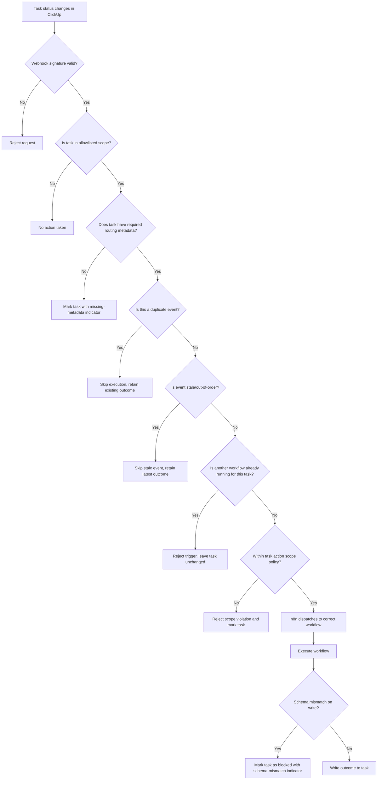

# Feature Specification: ClickUp + n8n Operational Control Plane — Phase 1: Event-Driven Workflow Dispatch

**Feature Branch**: `015-control-plane-dispatch`
**Created**: 2026-04-01
**Status**: Approved
**Parent Spec**: [014-clickup-n8n-control-plane](../014-clickup-n8n-control-plane/spec.md) (Phase 1 of 3)

## Approval Record

- Spec reviewed and approved by author on 2026-04-02.
- Plan reviewed and approved by author on 2026-04-02.
- Tasks reviewed and approved by author on 2026-04-02.

## One-Line Purpose *(mandatory)*

An operator moves a ClickUp task to a trigger-eligible status and the system dispatches the correct n8n workflow, executes scoped work, and writes a human-readable outcome back to the originating task.

## Consumer & Context *(mandatory)*

The operator interacts with ClickUp as the single pane of glass for work intake, review, and status, while n8n workflows consume task events and execute agent actions in the background.

## Clarifications

### Session 2026-04-01 (carried from parent spec)

- Q: Should the system support concurrent workflows on the same task? → A: No. One workflow at a time per task; new triggers are rejected while a run is active.
- Q: How should the webhook endpoint verify requests are genuinely from ClickUp? → A: Verify ClickUp webhook signature on every request; reject unsigned or invalid requests.
- Q: What happens when n8n is unavailable and webhook delivery fails? → A: Rely entirely on ClickUp's built-in webhook retry behavior; no additional handling.
- Q: What happens when a workflow targets a ClickUp field or status that no longer exists (schema drift)? → A: Fail the workflow and mark the task as blocked with a "schema mismatch" indicator describing the missing field/status.
- Q: What happens when ClickUp webhook delivery is delayed or out of order? → A: Older events are treated as stale and skipped with a visible stale-event outcome.

## User Scenarios & Testing *(mandatory)*

### User Story 1 - Trigger Agent Workflow from Task Status Change (Priority: P1)

An operator moves a ClickUp task to a trigger-eligible status (e.g., "Ready for Build"). The system detects this change, validates that the task belongs to an allowlisted scope and contains required routing metadata, then dispatches the task to the correct n8n workflow. The workflow executes the scoped work and writes a human-readable outcome summary back to the ClickUp task.

**Why this priority**: This is the foundational capability — without event-driven dispatch and outcome recording, no other workflow can function.

**Independent Test**: Can be fully tested by creating a task with valid metadata, moving it to a trigger status, and verifying that the correct workflow runs and writes its outcome back to the task.

**Acceptance Scenarios**:

1. **Given** a task in an allowlisted list with valid routing metadata, **When** the task status changes to "Ready for Build", **Then** n8n receives the event, dispatches the correct workflow, and writes a structured outcome update to the task within the configured timeout.
2. **Given** a task in an allowlisted list missing required routing metadata, **When** the task status changes to a trigger status, **Then** the system does not execute a workflow and marks the task with a visible "missing metadata" indicator specifying which fields are absent.
3. **Given** a task in a non-allowlisted list, **When** the task status changes to a trigger status, **Then** no workflow is dispatched and the task is marked with a visible out-of-scope indicator.
4. **Given** a duplicate webhook delivery for the same task event, **When** n8n receives the duplicate, **Then** the system does not re-execute the workflow and the task retains its existing outcome.
5. **Given** a webhook request with an invalid or missing signature, **When** the request reaches the endpoint, **Then** the system returns `401 invalid_signature` and performs no workflow dispatch.
6. **Given** an older out-of-order webhook event for a task, **When** the system compares it against the latest processed transition, **Then** the event is marked `stale_event` and no workflow is dispatched.
7. **Given** task metadata that requests workflow behavior outside the allowed action scope for the task type, **When** the system evaluates routing policy, **Then** dispatch is rejected and a visible operator-safe scope violation outcome is recorded.

---

### Edge Cases

- What happens when ClickUp's webhook delivery is delayed or out of order? → Older events are treated as stale and skipped with a visible stale-event outcome.
- What happens at max expected volume (hundreds to low-thousands of events per day, including replay bursts)? → The system remains idempotent and does not produce duplicate workflow dispatches.
- What happens when webhook payload is malformed (invalid JSON or missing required task/status fields)? → Request is rejected with `400 invalid_payload`; no dispatch or local state mutation occurs.
- How does the system handle a workflow that is already running when a new trigger event arrives for the same task? → Only one workflow runs per task at a time; new triggers are rejected while a run is active.
- What happens when n8n is temporarily unavailable when ClickUp sends a webhook? → System relies on ClickUp's built-in webhook retry behavior; no custom retry infrastructure.
- What happens when a workflow's target ClickUp custom field or status does not exist (e.g., schema drift)? → Workflow fails and task is marked as blocked with a "schema mismatch" indicator.

## Flowchart *(mandatory)*

## Data & State Preconditions *(mandatory)*

- A ClickUp workspace exists with at least one space, folder, or list configured as an allowlisted trigger scope.
- Trigger-eligible statuses (e.g., "Ready for Build") are defined in the ClickUp workspace.
- Required routing metadata fields (workflow type, specification/context reference, execution policy) are defined as custom fields on eligible task types.
- An n8n instance is running and reachable from the network where ClickUp webhooks are delivered.
- ClickUp webhook subscriptions are configured to send task status change events to the n8n endpoint.
- The operator has permission to move tasks between statuses.

## Inputs & Outputs *(mandatory)*

| Direction | Description | Format |
| :-- | :-- | :-- |
| Input | Task event from ClickUp containing task identifier, status change, custom field values, and scope identifiers | Caller-defined |
| Output | Structured outcome update written back to the originating ClickUp task containing what ran, what changed, what was produced, and what needs attention | Caller-defined |

## Constraints & Non-Goals *(mandatory)*

**Must NOT**:
- Must NOT execute workflows for tasks outside the allowlisted scope, even if metadata is present.
- Must NOT expose internal system state, stack traces, or raw API responses in task updates visible to operators.
- Must NOT allow a workflow to exceed the action scope defined for the task type.
- Must NOT silently fail — every failure must leave a visible indicator on the task.

**Adopted dependencies**:
- ClickUp — provides the operational UI, task state management, webhook event delivery, custom fields, and comment/update surfaces. Requires: workspace configuration, webhook setup, custom field definition, status workflow design.
- n8n — provides the workflow automation engine, webhook reception, workflow routing, and execution orchestration. Requires: instance deployment, workflow design, webhook endpoint configuration, credential management.

**Out of scope**:
- QA verification workflows and automatic pass/fail routing (deferred to Phase 2: 016-control-plane-qa-loop).
- Human-in-the-loop pause/resume workflows (deferred to Phase 3: 017-control-plane-hitl-audit).
- Full lifecycle auditability and chronological history (deferred to Phase 3: 017-control-plane-hitl-audit).
- Designing the internal logic of agent prompts or agent tool implementations.
- ClickUp workspace design (space/folder/list hierarchy, custom field schema, status workflow naming).
- n8n workflow internal design (node layout, credential wiring, error retry configuration).
- Multi-tenant or multi-workspace support.

## Requirements *(mandatory)*

### Functional Requirements

- **FR-001**: System MUST dispatch a workflow only when a task status change matches a configured trigger status AND the task belongs to an allowlisted scope.
- **FR-002**: System MUST validate that required routing metadata is present on the task before dispatching a workflow; if metadata is missing, the task MUST be marked with a visible indicator specifying which fields are absent.
- **FR-003**: System MUST route each eligible task to the correct workflow based on task metadata (workflow type, execution policy).
- **FR-004**: System MUST be idempotent with respect to duplicate webhook deliveries — repeated events for the same task state change MUST NOT cause duplicate workflow executions.
- **FR-005**: System MUST write a human-readable outcome update to the originating ClickUp task after every workflow run, including: what ran, what changed, what was produced, and what needs attention.
- **FR-006**: System MUST enforce one active workflow run per task at a time; if a new trigger event arrives while a run is active, the system MUST reject the new trigger and leave the task unchanged.
- **FR-007**: System MUST verify the webhook signature on every incoming request from ClickUp; unsigned or invalid requests MUST be rejected without dispatching a workflow.
- **FR-008**: System MUST fail the workflow and mark the task as blocked with a "schema mismatch" indicator if a write targets a ClickUp custom field or status that does not exist.
- **FR-009**: System MUST ignore stale out-of-order events for a task when ordering metadata indicates the event predates the latest processed transition.
- **FR-010**: System MUST enforce task-type action-scope policy and reject dispatch when requested workflow behavior exceeds the allowed scope.

### Key Entities

- **Task**: A ClickUp task that represents a unit of work; carries routing metadata and outcome history.
- **Workflow Run**: A single execution of an n8n workflow tied to one task; produces an outcome record.
- **Routing Metadata**: Custom field values on a task that determine which workflow to execute, where context lives, and what execution policy applies.
- **Outcome Record**: A structured update written to the task containing run results, artifacts, and next-action guidance.

## Success Criteria *(mandatory)*

### Measurable Outcomes

- **SC-001**: An operator can trigger a workflow by moving a ClickUp task to a trigger-eligible status and receive a structured outcome update on the same task.
- **SC-002**: Duplicate webhook deliveries do not cause duplicate workflow executions for the same task event.
- **SC-003**: Tasks with missing routing metadata are surfaced for correction — no silent failures.
- **SC-004**: Invalid or unsigned webhook requests are rejected without dispatching any workflow.

## Definition of Done *(mandatory)*

In production, an operator can move a ClickUp task to a trigger status and have the correct n8n workflow execute, write a structured outcome back to the task, and reject invalid, duplicate, or out-of-scope triggers — all without manual intervention beyond the initial status change.

## Resolved Decisions

- After 3 failed QA cycles, block automated rework; require human intervention to unblock (applies to Phase 2).
- One workflow at a time per task; concurrent triggers rejected while a run is active.
