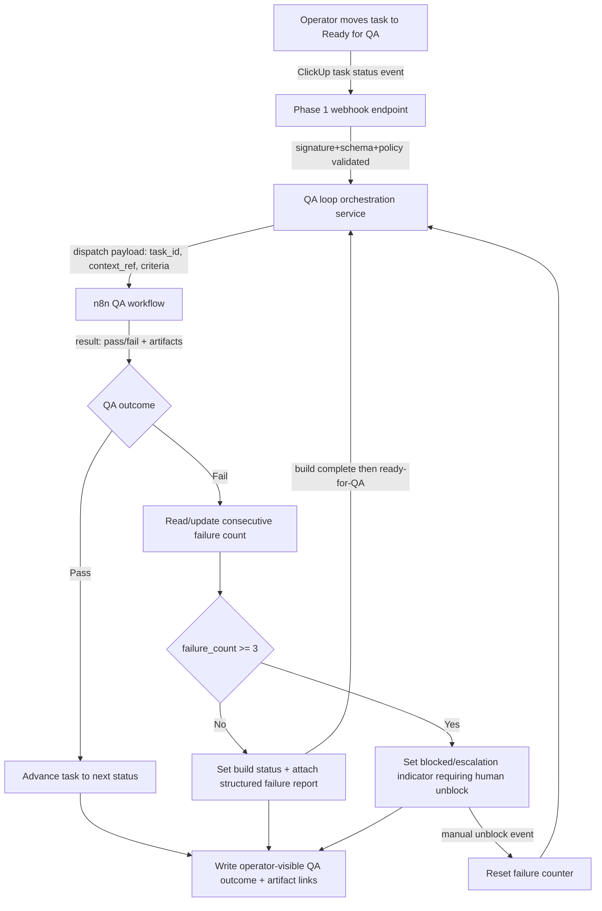

# Implementation Plan: ClickUp + n8n Operational Control Plane — Phase 2: QA Verification & Rework Loop

**Branch**: `016-control-plane-qa-loop-mainline` | **Date**: 2026-04-03 | **Spec**: [spec.md](spec.md)
**Input**: Feature specification from `/specs/016-control-plane-qa-loop/spec.md`

## Summary

Extend the Phase 1 dispatch runtime so QA-triggered tasks execute a deterministic QA pass/fail loop: pass advances status, fail returns to build with a structured failure report, and three consecutive failures force a blocked/escalation state requiring explicit human unblock before automation can continue.

## Technical Context

**Language/Version**: Python 3.12
**Primary Dependencies**: Existing Phase 1 stack (`fastapi`, `httpx`, `pydantic`, `aiosqlite`, `pyyaml`) plus ClickUp API and n8n runtime routes already adopted in Phase 1
**Storage**: ClickUp task fields/comments as authoritative QA lifecycle state; Phase 1 SQLite store remains dedupe/active-run guard only
**Testing**: `pytest` contract/unit/integration suites with async coverage for running-loop safety and QA loop regression flows
**Target Platform**: Self-hosted control-plane service with n8n backend; local dev on macOS and deployment on Linux
**Project Type**: Backend orchestration extension to an existing control-plane service
**Performance Goals**: QA routing decision path p95 < 350ms (excluding upstream/downstream network latency), zero duplicate dispatches under replay, deterministic escalation at failure count threshold 3
**Constraints**: No QA run without acceptance criteria, no hidden failures, no secret leakage, and no automated rework after 3 consecutive QA failures until manual unblock
**Executor Completion Requirement**: Routed automation must execute a real code-producing agent step (Codex CLI or equivalent) and emit a terminal completion signal (`completed`/`failed`) that is written back to ClickUp. A `dispatch accepted` acknowledgment alone is not sufficient to satisfy workflow completion.
**Scale/Scope**: Single ClickUp workspace/list flow handling repeated build→QA cycles for operator-managed tasks
**Async Process Model**: FastAPI request handlers remain single event loop; outbound ClickUp and n8n operations use explicit timeouts/cancellation and graceful shutdown semantics inherited from Phase 1; nested event loops are forbidden
**State Ownership/Reconciliation Model**: ClickUp task status + QA metadata are source-of-truth for QA progression and escalation state. Local service state is advisory only for dedupe/active-run lock and must reconcile against ClickUp before dispatch decisions
**Local DB Transaction Model**: N/A for new QA lifecycle ownership in this phase (no new authoritative local lifecycle state introduced); existing Phase 1 transaction boundaries remain unchanged
**Venue-Constrained Discovery Model**: N/A
**Implementation Skills**: Reuse `src/clickup_control_plane` layering and operator-safe outcome patterns from Phase 1; reuse async/state guard patterns already exercised in Phase 1 integration suite

## External Ingress + Runtime Readiness Gate *(mandatory)*

*GATE: Must pass before implementation. Re-validate in `/speckit.analyze`.*

| Check | Status | Notes |
|-------|--------|-------|
| Ingress strategy selected (`local tunnel`, `staging`, or `production`) and owner documented | ✅ Pass | Existing production ingress path retained from Phase 1 (`https://67.205.175.182.nip.io`) with local dev fallback (`localhost:8090`) |
| Endpoint contract path defined (example: `/control-plane/clickup/webhook`) and expected method/auth documented | ✅ Pass | Endpoint contract already documented in Phase 1 contract: `POST /control-plane/clickup/webhook` with signature validation |
| Runtime entrypoint readiness evidence captured (boot command + local probe command + observed result) | ✅ Pass | 2026-04-03 probe `curl -s -o /tmp/cp_health.out -w "%{http_code}\\n" https://67.205.175.182.nip.io/control-plane/health` returned `200`; body: `{\"status\":\"ok\"}` |
| Secret lifecycle defined for ingress auth (source, storage, rotation owner) | ✅ Pass | `CLICKUP_WEBHOOK_SECRET` + `CLICKUP_API_TOKEN` env-only runtime loading and operator-managed rotation documented in Phase 1 quickstart |
| External dependency readiness captured (upstream webhook registration path + downstream route readiness) | ✅ Pass | Caddy route `/control-plane/* -> control-plane:8090` confirmed; in-network probe from caddy container to control-plane health returned `{\"status\":\"ok\"}` |
| Evidence links recorded (commands/log snippets/screenshots/URLs) | ✅ Pass | Evidence captured in plan notes: health probe command/output, endpoint contract reference, and Phase 1 quickstart env/runbook references |

**Hard rule**: Any `❌ Fail` here blocks implementation readiness. `/speckit.tasks` MUST emit a `T000` gate task when any row is unresolved or when readiness must be proven in execution.

## Executor Reachability Gate *(mandatory)*

*GATE: Must pass before Phase 2 implementation continues.*

| Check | Status | Notes |
|-------|--------|-------|
| Executor path documented for each routed webhook target (`build_spec`, `qa_loop`) | ✅ Pass | n8n workflows `build-spec` (`e60ZZ7GYaNGPRSbs`) and `qa-loop` (`XEaqgA0PsffcYlIu`) now route `Webhook -> Dispatch Codex Workflow (GitHub)` targeting `.github/workflows/codex-clickup-runner-callback-basic.yml` on `main` |
| Codex CLI reachability validated from automation runtime | ✅ Pass | Codex executes from GitHub-hosted runner path (not n8n container host-shell path). Verified runs triggered from n8n dispatch completed with Codex + callback steps (`23963801429`, `23963836184`, `23964277014`) |
| Terminal completion writeback path defined and tested | ✅ Pass | `POST /control-plane/workflow/completion` now returns `202` for token-authenticated callbacks from GitHub Actions; control-plane logs confirm accepted callbacks and ClickUp task outcomes written for both `build_spec` and `qa_loop` |

**Hard rule**: Any unresolved row here blocks progression of spec-16 implementation tasks beyond planning. Current status: gate passed as of 2026-04-03.

## Constitution Check

| Principle | Status | Notes |
|-----------|--------|-------|
| I. Human-First | ✅ Pass | Escalation and unblock remain explicit human actions at the 3-failure threshold |
| II. AI Planning | ✅ Pass | Scope is bounded to QA loop behavior and reuses Phase 1 architecture |
| III-a. Security: no secrets in code/logs/committed files | ✅ Pass | QA failure reports must remain operator-safe with no secret/internal leakage |
| III-b. Security: secrets from env vars at runtime | ✅ Pass | Existing env-var secret model from Phase 1 retained |
| III-c. Security: least privilege | ✅ Pass | No broadened API scopes beyond task metadata/status/comment operations |
| III-d. Security: zero-trust boundaries identified | ✅ Pass | ClickUp ingress and n8n egress remain explicit trust boundaries in architecture flow |
| III-e. Security: external inputs validated | ✅ Pass | QA-triggering events depend on validated metadata and signature gates from Phase 1 |
| III-f. Security: errors don't expose internals | ✅ Pass | Structured failure reports are operator-facing and sanitized |
| IV. Parsimony | ✅ Pass | Adds only QA loop logic and escalation semantics required by FR-001..FR-004 |
| V. Reuse | ✅ Pass | Reuses existing control-plane modules, clients, and test harnesses |
| VI. Spec-First | ✅ Pass | Plan maps directly to spec-16 requirements and scenarios |
| VIII. Reuse Over Invention | ✅ Pass | Keeps n8n as workflow runtime; no custom orchestration platform introduced |
| IX. Composability | ✅ Pass | QA evaluation, failure reporting, and escalation policies are modular service responsibilities |
| X. SoC | ✅ Pass | Dispatch intake, QA routing policy, and ClickUp outcome writing stay separated |
| XIV. Observability | ✅ Pass | Every QA terminal path writes observable operator outcomes and test assertions |
| XV. TDD | ✅ Pass | Contract/unit/integration tests required before implementation tasks |
| XVIII. Async Process Management | ✅ Pass | Running-loop safety and timeout/cancel behavior remain mandatory regression checks |
| XIX. State Safety and Reconciliation | ✅ Pass | ClickUp stays source-of-truth; reconciliations happen before active dispatch decisions |
| XX. Local DB ACID and Transactional Integrity | ✅ Pass | No new authoritative local DB lifecycle state in scope |
| XXI. Venue-Constrained Discovery | ✅ Pass | N/A |

## Behavior Map Sync Gate *(mandatory)*

| Check | Status | Notes |
|-------|--------|-------|
| Runtime/config/operator-flow impact assessed (`src/csp_trader/`, `config*.yaml`, runbooks/scripts) | ✅ No impact | Scope remains within control-plane module/docs; trading runtime behavior unchanged |
| If impacted, update target identified: `specs/001-auto-options-trader/behavior-map.md` | N/A | No impact |

## Architecture Flow *(mandatory)*



## Project Structure

### Documentation (this feature)

```text
specs/016-control-plane-qa-loop/
├── spec.md
├── plan.md
├── research.md
├── data-model.md
├── quickstart.md
└── contracts/
    └── qa-loop-contract.md
```

### Source Code (repository root)

```text
src/
└── clickup_control_plane/
    ├── app.py                  # webhook intake wiring (existing, extended)
    ├── service.py              # dispatch decision orchestration (existing, extended)
    ├── dispatcher.py           # n8n workflow routing/payload shaping (existing, extended)
    ├── clickup_client.py       # task outcome + failure report writes (existing, extended)
    ├── state_store.py          # dedupe/active-run guard only (existing)
    ├── reconcile.py            # stale lock reconciliation (existing)
    └── qa_loop.py              # NEW: QA pass/fail routing + escalation policy coordinator

tests/
├── contract/
│   └── test_clickup_control_plane_contract.py
├── unit/
│   └── clickup_control_plane/
│       ├── test_dispatcher.py
│       ├── test_policy.py
│       └── test_qa_loop.py
└── integration/
    └── clickup_control_plane/
        └── test_webhook_to_dispatch_flow.py
```

**Structure Decision**: Extend the existing `src/clickup_control_plane` package from Phase 1 and add a focused `qa_loop.py` coordinator so QA-loop behavior is isolated while preserving existing trust-boundary and idempotency controls.

## Complexity Tracking

| Violation | Why Needed | Simpler Alternative Rejected Because |
|-----------|------------|-------------------------------------|
| N/A | N/A | No constitution violations; ingress readiness gate is now passing with runtime evidence |
