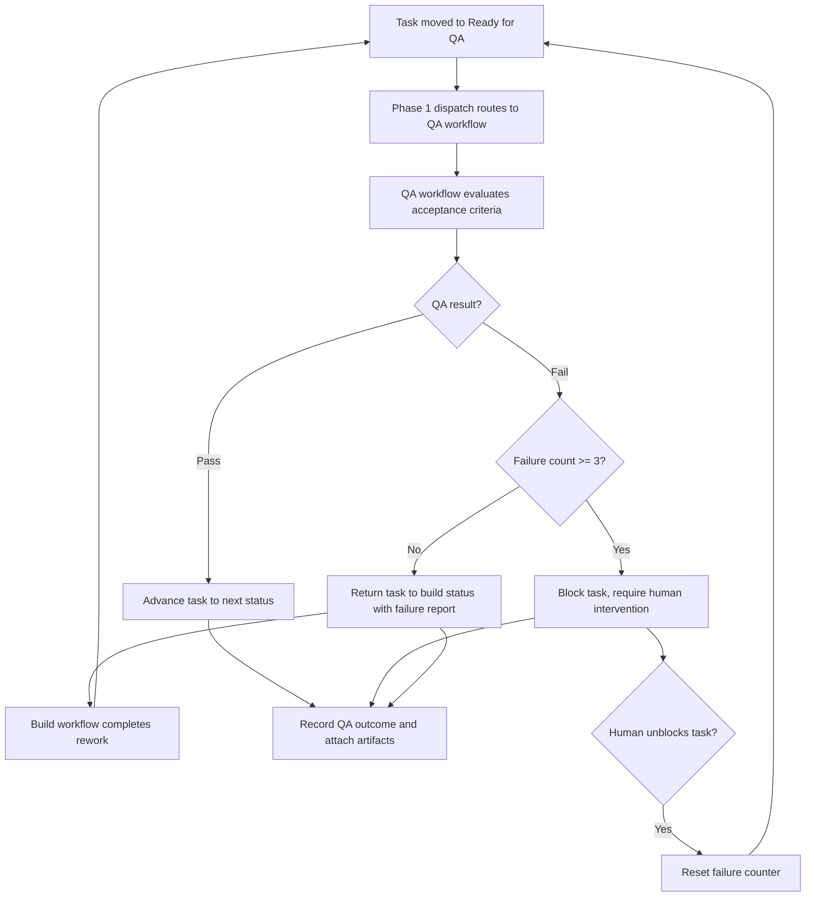

# Feature Specification: ClickUp + n8n Operational Control Plane — Phase 2: QA Verification & Rework Loop

**Feature Branch**: `016-control-plane-qa-loop`
**Created**: 2026-04-01
**Status**: Draft
**Parent Spec**: [014-clickup-n8n-control-plane](../014-clickup-n8n-control-plane/spec.md) (Phase 2 of 3)

## One-Line Purpose *(mandatory)*

An operator triggers automated QA evaluation on a completed build task, and the system automatically advances passing tasks or returns failing tasks to the build step with structured failure reports — escalating to human intervention after 3 consecutive failures.

## Consumer & Context *(mandatory)*

The operator interacts with ClickUp as the single pane of glass for work intake, review, and status, while n8n workflows consume task events and execute agent actions in the background.

## Clarifications

### Session 2026-04-01 (carried from parent spec)

- Q: What is the maximum number of QA rework cycles before escalation? → A: After 3 failed QA cycles, block further automated rework; require human intervention to unblock.

## User Scenarios & Testing *(mandatory)*

### User Story 1 - QA Verification with Automatic Pass/Fail Routing (Priority: P1)

An operator moves a completed build task to a QA-triggering status (e.g., "Ready for QA"). The system runs a QA workflow that evaluates the task against its acceptance criteria. If QA passes, the task advances to the next configured state. If QA fails, the task is automatically returned to the build state with a structured failure report describing the issue, expected behavior, observed behavior, and reproduction context.

**Why this priority**: Automated QA feedback loops with automatic backflow to build eliminate manual triage overhead and prevent failed work from stalling in review queues.

**Independent Test**: Can be fully tested by creating a task with defined acceptance criteria, triggering QA, and verifying both the pass path (task advances) and fail path (task returns to build with failure details).

**Acceptance Scenarios**:

1. **Given** a task in "Ready for QA" with defined acceptance criteria, **When** the QA workflow evaluates and all criteria pass, **Then** the task moves to the next configured status and the QA outcome is recorded on the task.
2. **Given** a task in "Ready for QA" with defined acceptance criteria, **When** the QA workflow evaluates and one or more criteria fail, **Then** the task is moved back to the build status and a structured failure report is attached containing: issue description, expected behavior, observed behavior, and reproduction context.
3. **Given** a task that has failed QA and been returned to build, **When** the build workflow completes rework, **Then** the task can re-enter QA and the QA workflow can see the prior failure context.
4. **Given** a task that has failed QA three times, **When** the third QA failure occurs, **Then** the system blocks further automated rework, marks the task as requiring human intervention, and preserves the cumulative failure history on the task.
5. **Given** a task blocked after 3 QA failures, **When** a human manually unblocks it, **Then** the task can re-enter the build → QA cycle and the failure counter resets.

---

### Edge Cases

- How does the system distinguish a QA-triggered workflow from a build-triggered workflow? → Via routing metadata (workflow type field on the task).
- What happens when acceptance criteria are not defined on a QA-eligible task? → The QA workflow cannot evaluate; task is marked with a missing-criteria indicator (handled by Phase 1 metadata validation).

## Flowchart *(mandatory)*

## Data & State Preconditions *(mandatory)*

- Phase 1 (015-control-plane-dispatch) is deployed and operational — webhook reception, scope validation, metadata validation, workflow dispatch, and outcome recording are available.
- QA-triggering statuses (e.g., "Ready for QA") are defined in the ClickUp workspace.
- Acceptance criteria are defined on QA-eligible tasks (as custom fields or structured task content).
- A build status exists for tasks to be returned to on QA failure.

## Inputs & Outputs *(mandatory)*

| Direction | Description | Format |
| :-- | :-- | :-- |
| Input | Task event from ClickUp indicating a task has moved to a QA-triggering status, with acceptance criteria available on the task | Caller-defined |
| Output | QA outcome: either task advancement to next status (pass) or task return to build status with structured failure report (fail) | Caller-defined |
| Output | Structured failure report containing: issue description, expected behavior, observed behavior, and reproduction context | Caller-defined |

## Constraints & Non-Goals *(mandatory)*

**Must NOT**:
- Must NOT execute QA evaluation without defined acceptance criteria on the task.
- Must NOT lose prior failure context when a task re-enters the QA cycle.
- Must NOT allow automated rework beyond 3 consecutive QA failures without human intervention.
- Must NOT expose internal system state in failure reports visible to operators.

**Adopted dependencies**:
- ClickUp — task state management, custom fields for acceptance criteria and failure reports, status transitions for pass/fail routing.
- n8n — QA workflow execution, failure report generation, rework cycle management.

**Out of scope**:
- Webhook reception, scope validation, metadata validation, idempotency, and outcome recording (provided by Phase 1: 015-control-plane-dispatch).
- Human-in-the-loop pause/resume workflows (deferred to Phase 3: 017-control-plane-hitl-audit).
- Full lifecycle auditability and chronological history (deferred to Phase 3: 017-control-plane-hitl-audit).
- Designing the internal logic of QA evaluation prompts or criteria definitions.
- ClickUp workspace design and n8n workflow internal design.

## Requirements *(mandatory)*

### Functional Requirements

- **FR-001**: System MUST automatically return a QA-failed task to the build status with a structured failure report containing: issue description, expected behavior, observed behavior, and reproduction context.
- **FR-002**: System MUST allow rework cycles (build → QA → fail → build → QA) to repeat without manual task recreation, preserving prior failure context on the task.
- **FR-003**: System MUST attach or link generated artifacts, reports, or references to the originating ClickUp task.
- **FR-004**: System MUST block further automated rework after 3 consecutive QA failures on the same task and mark it as requiring human intervention; a human must explicitly unblock the task to resume the build → QA cycle.

### Key Entities

- **Failure Report**: A structured QA failure record containing issue description, expected behavior, observed behavior, and reproduction context; attached to the originating task.

## Success Criteria *(mandatory)*

### Measurable Outcomes

- **SC-001**: A QA failure automatically returns the task to the build step with actionable failure context — no manual triage or task recreation required.
- **SC-002**: An operator can trigger, monitor, and review a complete build → QA → pass workflow without leaving ClickUp.
- **SC-003**: After 3 consecutive QA failures, the system blocks automated rework and surfaces the task for human intervention.

## Definition of Done *(mandatory)*

In production, an operator can move a task through a complete build → QA → pass/fail cycle with automatic QA evaluation, structured failure reports on fail, automatic backflow to build for rework, and escalation after 3 failures — all without leaving ClickUp or manually recreating tasks.

## Resolved Decisions

- After 3 failed QA cycles, block automated rework; require human intervention to unblock.
- One workflow at a time per task; concurrent triggers rejected while a run is active (enforced by Phase 1).
