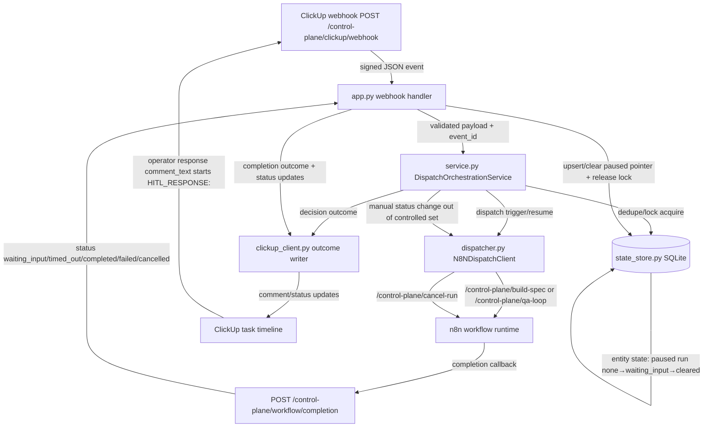

# Implementation Plan: ClickUp + n8n Operational Control Plane — Phase 3: Human-in-the-Loop & Lifecycle Auditability

**Branch**: `017-control-plane-hitl-audit-mainline` | **Date**: 2026-04-04 | **Spec**: [spec.md](spec.md)
**Input**: Feature specification from `/specs/017-control-plane-hitl-audit/spec.md`

## Summary

Implement Phase 3 control-plane behavior so workflow runs can pause for structured human input, resume from operator responses scoped to the paused run, timeout into a visible blocked state, and cancel immediately when an operator manually moves a task out of workflow-controlled statuses. Preserve chronological lifecycle visibility through ClickUp status/comment outcomes across multi-run task history.

## Technical Context

**Language/Version**: Python 3.12  
**Primary Dependencies**: `fastapi>=0.115.0`, `uvicorn>=0.30.0`, `httpx>=0.28.1`, `pydantic>=2.0,<3.0`, `aiosqlite>=0.20,<1.0`, `pytest>=8.4.0`, `pytest-asyncio>=0.24.0`  
**Storage**: ClickUp task statuses/comments as operator-visible source of truth; local SQLite (`.speckit/control-plane.db`) for dedupe + active-run lock + paused-run pointer only  
**Testing**: `pytest` contract/unit/integration suites; `pyright` for touched Python modules  
**Target Platform**: Self-hosted FastAPI control-plane service + n8n workflows; local macOS dev and Linux deployment  
**Project Type**: Backend orchestration extension to existing control-plane module  
**Performance Goals**: webhook decision path p95 `< 350ms` (excluding outbound ClickUp/n8n latency); paused-run SQLite read/write p95 `< 50ms`; zero duplicate resume/cancel side effects under replayed webhook events  
**Constraints**: no secret leakage in operator-visible outcomes; malformed operator input must not resume paused runs; manual cancel must not be silently ignored; lifecycle history must remain intact across repeated runs; canonical operator response convention uses `comment_text` prefix `HITL_RESPONSE:` (case-insensitive)  
**Scale/Scope**: single ClickUp workspace/list flow; one active workflow run per task enforced by Phase 1 state guard  
**Async Process Model**: FastAPI async request handlers own intake and completion callbacks; `N8NDispatchClient` governs timeout/cancel semantics for dispatch and cancel signals; no nested event-loop patterns; graceful request-scope cleanup on failure  
**State Ownership/Reconciliation Model**: ClickUp task status/comment timeline is authoritative for visible lifecycle; local DB owns advisory orchestration state (dedupe/lock/paused-run pointer). HITL timeout ownership remains with workflow runtime (n8n/runner) via `workflow/completion status=timed_out`; control-plane applies blocked outcome + lock release (no local timeout sweeper)  
**Local DB Transaction Model**: atomic transaction boundaries for dedupe+lock acquisition remain from Phase 1; paused-run upsert/get/clear and non-dispatch processed-event insert paths are idempotent and commit-or-rollback without partial writes  
**Venue-Constrained Discovery Model**: N/A (no venue-constrained external entity discovery)  
**Implementation Skills**: Reuse existing control-plane layering in `src/clickup_control_plane` and existing ClickUp outcome redaction templates

## External Ingress + Runtime Readiness Gate *(mandatory)*

*GATE: Must pass before implementation. Re-validate in `/speckit.analyze`.*

| Check | Status | Notes |
|-------|--------|-------|
| Ingress strategy selected (`local tunnel`, `staging`, or `production`) and owner documented | ✅ Pass | Production ingress retained via `https://67.205.175.182.nip.io/control-plane/*`; local fallback `http://localhost:8090/control-plane/*` |
| Endpoint contract path defined (example: `/control-plane/clickup/webhook`) and expected method/auth documented | ✅ Pass | Ingress endpoints: `POST /control-plane/clickup/webhook` (ClickUp signature) and `POST /control-plane/workflow/completion` (completion token) |
| Runtime entrypoint readiness evidence captured (boot command + local probe command + observed result) | ✅ Pass | Probe: `curl -s -o /tmp/cp_health.out -w "%{http_code}\n" https://67.205.175.182.nip.io/control-plane/health` => `200`, body `{"status":"ok"}` |
| Secret lifecycle defined for ingress auth (source, storage, rotation owner) | ✅ Pass | `CLICKUP_WEBHOOK_SECRET`, `CLICKUP_API_TOKEN`, `CONTROL_PLANE_COMPLETION_TOKEN` loaded from env only; operator-managed rotation |
| External dependency readiness captured (upstream webhook registration path + downstream route readiness) | ✅ Pass | ClickUp webhook points to `/control-plane/clickup/webhook`; n8n dispatch routes active for `/control-plane/build-spec`, `/control-plane/qa-loop`, and cancel endpoint `/control-plane/cancel-run` |
| Evidence links recorded (commands/log snippets/screenshots/URLs) | ✅ Pass | Evidence captured in `specs/016-control-plane-qa-loop/quickstart.md` runbook and validated during 017 implementation tests |

**Hard rule**: Any `❌ Fail` here blocks implementation readiness. `/speckit.tasks` MUST emit a `T000` gate task when any row is unresolved or when readiness must be proven in execution.

## Constitution Check

*GATE: Must pass before Phase 0 research. Re-check after Phase 1 design (after security review step).*

| Principle | Status | Notes |
|-----------|--------|-------|
| I-a. Security: no secrets in code/logs/committed files | ✅ Pass | Operator-visible outcomes use sanitized templates and reason codes only |
| I-b. Security: secrets from env vars at runtime | ✅ Pass | Runtime secrets sourced from env (`CLICKUP_*`, `CONTROL_PLANE_COMPLETION_TOKEN`) |
| I-c. Security: least privilege | ✅ Pass | No new credential scopes beyond existing ClickUp + n8n runtime integrations |
| I-d. Security: zero-trust boundaries identified | ✅ Pass | Ingress/egress boundaries are explicit in Architecture Flow (ClickUp, n8n, local DB) |
| I-e. Security: external inputs validated | ✅ Pass | Webhook/completion payloads validated via Pydantic + signature/token enforcement |
| I-f. Security: errors don't expose internals | ✅ Pass | Error envelopes remain sanitized and operator-actionable |
| II. Reuse at Every Scale | ✅ Pass | Extends existing control-plane stack; no net-new orchestration platform |
| III. Spec-First | ✅ Pass | Plan scope traces directly to FR-001..FR-007 and acceptance scenarios |
| IV. Composability, Modularity, and SoC | ✅ Pass | Intake/orchestration/transport/persistence concerns remain separated |
| V. KISS, YAGNI, and DRY | ✅ Pass | Minimal extension of existing modules; no speculative abstractions |
| VI. SOLID | ✅ Pass | Service/state/dispatcher boundaries preserve single-responsibility flow |
| VII. Observability and Fail Gracefully | ✅ Pass | Lifecycle outcomes and reason codes are persisted to operator-visible timeline |
| VIII. TDD | ✅ Pass | Contract/unit/integration suites are mandatory for phase behavior |
| IX. Documentation as First-Class Standard | ✅ Pass | Phase artifacts include research/data-model/contracts/quickstart/tasks |
| X. Automation-First Validation Gates | ✅ Pass | Validation is test-driven (`pytest` + `pyright`) with deterministic pass/fail gates |
| XI. Async Process Management and Event-Loop Safety | ✅ Pass | Timeout/cancel semantics are explicit in async dispatcher and callback flow |
| XII. State Safety and Integrity | ✅ Pass | Advisory state ownership and transactional mutation boundaries are explicit |
| XIII. Venue-Constrained Discovery and Live Data Discipline | ✅ Pass | N/A (feature has no venue-constrained live-data discovery paths) |

## Behavior Map Sync Gate *(mandatory)*

*GATE: Must be filled before `/speckit.tasks` generation.*

| Check | Status | Notes |
|-------|--------|-------|
| Runtime/config/operator-flow impact assessed (`src/csp_trader/`, `config*.yaml`, runbooks/scripts) | ✅ Impacted | `clickup_control_plane` runtime/config/operator flow changed (new HITL statuses, response convention, cancellation path) |
| If impacted, update target identified from `catalog.yaml` (`components[].behavior_map`) | ✅ Identified | `catalog.yaml` maps `clickup_control_plane` to `specs/015-control-plane-dispatch/behavior-map.md`; sync task required in `/speckit.tasks` |

## Architecture Flow *(mandatory)*



## Project Structure

### Documentation (this feature)

```text
specs/017-control-plane-hitl-audit/
├── spec.md
├── plan.md
├── research.md
├── data-model.md
├── quickstart.md
├── contracts/
│   └── hitl-lifecycle-contract.md
└── tasks.md
```

### Source Code (repository root)

```text
src/clickup_control_plane/
├── app.py
├── service.py
├── dispatcher.py
├── state_store.py
├── clickup_client.py
├── schemas.py
├── policy.py
├── reconcile.py
└── config.py

tests/
├── contract/test_clickup_control_plane_contract.py
├── integration/clickup_control_plane/test_webhook_to_dispatch_flow.py
└── unit/clickup_control_plane/
    ├── test_schemas.py
    ├── test_state_store.py
    ├── test_dispatcher.py
    └── test_clickup_client.py
```

**Structure Decision**: Extend the existing control-plane package and test harness to preserve deployment and observability continuity while adding Phase 3 behavior.

## Complexity Tracking

No constitution violations identified.
