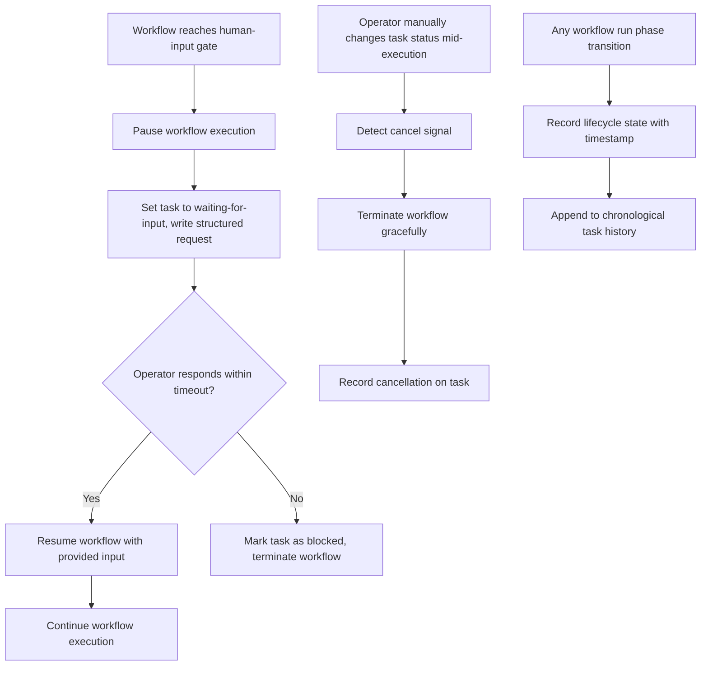

# Feature Specification: ClickUp + n8n Operational Control Plane — Phase 3: Human-in-the-Loop & Lifecycle Auditability

**Feature Branch**: `017-control-plane-hitl-audit`
**Created**: 2026-04-01
**Status**: Approved
**Parent Spec**: [014-clickup-n8n-control-plane](../014-clickup-n8n-control-plane/spec.md) (Phase 3 of 3)

## One-Line Purpose *(mandatory)*

Workflows can pause for human input and resume on operator response, operators can cancel running workflows via manual status changes, and every task carries a complete chronological audit trail of all workflow runs and state transitions.

## Consumer & Context *(mandatory)*

The operator interacts with ClickUp as the single pane of glass for work intake, review, and status, while n8n workflows consume task events and execute agent actions in the background.

## Clarifications

### Session 2026-04-01 (carried from parent spec)

- Q: What happens when an operator manually moves a task out of a workflow-controlled status mid-execution? → A: Treat as a cancel signal; terminate the running workflow gracefully and record the cancellation on the task.

## User Scenarios & Testing *(mandatory)*

### User Story 1 - Human-in-the-Loop Pause and Resume (Priority: P1)

A workflow encounters a point where it needs human input — a clarification, approval, or decision. The system pauses execution, writes a structured request for input to the ClickUp task, and waits. When the operator provides a response (via comment or field update following a defined convention), the system resumes the correct workflow with the provided input.

**Why this priority**: Many agentic workflows cannot proceed without human judgment at specific decision points; without pause/resume, the system either blocks indefinitely or makes unauthorized decisions.

**Independent Test**: Can be fully tested by triggering a workflow that requires human input, verifying the task shows a clear request, providing a response, and verifying the workflow resumes and completes.

**Acceptance Scenarios**:

1. **Given** a running workflow that reaches a human-input gate, **When** the workflow pauses, **Then** the task status changes to a "waiting for input" state and the task contains a structured description of what input is needed.
2. **Given** a task in "waiting for input" state, **When** the operator provides a response following the defined convention, **Then** n8n detects the response and resumes the paused workflow with the provided input.
3. **Given** a task in "waiting for input" state, **When** no response is provided within the configured timeout, **Then** the task is marked as "blocked" with a visible timeout indicator and the workflow is terminated cleanly.

---

### User Story 2 - Workflow Lifecycle Visibility and Auditability (Priority: P2)

Every workflow run has a visible lifecycle state on its ClickUp task (queued, running, waiting for input, passed, failed, blocked). The task preserves a clear history of all status changes, workflow runs, and outcomes so that an operator can trace any task from trigger to final result.

**Why this priority**: Without lifecycle visibility, operators cannot diagnose failures, track progress, or trust the system's state.

**Independent Test**: Can be fully tested by running a workflow end-to-end and verifying that all lifecycle states were recorded on the task and can be reviewed in chronological order.

**Acceptance Scenarios**:

1. **Given** a workflow that runs to completion, **When** an operator reviews the task, **Then** the task shows the complete lifecycle: trigger time, workflow start, execution steps, and final outcome with timestamps.
2. **Given** a workflow that fails mid-execution, **When** an operator reviews the task, **Then** the task shows the failure point, error context (without exposing internal system details), and the state the task was left in.
3. **Given** multiple workflow runs on the same task (e.g., build → QA fail → rework → QA pass), **When** an operator reviews the task, **Then** all runs are visible in chronological order with their individual outcomes.

---

### Edge Cases

- What happens when a task has a long-running workflow and the operator responds to a different task's human-input request? → Each pause/resume is scoped to the specific task and workflow run; no cross-task interference.
- How does the system handle multiple rapid status changes on a task (e.g., operator moves it out and back)? → The first manual move out of a workflow-controlled status triggers cancellation; re-entry triggers a new workflow run if eligible.

## Flowchart *(mandatory)*

## Data & State Preconditions *(mandatory)*

- Phase 1 (015-control-plane-dispatch) is deployed and operational — webhook reception, scope validation, metadata validation, workflow dispatch, and outcome recording are available.
- Phase 2 (016-control-plane-qa-loop) is deployed and operational — QA rework cycles provide multi-run history to audit.
- A "waiting for input" status is defined in the ClickUp workspace.
- A defined convention exists for operators to provide human-in-the-loop responses (comment format or field update pattern).
- Timeout durations for human-input gates are configured.

## Inputs & Outputs *(mandatory)*

| Direction | Description | Format |
| :-- | :-- | :-- |
| Input | Workflow-generated pause request containing a structured description of what input is needed | Caller-defined |
| Input | Operator response following the defined convention (comment or field update) | Caller-defined |
| Input | Task status change event indicating an operator manually moved a task out of a workflow-controlled status | Caller-defined |
| Output | Resumed workflow execution with the operator's provided input | Caller-defined |
| Output | Chronological lifecycle history on the task showing all workflow runs, state transitions, and outcomes with timestamps | Caller-defined |

## Constraints & Non-Goals *(mandatory)*

**Must NOT**:
- Must NOT resume a paused workflow with invalid or malformed operator input — validate before resuming.
- Must NOT expose internal system state, stack traces, or raw API responses in lifecycle records visible to operators.
- Must NOT lose lifecycle history when a task undergoes multiple workflow runs.
- Must NOT silently ignore operator cancellation — every manual status change on a workflow-controlled task must be detected and handled.

**Adopted dependencies**:
- ClickUp — task state management, comment/field update detection for human-in-the-loop responses, status change events for cancellation detection, custom fields or comments for lifecycle history.
- n8n — workflow pause/resume mechanics, cancellation handling, lifecycle state recording.

**Out of scope**:
- Webhook reception, scope validation, metadata validation, idempotency, and outcome recording (provided by Phase 1: 015-control-plane-dispatch).
- QA verification workflows and automatic pass/fail routing (provided by Phase 2: 016-control-plane-qa-loop).
- Designing the internal logic of agent prompts or agent tool implementations.
- ClickUp workspace design and n8n workflow internal design.
- Multi-tenant or multi-workspace support.

## Requirements *(mandatory)*

### Functional Requirements

- **FR-001**: System MUST record a visible lifecycle state on the task for each workflow run phase (queued, running, waiting for input, passed, failed, blocked).
- **FR-002**: System MUST support pausing a workflow to request human input, setting the task to a "waiting for input" state with a structured description of what is needed.
- **FR-003**: System MUST detect an operator's response (via a defined comment or field convention) and resume the paused workflow with the provided input.
- **FR-004**: System MUST mark a task as "blocked" and terminate the workflow cleanly if no human response is received within the configured timeout.
- **FR-005**: System MUST preserve a chronological history of all workflow runs, status changes, and outcomes on each task for auditability.
- **FR-006**: System MUST mark a task with a visible failure or blocked state if a workflow cannot run or fails after triggering, retaining enough context for retry without losing prior work.
- **FR-007**: System MUST treat an operator's manual status change on a task with an active workflow as a cancellation signal — the running workflow MUST be terminated gracefully and the cancellation recorded on the task.

### Key Entities

- **Task** (extended): Carries lifecycle state history, pause/resume state, and chronological audit trail in addition to Phase 1 fields.
- **Workflow Run** (extended): Carries lifecycle phase transitions with timestamps, pause/resume records, and cancellation records.

## Success Criteria *(mandatory)*

### Measurable Outcomes

- **SC-001**: A paused workflow resumes correctly when the operator provides input, and times out visibly if no response is given.
- **SC-002**: Every workflow run is traceable from trigger to final result via the task's recorded lifecycle history.
- **SC-003**: An operator can cancel a running workflow by manually changing the task status, and the cancellation is recorded.
- **SC-004**: Tasks with multiple workflow runs (e.g., build → QA fail → rework → QA pass) show all runs in chronological order.

## Definition of Done *(mandatory)*

In production, workflows can pause for human input and resume on operator response with timeout handling, operators can cancel running workflows via manual status changes, and every task shows a complete chronological audit trail of all workflow runs and state transitions — all visible within ClickUp.

## Resolved Decisions

- Operator manual status change on a workflow-controlled task is treated as a cancellation signal; workflow terminates gracefully and cancellation is recorded.
- One workflow at a time per task; concurrent triggers rejected while a run is active (enforced by Phase 1).
