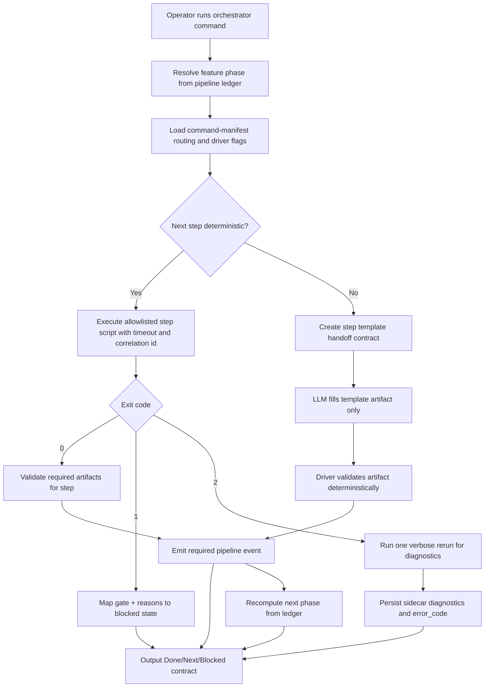

# Implementation Plan: Deterministic Pipeline Driver with LLM Handoff

**Branch**: `019-token-efficiency-docs` | **Date**: 2026-04-09 | **Spec**: [spec.md](spec.md)
**Input**: Feature specification from `/specs/019-token-efficiency-docs/spec.md`

## Summary

Implement a deterministic local pipeline driver that advances Speckit phases through manifest-allowlisted scripts, emits strict three-line human status output (`Done`, `Next`, `Blocked`), and invokes the LLM only for generation steps with template-based handoff contracts.

## Technical Context

**Language/Version**: Python 3.12  
**Technology Direction**: local deterministic orchestration command that resolves pipeline state from ledger events, executes allowlisted step scripts, and routes outcomes by exit code + compact JSON envelope  
**Technology Selection**: MVP uses existing repository runtime stack and standard library (`subprocess`, `json`, `pathlib`) with typed envelope validation using existing `pydantic` dependency; no additional package required before feasibility spikes  
**Storage**: append-only `.speckit/pipeline-ledger.jsonl`, artifact files under `specs/<feature>/`, and per-feature lock files under `.speckit/locks/`  
**Testing**: `uv run pytest`, `uv run pyright`, deterministic smoke script for feature flow progression and blocked-state routing  
**Target Platform**: local CLI execution in repository root, plus CI runners invoking the same deterministic scripts  
**Project Type**: CLI orchestration and governance tooling  
**Performance Goals**: non-generative routing overhead p95 `<250ms` excluding child script runtime; default human response capped at three lines; no full-payload stdout dump on success  
**Constraints**: manifest allowlist-only execution, deterministic exit semantics (`0/1/2`), one active orchestrator per feature lock, ledger-authoritative state progression, and no direct mutation without gate validation  
**Scale/Scope**: one feature pipeline progression per invocation; concurrent runs allowed across different feature IDs, not within the same feature ID  
**Async Process Model**: synchronous process execution with per-step timeout + forced kill on overrun; no nested event loops; each invocation is a single process lifecycle  
**State Ownership/Reconciliation Model**: ledger events are authoritative for phase progression; artifacts are validation evidence only. If artifact state conflicts with ledger state, return `state_drift_detected` and require deterministic reconcile step before continuing  
**Local DB Transaction Model**: N/A (no local relational DB mutations in this feature)  
**Venue-Constrained Discovery Model**: N/A (no venue-constrained live-data integrations)  
**Implementation Skills**: `speckit-workflow`

## External Ingress + Runtime Readiness Gate *(mandatory)*

*GATE: Must pass before implementation. Re-validate in `/speckit.analyze`.*

| Check | Status | Notes |
|-------|--------|-------|
| Ingress strategy selected (`local tunnel`, `staging`, or `production`) and owner documented | N/A | Feature is local CLI orchestration only; no inbound webhook/callback endpoint introduced |
| Endpoint contract path defined (example: `/control-plane/clickup/webhook`) and expected method/auth documented | N/A | No HTTP ingress surface in scope |
| Runtime entrypoint readiness evidence captured (boot command + local probe command + observed result) | N/A | Runtime entrypoint is CLI invocation (`python -m ...` or script), not network endpoint |
| Secret lifecycle defined for ingress auth (source, storage, rotation owner) | N/A | No ingress authentication channel introduced |
| External dependency readiness captured (upstream webhook registration path + downstream route readiness) | N/A | No upstream webhook registrations required |
| Evidence links recorded (commands/log snippets/screenshots/URLs) | N/A | Ingress evidence not applicable to this CLI-only feature |

**Hard rule**: Any `❌ Fail` here blocks implementation readiness. `/speckit.tasks` MUST emit a `T000` gate task when any row is unresolved or when readiness must be proven in execution.

## Constitution Check

*GATE: Must pass before Phase 0 research. Re-check after Phase 1 design (after security review step).*

| Principle | Status | Notes |
|-----------|--------|-------|
| I. Human-First | ✅ Pass | Output contract is optimized for operator comprehension: strict `Done/Next/Blocked` lines with optional drill-down |
| II. AI Planning | ✅ Pass | Deterministic orchestration replaces repeated prompt interpretation for routing/gates |
| III-a. Security: no secrets in code/logs/committed files | ✅ Pass | Default output avoids verbose dumps; sidecar diagnostics path only |
| III-b. Security: secrets from env vars at runtime | ✅ Pass | Any tokens used by child scripts remain env-sourced; no new secret storage |
| III-c. Security: least privilege | ✅ Pass | Driver executes only manifest-allowlisted scripts |
| III-d. Security: zero-trust boundaries identified | ✅ Pass | Script outputs treated as untrusted until envelope validation passes |
| III-e. Security: external inputs validated | ✅ Pass | Manifest paths, feature IDs, and script payload envelope fields are validated |
| III-f. Security: errors don't expose internals | ✅ Pass | Runtime failures return stable `error_code` + sidecar reference instead of raw traces |
| IV. Parsimony | ✅ Pass | Reuses existing ledger/gate tooling with thin orchestration layer |
| V. Reuse | ✅ Pass | Reuses `pipeline_ledger.py`, gate scripts, and manifest mapping |
| VI. Spec-First | ✅ Pass | Plan directly traces to FR-001..FR-026 and clarified constraints |
| VIII. Reuse Over Invention | ✅ Pass | No net-new orchestration service introduced |
| IX. Composability | ✅ Pass | Separate modules for state resolution, step execution, validation, and event append |
| X. SoC | ✅ Pass | LLM generation work remains isolated from deterministic control flow |
| XIV. Observability | ✅ Pass | Correlation ID propagation and deterministic sidecar diagnostics required |
| XV. TDD | ✅ Pass | Unit + integration routing tests and gate regression checks required before implementation close |
| XVIII. Async Process Management | ✅ Pass | Explicit timeout/cancel policy for child scripts; no async event-loop hazards introduced |
| XIX. State Safety and Reconciliation | ✅ Pass | Ledger-authoritative reconciliation policy with explicit `state_drift_detected` block |
| XX. Local DB ACID and Transactional Integrity | N/A | Feature uses files/JSONL only; no DB transaction semantics |
| XXI. Venue-Constrained Discovery | N/A | No venue-constrained entity discovery involved |

## Behavior Map Sync Gate *(mandatory)*

*GATE: Must be filled before `/speckit.tasks` generation.*

| Check | Status | Notes |
|-------|--------|-------|
| Runtime/config/operator-flow impact assessed (`src/csp_trader/`, `config*.yaml`, runbooks/scripts) | ✅ Impacted | Impacts Speckit command/runtime scripts and governance docs; no `src/csp_trader/` behavior-map target affected |
| If impacted, update target identified: `specs/001-auto-options-trader/behavior-map.md` | N/A | This feature does not alter trading runtime/operator behavior captured by that behavior map |

## Architecture Flow *(mandatory)*



## Project Structure

### Documentation (this feature)

```text
specs/019-token-efficiency-docs/
├── spec.md
├── research.md
├── plan.md
├── data-model.md
├── quickstart.md
├── contracts/
│   └── orchestrator-step-result.schema.json
└── tasks.md
```

### Source Code (repository root)

```text
scripts/
├── pipeline_driver.py                    # new deterministic orchestrator entrypoint
├── pipeline_driver_contracts.py          # envelope/schema validation + status-line renderer
├── pipeline_ledger.py                    # existing ledger append/validation reused
├── speckit_gate_status.py                # existing gate script reused in step mapping
├── speckit_tasks_gate.py                 # existing gate script reused in step mapping
└── speckit_implement_gate.py             # existing gate script reused in step mapping

.specify/
├── command-manifest.yaml                 # mapping source for deterministic step allowlist
└── templates/
    └── command templates for LLM-only steps

tests/
├── unit/
│   └── test_pipeline_driver.py
└── integration/
    └── test_pipeline_driver_feature_flow.py
```

**Structure Decision**: Extend existing script-based governance tooling with a dedicated deterministic driver module while preserving existing ledgers, gate scripts, and manifest ownership boundaries.

## Open Feasibility Questions

*None — no unresolved architecture capability assumptions remain after plan + research synthesis.*

## Complexity Tracking

No constitution violations identified.
