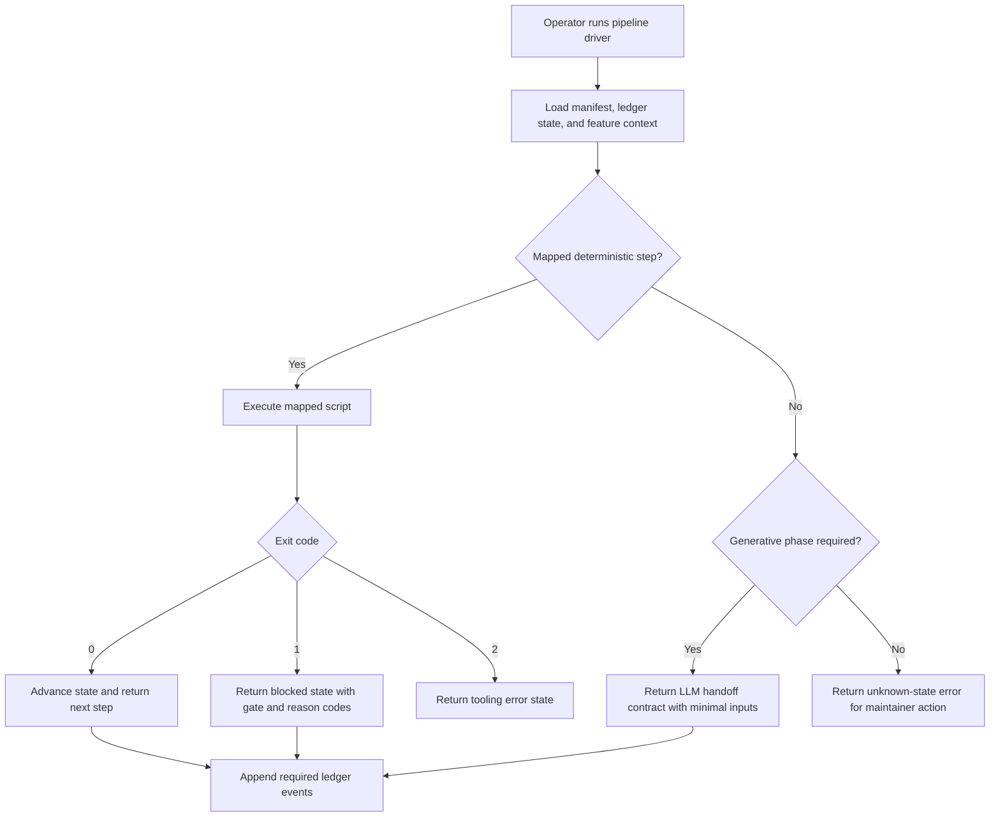

# Feature Specification: Deterministic Pipeline Driver with LLM Handoff

**Feature Branch**: `019-token-efficiency-docs`
**Created**: 2026-04-09
**Status**: Draft
**Input**: User description: "Introduce a deterministic pipeline driver that executes scripted gates/steps directly, invokes LLM only for generative phases, and enforces low-token response parsing defaults."

## One-Line Purpose *(mandatory)*

A build operator runs one deterministic pipeline driver command that advances speckit phases automatically and invokes the LLM only when generation work is required.

## Consumer & Context *(mandatory)*

Speckit operators and automation jobs consume this capability from local CLI execution in the repository root during normal spec-to-implementation workflows.

## User Scenarios & Testing *(mandatory)*

### User Story 1 - Deterministic Step Routing (Priority: P1)

An operator invokes one pipeline driver command with a feature context, and the driver evaluates current ledger/artifact state, executes deterministic scripts for the current step, and returns the next actionable state without requiring prompt-level interpretation of phase rules.

**Why this priority**: This removes the highest-frequency source of token waste and workflow drift by replacing repeated instruction re-reading with deterministic state transitions.

**Independent Test**: Can be fully tested by running the driver against a feature fixture where deterministic gates pass/fail in known combinations and verifying that the returned next-step state is correct.

**Acceptance Scenarios**:

1. **Given** a feature state where the next step is deterministic and all gate inputs are present, **When** the operator runs the driver, **Then** the driver executes the mapped script, records the result, and returns the next pipeline state.
2. **Given** a feature state where a deterministic gate fails, **When** the operator runs the driver, **Then** the driver returns a blocked state with gate identity and reason codes without requiring the LLM to inspect full logs.
3. **Given** a feature state that requires generative output (for example spec/plan/task synthesis), **When** the operator runs the driver, **Then** the driver returns an explicit LLM handoff contract containing step name and minimal required inputs.

---

### User Story 2 - Compact Parsing Contract (Priority: P2)

The pipeline scripts return a compact, uniform response contract so normal success paths do not emit large payloads and orchestration only parses failure-routing fields when needed.

**Why this priority**: The biggest avoidable token burn is reading full JSON/log output on successful paths where only pass/fail matters.

**Independent Test**: Can be fully tested by invoking representative scripts in success, business-failure, and runtime-failure modes and verifying exit-code-first behavior plus compact payload schema.

**Acceptance Scenarios**:

1. **Given** a script invocation that succeeds, **When** the driver executes it, **Then** the driver advances without reading large detail payloads.
2. **Given** a script invocation that returns business gate failure, **When** the driver executes it, **Then** it parses gate + reason codes and routes remediation deterministically.
3. **Given** a script invocation that returns runtime/contract failure, **When** the driver executes it, **Then** it returns a tooling error state distinct from business gate failure.

---

### User Story 3 - Governance and Migration Safety (Priority: P3)

A maintainer can migrate existing command docs and scripts to the driver model incrementally while preserving ledger integrity, existing artifacts, and branch-safe rollout.

**Why this priority**: Adoption must be low risk and reversible to avoid disrupting active feature branches.

**Independent Test**: Can be fully tested by enabling the driver for a subset of phases and confirming no regression in ledger event sequencing or artifact expectations.

**Acceptance Scenarios**:

1. **Given** a phase migrated to driver control, **When** the phase completes, **Then** required pipeline/task ledger events remain valid and in allowed order.
2. **Given** a phase not yet migrated, **When** the driver is used, **Then** it routes to existing command behavior without changing observable outputs.
3. **Given** a manifest/ledger contract change, **When** governance validation runs, **Then** it fails unless command-manifest version and sync metadata are updated.

### Edge Cases

- What happens when the driver receives an unknown phase/state not mapped in the transition matrix?
- How does the driver handle conflicting ledger state (for example duplicate terminal events)?
- What happens when a script exits `0` but emits malformed JSON in verbose mode?
- How does the system behave when a required script path in command-manifest is missing at runtime?
- What happens when a partial migration enables driver control for one phase while adjacent phases still use legacy command routing?
- What happens when two orchestrator invocations for the same feature run concurrently?
- What happens when ledger and filesystem artifacts disagree on phase completion?
- How does the driver prevent duplicate event emission on retry after partial failure?

## Flowchart *(mandatory)*

## Data & State Preconditions *(mandatory)*

- The feature directory exists with canonical artifact paths (`spec.md`, optional phase artifacts, and checklist directory).
- Pipeline and task ledgers are readable and contain valid JSONL entries up to the current transition point.
- Command manifest files exist and pass mirror consistency validation.
- Deterministic scripts referenced by the command manifest are present in the repository.

## Inputs & Outputs *(mandatory)*

| Direction | Description | Format |
| :-- | :-- | :-- |
| Input | Driver invocation context including feature identifier, current phase intent, and repository state | Caller-defined |
| Output | Compact orchestration result describing next state, blocking reason codes, or LLM handoff payload | Caller-defined |

## Constraints & Non-Goals *(mandatory)*

**Must NOT**:
- Must NOT remove LLM-generated deliverables from spec/plan/tasking phases.
- Must NOT bypass existing ledger transition rules or required event contracts.
- Must NOT parse or emit verbose script payloads on success paths by default.
- Must NOT introduce branch-destructive automation (forced resets, implicit rebases, or unapproved merges).

**Adopted dependencies**:
- Existing speckit deterministic gate scripts (`speckit_gate_status.py`, `speckit_spec_gate.py`, `speckit_plan_gate.py`, `speckit_tasks_gate.py`, `speckit_implement_gate.py`) for phase checks.
- Existing ledger tooling (`pipeline_ledger.py`, `task_ledger.py`) for authoritative event validation and append operations.
- Command manifest governance files (`.specify/command-manifest.yaml`, `command-manifest.yaml`) as script/event mapping source of truth.

**Out of scope**:
- Replacing narrative quality of LLM-generated specs/plans with template-only automation.
- Rewriting all existing command documents in one migration step.
- Introducing external orchestrators or hosted workflow engines for this driver.

## Requirements *(mandatory)*

### Functional Requirements

- **FR-001**: System MUST invoke a single deterministic driver command that resolves current phase state and dispatches mapped deterministic scripts without requiring prompt-level workflow interpretation.
- **FR-002**: System MUST treat script exit codes with standardized semantics (`0` success, `1` business/gate failure, `2` runtime/contract failure) for orchestration routing.
- **FR-003**: System MUST read only minimal payload fields on non-zero exits (`gate`, `reasons`, `error_code`) and avoid full-output parsing on success by default.
- **FR-004**: System MUST return an explicit LLM handoff contract when the next step requires generative work, including step identifier and minimal required input paths.
- **FR-005**: System MUST preserve existing ledger invariants by validating and emitting required pipeline/task events through existing ledger tooling.
- **FR-006**: System MUST source command-to-script routing from command-manifest and fail deterministically when mappings are missing or target scripts do not exist.
- **FR-007**: System MUST support incremental migration mode where migrated phases use driver routing and non-migrated phases continue legacy command flow.
- **FR-008**: System MUST provide optional verbose/debug output only when explicitly requested, and keep default response payload compact.
- **FR-009**: System MUST enforce manifest governance such that ledger contract changes require command-manifest update plus manifest version/timestamp update in the same change set.
- **FR-010**: System MUST expose deterministic blocked-state reason codes compatible with `docs/governance/gate-reason-codes.yaml` remediation routing.
- **FR-011**: System MUST define deterministic precedence rules for state reconciliation when ledger events and artifact presence conflict.
- **FR-012**: System MUST require deterministic post-LLM artifact validation before emitting success events to pipeline/task ledgers.
- **FR-013**: System MUST make orchestration retries idempotent so repeated invocation does not duplicate terminal events or corrupt phase progression.
- **FR-014**: System MUST enforce one active orchestrator execution per feature context using a lock or equivalent concurrency guard.
- **FR-015**: System MUST execute only command-manifest allowlisted scripts for deterministic steps and reject unmapped execution requests.
- **FR-016**: System MUST support a strict minimal-output mode where success paths return compact envelopes and detailed diagnostics are opt-in.
- **FR-017**: System MUST version orchestration and gate payload schemas with an explicit `schema_version` field and fail deterministically on unsupported versions.
- **FR-018**: System MUST enforce per-step timeout and cancellation behavior with deterministic blocked-state routing when execution exceeds configured limits.
- **FR-019**: System MUST define deterministic compensation/recovery behavior for partial-success states (for example artifact written but success event not emitted).
- **FR-020**: System MUST propagate a run-scoped correlation identifier across orchestrator outputs and ledger emissions for end-to-end traceability.
- **FR-021**: System MUST support a dry-run mode that resolves and reports planned step execution without mutating artifacts or ledgers.
- **FR-022**: System MUST support explicit human-approval breakpoints for configured steps before final success-event emission.

### Key Entities *(include if feature involves data)*

- **Pipeline Driver State**: Resolved orchestration state for a feature, including current phase, next action type (deterministic vs LLM), and block status.
- **Step Mapping**: Manifest-defined relation between pipeline command/phase and executable deterministic scripts.
- **Handoff Contract**: Compact payload returned to the LLM layer when generation is required (step, required inputs, and constraints).
- **Gate Outcome**: Structured result of deterministic script execution containing exit classification and reason codes.

## Success Criteria *(mandatory)*

### Measurable Outcomes

- **SC-001**: For deterministic-only transitions, median orchestration token usage decreases by at least 50% versus current command-doc-driven execution path.
- **SC-002**: At least 95% of successful deterministic step executions complete without parsing verbose script output.
- **SC-003**: Pipeline/task ledger validation passes with zero new ordering/schema regressions across migrated phases.
- **SC-004**: At least one end-to-end feature flow runs in mixed migration mode (driver + legacy phases) with identical observable artifacts and gate decisions.

## Definition of Done *(mandatory)*

In production development workflow, operators can run one deterministic pipeline driver that advances deterministic phases automatically, routes failures by reason code, and invokes the LLM only for required generation handoffs while preserving all ledger and governance guarantees.

## Open Questions *(include if any unresolved decisions exist)*

- **OQ-1**: Should the driver persist orchestration snapshots to a dedicated state file or derive state solely from ledgers + artifacts each run? Stakes: wrong choice could increase complexity or create stale-state drift.
- **OQ-2**: Should legacy phase routing be controlled by per-phase flags in manifest or by a single global migration mode? Stakes: incorrect mechanism could make rollout harder to audit.
- **OQ-3**: What exact reconciliation precedence should apply when ledger says phase complete but required artifact is missing (or the inverse)? Stakes: wrong precedence can cause skipped work or duplicate execution.
- **OQ-4**: Should feature-level orchestration locking use file locks, ledger locks, or process registry semantics? Stakes: weak locking risks duplicate event writes and race-condition regressions.
- **OQ-5**: What is the canonical minimal success payload schema for all gate/orchestrator scripts (`ok/mode` only vs `ok/mode/meta-lite`)? Stakes: inconsistent schema causes parser drift and token creep.
- **OQ-6**: What timeout defaults should apply per phase type, and should timeout thresholds be manifest-driven or hardcoded? Stakes: wrong defaults can either stall pipeline progress or cause premature failure churn.
- **OQ-7**: What is the required rollback behavior when a deterministic step mutates files but fails before ledger emission? Stakes: undefined rollback semantics can produce non-reproducible state and duplicate work.
- **OQ-8**: Which steps require mandatory human approval breakpoints before event emission versus auto-advance? Stakes: weak approval boundaries can violate governance intent or slow routine flows unnecessarily.
