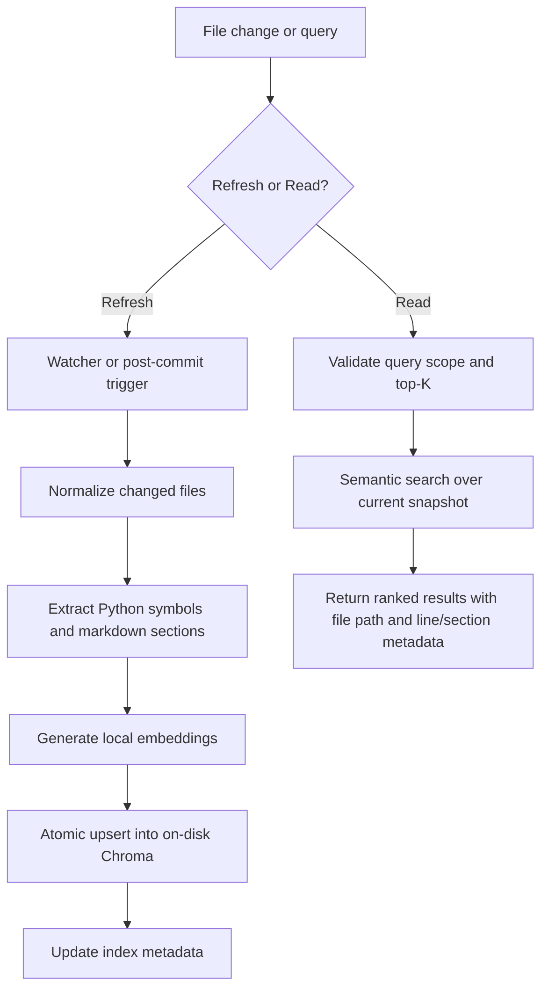

# Implementation Plan — Codebase Vector Index

_Date: 2026-04-13_  
_Feature: `020-codebase-vector-index`_  
_Source Spec: `spec.md`_  
_Artifact: `plan.md`_

## Summary

### Feature Goal

Build a local, repo-scoped semantic index for Python symbols and markdown sections so agents can find relevant context with one targeted query instead of broad file scans. The index should preserve line-level provenance, update as files change, and stay usable after restarts.

### Architecture Direction

Add a local indexer/query subsystem inside the existing `src/mcp_codebase` package, backed by an on-disk Chroma collection in `.codegraphcontext/db/vector-index/`. Use Tree-sitter for Python symbol extraction, `markdown-it-py` for markdown section extraction, `fastembed` for local embeddings, and `watchdog` for incremental refresh.

### Why This Direction

This direction reuses the repo's existing MCP/package structure, aligns with the `.codegraphcontext/` storage convention already used by codegraph tooling, keeps all state local, and satisfies the token-efficiency goal by making query results metadata-rich enough to drive `read_code_context` and `read_markdown_section` without extra discovery passes.

---

## Technical Context

| Area | Decision / Direction | Notes |
|------|-----------------------|-------|
| Language / Runtime | Python 3.12 | Matches the repo baseline in `pyproject.toml` and existing MCP servers. |
| Technology Direction | Local embedded index, no custom backend service | Keep indexing/querying repo-local and deterministic; no external network dependency. |
| Technology Selection | `tree-sitter`, `markdown-it-py`, `fastembed`, `chromadb`, `watchdog`, existing `src/mcp_codebase` package | Reuse existing package boundaries and local indexing conventions. |
| Storage | On-disk Chroma collection under `.codegraphcontext/db/vector-index/` | Persistent across restarts; derived state only. |
| Testing | `pytest`, deterministic smoke tests, plan/research smoke gates | Verification-first governance applies to this feature. |
| Target Platform | Local developer/agent machine against a checked-out repo | Designed for repo-scoped use, not a multi-tenant service. |
| Project Type | Local library + MCP tool surface extension | Extend the existing codebase MCP tooling instead of introducing a separate service. |
| Performance Goals | Full build under 60s; incremental refresh under 10s; top-5 query latency low enough for agent use | Derived from the spec success criteria. |
| Constraints | No partial writes, no query mutation, watcher-first refresh, on-disk persistence, markdown and Python only in phase 1 | Keep the initial scope tight and deterministic. |
| Scale / Scope | `src/`, `tests/`, `specs/`, `.claude/`, and root markdown docs | Python symbols plus markdown sections only. |

### Async Process Model

Refresh runs in the background when file changes arrive from the watcher or post-commit fallback. Query calls should stay non-blocking and read from the last known good snapshot. If a refresh is in progress, query should continue against the current collection.

### State Ownership / Reconciliation Model

The repository files are authoritative. The index is a derived cache whose freshness is tracked by commit hash, per-record content hashes, and build timestamp. Reconciliation happens on refresh: changed files are re-parsed, embeddings are recomputed, and old records are superseded atomically.

### Local DB Transaction Model

Each build/update should stage writes in a temporary collection or staging directory and swap them into the active path only after the full batch succeeds. Partial refreshes must not become visible. Upserts must be idempotent by content hash plus path/span identity.

### Venue-Constrained Discovery Model

Discovery is metadata-first: a query should return path, breadcrumb or line range, symbol type, and preview before the agent reads the source file. Query scope must stay local to the repo and obey the code/markdown/both filter from the spec.

### Implementation Skills

- Tree-sitter symbol extraction for Python source
- Markdown section parsing and breadcrumb generation
- Local vector-store lifecycle management and atomic refreshes

---

## Repeated Architectural Unit Recognition

### Does a repeated architectural unit exist?

Yes.

### Chosen Abstraction

`IndexableContentUnit`

### Why It Matters

Both Python symbols and markdown sections follow the same lifecycle: extract source text, attach provenance, embed, persist, query, refresh, and mark stale. Treating them as one first-class unit keeps the extractor, embedder, and storage flow consistent.

### Defining Properties

- Stable identity derived from path + source span or breadcrumb + content hash
- Metadata-rich provenance for line ranges, headers, and content type
- Shared lifecycle: discovered -> embedded -> persisted -> refreshed -> superseded
- Query output that can be consumed directly by read tools

---

## Reuse-First Architecture Decision

### Existing Sources Considered

| Source Type | Candidate | Covers Which FRs / Needs | Use Decision | Notes |
|-------------|-----------|---------------------------|--------------|------|
| Script | `scripts/cgc_safe_index.sh` | Incremental guarded indexing pattern, scoped refresh discipline | Reuse | Good operational baseline for guarded refreshes and repo-root safety. |
| Script | `scripts/read-markdown.sh` | Markdown section read semantics and section-window discipline | Reuse | Useful as a user-facing fallback when a query result points to a section. |
| Package | `src/mcp_codebase/` | Existing MCP package layout and runtime conventions | Extend | Best place for index/query tools without adding a new top-level service family. |
| Package / dependency | `tree-sitter` | Python symbol parsing and line-range extraction | Adopt | Better fit than ad hoc regexes for symbol boundaries and body capture. |
| Package / dependency | `markdown-it-py` | Markdown section extraction and breadcrumb generation | Adopt | Natural fit for structured heading traversal. |
| Package / dependency | `fastembed` | Local embedding runtime | Adopt | Small local dependency and good fit for repo-scoped embeddings. |
| Package / dependency | `chromadb` | Persistent local vector storage and metadata filtering | Adopt | Matches the on-disk local DB requirement. |
| Package / dependency | `watchdog` | File change refresh trigger | Adopt | Satisfies watcher-first update behavior. |
| Convention | `.codegraphcontext/` storage home | Local index state and repo-scoped cache location | Reuse | Keeps the new index aligned with existing codegraph tooling conventions. |

### Preferred Reuse Strategy

Extend `src/mcp_codebase` with a dedicated index subpackage and tool surface, reuse the repo-local `.codegraphcontext/` home for persistence, and reuse the existing guarded indexing / markdown-reading scripts as workflow patterns. The net-new work is the extractor + embedder + storage pipeline, not a new backend architecture.

### Net-New Architecture Justification

The repo does not yet have a semantic vector index, a markdown-section indexer, or a refresh pipeline that keeps those derived records in sync with file changes. That logic needs new code, but it should be built inside the existing package and storage conventions.

---

## Pipeline Architecture Model

### Recurring Unit Model

The recurring unit is `IndexableContentUnit`, which represents either a Python symbol or a markdown section. Each unit travels through the same pipeline: extract -> normalize -> embed -> persist -> query -> refresh.

### Unit Properties

| Property | Description |
|----------|-------------|
| Name | `IndexableContentUnit` |
| Owned Artifacts | Symbol rows, markdown section rows, metadata rows, query result envelopes |
| Template / Scaffold Relationship | Not a human-authored artifact; derived from extractor and indexer rules |
| Events | `index_build_started`, `index_build_completed`, `index_refresh_started`, `index_refresh_completed`, `index_refresh_failed` |
| Handoffs | Query surface, staleness check, plan review / sketch consumers that need provenance-rich results |
| Completion Invariants | Each unit has a stable identity, source provenance, embedding payload, and freshness marker |

### Downstream Reliance

Later phases should be able to consume a query result and immediately jump to the correct file and span or markdown section without any extra search pass. That is the main token-saving contract.

---

## Artifact / Event Contract Architecture

| Architectural Unit / Phase | Owned Artifacts | Template / Scaffold | Emitted Events | Downstream Consumers | Notes |
|----------------------------|----------------|---------------------|----------------|----------------------|------|
| `speckit.plan` | `plan.md`, `data-model.md`, `quickstart.md` | `plan-template.md`, `data-model-template.md`, `quickstart-template.md` | `plan_started`, `plan_approved` | `speckit.planreview`, `speckit.feasibilityspike`, `speckit.sketch` | The planning artifact itself is table-heavy and should stay driver-backed. |
| Python symbol extractor | `CodeSymbol` records | Tree-sitter extractor rules | `index_build_started`, `index_build_completed`, `index_refresh_completed` | Query surface, staleness checker | Capture name, signature, docstring, code body, file path, and line range. |
| Markdown section extractor | `MarkdownSection` records | `markdown-it-py` heading traversal rules | `index_build_started`, `index_build_completed`, `index_refresh_completed` | Query surface, markdown read fallback | Capture breadcrumb, section depth, and content preview. |
| Local vector store | On-disk Chroma collection + metadata sidecar | Chroma collection schema | `index_build_completed`, `index_refresh_failed` | Query surface, watcher refresh, staleness check | Store only derived index state; never mutate source files. |
| Refresh trigger | Watcher + post-commit fallback | `watchdog` + `.git/hooks/post-commit` | `index_refresh_started`, `index_refresh_completed`, `index_refresh_failed` | Query surface, operator logs | Watcher is default; hook is fallback. |

### Manifest Impact

The plan phase itself does not require a command-manifest change. Implementation may add new runtime commands, but the current planning flow can proceed without altering the manifest.

---

## Architecture Flow

### Major Components

- Refresh trigger (`watchdog` watcher with post-commit fallback)
- Extractors for Python symbols and markdown sections
- Embedder and persistent Chroma store
- Query surface exposed through the existing MCP package

### Trust Boundaries

- Local filesystem content is untrusted until parsed and validated
- Query inputs from agents are untrusted until scope and top-K are validated
- Persistent index state is derived and may lag the current repo HEAD until refreshed

### Primary Automated Action

Incremental refresh on file change.

### Architecture Flow Notes

The system should keep the refresh path local and deterministic: a file change triggers reindexing of only the affected files, the extractor normalizes content, the embedder produces vectors, the store atomically swaps in the new snapshot, and queries return metadata-rich results that point the agent to the exact read target.

---

## External Ingress + Runtime Readiness Gate

| Gate Item | Status | Rationale |
|-----------|--------|-----------|
| Local query input | ✅ Pass | Query requests stay local and are validated for scope and top-K before search. |
| File-system change input | ✅ Pass | Watcher-driven refresh keeps the index close to current edits. |
| Post-commit fallback input | ✅ Pass | Commit hook exists as a secondary refresh path when file watching is unavailable. |
| Embedding runtime availability | ✅ Pass | Local embedding is intentionally selected to avoid external API dependency. |
| Repository-root awareness | ✅ Pass | All paths and updates are repo-scoped and derived from the current checkout. |

### Readiness Blocking Summary

No external ingress blocks implementation readiness. The main readiness items are local: parser choice, collection path, and exact query-tool wiring.

---

## State / Storage / Reliability Model

### State Authority

The repository working tree is authoritative for content. The index is a derived state machine that records a snapshot of the repo at a specific HEAD commit and content hash set. If the repo changes, the index becomes stale until refreshed.

### Persistence Model

Persist the active vector store on disk under `.codegraphcontext/db/vector-index/`, with a sidecar metadata record that stores build timestamp, HEAD commit hash, model ID, symbol count, and section count. Use versioned collection names or a staging path to support safe rebuilds.

### Retry / Timeout / Failure Posture

Refresh operations should retry bounded transient failures only when the operation is idempotent. If an embedding or write step fails, the last good collection stays active. Query calls should fail closed only when the active snapshot is missing or invalid.

### Recovery / Degraded Mode Expectations

If the index is stale, the system may still answer queries from the last good snapshot but should report freshness metadata so the caller can decide whether to force refresh. If the store is missing or corrupted, rebuild from the repository source tree.

---

## Contracts and Planning Artifacts

### Data Model

`data-model.md` should define the derived entity set:

- `CodeSymbol`
- `MarkdownSection`
- `IndexMetadata`
- `QueryResult`

The artifact should stay table-driven and capture identity, source of truth, lifecycle, and storage boundaries.

### Contracts

No separate `contracts/` artifact is required at plan time. If the implementation later introduces explicit query schemas or IPC contracts, those should be added only if they become downstream interfaces that need a dedicated document.

### Quickstart

`quickstart.md` should cover:

- repo sync and dependency install
- how to build or refresh the index locally
- how to run the query surface
- how to verify freshness and smoke-test the index

---

## Constitution Check

| Check | Status | Notes |
|-------|--------|-------|
| Verification First | ✅ Pass | The plan assumes deterministic smoke tests and gate scripts for any markdown-process or code change. |
| Security First | ✅ Pass | Inputs are local, validated, and scope-limited; no secrets or unauthenticated external ingress are introduced. |
| Reuse at Every Scale | ✅ Pass | The plan reuses existing package conventions, local storage homes, and helper-script patterns. |
| Spec-First | ✅ Pass | The feature already has a completed spec and research artifact. |
| Architectural Flow Visualization | ✅ Pass | The architecture flow is documented with a mermaid diagram. |

---

## Behavior Map Sync Gate

| Runtime / Config / Operator Surface | Impact? | Update Target | Notes |
|------------------------------------|---------|---------------|-------|
| `src/mcp_codebase/` runtime config | Yes | `src/mcp_codebase/config.py` or new index config module | Add index path, embedding model, watcher scope, and refresh settings. |
| Query tool surface | Yes | `src/mcp_codebase/server.py` or index tool module | Expose search/staleness/update entry points. |
| Repo-local storage path | Yes | `.codegraphcontext/db/vector-index/` | Document the on-disk collection and metadata sidecar path. |
| Environment defaults | Yes | `.env.example` or equivalent docs | Only if runtime config needs explicit overrides. |
| `scripts/cgc_safe_index.sh` | No | N/A | Existing helper remains a pattern reference, not a required edit for this feature. |
| `scripts/read-markdown.sh` | No | N/A | Existing fallback read helper stays as-is. |

---

## Open Feasibility Questions

- [x] **FQ-001**: Should the first implementation surface be a direct MCP tool set inside `src/mcp_codebase`, or a small standalone CLI that the MCP server wraps?  
  **Probe:** Prove the tool boundary and smoke-test entry point with one minimal query command.  
  **Blocking:** Package layout and first runnable interface.  
  **Answer:** Direct MCP tool set inside `src/mcp_codebase`.

- [x] **FQ-002**: Can Tree-sitter plus `markdown-it-py` cover the required Python and markdown extraction shapes on current repo fixtures without extra parser glue?  
  **Probe:** Run representative extraction fixtures over `src/`, `tests/`, `specs/`, and `.claude/`.  
  **Blocking:** Extractor implementation details and test fixtures.  
  **Answer:** Yes. Phase 1 should standardize on `tree-sitter` for Python and `markdown-it-py` for markdown; the parser stack is local, read-only, and does not add a new trust boundary beyond normal file ingestion.

- [x] **FQ-003**: Is `.codegraphcontext/db/chroma/` the right stable default path, or should the index live in a sibling subdirectory for cleaner separation from graph-based codegraph state?  
  **Probe:** Compare path conventions against the existing `.codegraphcontext/` layout and keep the one that makes backup/rebuild semantics clearer.  
  **Blocking:** Storage path default and documentation.  
  **Answer:** Use `.codegraphcontext/db/vector-index/` as the stable on-disk path. It keeps the semantic index isolated while still staying inside the repo-local codegraph home.

---

## Handoff Contract to Sketch

### Settled by Plan

- The index is local-only and repo-scoped.
- Tree-sitter will be the first parser for Python symbols.
- `markdown-it-py` will be the first parser for markdown sections.
- `fastembed` will provide local embeddings.
- Chroma will persist on disk under the repo-local codegraph home.
- Watchdog is the default refresh trigger, with post-commit as fallback.

### Sketch Must Preserve

- The local-only trust boundary
- The on-disk persistence model
- The metadata-rich query result contract
- The watcher-first refresh behavior
- The atomic no-partial-write requirement

### Sketch May Refine

- Exact module names inside `src/mcp_codebase`
- Exact query tool names and CLI entry points
- The precise metadata sidecar file format
- Fixture layout and test split

### Sketch Must Not Re-Decide

- Parser family choice for phase 1
- Embedding runtime family choice for phase 1
- Persistence being on-disk
- Watcher-first refresh behavior

---

## Phase 1 Planning Artifacts Summary

| Artifact | Status | Notes |
|----------|--------|-------|
| `plan.md` | updated | Replaced template shell with a table-heavy architecture plan. |
| `data-model.md` | updated | Defines the derived entities and lifecycle boundaries. |
| `contracts/` | N/A | No separate contract artifact is required at plan time. |
| `quickstart.md` | updated | Documents the expected local build/query/smoke-test workflow. |

---

## Plan Completion Summary

### Ready for Plan Review?

- [x] Architecture direction is explicit
- [x] Repeated architectural unit is modeled or explicitly unnecessary
- [x] Reuse-first decision is explicit
- [x] Architecture Flow is complete
- [x] Trust boundaries are explicit
- [x] Artifact/event contract architecture is explicit
- [x] Open feasibility questions are isolated
- [x] Sketch handoff contract is explicit

### Suggested Next Step

`/speckit.planreview`
