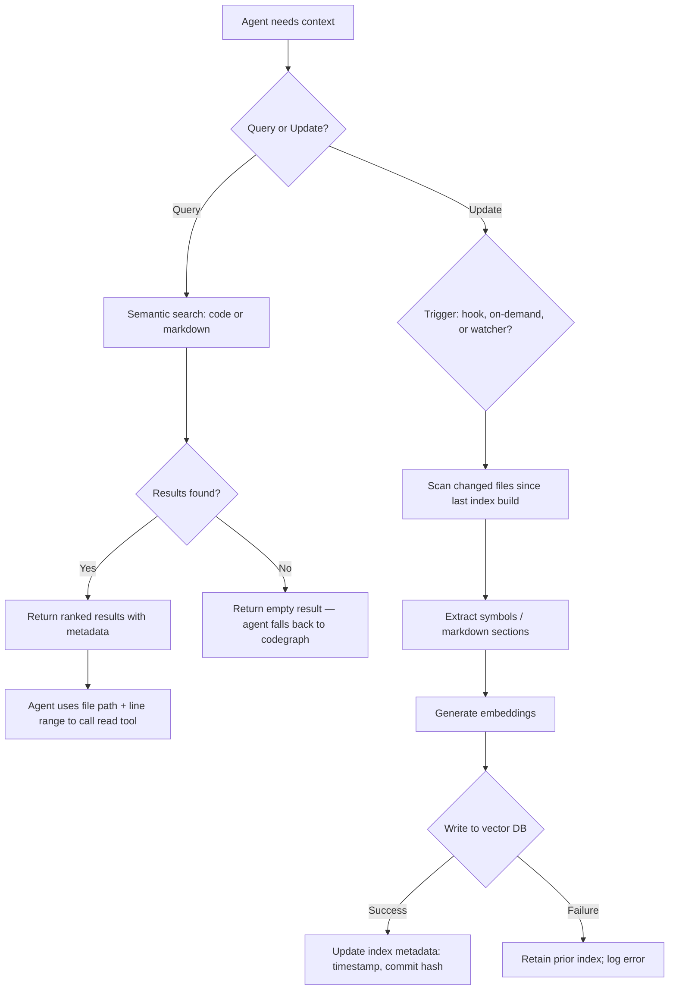

# Feature Specification: Codebase Vector Index

**Feature Branch**: `020-codebase-vector-index`
**Created**: 2026-04-11
**Status**: Draft
**Input**: User description: "Vector for traversing the codebase and markdown files with token efficiency; precursor to codegraph/readcode traversal; extracts function name, docstring, signature, code body, file path, line range, symbol type; uses Chroma (open to alternatives); regularly updated when code changes."

## One-Line Purpose *(mandatory)*

Agents query vector embeddings of code symbols and markdown sections to locate relevant context with minimal token spend before invoking read-code or codegraph tools.

## Consumer & Context *(mandatory)*

Claude Code agents consume this index during planning, discovery, and implementation phases to reduce token cost when navigating unfamiliar code regions and documentation.

## Clarifications

### Session 2026-04-13

- Q: Should code body be included in the embedding input (alongside docstring + signature) or stored as metadata only? → A: Include the full code body in the embedding input, while still recording line numbers and all other symbol metadata as structured fields.
- Q: Should the automated update trigger use a git post-commit hook, a filesystem watcher (watchdog), or a session-start check? → A: Use a `watchdog` filesystem watcher as the default trigger so the index updates as files change, with a `post-commit` hook as a secondary fallback trigger.
- Q: Should Chroma use in-memory or on-disk persistence? → A: Use on-disk persistence so the index survives restarts and does not require a full rebuild each session.

## User Scenarios & Testing *(mandatory)*

### User Story 1 — Semantic Symbol Lookup (Priority: P1)

An agent needs to understand what handles a specific concern (e.g., "webhook deduplication") without reading every file. It queries the vector index with a short phrase and receives ranked candidate symbols with file path, line range, and docstring.

**Why this priority**: The core value — replacing broad file reads with ranked symbol candidates.

**Independent Test**: Index built over `src/`; query returns ≥1 relevant result with complete metadata for a known symbol.

**Acceptance Scenarios**:

| # | Given | When | Then |
|---|-------|------|------|
| 1 | Index built over `src/` | Agent queries "webhook deduplication" | Returns ranked symbols with name, docstring, signature, file path, line range, symbol type |
| 2 | Top result selected | Agent constructs `read_code_context` call | Metadata (file path + line range) is sufficient to call the read tool without additional discovery |
| 3 | Index built; query term matches nothing | Agent queries "nonexistent concept XYZ" | Returns empty ranked list; caller receives zero results without error |

---

### User Story 2 — Markdown Section Discovery (Priority: P2)

An agent needs to find the right spec section or governance rule without scanning full markdown trees. It queries the index with a topic phrase and receives ranked section results with breadcrumb, file path, and content preview.

**Why this priority**: Markdown traversal is as frequent as code traversal in this codebase; users explicitly requested it.

**Independent Test**: Index includes sections from `specs/` and `.claude/`; query returns a matching section header with path and breadcrumb.

**Acceptance Scenarios**:

| # | Given | When | Then |
|---|-------|------|------|
| 1 | Markdown index built | Agent queries "webhook authentication" | Returns ranked sections with file path, header breadcrumb, content preview (≤200 chars) |
| 2 | Section result consumed | Agent reads target section | File path + section heading from result is sufficient to call `read_markdown_section` directly |

---

### User Story 3 — Incremental Update on Code Change (Priority: P2)

A developer commits new code or edits a spec. The vector index reflects the changed files within a configured window (e.g., next agent session or on-demand refresh). Agents querying shortly after a change get results that include the new/edited symbols.

**Why this priority**: Stale index produces misleading results; update mechanism is explicitly required.

**Independent Test**: Modify one source file; trigger update; query returns the updated symbol.

**Acceptance Scenarios**:

| # | Given | When | Then |
|---|-------|------|------|
| 1 | Index built at commit A | New function added and update triggered | Query for the new function name returns it with correct metadata |
| 2 | Update triggered on unchanged files | No new content since last index | Update completes without errors; index metadata timestamp advances |
| 3 | Update fails mid-run | Process interrupted | Existing index remains valid; partial results not committed |

---

### User Story 4 — Staleness Check (Priority: P3)

An agent checks whether the index reflects the current HEAD before relying on query results. If stale, it can trigger an update or warn.

**Why this priority**: Safety guard; deferred until core indexing works.

**Independent Test**: Index built at commit A; move to commit B; staleness check reports "stale by N commits."

**Acceptance Scenarios**:

| # | Given | When | Then |
|---|-------|------|------|
| 1 | Index built at prior commit | Agent checks staleness | Reports commits-behind-HEAD count and index timestamp |
| 2 | Index is current | Agent checks staleness | Reports "up to date" with last-built timestamp |

---

### Edge Cases

- Symbol has no docstring: index uses signature only; must not fail or skip.
- Markdown contains code blocks: code blocks within markdown sections are included in the section content, not parsed as code symbols.
- Generated/build artifacts (`__pycache__`, `.pyc`, build dirs): excluded from both code and markdown indexing.
- Update interrupted mid-run: prior index retained intact; no partial-write state.
- Embedding model unavailable at update time: update fails with clear error; existing index unchanged.
- Max volume: codebase exceeds 1,000 symbols or 500 markdown sections — index build must complete without OOM failure.
- Malformed query string (empty string, whitespace-only, invalid encoding): system returns empty result or validation error; must not crash.

## Flowchart *(mandatory)*

## Data & State Preconditions *(mandatory)*

- Source files (`.py`) exist in `src/` and `tests/`.
- Markdown files (`.md`) exist in `specs/`, `.claude/`, and project root docs.
- An embedding model is available at index build time (local or configured endpoint); verifiable by running a single test embedding before build starts.
- At least one prior index build has completed before update runs can detect staleness.
- The vector database persists on disk at a stable local path so restart does not force a full rebuild.

## Inputs & Outputs *(mandatory)*

| Direction | Description | Format |
| :-- | :-- | :-- |
| Input | Semantic query string, scope filter (code/markdown/both), and top-K parameter; or a rebuild/update command | Caller-defined |
| Output | Ranked list of symbols or sections with name, docstring, signature, file path, line range, symbol type, and similarity score; or update status with timestamp and counts | Caller-defined |

## Constraints & Non-Goals *(mandatory)*

**Must NOT**:
- Mutate source code or markdown files during indexing or querying.
- Block query operations while an index update is in progress.
- Commit partial index state if an update is interrupted.

**Adopted dependencies**:
- **Vector database (Chroma or equivalent)** — persistent local vector storage, similarity search, metadata filtering. Requires: install, collection schema definition, on-disk persistence path configuration, verification against sample queries.
- **Python AST or tree-sitter** — symbol extraction (function/class name, signature, docstring, body, line range) from `.py` files. Requires: install, grammar validation on project source, handling of edge cases (no docstring, nested classes).
- **Markdown parser** — section header and content extraction from `.md` files. Requires: install, header-level strategy decision, breadcrumb generation, validation on project docs.
- **File change detection** — mechanism to identify which files changed since last build (git diff, mtime comparison, or filesystem watcher). Requires: choice of strategy, integration with update trigger.

**Out of scope**:
- Multi-repository or cross-repo indexing.
- Cloud-hosted embedding APIs (local embedding model assumed; external API support deferred).
- UI or dashboard for index administration.
- Indexing non-Python code files (JS, YAML, etc.).

## Requirements *(mandatory)*

### Functional Requirements

- **FR-001**: System MUST extract Python symbols (functions, methods, classes) from all `.py` files in `src/` and `tests/`, capturing: name, docstring (or empty string if absent), signature, code body, file path, start/end line numbers, and symbol type.
- **FR-002**: System MUST generate vector embeddings per symbol using the full code body, docstring, and signature as the embedding input.
- **FR-003**: System MUST store embeddings and all extracted metadata in a persistent, queryable vector database.
- **FR-004**: System MUST support semantic search queries returning top-K results (K configurable, default 5) sorted by similarity score, with all metadata fields in each result.
- **FR-005**: System MUST support a `scope` filter on queries: code-only, markdown-only, or both.
- **FR-006**: System MUST extract markdown sections from all `.md` files in `specs/`, `.claude/`, and the project root, capturing: file path, full header breadcrumb, content preview (first 200 characters), and section depth.
- **FR-007**: System MUST generate vector embeddings per markdown section using the header text + content preview as embedding input.
- **FR-008**: System MUST record index metadata after each successful build: build timestamp, HEAD commit hash, symbol count, section count, and embedding model identifier.
- **FR-009**: System MUST support an on-demand update command that re-indexes only files changed since the last build (using git diff against the recorded commit hash).
- **FR-010**: System MUST support a configurable automated update trigger that invokes the on-demand update command (FR-009) after file changes; the default trigger MUST be a `watchdog`-based filesystem watcher that monitors `src/`, `tests/`, and `specs/` directories, and a git `post-commit` hook installed into `.git/hooks/post-commit` MUST be available as a fallback trigger.
- **FR-011**: System MUST expose a staleness check that reports the recorded commit hash vs. current HEAD and the elapsed time since last build.
- **FR-012**: System MUST preserve the prior index intact if an update run fails or is interrupted; no partial writes to the active collection.
- **FR-013**: System MUST exclude `__pycache__`, `*.pyc`, and any paths matching configurable exclude patterns from indexing.
- **FR-014**: System MUST handle symbols with no docstring without failure, using an empty string or signature-only embedding.

### Key Entities

| Entity | Represents |
|--------|-----------|
| **CodeSymbol** | A Python function, method, or class with name, docstring, signature, body, file path, line range, symbol type |
| **MarkdownSection** | A markdown header + its content block with file path, header breadcrumb, content preview, section depth |
| **IndexMetadata** | State of the last successful build: timestamp, commit hash, symbol count, section count, model ID |
| **QueryResult** | A ranked match (symbol or section) returned to the caller with all metadata and similarity score |

## Success Criteria *(mandatory)*

### Measurable Outcomes

| ID | Criterion |
|----|-----------|
| SC-001 | Full index build completes in under 60 seconds on the current codebase |
| SC-002 | Incremental update (changed files only) completes in under 10 seconds for a single-file change |
| SC-003 | Top-5 results for a known-symbol semantic query include the correct symbol in position 1–3 in ≥4 out of 5 test queries |
| SC-004 | Markdown section queries return a relevant section in top-3 for topic-based queries on existing specs |
| SC-005 | Index metadata accurately reflects HEAD commit; staleness report matches `git log` delta |
| SC-006 | Index remains valid and queryable after a simulated interrupted update |

## Definition of Done *(mandatory)*

Vector index builds, queries, and incremental updates are operational on the agent's local machine, and agents routinely use query results to direct `read_code_context` and `read_markdown_section` calls instead of broad file scans.

## Open Questions *(include if any unresolved decisions exist)*
