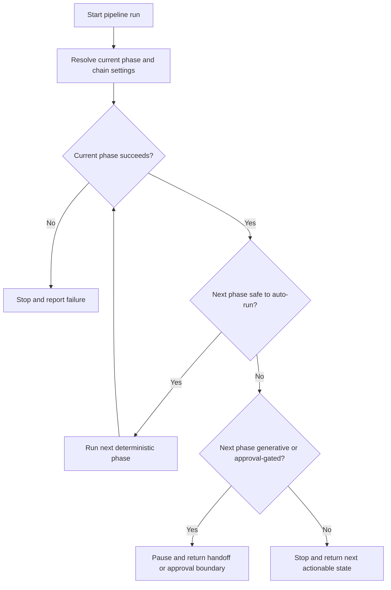

# Feature Specification: Pipeline Auto-Chaining

**Feature Branch**: `021-pipeline-chaining`
**Created**: 2026-04-13
**Status**: Draft
**Input**: User description: "Automatically chain the pipeline driver into the next phase after successful step completion when safe, while preserving generative handoffs, approvals, and failure breakpoints."

## One-Line Purpose *(mandatory)*

The pipeline operator can run the pipeline once and have safe deterministic phases continue automatically until the workflow reaches a generative handoff, approval checkpoint, or failure boundary.

## Consumer & Context *(mandatory)*

Speckit operators and automation jobs running the local pipeline driver from the repository root consume this in the same CLI workflow they already use for spec-to-implementation handoffs.

## User Scenarios & Testing *(mandatory)*

<!--
  IMPORTANT: User stories should be PRIORITIZED as user journeys ordered by importance.
  Each user story/journey must be INDEPENDENTLY TESTABLE - meaning if you implement just ONE of them,
  you should still have a viable MVP (Minimum Viable Product) that delivers value.
  
  Assign priorities (P1, P2, P3, etc.) to each story, where P1 is the most critical.
  Think of each story as a standalone slice of functionality that can be:
  - Developed independently
  - Tested independently
  - Deployed independently
  - Demonstrated to users independently
-->

### User Story 1 - Deterministic Chain Run (Priority: P1)

An operator runs the pipeline driver once and the driver continues through every safe deterministic phase without requiring repeated manual re-invocation.

**Why this priority**: This is the core token-saving behavior and the main reason for the feature.

**Independent Test**: Can be fully tested by running a fixture with multiple safe deterministic phases and verifying that one invocation completes the chain.

**Acceptance Scenarios**:

1. **Given** a feature state with a safe deterministic next phase, **When** the operator enables chaining and runs the pipeline driver, **Then** the driver completes the current phase and automatically continues into the next safe deterministic phase.
2. **Given** a chain of more than one deterministic phase, **When** each phase succeeds, **Then** the driver continues until it reaches a boundary that requires a pause.
3. **Given** the workflow is already at a terminal point or has no safe next phase, **When** the operator enables chaining, **Then** the driver stops cleanly and reports that there is nothing left to chain.

---

### User Story 2 - Safe Pause at Boundaries (Priority: P1)

An operator gets an automatic pause whenever the next phase requires a generative handoff, approval checkpoint, or any other stop condition that should not be crossed automatically.

**Why this priority**: Chaining must never skip the points where the workflow needs human judgment or a separate generative turn.

**Independent Test**: Can be fully tested by running a fixture whose next phase is generative or approval-gated and verifying that chaining stops at the boundary.

**Acceptance Scenarios**:

1. **Given** a safe deterministic phase followed by a generative phase, **When** the deterministic phase completes, **Then** the driver pauses and surfaces the generative handoff instead of auto-running it.
2. **Given** a safe deterministic phase followed by an approval-gated phase, **When** the deterministic phase completes, **Then** the driver pauses and surfaces the approval boundary instead of auto-running it.
3. **Given** a boundary requires approval and the supplied approval token is missing or invalid, **When** the run reaches that boundary, **Then** the driver stops and reports that approval is required.

---

### User Story 3 - Failure Stops the Chain (Priority: P2)

An operator gets a clean stop when any chained step fails, drifts, or times out, so the workflow does not continue past an unsafe state.

**Why this priority**: A chain that keeps running after failure would be harder to trust than the current one-step flow.

**Independent Test**: Can be fully tested by forcing a deterministic step failure or state drift and verifying the chain stops with the correct reason.

**Acceptance Scenarios**:

1. **Given** a deterministic phase that fails, **When** chaining is active, **Then** the driver stops immediately and reports the failing phase and reason.
2. **Given** ledger drift or missing prerequisites, **When** chaining is active, **Then** the driver stops before the next phase and reports the drift boundary.

---

[Add more user stories as needed, each with an assigned priority]

### Edge Cases

- What happens when the next deterministic phase is available but the run has been limited by depth or operator preference?
- How does the system behave if a chained phase emits a successful exit code but the ledger or artifact state is inconsistent?
- What happens when a boundary is discovered after a step completes rather than before it begins?
- What happens when the chain reaches a large number of deterministic steps in a single run?
- What happens when a chained step depends on a missing prerequisite or unavailable dependency?
- How does the system handle malformed chain input or an unknown phase boundary?

## Flowchart *(mandatory)*

## Data & State Preconditions *(mandatory)*

- The current feature context must be resolvable from the pipeline state without ambiguity.
- The current run must have a clear stop boundary for generative, approval, drift, or failure conditions.
- The next candidate phase must be known before auto-chaining is allowed to continue.

## Inputs & Outputs *(mandatory)*

| Direction | Description | Format |
| :-- | :-- | :-- |
| Input | Current pipeline driver run context, feature state, and chaining preference or limit | Caller-defined |
| Output | One or more completed phase results plus the final pause, handoff, or stop state | Caller-defined |

## Constraints & Non-Goals *(mandatory)*

**Must NOT**:
- The driver must not auto-cross a generative handoff, approval checkpoint, or drift boundary.
- The driver must not continue chaining after a failed, timed-out, or inconsistent step.
- The driver must not hide the final stop reason from the operator.

**Boundary assumptions**:
- The operator owns the choice to enable chaining for a run; verifiable by the run output showing chain mode and the final stop point.
- The feature maintainer owns the chain boundary definitions; verifiable by the manifest and fixture-driven acceptance tests that identify each stop condition.

**Adopted dependencies** *(include if feature uses external tools/packages to deliver capability)*:
- None new. This feature reuses the existing pipeline driver, state helpers, and command manifest.

**Out of scope** *(things this feature genuinely does not do, even via external tools)*:
- Cross-feature batch orchestration
- Distributed worker queues or remote schedulers
- Replacing generative phases with deterministic ones

## Requirements *(mandatory)*

### Functional Requirements

- **FR-001**: The pipeline driver MUST be able to continue automatically into the next safe deterministic phase after a successful step when chaining is enabled.
- **FR-002**: The pipeline driver MUST stop automatically before any generative handoff and return the handoff boundary instead of executing the next phase.
- **FR-003**: The pipeline driver MUST stop automatically on approval checkpoints, state drift, timeouts, or runtime failures and report the exact stop reason.
- **FR-004**: The pipeline driver MUST preserve per-phase ledger/event ordering and emit the same success events for each completed step as the non-chained flow.
- **FR-005**: The operator MUST be able to limit or disable chaining for a run so the driver can still be used one phase at a time.
- **FR-006**: The pipeline driver or its run command MUST expose the chaining behavior explicitly so operators know when automatic continuation is active.

### Key Entities *(include if feature involves data)*

- **Chain Run**: A single driver invocation with chain settings and a current feature context.
- **Chain Boundary**: A stop condition that pauses the run, such as a generative handoff, approval gate, drift, or failure.

## Success Criteria *(mandatory)*

### Measurable Outcomes

- **SC-001**: A fixture with three safe deterministic phases completes in one driver invocation without manual re-invocation.
- **SC-002**: A fixture whose next phase is generative always pauses before any LLM execution and surfaces the handoff boundary.
- **SC-003**: A forced failure, drift, or timeout stops the chain in the same run and reports the correct phase and reason in 100% of tested cases.
- **SC-004**: Operators can identify the last completed phase and the next required action from the final driver output without reading raw logs.

## Definition of Done *(mandatory)*

The feature is shipped when production pipeline driver runs can optionally continue through safe deterministic phases automatically, while still pausing correctly at generative, approval, drift, or failure boundaries.

## Open Questions *(include if any unresolved decisions exist)*

- **OQ-1**: Should chaining default to enabled or require an explicit opt-in? Stakes: If assumed incorrectly, operator expectations and run behavior will diverge.
- **OQ-2**: Is there a maximum chain depth or phase count limit? Stakes: If assumed incorrectly, the feature could either under-deliver token savings or overrun a safe execution window.
- **OQ-3**: Should a generative handoff be surfaced as a paused boundary only, or should it optionally trigger the next agent/command automatically? Stakes: If assumed incorrectly, the feature may violate the intended safety boundary.
