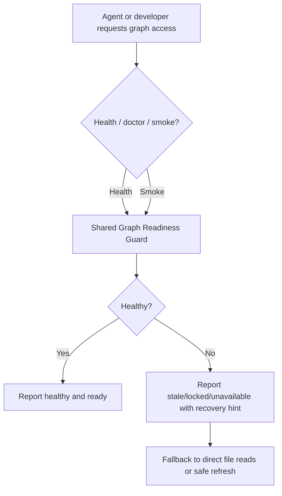

# Implementation Plan — CodeGraph Reliability Hardening

_Date: 2026-04-14_  
_Feature: `022-codegraph-hardening`_  
_Source Spec: `spec.md`_  
_Artifact: `plan.md`_

## Summary

### Feature Goal

Make the local CodeGraph/Kuzu path trustworthy enough that agents can use it for discovery and editing without being blocked by lock contention, stale sessions, or opaque query failures. The feature adds deterministic health classification, explicit recovery hints, and smoke-test guards on top of the existing repo-scoped graph stack.

### Architecture Direction

Keep the existing local graph and Pyright-based MCP tooling. Add a shared graph-readiness core that powers both a CLI doctor surface and an MCP health surface, and reuse the current safe indexing scripts for recovery and validation. Do not introduce a new backend or require network access for core checks.

### Why This Direction

The spec is about reliability, not replacement. The repo already has the important building blocks: a persistent Pyright client, per-call diagnostics, local path validation, and guarded indexing scripts around `.codegraphcontext/db/kuzudb`. The lowest-risk solution is to unify those pieces into one deterministic health/recovery story.

---

## Technical Context

| Area | Decision / Direction | Notes |
|------|-----------------------|-------|
| Language / Runtime | Python 3.12 + Bash wrappers | Existing codegraph tooling is Python-first with shell safety wrappers around indexing. |
| Technology Direction | Local repo-scoped toolchain | No remote service; health, recovery, and smoke checks must work offline. |
| Technology Selection | `src/mcp_codebase/*`, `scripts/cgc_safe_index.sh`, `scripts/cgc_index_repo.sh`, `scripts/validate_doc_graph.sh` | Reuse existing discovery, validation, and safe-index pathways. |
| Storage | `.codegraphcontext/db/kuzudb` plus local metadata/logs | Kuzu remains the graph store; operational metadata stays repo-local. |
| Testing | `pytest` + shell smoke tests + plan/research smoke harnesses | Validate explicit status classification and non-destructive recovery paths. |
| Target Platform | Local developer checkout on macOS/Linux | Repo-local only; no deployment/runtime ingress. |
| Project Type | Local MCP server + index/doctor utilities | Health status needs both agent-facing and developer-facing entrypoints. |
| Performance Goals | Health classification under 2 seconds on a normal checkout | Smoke tests should be deterministic and bounded. |
| Constraints | No network for core checks; no source mutation during health checks; preserve last-known-good graph state | Stale/locked/unavailable must be reported explicitly. |
| Scale / Scope | Narrow reliability hardening of existing codegraph path | No new storage backend, no new language family support. |

### Async Process Model

`PyrightClient` remains the long-lived subprocess with restart/shutdown lifecycle. Diagnostics stay short-lived per-call subprocesses. The new health/doctor path is read-only and should not add a second long-lived worker model; it may probe Pyright availability, but it should return status rather than mutating state.

### State Ownership / Reconciliation Model

The repository checkout is the source of truth for code content. `.codegraphcontext/db/kuzudb` is authoritative for graph content, while lock and latest-run metadata are operational mirrors. Health checks should reconcile these signals and classify the graph as healthy, stale, locked, or unavailable without rewriting source files.

### Local DB Transaction Model

Health and smoke checks must not mutate the graph store. Recovery/rebuild paths should be atomic from the caller’s point of view: build a validated replacement snapshot, then replace the active snapshot only after validation passes. If rebuild fails, the previous snapshot remains usable.

### Venue-Constrained Discovery Model

Discovery is local-only and path-validated. Any file input used by the health or smoke path must pass the existing path validation boundary before being read. No network dependency is allowed for the core reliability checks.

### Implementation Skills

- Async subprocess lifecycle management
- Shell-script safety and atomic file replacement
- Local DB / lock / recovery classification

---

## Repeated Architectural Unit Recognition

### Does a repeated architectural unit exist?

Yes.

### Chosen Abstraction

Graph Readiness Guard

### Why It Matters

Health checks, smoke tests, and recovery flows all need the same status vocabulary and recovery hint semantics. Treating that as a first-class unit keeps the CLI and MCP surfaces consistent and prevents drift between “doctor” behavior and “browse” behavior.

### Defining Properties

- Deterministic classification of healthy / stale / locked / unavailable
- Read-only by default
- Shared by CLI and MCP surfaces
- Always returns an explicit recovery hint or explicit healthy status

---

## Reuse-First Architecture Decision

### Existing Sources Considered

| Source Type | Candidate | Covers Which FRs / Needs | Use Decision | Notes |
|-------------|-----------|---------------------------|--------------|------|
| Repo package | `src/mcp_codebase/pyright_client.py`, `src/mcp_codebase/type_tool.py`, `src/mcp_codebase/diag_tool.py` | FR-002, FR-004, FR-006 | Extend | Existing discovery path already has explicit error envelopes and subprocess lifecycle boundaries. |
| Repo package | `src/mcp_codebase/security.py` | FR-002, FR-006 | Reuse | Existing path canonicalization cleanly separates invalid argument, out-of-scope, and missing-file failures. |
| Repo scripts | `scripts/cgc_safe_index.sh`, `scripts/cgc_index_repo.sh` | FR-003, FR-005, FR-006 | Extend | Already enforce safe indexing and repo-root guardrails; can anchor safe refresh/rebuild. |
| Repo script | `scripts/validate_doc_graph.sh` | FR-004, FR-006 | Reuse | Good smoke-test / governance validation pattern for deterministic checks. |

### Preferred Reuse Strategy

Keep the existing MCP discovery stack and safe-index scripts. Add a shared graph-readiness core that both a CLI doctor command and an MCP health tool can call. Extend the current index wrappers for safe refresh/rebuild and smoke-test reporting instead of replacing them.

### Net-New Architecture Justification

The repo does not currently have a first-class deterministic health classifier, explicit stale-lock status, or a shared recovery-hint contract. Those behaviors need to be added, but they should be built on top of the current local graph and Pyright lifecycle rather than introducing a new backend.

---

## Pipeline Architecture Model

### Recurring Unit Model

The recurring unit is a graph readiness check that can be called from a CLI doctor surface, an MCP tool, or a smoke test. All three entrypoints should use the same shared core and the same status vocabulary.

### Unit Properties

| Property | Description |
|----------|-------------|
| Name | Graph Readiness Guard |
| Owned Artifacts | Health result JSON, recovery hint, smoke-test exit code, optional refresh summary |
| Template / Scaffold Relationship | Shared core checker with thin CLI and MCP wrappers |
| Events | User-facing status categories: healthy, stale, locked, unavailable |
| Handoffs | Doctor check → smoke test → safe refresh/rebuild or direct file-read fallback |
| Completion Invariants | Deterministic status, no source mutation, explicit recovery hint, last-good snapshot preserved |

### Downstream Reliance

Later phases can trust the graph status before browsing or indexing, and can fall back to direct file reads when the graph is unhealthy instead of failing with an opaque crash.

---

## Artifact / Event Contract Architecture

| Architectural Unit / Phase | Owned Artifacts | Template / Scaffold | Emitted Events | Downstream Consumers | Notes |
|----------------------------|----------------|---------------------|----------------|----------------------|------|
| Graph health check | Health status JSON / structured response | Shared core checker + CLI / MCP wrappers | `healthy`, `stale`, `locked`, `unavailable` | Agents, CLI users, smoke tests | Must never mutate source code. |
| Telemetry / diagnostics | Structured JSONL event records and summary output | Shared readiness guard and adapters | `run_id`, `request_id`, `operation_id`, latency, error rate, recovery hint id | Operators, CI, maintainers | No silent failures; logs must make unhealthy states reconstructable. |
| Smoke test / doctor guard | Exit code + short summary | `scripts/cgc_doctor.sh`-style entrypoint plus shared checker | `smoke_passed` / `smoke_failed` as local command output, not ledger events | Local maintainers, CI | Confirms graph is usable before discovery begins. |
| Safe refresh / rebuild | Replacement snapshot + recovery summary | `scripts/cgc_safe_index.sh` / `scripts/cgc_index_repo.sh` | Local command result only | Maintainers, doctor guard | Must preserve last-known-good snapshot on failure. |

### Manifest Impact

No `speckit` manifest changes are expected. This is a feature implementation inside the codegraph tooling, not a change to the workflow command registry.

---

## Architecture Flow

### Major Components

- `src/mcp_codebase/server.py` and the existing MCP tool modules
- `src/mcp_codebase/pyright_client.py`, `diag_tool.py`, and `security.py`
- `scripts/cgc_safe_index.sh`, `scripts/cgc_index_repo.sh`, and the local `.codegraphcontext/db/` state

### Trust Boundaries

- Repo checkout vs. `.codegraphcontext` operational state
- Validated file paths vs. untrusted agent input

### Primary Automated Action

Deterministic graph readiness classification with explicit recovery guidance.

### Architecture Flow Notes

The doctor / health path reads local graph state, lock metadata, and readiness signals, then returns a clear status with a recovery hint. If the graph is stale or locked, the system should make that obvious and permit a safe fallback to direct file reads while a refresh path is invoked separately.

### Module / Symbol Boundaries

| Layer | Public Symbol Family | Responsibility | Notes |
|------|----------------------|----------------|------|
| Domain | `GraphHealthStatus`, `GraphLockRecord`, `GraphSnapshot`, `GraphRecoveryHint` | Typed readiness and recovery models only | No IO; these models define the shared vocabulary for CLI and MCP surfaces. |
| Service | `check_graph_health()`, `classify_graph_readiness()`, `resolve_recovery_hint()` | Pure health classification and recovery recommendation | Owns decision logic but not file or subprocess IO. |
| Adapter | CLI doctor entrypoint, MCP health tool, safe-index wrapper | Perform local IO, invoke service layer, emit user-facing status | Thin wrappers only; adapters translate inputs/outputs and keep errors explicit. |

---

## External Ingress + Runtime Readiness Gate

| Gate Item | Status | Rationale |
|-----------|--------|-----------|
| External ingress / webhook / callback handling | N/A | This is a local codegraph reliability feature; it does not add deployable ingress. |
| Runtime readiness gate | ✅ Pass | The feature itself is a readiness gate for the local graph and smoke-check paths. |

### Readiness Blocking Summary

No deployment ingress is involved. The only readiness concern is local graph usability, which this feature is explicitly meant to classify and recover from.

---

## State / Storage / Reliability Model

### State Authority

- Kuzu DB content is authoritative for graph data
- The repo checkout is authoritative for source files
- Lock and latest-run metadata are operational mirrors used to detect stale or locked access

### Persistence Model

Persistent graph state lives under `.codegraphcontext/db/kuzudb`. Run logs remain under `logs/codebase-lsp/`, and any new readiness metadata should stay repo-local so the feature remains reproducible from the checkout.

### Retry / Timeout / Failure Posture

Health checks must be bounded and deterministic. Pyright diagnostics already have timeouts; the new doctor path should surface explicit stale/locked/unavailable reasons instead of retrying indefinitely or crashing generically.

### Recovery / Degraded Mode Expectations

When the graph is unhealthy, the system should return a specific recovery hint and allow direct file reads as a safe degraded mode. Refresh/rebuild must preserve the previous good snapshot until the replacement has been validated.

---

## Contracts and Planning Artifacts

### Data Model

`data-model.md` defines the health / lock / snapshot / recovery entities and their transitions.

### Contracts

No separate contract directory is expected for this feature. The contract is the CLI / MCP health response shape plus the smoke-test exit behavior.

### Quickstart

`quickstart.md` explains how to sync dependencies, refresh the local graph, run the codebase MCP server, and verify health/smoke behavior with the new doctor flow.

---

## Constitution Check

| Check | Status | Notes |
|-------|--------|-------|
| Local-only graph access with no network requirement | ✅ Pass | The feature stays inside the repo-scoped graph and uses local validation only. |
| No source mutation during health checks | ✅ Pass | Doctor/smoke paths are read-only; rebuild paths are separate and preserve the last good snapshot. |

---

## Behavior Map Sync Gate

| Runtime / Config / Operator Surface | Impact? | Update Target | Notes |
|------------------------------------|---------|---------------|-------|
| Local codegraph discovery and recovery surfaces | No | N/A | This feature stays within the codegraph tooling and does not require a runtime behavior-map update. |

---

## Open Feasibility Questions

- None. The plan chooses a shared CLI + MCP health surface, and the recovery posture is explicit fallback plus separate refresh.

---

## Handoff Contract to Sketch

### Settled by Plan

- A shared Graph Readiness Guard will own healthy / stale / locked / unavailable classification.
- The same core behavior will back both a CLI doctor surface and an MCP health surface.
- Safe refresh/rebuild must preserve the last known good snapshot.

### Sketch Must Preserve

- Repo-local `.codegraphcontext` state as the authority boundary
- Pyright subprocess lifecycle boundaries already implemented in `PyrightClient`
- Explicit recovery hints and read-only fallback when the graph is unhealthy
- The module split above: domain models, pure health classification service, and thin CLI/MCP adapters
- Public symbol families should remain cohesive and single-purpose per module; no mixed IO/decision modules
