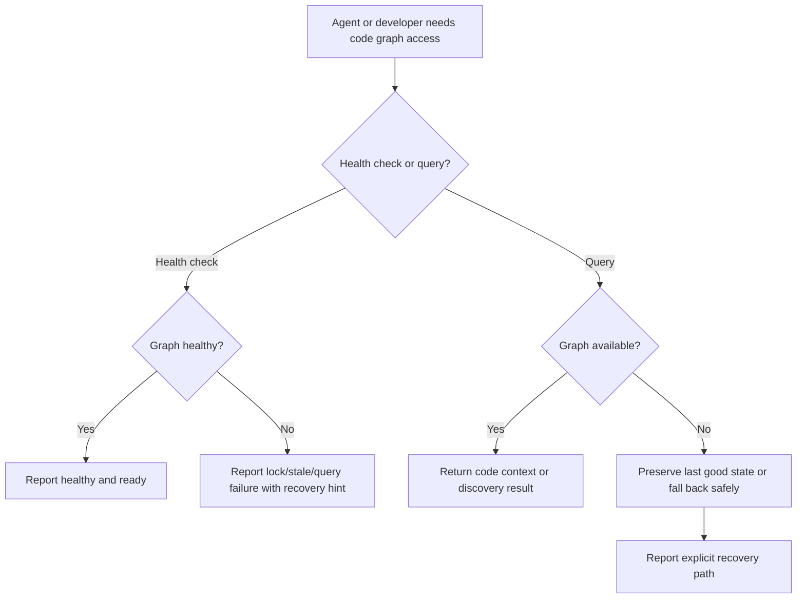

# Feature Specification: CodeGraph Reliability Hardening

**Feature Branch**: `022-codegraph-hardening`  
**Created**: 2026-04-13  
**Status**: Draft  
**Input**: User description: "Harden the local CodeGraph/Kuzu index path so lock contention, stale sessions, and query failures fail gracefully with doctor and smoke-test guards, making code browsing reliable."

## One-Line Purpose *(mandatory)*

Make the local code graph trustworthy enough that agents can use it for code reading and editing without getting blocked by lock contention, stale sessions, or opaque query failures.

## Consumer & Context *(mandatory)*

Codex agents and repo maintainers consume the local CodeGraph/Kuzu path during discovery, planning, and implementation. This feature exists to keep that path dependable, observable, and recoverable when the graph is stale, locked, or otherwise unhealthy.

## Assumptions

- The repo continues to use a local, repo-scoped code graph rather than a remote graph service.
- Existing codegraph state remains derived and rebuildable from the repository checkout.
- The reliability work is expected to strengthen the current tools and scripts, not replace the graph system with a new backend.

## Clarifications

### Session 2026-04-13

- No clarifications required yet; the feature is scoped to local reliability, lock handling, and recoverable graph health checks.

## User Scenarios & Testing *(mandatory)*

### User Story 1 — Graph Health Check for Developers (Priority: P1)

A developer wants to know whether the local code graph is healthy before trusting it for discovery. They run a deterministic health check and get a clear pass/fail result with a reason.

**Why this priority**: A bad graph makes code discovery unreliable and can block the entire read/edit workflow.

**Independent Test**: Run the health check against a healthy repo state and a deliberately unhealthy state; the tool reports the difference without crashing.

**Acceptance Scenarios**:

| # | Given | When | Then |
|---|-------|------|------|
| 1 | Code graph is healthy | Developer runs the health check | Tool reports healthy status with no ambiguity |
| 2 | Code graph is locked or otherwise unavailable | Developer runs the health check | Tool reports the blocking condition and a recovery hint |
| 3 | Graph state is stale | Developer runs the health check | Tool reports stale status and indicates refresh is needed |
| 4 | The graph state cannot be read because of local file permission issues | Developer runs the health check | Tool reports a permission failure clearly enough to distinguish it from stale or locked state |

---

### User Story 2 — Agent-Facing Recovery on Lock/Query Failure (Priority: P1)

An agent tries to use the graph while a previous session or stale lock is interfering. Instead of an opaque failure, the system returns a clear recovery path or safely falls back to direct file reads.

**Why this priority**: Agents need reliable code discovery; brittle failures waste tokens and can derail implementation work.

**Independent Test**: Simulate a lock conflict or query failure and verify the agent-facing response names the failure mode and the next action.

**Acceptance Scenarios**:

| # | Given | When | Then |
|---|-------|------|------|
| 1 | A stale lock is present | Agent requests graph access | The system reports stale-lock contention and suggests recovery |
| 2 | Query execution fails | Agent attempts discovery | The system reports a clear query failure instead of a generic crash |
| 3 | Graph is unavailable | Agent requests code context | The system preserves the last known good state or falls back safely |
| 4 | Query input is malformed or empty | Agent requests discovery | The system returns a validation error or empty result without crashing |

---

### User Story 3 — Safe Refresh and Rebuild (Priority: P2)

A maintainer needs to refresh or rebuild the graph without corrupting the local database or losing the last good state.

**Why this priority**: Recovery must be safe, repeatable, and non-destructive.

**Independent Test**: Trigger a refresh/rebuild, interrupt it or force a failure, then verify the prior healthy state remains usable.

**Acceptance Scenarios**:

| # | Given | When | Then |
|---|-------|------|------|
| 1 | A healthy graph snapshot exists | Refresh is started | The existing snapshot remains usable until the new one is ready |
| 2 | Refresh fails mid-run | Maintainer retries recovery | The prior good snapshot is still intact |
| 3 | Stale state is detected | Maintainer performs recovery | The graph returns to a healthy, queryable state |

---

### Edge Cases

- Stale lock file exists but no active process is holding the database.
- Graph query layer reports a binder/query construction failure instead of a storage failure.
- A refresh starts while another session is still using the graph.
- The database file exists but the current session cannot acquire it cleanly.
- The graph is healthy but the index content is stale relative to the current checkout.
- The graph contains a large number of records and health checks or recovery flows must still complete without timing out.
- Query input is empty, whitespace-only, or otherwise malformed.

## Flowchart *(mandatory)*

## Data & State Preconditions *(mandatory)*

- A repo checkout exists with local code graph state under `.codegraphcontext/`.
- A prior graph build or index snapshot exists or can be created from the repository contents.
- Health and recovery checks can read the graph state without mutating source code.
- A stale or locked graph can be detected from local state before performing a rebuild.

## Inputs & Outputs *(mandatory)*

| Direction | Description | Format |
| :-- | :-- | :-- |
| Input | Health check request, graph discovery request, or refresh/rebuild request | Local command or tool call |
| Output | Healthy/unhealthy status, failure reason, stale/lock indication, or recovery action | Deterministic text or structured result |

## Constraints & Non-Goals *(mandatory)*

**Must NOT**:
- Mutate source code during health checks.
- Hide lock contention behind a generic failure.
- Corrupt or replace a good graph snapshot when refresh fails.
- Require network access for basic health or recovery checks.

**Out of scope**:
- Replacing the code graph with a remote service.
- Expanding the graph to new language families in the same feature.
- Designing a new UI for graph administration.

## Requirements *(mandatory)*

### Functional Requirements

- **FR-001**: System MUST provide a deterministic health check for the local CodeGraph/Kuzu path that reports healthy, stale, locked, or unavailable status.
- **FR-002**: System MUST detect stale or conflicting graph access and return a clear recovery message instead of an opaque crash.
- **FR-003**: System MUST preserve the last known good graph snapshot when a refresh, rebuild, or query path fails.
- **FR-004**: System MUST provide a deterministic smoke test or doctor-style check that validates the graph is usable before code browsing workflows depend on it.
- **FR-005**: System MUST support a safe refresh/rebuild path that can recover from stale sessions or lock contention without corrupting the graph state.
- **FR-006**: System MUST make graph failure modes distinguishable enough that a developer or agent can decide whether to retry, refresh, or fall back to direct file reads.

### Key Entities

| Entity | Represents |
|--------|-----------|
| **GraphHealthStatus** | The current readiness state of the local graph, including healthy, stale, locked, or unavailable |
| **GraphLockRecord** | The local lock/lease state that can block access or indicate stale ownership |
| **GraphSnapshot** | The last known good graph build or index state available for query |
| **RecoveryHint** | The explicit next action returned when the graph is unhealthy |

## Success Criteria *(mandatory)*

### Measurable Outcomes

| ID | Criterion |
|----|-----------|
| SC-001 | Health check reports a clear status for healthy vs unhealthy graph state in under 2 seconds on a normal local checkout |
| SC-002 | A stale-lock scenario is identified as stale lock contention rather than a generic failure in 100% of deterministic test cases |
| SC-003 | A failed refresh or rebuild leaves the last known good graph usable in 100% of failure-mode tests |
| SC-004 | A smoke test can reliably tell whether the code graph is safe to use before discovery begins |
| SC-005 | Recovery guidance is specific enough that a maintainer can tell whether to retry, refresh, or fall back without reading source code |

## Definition of Done *(mandatory)*

The local code graph can be checked, refreshed, and recovered without opaque lock failures blocking code discovery, and the feature includes deterministic verification that proves the graph remains usable after stale-session or refresh failures.

## Open Questions *(include if any unresolved decisions exist)*

- None at this time.
