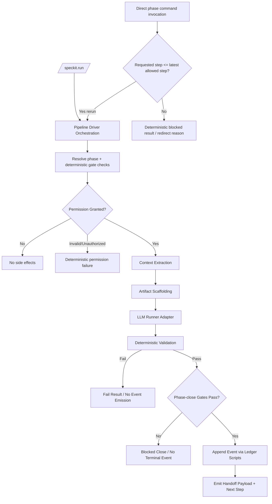

# Implementation Plan: Deterministic Phase Orchestration

**Feature Branch**: `023-deterministic-phase-orchestration`  
**Spec**: `specs/023-deterministic-phase-orchestration/spec.md`  
**Research**: `specs/023-deterministic-phase-orchestration/research.md`

---

## Summary

### Feature Goal

Move speckit phase progression to one deterministic orchestration boundary where `/speckit.run` (or direct driver CLI) is the canonical progression entrypoint, direct reruns of current/earlier steps remain allowed, and phase events are emitted only after deterministic validation and phase-close gates pass.

### Architecture Direction

Adopt a strict phase execution model aligned to `docs/governance/phase-execution`:

`orchestrate -> extract -> scaffold -> LLM Action -> validate -> phase-close gates -> emit/handoff`

The pipeline driver owns orchestration, phase resolution, permission breakpointing, validation gating, phase-close decisions, and event append mechanics. Command docs and templates own artifact structure and synthesis intent only.

### Why This Direction

- It matches existing repo strengths (`pipeline_driver.py`, `pipeline_ledger.py`, manifest-driven routing).
- It reduces repeated command-doc prompt schema, improving token efficiency.
- It makes event emission auditable and deterministic.
- It cleanly separates deterministic work (scripts/validators) from judgment work (LLM synthesis).
- It closes forward-progression bypass paths while permitting deterministic reruns of current/earlier steps.

---

## Technical Context

| Area | Decision / Direction | Notes |
|------|-----------------------|-------|
| Language / Runtime | Python 3.12 + Bash + uv | Existing repo baseline and tooling. |
| Technology Direction | Script-first deterministic orchestration with manifest route contracts | Extend existing scripts instead of introducing a new workflow engine. |
| Technology Selection | `scripts/pipeline_driver.py`, `scripts/pipeline_driver_contracts.py`, `scripts/pipeline_ledger.py`, `scripts/task_ledger.py`, `scripts/speckit_gate_status.py`, `scripts/speckit_implement_gate.py`, `command-manifest.yaml` | Reuse current orchestration and ledger surfaces as primary control plane. |
| Entry Surface | Canonical `/speckit.run` trigger dispatching to pipeline driver contract | Forward progression requests outside allowed latest step are blocked/redirected; deterministic reruns at/below latest allowed step are permitted. |
| Storage | Append-only JSONL ledgers + feature artifacts under `specs/<feature>/` | `pipeline-ledger.jsonl` and `task-ledger.jsonl` are authoritative for their scopes. |
| Testing | Pytest unit/integration + deterministic validator commands + dry-run gate checks | Existing driver/manifest tests are extended for route and phase-close behavior. |
| Target Platform | Local/dev CLI execution on macOS/Linux | No new external runtime service is required. |
| Project Type | Governance/pipeline orchestration feature | Changes phase command contracts and orchestration mechanics, not product runtime endpoints. |
| Performance Goals | Dry-run and phase resolution should complete in seconds; bounded LLM calls; no duplicate terminal events | Keep command loops deterministic and idempotent. |
| Constraints | Human approval required before side effects; no direct ledger file reads; validate-before-emit invariant; producer-only command docs | Governed by AGENTS/constitution/phase-execution model. |
| Scale / Scope | Full-pipeline deterministic entry migration, including implement-phase close gating and `implementation_completed` emission contract | Removes out-of-order forward bypass while preserving deterministic rerun paths. |

### Async Process Model

Primary execution remains synchronous CLI orchestration. Optional deferred handoff is allowed via `--handoff-runner`, but phase completion remains blocked until deterministic validation and event append outcome are known.

### State Ownership / Reconciliation Model

`pipeline-ledger.jsonl` is authoritative for feature phase state. Any derived/mirrored phase hints are non-authoritative and must reconcile to ledger state through driver resolution before execution.

### Local DB Transaction Model

No relational DB transaction is introduced in this phase. Reliability boundary is: command completion payload validation must pass before any append call to `pipeline_ledger.py`. Partial success without event append is treated as non-complete.

### Venue-Constrained Discovery Model

Routing metadata is manifest-constrained (`command-manifest.yaml`). Phase discovery and dispatch are only valid for commands declared in manifest contracts.

### Implementation Skills

- Pipeline contract design (phase contract + artifact contract alignment)
- Deterministic validation and gate modeling
- Manifest-driven orchestration and migration safety

---

## Repeated Architectural Unit Recognition

### Does a repeated architectural unit exist?

Yes.

### Chosen Abstraction

**Phase Contract + Artifact Contract** as first-class pipeline constructs.

- Phase Contract: execution lifecycle, gate logic, validation rules, event emission, handoff invariants.
- Artifact Contract: required structure and controlled vocabulary for each owned artifact.

### Why It Matters

- Prevents command docs from embedding duplicated structural rules.
- Keeps deterministic behavior in scripts/validators.
- Provides stable assumptions for sketch/tasking/analyze downstream.

---

## Reuse-First Architecture Decision

### Existing assets reused as-is

- `scripts/pipeline_driver.py` core dispatch/orchestration flow
- `scripts/pipeline_ledger.py` append/validation mechanics
- `scripts/speckit_gate_status.py` deterministic entry gate checks
- `.specify/scripts/pipeline-scaffold.py` artifact scaffolding path

### Existing assets extended

- `create-new-feature.sh` branch creation now deterministic from `main` by default
- root `command-manifest.yaml` becomes canonical command registry path
- `read-markdown.sh` exact heading lookup to avoid regex ambiguity

### Net-new architecture required

- Explicit plan-level contract for producer-only command docs and validate-before-emit handoff
- Feature-scoped contracts artifact under `specs/023.../contracts/`

### Why this minimizes unnecessary custom code

The design keeps existing execution surfaces and adds contract clarity/validation boundaries instead of replacing pipeline runtime infrastructure.

---

## Pipeline Architecture Model

### Recurring Unit Name

**Phase Execution Node**

### Defining Properties

- Has deterministic prerequisites/gates.
- Uses deterministic extraction and scaffolding.
- Runs one bounded LLM synthesis action.
- Requires deterministic artifact validation.
- Emits phase events only after validation pass.
- Produces explicit downstream handoff contract.

### Owned Artifacts and Events

- Owned artifacts are declared per command in `command-manifest.yaml`.
- Completion events are declared in manifest and appended by driver/ledger scripts after deterministic validation and any required phase-close gates.

### Invariants Downstream May Rely On

- If a completion event exists, validation already passed.
- If a completion event exists, any phase-close gate also passed.
- If validation fails, no completion event is emitted.
- Command docs are not responsible for direct ledger append instructions.
- `/speckit.run` (or direct driver CLI) is the canonical forward-progression entrypoint.
- Direct rerun requests at or below latest allowed step are permitted, but forward progression beyond latest allowed step never bypasses deterministic orchestration.

---

## Artifact / Event Contract Architecture

| Phase Command | Owned Artifacts | Emit Event(s) | Downstream Consumers | Contract Note |
|---------------|------------------|---------------|----------------------|---------------|
| `speckit.run` | none (dispatch trigger) | none (delegates) | `pipeline_driver.py` phase routes | Canonical orchestration trigger; resolves phase + deterministic gate checks before phase execution. |
| `speckit.specify` | `spec.md`, `checklists/requirements.md` | `backlog_registered` | `speckit.research`, `speckit.plan` | Entry artifacts only; no phase completion without structure. |
| `speckit.research` | `research.md` | `research_completed` | `speckit.plan` | Prior-art assembly contract for planning decisions. |
| `speckit.plan` | `plan.md`, `data-model.md`, `quickstart.md`, `contracts/*` | `plan_started`, `plan_approved` | `speckit.planreview`, `speckit.solution`, `speckit.sketch` | Planning phase must settle architecture thesis and handoff constraints. |
| `speckit.planreview` | `planreview.md` | `planreview_completed` | `speckit.feasibilityspike`, `speckit.solution` | Feasibility ambiguity count gates solutioning. |
| `speckit.feasibilityspike` | `spike.md` | `feasibility_spike_completed`/`feasibility_spike_failed` | `speckit.plan`, `speckit.solution` | Evidence contract for unresolved feasibility items. |
| `speckit.sketch` | `sketch.md` | `sketch_completed` | `speckit.solutionreview`, `speckit.tasking`, `speckit.analyze` | Driver-managed generative phase emits only after deterministic validation passes. |
| `speckit.solution` | none (orchestration phase) | `solution_approved` | `speckit.implement` | Orchestrates sketch/solutionreview/tasking/analyze chain under deterministic emission rules. |
| `speckit.implement` | task-local artifacts from task execution | `implementation_completed` (target migration event) | closeout / phase completion / feature close workflows | Must migrate from legacy mode to driver-managed flow: deterministic preflight, per-task verification gates, phase-close gate, then single terminal emission. |
| `speckit.closeout` | none | `tests_passed`, `commit_created`, `offline_qa_started`, `offline_qa_passed`, `task_closed` | next task / checkpoint / story closure | Task-ledger lifecycle events remain task-scoped and do not replace pipeline-level implement completion event. |

Manifest update requirement for this feature: **Yes** (root manifest canonicalization and routing assumptions must remain aligned to driver behavior).

---

## Architecture Flow

### Trust Boundaries

- Human approval boundary: user/operator approval is required before execution side effects.
- Deterministic governance boundary: driver and validators decide pass/fail; LLM does not decide event append.
- Event authority boundary: ledger append path is script-owned (`pipeline_ledger.py` / `task_ledger.py`), not prompt-owned.

### Primary Automated Action

`/speckit.run --feature-id <FEATURE_ID> [--phase <PHASE>]`

Canonical script dispatch target:

`uv run python scripts/pipeline_driver.py --feature-id <FEATURE_ID> [--phase <PHASE>]`

`/speckit.run` is the canonical orchestration trigger, and the driver CLI remains the deterministic execution command boundary.

#### Runner Adapter Note

`pipeline_driver.py` can invoke local Codex for LLM actions through `--handoff-runner` (or `SPECKIT_HANDOFF_RUNNER`) when a runner adapter command is configured.

Execution contract requirement:

- The runner adapter accepts the handoff request JSON on stdin.
- The runner adapter may call `codex exec` locally.
- The runner adapter must emit one JSON object on stdout for driver parsing (for example, including `artifact_path` when applicable).
- Direct raw `codex exec` output should not be treated as a drop-in handoff payload without adapter normalization.

---

## External Ingress + Runtime Readiness Gate

| Gate Item | Status | Rationale |
|-----------|--------|-----------|
| Public HTTP/Webhook ingress introduced by this feature | N/A | Feature changes CLI pipeline orchestration contracts only; no new inbound endpoint. |
| External callback receiver required for approval | N/A | Approval is modeled via driver-gated token/explicit human confirmation path in CLI workflow. |
| Runtime sidecar/worker required before safe execution | ✅ Pass | Existing script runtime is sufficient for this planning scope; no new service bootstrap gate. |
| Deterministic validation gate before emission is defined | ✅ Pass | Validation step explicitly precedes event append in architecture flow and contracts. |
| Legacy direct forward-progression bypass path | ⚠️ Must close | Direct invocation that attempts to progress beyond the latest allowed step must be deterministically blocked/redirected; reruns remain allowed. |
| Runner adapter local availability | ✅ Pass (with adapter contract) | Local script can invoke Codex via adapter; adapter normalizes stdout JSON for deterministic driver parsing. |

### Readiness Blocking Summary

No `❌ Fail` rows. Implementation readiness is not blocked by external ingress/runtime gates for this feature.

---

## State / Storage / Reliability Model

### State Authority

Feature phase progression authority is ledger-derived phase state. Driver-resolved phase state must match ledger sequence before execution. Implement task progress authority remains task-ledger-scoped until phase-close gates produce pipeline-level completion.

### Persistence Model

- Append-only ledger persistence for phase events and task lifecycle events.
- Artifact files under feature directory as phase outputs.
- No event append on failed validation.
- No terminal phase completion append on failed phase-close gating.

### Retry / Timeout / Failure Posture

- Retries must be idempotent at phase boundary.
- Timeout or invalid payload returns deterministic failure envelope.
- Event append timeout/failure is surfaced as error, not silent success.
- Phase-close retries must not duplicate terminal events (`implementation_completed` once-only emission contract).

### Recovery / Degraded Mode Expectations

- On validation or append failure, keep artifacts for inspection, but do not advance phase ledger state.
- Operators can rerun same phase after fixing gate/contract violations.
- On runner adapter failure, preserve request/response envelope evidence for deterministic re-run debugging.

---

## Contracts and Planning Artifacts

### Data Model

`data-model.md` defines execution entities, relationships, and state transitions for phase requests/results, validation outcomes, and event append decisions.

### Contracts

`contracts/phase-execution-contract.md` defines command-output envelope expectations, canonical trigger routing, validate-before-emit invariants, and phase-close gating boundaries for this feature.

### Quickstart

`quickstart.md` documents local setup, dry-run execution, legacy redirect/block checks, and smoke checks for deterministic phase orchestration behavior.

---

## Constitution Check

| Check | Status | Notes |
|-------|--------|-------|
| Human-First Decisions | ✅ Pass | Explicit permission gate before phase execution side effects. |
| Security First | ✅ Pass | No new ingress surface; deterministic validation before event append. |
| Reuse at Every Scale | ✅ Pass | Extends existing driver/ledger/scaffold surfaces rather than replacing them. |
| Spec & Process-First | ✅ Pass | Planning artifacts and event flow aligned to command-manifest + phase-execution model. |
| Test-Driven Verification First | ✅ Pass | Existing unit/integration suites cover driver and manifest behavior; plan preserves deterministic checks. |

---

## Behavior Map Sync Gate

| Runtime / Config / Operator Surface | Impact? | Update Target | Notes |
|------------------------------------|---------|---------------|-------|
| Pipeline driver phase execution sequence | Yes | `specs/023-deterministic-phase-orchestration/behavior-map.md` | Add flow + fail/pass paths during sketch/tasking decomposition. |
| Root command manifest ownership | Yes | `docs/governance/speckit-end-to-end.md` and `docs/governance/how-to-add-speckit-step.md` | Canonical registry moved to root and must remain documented. |
| Operator approval step expectations | Yes | `specs/023-deterministic-phase-orchestration/quickstart.md` | Quickstart captures how to run and confirm behavior. |
| Canonical `/speckit.run` trigger and rerun-vs-progression gate path | Yes | `specs/023-deterministic-phase-orchestration/behavior-map.md` | Add explicit branch: rerun allowed at/below latest allowed step, forward overreach blocked/redirected. |
| Implement phase-close + `implementation_completed` emission | Yes | `specs/023-deterministic-phase-orchestration/behavior-map.md` and `specs/023-deterministic-phase-orchestration/contracts/phase-execution-contract.md` | Capture terminal event once-only emission and failure/no-emit branch. |
| Producer-only command doc normalization | Yes | `.claude/commands/speckit.*.md` + governance docs | Remove embedded gate/ledger procedures from command docs as routes migrate. |

---

## Open Feasibility Questions

- [x] **FQ-001**: Can root-manifest canonicalization be applied without breaking pipeline validator and driver routing behavior?  
  **Probe:** Run manifest validator + command coverage validator + pipeline driver route tests on rebased branch.  
  **Blocking:** Manifest ownership and deterministic routing contract.

- [x] **FQ-002**: Can deterministic base branch selection in feature scaffolding avoid accidental branch ancestry drift?  
  **Probe:** Create feature branches from a non-main branch in a temp repo and verify new branch head resolves to `main` unless `--base` is provided.  
  **Blocking:** Governance consistency for all future feature branches.

- [x] **FQ-003**: Can local orchestration invoke Codex for the LLM step deterministically?  
  **Probe:** Use `--handoff-runner` adapter contract with stdin JSON request and stdout JSON response envelope, then verify driver parsing and validation gating remain deterministic.  
  **Blocking:** FR-019 runner-adapter boundary and local execution viability.

- [ ] **FQ-004**: Can implement migration emit `implementation_completed` once-only while preserving existing task-ledger semantics?  
  **Probe:** Add phase-close gating tests covering successful close (single emission), close failure (no emission), and retry idempotency across repeated attempts.  
  **Blocking:** FR-018 + SC-006 compliance.

---

## Handoff Contract to Sketch

### Settled by Plan

- Phase execution contract follows `orchestrate -> extract -> scaffold -> LLM Action -> validate -> phase-close gates -> emit/handoff`.
- `/speckit.run` is the canonical orchestration trigger, dispatching to the pipeline driver execution contract.
- Reruns of current/earlier steps are allowed directly, but forward progression beyond latest allowed step is blocked/redirected.
- Completion events are emitted only after deterministic validation and required phase-close gates pass.
- Command docs are producer contracts, not ledger append instructions.

### Sketch Must Preserve

- Trust boundary between LLM synthesis and deterministic validation/event append.
- Ledger-authoritative phase state resolution and drift blocking.
- Artifact/event ownership defined by `command-manifest.yaml`.
- Reuse-first approach (extend current scripts; avoid net-new orchestration framework).
- Legacy/direct invocation policy that allows deterministic reruns but blocks forward overreach.
- Implement-phase task-ledger + phase-close integration before pipeline terminal event emission.

### Sketch May Refine

- Exact file/symbol touchpoints for driver, contracts, and validators.
- Migration slices across commands/phases, including implement route migration.
- Acceptance traceability and design slices for implementation tasking.

### Sketch Must Not Re-Decide

- Primary automated action (`/speckit.run` -> `pipeline_driver.py` execution boundary).
- Validate-before-emit invariant.
- Root manifest canonicalization decision.
- Human permission gate requirement before side effects.
- Canonical `/speckit.run` trigger requirement.
- Rerun-directly policy (allowed at/below latest step; blocked/redirected when progressing beyond latest step).
- `implementation_completed` once-only emission requirement after phase-close success.

---

## Phase 1 Planning Artifacts Summary

| Artifact | Status | Notes |
|----------|--------|-------|
| `plan.md` | updated | Architecture direction, `/speckit.run` trigger model, contracts, and handoff thesis finalized. |
| `data-model.md` | created | Execution entities and transitions for deterministic phase flow. |
| `contracts/` | created | Phase execution contract artifact added for downstream use. |
| `quickstart.md` | created | Local runbook for dry-run, execution, redirect/block checks, and smoke checks. |

---

## Plan Completion Summary

### Ready for Plan Review?

- [x] Architecture direction is explicit
- [x] Repeated architectural unit is modeled or explicitly unnecessary
- [x] Reuse-first decision is explicit
- [x] Architecture Flow is complete
- [x] Trust boundaries are explicit
- [x] Artifact/event contract architecture is explicit
- [x] Open feasibility questions are isolated
- [x] Sketch handoff contract is explicit
- [x] Canonical trigger (`/speckit.run`) is explicit
- [x] Legacy bypass block/redirect requirement is explicit
- [x] Implement phase-close + `implementation_completed` requirement is explicit

### Suggested Next Step

`/speckit.planreview`
