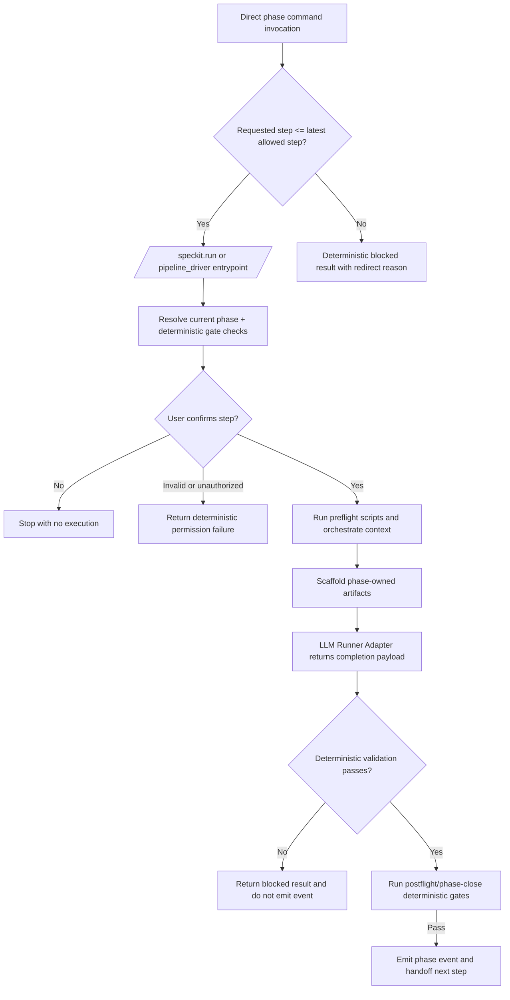

# Feature Specification: Deterministic Phase Orchestration Boundary

**Feature Branch**: `023-deterministic-phase-orchestration`  
**Created**: 2026-04-17  
**Status**: Draft  
**Input**: User description: "Establish a deterministic phase orchestration contract where command docs only produce artifacts and completion payloads, while the orchestrator runs orchestrate -> extract -> scaffold -> LLM Action -> validate -> emit/handoff with event emission only after validation and an explicit yes/no permission handshake for phase start."

## One-Line Purpose *(mandatory)*

Pipeline operators and Codex commands run all speckit phases through one deterministic orchestrator (`/speckit.run` + pipeline driver) that validates outputs before any ledger event is emitted.

## Consumer & Context *(mandatory)*

This output is consumed by human operators and Codex skills during repo-local speckit phase execution in feature branches.

## User Scenarios & Testing *(mandatory)*

### User Story 1 - Deterministic Phase Completion (Priority: P1)

An operator runs phase execution and receives deterministic phase progression where phase events are emitted only after validation passes.

**Why this priority**: This is the core governance guarantee and prevents false-positive phase completion.

**Independent Test**: Run a phase where validation fails and confirm no completion event is emitted, then run with valid artifacts and confirm the event is emitted once.

**Acceptance Scenarios**:

1. **Given** a valid phase context and valid produced artifacts, **When** the orchestrator executes the phase flow, **Then** validation passes and the correct phase event is emitted to the pipeline ledger.
2. **Given** a phase run where produced artifacts fail deterministic validation, **When** the orchestrator reaches the validation step, **Then** no completion event is emitted and a deterministic blocked result is returned.
3. **Given** a feature with no prior phase events (empty/zero state), **When** orchestration starts, **Then** it resolves the first valid step deterministically and does not emit completion until validation succeeds.

---

### User Story 2 - Permissioned Phase Start (Priority: P2)

An operator or skill sees the resolved current step and must explicitly approve execution before the orchestrator starts the phase.

**Why this priority**: This prevents accidental phase execution and keeps humans in control of irreversible progression.

**Independent Test**: Resolve a step with interactive confirmation, reject once and confirm no phase execution occurs, then approve and confirm phase execution begins.

**Acceptance Scenarios**:

1. **Given** a resolved current step, **When** confirmation is requested and the user answers `no`, **Then** the orchestrator exits without starting phase execution or emitting events.
2. **Given** a resolved current step, **When** confirmation is requested and the user answers `yes`, **Then** the orchestrator starts the phase execution flow.
3. **Given** an unauthorized or invalid permission response, **When** confirmation is evaluated, **Then** execution is rejected with a deterministic permission failure response.

---

### User Story 3 - Producer-Only Command Contracts (Priority: P3)

Command docs produce phase artifacts and completion payloads only, while orchestration, validation, and event emission are handled by the deterministic driver contract.

**Why this priority**: This removes duplicated gate logic from prompt-heavy command docs and improves token efficiency with clearer responsibility boundaries.

**Independent Test**: Execute a migrated command flow where command docs return completion payload only and verify validation and event emission are performed by orchestration components.

**Acceptance Scenarios**:

1. **Given** a phase command execution, **When** command-level output is produced, **Then** it contains artifact and completion payload data without direct ledger mutation responsibilities.
2. **Given** phase orchestration after command completion, **When** deterministic checks pass, **Then** the orchestrator emits events and hands off to the next phase.

---

### User Story 4 - Full-Pipeline Deterministic Entry (Priority: P4)

All phase progression is entered through one deterministic trigger, while direct phase-command invocations are allowed for deterministic reruns and blocked only when they attempt to progress beyond the allowed latest step.

**Why this priority**: This removes non-deterministic drift from command-local execution paths and makes gate -> step -> verify -> emit behavior auditable end-to-end.

**Independent Test**: Invoke phase execution through `/speckit.run` and verify gate checks are deterministic; invoke a direct phase command for an already-reached step and verify deterministic rerun is allowed; invoke a direct phase command that would progress beyond allowed latest step and verify deterministic block/redirect behavior.

**Acceptance Scenarios**:

1. **Given** a phase invocation request, **When** `/speckit.run` is executed, **Then** the driver resolves phase, runs deterministic gates, executes LLM action through runner adapter, validates, and emits exactly one completion decision.
2. **Given** a direct invocation of a phase command for the current or earlier step, **When** execution starts, **Then** deterministic rerun execution is allowed and bounded by the same validation/emit rules.
3. **Given** a direct invocation of a phase command that would progress beyond the allowed latest step, **When** execution starts, **Then** it is deterministically blocked or redirected to canonical orchestration.
4. **Given** implement phase completion gates pass, **When** phase-close validation succeeds, **Then** `implementation_completed` is emitted once and only once.

---

### Edge Cases

- What happens when validation dependencies are temporarily unavailable during the validate step?
- How does orchestration handle malformed completion payloads returned by a phase command?
- How does orchestration handle high-volume repeated retries for the same phase without duplicate terminal event emission?

## Flowchart *(mandatory)*

## Data & State Preconditions *(mandatory)*

- The feature has a valid three-digit feature ID and a readable pipeline ledger history.
- The relevant phase contract and artifact contract definitions exist and are readable by orchestration validators.
- The user or skill execution context can provide an explicit `yes`/`no` decision before phase start.

## Inputs & Outputs *(mandatory)*

| Direction | Description | Format |
| :-- | :-- | :-- |
| Input | `/speckit.run` (or driver CLI) request with feature context, phase hint, explicit permission response, and runner-adapter execution context | Caller-defined |
| Output | Deterministic phase status, gate/validation outcome, emitted event decision, and handoff/next-step result | Canonical step-result envelope |

## Constraints & Non-Goals *(mandatory)*

**Must NOT**:
- Must NOT emit completion events before deterministic validation succeeds.
- Must NOT require command docs to duplicate orchestration gate logic owned by the deterministic flow.
- Must NOT allow ambiguous permission responses to start phase execution.
- Must NOT allow direct invocation to progress beyond the allowed latest step outside deterministic orchestration boundaries.

**Adopted dependencies** *(include if feature uses external tools/packages to deliver capability)*:
- Pipeline ledger command tooling for event append and sequence enforcement.
- Existing deterministic phase gate commands for pre-validation signals.
- Runner-adapter contract for LLM action execution (stdin JSON request -> stdout JSON step payload).
- Task ledger command tooling for implement-phase task lifecycle gates.

**Boundary assumptions**:
- Pipeline ledger event sequencing remains the source of truth for phase progression. Owner: governance scripts. Verifiability: `pipeline_ledger.py validate` passes.
- Deterministic validation commands remain executable in local repo workflows. Owner: script maintainers. Verifiability: each validator returns a deterministic pass/fail exit status.

**Out of scope** *(things this feature genuinely does not do, even via external tools)*:
- Redefining the semantic content of each phase artifact template.
- Replacing existing task-level ledger lifecycle semantics.
- Replacing external model/provider selection policy for the runner adapter.

## Requirements *(mandatory)*

### Functional Requirements

- **FR-001**: System MUST execute phase work using the canonical short flow `orchestrate -> extract -> scaffold -> LLM Action -> validate -> emit/handoff`.
- **FR-002**: System MUST resolve and report the current step before phase execution begins.
- **FR-003**: System MUST require an explicit `yes` permission signal before starting phase execution.
- **FR-004**: System MUST stop without side effects when permission is denied.
- **FR-005**: System MUST return deterministic permission failure results for invalid or unauthorized permission responses.
- **FR-006**: System MUST treat command docs as producer-only contracts that output artifacts and completion payloads, not ledger events.
- **FR-007**: System MUST run deterministic validation after LLM action and before any phase completion event emission.
- **FR-008**: System MUST block completion and emit no completion event when validation fails.
- **FR-009**: System MUST emit the phase completion event only after deterministic validation passes.
- **FR-010**: System MUST route handoff decisions only after a successful validate-and-emit sequence.
- **FR-011**: System MUST make phase retries idempotent so repeated attempts do not duplicate terminal event outcomes.
- **FR-012**: System MUST define source-of-truth ownership for live phase state versus local mirrors and define stale fallback/fail behavior when reconciliation fails.
- **FR-013**: System MUST define local persisted mutation boundaries such that partial-write outcomes are rejected and rollback/idempotency behavior is explicit.
- **FR-014**: System MUST name the executing orchestration command as the pipeline driver command in the phase contract and treat it as the execution entrypoint for automated phase flow.
- **FR-015**: System MUST expose a canonical orchestration command trigger (`/speckit.run`) that dispatches deterministic phase execution through the pipeline driver contract.
- **FR-016**: System MUST ensure direct phase-command execution paths that would progress beyond the allowed latest step are deterministically blocked or redirected to `/speckit.run`.
- **FR-017**: System MUST support deterministic dry-run gate evaluation that resolves phase and gate outcomes without mutating ledgers or artifacts.
- **FR-018**: System MUST migrate implement-phase execution into driver-managed orchestration with deterministic preflight, per-task verification gates, phase-close gating, and emit `implementation_completed` only after success.
- **FR-019**: System MUST execute LLM action via a runner-adapter contract where orchestration scripts own gating, validation, and ledger emission decisions.
- **FR-020**: System MUST define explicit driver route metadata for each migrated phase command (mode, script ownership, timeout, and emit contract fields) in the canonical manifest.
- **FR-021**: System MUST normalize command docs to producer-only compact contracts that exclude executable gate/ledger procedures.
- **FR-022**: System MUST allow deterministic rerun of current or earlier steps via direct phase-command invocation without requiring ledger rewind, while still enforcing validate-before-emit and idempotent terminal outcomes.

### Key Entities *(include if feature involves data)*

- **Phase Execution Contract**: Deterministic execution boundary for one phase run, including permission decision, validation status, and handoff result.
- **Phase Completion Payload**: Producer output describing phase artifacts and completion status before orchestration validation.
- **Validation Outcome**: Deterministic pass/fail result with explicit reasons used to allow or block event emission.
- **Event Emission Decision**: Post-validation decision record stating whether a phase event is appended or withheld.
- **Orchestration Trigger Contract**: Canonical `/speckit.run` request/response boundary for deterministic phase execution.
- **Runner Adapter Contract**: Deterministic transport contract for LLM step execution (`stdin` JSON request, `stdout` JSON result envelope).
- **Implementation Completion Event**: Pipeline-level terminal event (`implementation_completed`) emitted only after implement-phase close gates pass.

## Success Criteria *(mandatory)*

### Measurable Outcomes

- **SC-001**: 100% of migrated phase runs emit completion events only after deterministic validation reports pass.
- **SC-002**: 100% of denied confirmation responses result in zero phase execution side effects.
- **SC-003**: For migrated command flows, command docs no longer contain direct ledger emission instructions and no behavioral regression is observed in phase progression.
- **SC-004**: Median command-doc token footprint for migrated phases is reduced by at least 30% while preserving deterministic phase outcomes.
- **SC-005**: 100% of phase execution requests that attempt forward progression beyond the allowed latest step are blocked or redirected to canonical orchestration, while deterministic direct reruns at or below the latest allowed step remain permitted.
- **SC-006**: 100% of successful implement-phase closures emit exactly one `implementation_completed` event and 0 emissions when phase-close gates fail.
- **SC-007**: 100% of speckit command docs conform to compact producer-only contract shape after migration.

## Definition of Done *(mandatory)*

In production workflows, speckit phase progression executes through canonical permissioned deterministic orchestration where completion events (including `implementation_completed`) are emitted only after validation and phase-close gates pass, failed validation never advances ledger state, and reruns of current/earlier steps are allowed without enabling out-of-order forward progression.
