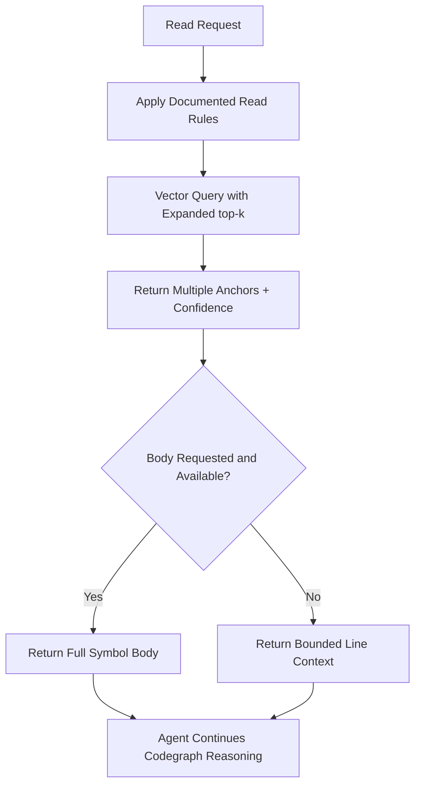

# Feature Specification: Read-Code Anchor Output Simplification

**Feature Branch**: `025-intent-anchor-routing`  
**Created**: 2026-04-21  
**Status**: Draft  
**Input**: User description: "Keep only practical read-code improvements: pre-read documentation rules, multi-anchor vector output with confidence, optional body return, and larger top-k."

## One-Line Purpose *(mandatory)*

Make read-code easier and faster for agents by returning better anchor candidates and clearer usage rules with minimal behavior change.

---

## Consumer & Context *(mandatory)*

- **Primary consumer**: Agents and contributors using `scripts/read-code.sh` and `scripts/read_code.py`, after consulting `AGENTS.md` before attempting a large read.
- **Operational context**: Interactive code exploration and workflow command execution.
- **Main pain point**: Too much trial-and-error around anchors and line-window reads.
- **Why now**: Current flow creates avoidable retries and token waste during normal code reading.

---

## User Scenarios & Testing *(mandatory)*

### User Story 1 - Rule-Guided Reads Before Attempt (Priority: P1)

An agent needs clear read rules before attempting large file reads.

**Why this priority**: Missing rules create repeated command failures and wasted turns.

**Independent test**: Verify an agent can discover and follow explicit read limits and modes before first code read attempt from `AGENTS.md`.

**Acceptance Scenarios**:

1. **Given** a file read request, **When** agent guidance is loaded, **Then** the documented limit and mode rules (including 80-line cap behavior) are explicit and actionable before the first attempt.
2. **Given** the agent has not consulted the rules, **When** it attempts a large read, **Then** the documented guidance tells it to consult `AGENTS.md` first.
2. **Given** a read attempt that violates limits, **When** the command rejects it, **Then** the error clearly points to the documented rule.

---

### User Story 2 - Multiple Anchor Candidates with Confidence (Priority: P1)

An agent wants multiple likely vector anchors with confidence so it can choose and continue codegraph reasoning without repeated blind retries.

**Why this priority**: Single forced anchors can be wrong and block progress.

**Independent test**: Query for a symbol/pattern and verify output includes a bounded ranked candidate list, confidence values, and a documented way to ask for more.

**Acceptance Scenarios**:

1. **Given** a semantic query, **When** read-code resolves anchors, **Then** it returns the top ranked candidates, not only one, with confidence scores.
2. **Given** low-confidence top candidate, **When** alternatives are present, **Then** the agent can continue with codegraph checks using returned candidate set.
3. **Given** the first shortlist is insufficient, **When** the agent requests more candidates once, **Then** the command returns the next bounded batch rather than expanding indefinitely.

---

### User Story 3 - Optional Symbol Body Return (Priority: P2)

An agent may request the full indexed symbol body instead of a numeric window when learning behavior.

**Why this priority**: Full body is often the exact unit needed for understanding logic.

**Independent test**: Resolve a symbol that has indexed body content and verify optional body-first output mode works and is documented.

**Acceptance Scenarios**:

1. **Given** a confident symbol match with indexed body data, **When** body return is requested, **Then** the full symbol body is returned instead of a numeric window.
2. **Given** the symbol body is available and confidence is high, **When** the agent reads the result, **Then** the docs explain that body return is the default path.
2. **Given** body is unavailable, **When** body mode is requested, **Then** command falls back to current bounded line output with a clear note.

---

### Edge Cases

| Case | Expected Behavior |
|------|-------------------|
| Empty query input | Return validation error with usage guidance. |
| High-volume matches | Return bounded candidate list with deterministic ordering and confidence values. |
| Dependency/codegraph unavailable after anchor selection | Agent can still proceed with returned candidate list and explicit failure reason. |
| Permission/auth issues in downstream tools | Read-code output remains valid and does not leak internal errors. |
| Symbol has no indexed body | Return bounded line context fallback. |

---

## Flowchart *(mandatory)*

---

## Data & State Preconditions *(mandatory)*

- **Objects/records involved**: Query text, candidate anchor list, confidence score, optional symbol body payload.
- **Required existing state**: Indexed code symbol data for query target.
- **State changes introduced**: None to persistent business state.
- **Persistence expectations**: No new storage required for this feature.

---

## Inputs & Outputs *(mandatory)*

| Type | Name | Description | Validation |
|------|------|-------------|------------|
| Input | Query text | Symbol or semantic search text | Must be non-empty |
| Input | Optional body mode | Request to return symbol body when available | Must be a valid supported option |
| Input | top-k setting | Number of vector candidates to retrieve from the semantic index | Must be a bounded positive integer |
| Output | Anchor candidates | Multiple ranked anchor results with confidence ratings | Deterministic ordering required, first shortlist capped at 5 |
| Output | Symbol body (optional) | Full indexed body for selected symbol | Returned only when available and requested |
| Output | Bounded line context | Numeric line window fallback | Must honor configured line cap |

---

## Constraints & Non-Goals *(mandatory)*

- **In scope**:
  - Agent-facing documentation of read rules and limits.
  - Multiple vector anchors with confidence.
  - Optional symbol-body return.
  - Expanded top-k to improve candidate recall.
  - Documented one-time “ask for more” expansion for candidates.
- **Out of scope (non-goals)**:
  - Full pipeline-driver redesign.
  - New dependency traversal framework inside read-code.
  - Broad CLI redesign outside these four changes.
- **Constraints**:
  - Keep behavior backward-compatible for existing callers.
  - Preserve bounded read protections.
  - Keep candidate output bounded even when retrieval fanout increases.
  - First candidate shortlist is capped at 5 results; one bounded expansion is allowed.
- **Dependencies / adopted tools**:
  - Existing vector index query path and symbol metadata.
  - Existing codegraph flow for downstream caller decisions.
- **Assumptions**:
  - Indexed symbol records include confidence-comparable rank/score data.
  - Agents can consume candidate sets and choose follow-up checks.
  - `AGENTS.md` is the authoritative place for read-code rules and must be consulted before large reads.
  - Semantic retrieval expands from the current narrow default to a bounded default of 20 retrieved candidates, while returned anchor output remains capped at 5 candidates.
  - The agent-facing docs explain that the agent may request one more bounded batch when the first shortlist is insufficient.
  - Body-return mode is preferred whenever a confident symbol match exposes indexed body content; line-context fallback remains available when body content is missing.

---

## Requirements *(mandatory)*

### Functional Requirements

- **FR-001**: System MUST provide clear agent-readable documentation in `AGENTS.md` for read rules before attempt, including bounded read limits and mode selection guidance.
- **FR-002**: System MUST return a bounded ranked list of multiple vector anchor candidates with confidence ratings for anchorable queries.
- **FR-003**: System MUST support optional full symbol-body return when indexed body content exists and use it in preference to a numeric window when requested or when a confident symbol hit is available.
- **FR-004**: System MUST increase vector `top_k` from the current narrow default to a bounded default of 20 to improve candidate recall.
- **FR-005**: System MUST document a first shortlist of 5 candidates and a single bounded follow-up expansion path for when the shortlist is insufficient.

### Key Entities *(include if feature involves data)*

- **AnchorCandidate**: Candidate symbol/location with confidence score and ordering.
- **ReadRuleSet**: Documented command constraints and usage limits.
- **SymbolBodyPayload**: Indexed full body content for a symbol candidate.
- **CandidateShortlist**: First bounded response set of anchor candidates exposed to the agent.
- **CandidateExpansion**: One additional bounded batch of candidates that the agent may request if the shortlist is not enough.

---

## Success Criteria *(mandatory)*

### Measurable Outcomes

- **SC-001**: At least 90% of ambiguous anchor queries return more than one candidate with confidence metadata.
- **SC-002**: Agent retries caused by failed first-anchor selection decrease by at least 30% in read-code workflow sampling.
- **SC-003**: Body-return mode succeeds for at least 95% of symbols that have indexed body data.
- **SC-004**: First-attempt read failures caused by undocumented rule violations decrease by at least 50%.
- **SC-005**: The agent-facing documentation clearly states the 5-candidate shortlist and single bounded expansion rule in the first read-code guidance pass.

---

## Definition of Done *(mandatory)*

- [x] User stories include acceptance scenarios
- [x] Functional requirements are testable and unambiguous
- [x] Success criteria are measurable and implementation-agnostic
- [x] No unresolved `[NEEDS CLARIFICATION]` markers remain
- [x] Scope boundaries and non-goals are explicit
- [x] Dependencies and assumptions are documented
