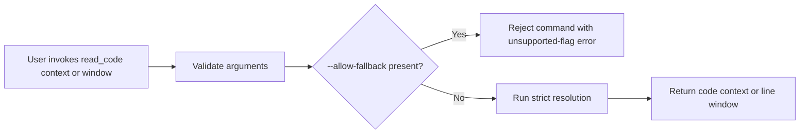

# Feature Specification: Read Code No Fallback

**Feature Branch**: `027-read-code-no-fallback`
**Created**: 2026-04-29
**Status**: Draft
**Input**: User description: "remove the allow-fallback in read code"

## One-Line Purpose *(mandatory)*

Repository maintainers and automated agents use strict read-code commands so unsupported fallback invocations fail clearly instead of being accepted.

## Consumer & Context *(mandatory)*

Repository maintainers and automation agents invoke local `read_code` helpers from a shell or task runner inside the repository checkout.

## User Scenarios & Testing *(mandatory)*

### User Story 1 - Reject Removed Flag (Priority: P1)

An existing `read_code context` or `read_code window` invocation that includes `--allow-fallback` is rejected with a clear error.

**Why this priority**: Removing the flag is the core behavior change; it prevents continued reliance on a path the repo no longer supports.

**Independent Test**: Run both helper modes with and without the removed flag and verify the flagged command fails while the unflagged command still succeeds.

**Acceptance Scenarios**:

1. **Given** a valid `read_code context` command, **When** `--allow-fallback` is added, **Then** the command fails fast with a clear unsupported-flag error and returns no match payload.
2. **Given** a valid `read_code window` command, **When** `--allow-fallback` is added, **Then** the command fails fast with a clear unsupported-flag error and prints no window output.

---

### User Story 2 - Preserve Strict Reads (Priority: P2)

Supported `read_code` invocations continue to return code or markdown context using the existing strict resolution path.

**Why this priority**: The repo still depends on read-code for accurate source and documentation inspection, so the removal must not break normal usage.

**Independent Test**: Run representative strict context and window commands without the removed flag and compare them with current expected output shape.

**Acceptance Scenarios**:

1. **Given** a valid strict `read_code context` invocation, **When** the target symbol exists, **Then** the helper returns the expected match metadata and optional body or shortlist output.
2. **Given** a valid strict `read_code window` invocation, **When** the file and bounds are valid, **Then** the helper prints the requested numbered lines unchanged.

---

### User Story 3 - Align Guardrails and Guidance (Priority: P3)

The repository's command guardrails and usage guidance no longer tell users to rely on the removed fallback flag.

**Why this priority**: Clear guardrails reduce repeated mistakes and keep local helper usage consistent across humans and automation.

**Independent Test**: Inspect the hook message and helper documentation after the change and confirm `--allow-fallback` is absent from supported usage examples.

**Acceptance Scenarios**:

1. **Given** a command payload that includes `--allow-fallback`, **When** the enforcement hook evaluates it, **Then** the hook denies the command and explains the supported strict usage.
2. **Given** the local helper docs or examples, **When** they are reviewed, **Then** they show only supported read-code options.

### Edge Cases

- A command includes `--allow-fallback` together with `--inline-body`, `--show-shortlist`, `--candidate-index`, or `--path`; the command still fails rather than partially running.
- The removed flag appears in either the old or new `read_code context` syntax; both forms reject it the same way.
- A previously fallback-dependent lookup now has no exact match; the command returns the normal strict-resolution failure instead of silently choosing another result.
- A request reaches the existing maximum line-window size; it still honors the current bound and fails clearly if the request exceeds it.
- The semantic/index dependency is unavailable or stale; the command surfaces the normal strict-resolution error instead of relaxing the lookup rules.
- Non-`read_code` markdown helpers and other repo tooling remain unaffected.

## Flowchart *(mandatory)*



## Data & State Preconditions *(mandatory)*

- The user is working inside a repository checkout with the local helper scripts available.
- The repository already has strict code-read resolution and guardrail enforcement in place.
- No persisted application data or migrations are introduced.

## Inputs & Outputs *(mandatory)*

| Input | Output |
|-------|--------|
| `read_code context <query> [options]` | Semantic match metadata, optional body, and shortlist output when the query resolves. |
| `read_code window <file> <start_line> [line_count]` | A bounded numbered line window from the requested file. |
| Either helper plus `--allow-fallback` | A clear unsupported-flag error and no code-read result. |

## Constraints & Non-Goals *(mandatory)*

- Keep every supported read-code option working as it does today.
- Do not add a replacement fallback flag or a new relaxed-resolution mode.
- Do not change codegraph indexing, ranking, or discovery behavior beyond removing the fallback escape hatch.
- Do not alter unrelated markdown-reading helpers or general repository search tools.
- Do not introduce user-facing product behavior; this is local developer tooling only.

## Requirements *(mandatory)*

### Functional Requirements

- The `read_code context` and `read_code window` helpers must reject `--allow-fallback` as unsupported input.
- The helpers must continue to accept all existing supported options and produce the same output shape for valid invocations.
- The repository’s read-code enforcement hook must deny any command containing the removed flag and explain the supported strict usage.
- Helper documentation and examples must omit `--allow-fallback` and describe only the supported strict workflow.
- Regression coverage must prove both the parser-level rejection and the guardrail-level denial.

## Success Criteria *(mandatory)*

### Measurable Outcomes

- 100% of documented read-code examples use the strict interface without `--allow-fallback`.
- Any invocation containing `--allow-fallback` fails deterministically with a clear error message.
- Valid strict `read_code` invocations continue to return the expected result format for context and window reads.
- Automated coverage demonstrates the removal in both the helper parser and the enforcement hook.

## Definition of Done *(mandatory)*

- The spec is complete and validated.
- The checklist file exists and is populated from the spec template.
- The rejection behavior is covered by deterministic automated tests.
- The enforcement hook and usage guidance no longer advertise the removed flag.

## Delivery Routing & Rough Size *(mandatory)*

### Item Classification

| Field | Value | Notes |
|-------|-------|-------|
| Work type | `Existing feature delta` | This is a small behavior change to an existing repo-local developer helper. |
| Existing spec coverage | `None` | There is no prior spec for this helper behavior. |
| Required spec action | `New spec` | The behavior change needs a new specification and downstream tasking. |

### Rough Size

T-shirt size: `XS`

Reasoning:
- This is a single repo-local process change with no external dependencies, no state migration, and two clear implementation seams: `scripts/read_code.py` and `scripts/hook_enforce_code_reads.py`.

### Risk / Uncertainty

| Dimension | Level | Reason |
|-----------|-------|--------|
| Requirement clarity | `Low` | The requested behavior is straightforward: remove the fallback flag. |
| Repo uncertainty | `Low` | The relevant helper and hook paths are already identified. |
| External dependency uncertainty | `Low` | No external services or packages are involved. |
| State / data / migration risk | `Low` | No persisted data or migrations are introduced. |
| Runtime / side-effect risk | `Low` | The change affects local helper validation only. |
| Human/operator dependency | `Low` | The change is self-contained and locally testable. |

### Phase Routing

| Downstream Phase | Decision | Reason |
|------------------|----------|--------|
| Research | `Skip` | No prior art or external dependency needs investigation. |
| Plan | `Skip` | Existing architecture already covers the change. |
| Sketch | `Required` | Tasking will need the exact file/symbol seams. |
| Tasking | `Required` | The implementation needs discrete tasks for the helper and hook. |
| Estimate | `Required after tasking` | The estimate is produced once tasks exist. |

### Routing Contract

```json
{
  "routing": {
    "research_route": "skip",
    "plan_profile": "skip",
    "sketch_profile": "core",
    "tasking_route": "required",
    "estimate_route": "required_after_tasking",
    "routing_reason": "Repo-local helper cleanup with no external research or new architecture; implementation stays within existing strict read-code flow.",
    "conditional_sketch_sections": []
  },
  "risk": {
    "requirement_clarity": "low",
    "repo_uncertainty": "low",
    "external_dependency_uncertainty": "low",
    "state_data_migration_risk": "low",
    "runtime_side_effect_risk": "low",
    "human_operator_dependency": "low"
  }
}
```

### Existing-Spec Attachment

- Existing feature/spec: `N/A`
- Attach as: `New spec`
- New spec required? `Yes`
- Rationale: The change touches an existing helper but there is no prior spec to attach the delta to.

### Routing Gate

- [ ] Work type is classified.
- [ ] Existing spec coverage is checked.
- [ ] Rough size is assigned.
- [ ] Risk/uncertainty dimensions are assigned.
- [ ] Research route is justified.
- [ ] Plan route is justified.
- [ ] Sketch is required and right-sized.
- [ ] Tasking/estimate route is justified.
