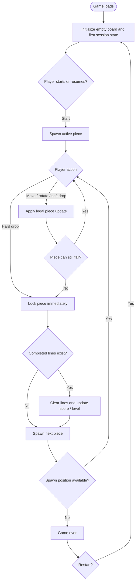

# Feature Specification: Tetris Game

**Feature Branch**: `[028-tetris-game]`
**Created**: 2026-04-30
**Status**: Draft
**Input**: User description: "Build a playable Tetris game in the app."

## One-Line Purpose *(mandatory)*

A player uses the app to play a responsive Tetris game that tracks score, clears completed lines, and ends when no new piece can enter the board.

## Consumer & Context *(mandatory)*

A browser session in the existing app consumes the game view and keyboard input during interactive play.

## User Scenarios & Testing *(mandatory)*

### User Story 1 - Core Play Loop (Priority: P1)

As a player, I can start a new game and move, rotate, and drop the active piece until it locks into the board.

**Why this priority**: The game is only valuable if the primary Tetris interaction works end to end.

**Independent Test**: Open the game, start a session, and verify that piece movement, rotation, soft drop, and hard drop all behave correctly without requiring any other feature.

**Acceptance Scenarios**:

1. **Given** a fresh game session opened in a browser without any account sign-in, **When** the player starts the game, **Then** the board shows an active falling piece and an empty settled grid.
2. **Given** an active piece, **When** the player moves or rotates it, **Then** the piece updates only to legal positions within the board.
3. **Given** an active piece above settled blocks or the floor, **When** the player hard-drops it, **Then** it locks into place and the next piece becomes active.

---

### User Story 2 - Scoring and Line Clears (Priority: P2)

As a player, I can clear one or more completed lines and see the game update score, cleared-line count, and level progression.

**Why this priority**: Tetris without line-clear scoring and progression does not feel complete or rewarding.

**Independent Test**: Set up a near-complete board, clear lines, and verify the score, line count, and level change without depending on game-over behavior.

**Acceptance Scenarios**:

1. **Given** a board with one or more nearly complete rows, **When** the active piece fills the remaining spaces, **Then** the completed rows disappear and the settled blocks above them fall downward.
2. **Given** one or more lines are cleared in a single drop, **When** the score updates, **Then** the player receives the correct clear bonus for that event.
3. **Given** enough lines have been cleared to advance the level, **When** the next piece spawns, **Then** the game reflects the faster pace or next-level state.

---

### User Story 3 - Game Over and Restart (Priority: P3)

As a player, I can see when the board is full enough to block a new piece and restart the game from a clean state.

**Why this priority**: A clear end state and reset path are necessary for repeatable play sessions.

**Independent Test**: Fill the top of the board, trigger a blocked spawn, confirm game over, and restart without reloading the page.

**Acceptance Scenarios**:

1. **Given** the spawn area is obstructed, **When** the game tries to introduce a new piece, **Then** the game enters a game-over state.
2. **Given** the game is over, **When** the player restarts, **Then** the board, score, line count, level, and piece queue reset to a fresh session.

### Edge Cases

- A piece rotates next to a wall or stacked blocks and must not overlap occupied cells or leave the board.
- Clearing multiple rows at once must remove every completed row in that event and preserve the remaining stack above them.
- Rapid repeated input must not duplicate movement, corrupt the board, or skip the active piece past legal positions.
- A new piece that cannot spawn because the top rows are filled must end the session immediately instead of partially placing the piece.
- Unsupported or malformed control input must be ignored without changing the current board state.
- If the game surface cannot finish loading its required browser resources, the player should see a clear failure state instead of a broken or partially initialized board.

## Flowchart *(mandatory)*



## Data & State Preconditions *(mandatory)*

- The browser session can load the game route without requiring an authenticated account.
- The player owns the current browser session, and the route is verifiable by opening it in a supported browser tab without sign-in.
- The active game session is owned by the current tab, and separate tabs must each start from isolated fresh state.
- The game starts with an empty settled board, an initial score of zero, and an available piece queue.

## Inputs & Outputs *(mandatory)*

| Direction | Description | Format |
| :-- | :-- | :-- |
| Input | Player control actions and game start or restart intent | Caller-defined |
| Output | Game board state, score state, level state, next-piece state, and game-over state | Caller-defined |

## Constraints & Non-Goals *(mandatory)*

**Must NOT**:
- Must NOT allow active pieces to overlap settled blocks or leave the board bounds.
- Must NOT require a page reload to restart a finished game.
- Must NOT depend on user accounts or persistent storage to play a single session.

**Adopted dependencies** *(include if feature uses external tools/packages to deliver capability)*:
- None. The feature should work within the existing app and browser runtime.

**Out of scope** *(things this feature genuinely does not do, even via external tools)*:
- Online multiplayer or competitive matchmaking.
- Persistent leaderboards or saved high scores across sessions.
- Account management, monetization, or external game services.

## Requirements *(mandatory)*

### Functional Requirements

- **FR-001**: The system MUST present a playable Tetris board in a browser session.
- **FR-002**: The system MUST start each new session with an empty settled board, a zeroed score, and an active falling piece.
- **FR-003**: The system MUST allow the player to move, rotate, soft drop, and hard drop the active piece using the game controls.
- **FR-004**: The system MUST prevent every piece from occupying illegal positions outside the board or overlapping settled blocks.
- **FR-005**: The system MUST lock a piece into the settled board when it can no longer fall.
- **FR-006**: The system MUST clear every completed line created by a lock event and update the score and cleared-line count accordingly.
- **FR-007**: The system MUST advance game pace or level as the cleared-line count increases.
- **FR-008**: The system MUST show the current score, cleared-line count, current level, and next-piece preview during play.
- **FR-009**: The system MUST enter a game-over state when a new piece cannot spawn because the board is obstructed.
- **FR-010**: The system MUST allow the player to restart from game over and return to a fresh playable state without reloading the page.

### Key Entities *(include if feature involves data)*

- **Game Session**: One playable run with its own score, level, queue, and terminal state.
- **Board**: The playfield that contains settled blocks and open cells.
- **Piece**: The active falling shape with a current position and rotation.
- **Piece Queue**: The upcoming pieces that feed the active piece.
- **Score State**: The current score, cleared-line count, and level shown to the player.

## Success Criteria *(mandatory)*

### Measurable Outcomes

- **SC-001**: A player can load the game and make a legal move within 2 seconds of the browser view becoming interactive in a normal session.
- **SC-002**: The game correctly handles every tested single-line and multi-line clear scenario with matching score and line-count updates.
- **SC-003**: A blocked spawn immediately transitions the game into a visible game-over state and allows a clean restart without a page reload.
- **SC-004**: At least 90% of guided playtesters can start a game, clear at least one line, and restart after game over without external instructions beyond the on-screen controls.

## Definition of Done *(mandatory)*

The Tetris game is available in production, opens in the browser, supports a complete play cycle from new game through game over and restart, and preserves correct movement, scoring, and line-clear behavior.

## Delivery Routing & Rough Size *(mandatory)*

### Item Classification

| Field | Value | Notes |
|-------|-------|-------|
| Work type | `New feature` | A new interactive game surface with its own runtime state and controls. |
| Existing spec coverage | `None` | No existing Tetris implementation or spec was found in the codebase discovery scan. |
| Required spec action | `New spec` | The request introduces a new product behavior instead of a delta to an existing feature. |

### Rough Size

T-shirt size: `L`

Reasoning:
- This adds a new interactive browser experience with a real-time game loop, controls, scoring, line clearing, and restart behavior.
- The repo currently centers on backend control-plane behavior, so the feature crosses a new UI/runtime seam rather than fitting an existing slice.
- No external package choice is required, but the state machine and user interaction surface create enough complexity to justify a larger downstream plan.

### Risk / Uncertainty

| Dimension | Level | Reason |
|-----------|-------|--------|
| Requirement clarity | `Medium` | The request is clear at the game level, but the exact presentation details are assumed to be browser-based. |
| Repo uncertainty | `Medium` | The repository is backend-centric, so the best integration point for a playable game needs architectural confirmation in later phases. |
| External dependency uncertainty | `Low` | No new external service or package is required to define the feature. |
| State / data / migration risk | `Low` | The feature is session-local and does not require persistence or migration. |
| Runtime / side-effect risk | `Medium` | The game loop and input handling must remain responsive and keep board state valid. |
| Human/operator dependency | `Low` | No manual operations beyond normal app usage are required. |

### Phase Routing

| Downstream Phase | Decision | Reason |
|------------------|----------|--------|
| Research | `Skip` | No external dependency or package choice requires investigation for the spec itself. |
| Plan | `Full` | The feature introduces a new interactive runtime and needs architecture decisions before implementation. |
| Sketch | `Required` | The feature will need tasking with state, input, and UI slices. |
| Tasking | `Required` | This is a new feature, not a delta that can attach to an existing task set. |
| Estimate | `Required after tasking` | The feature size should be refined after the sketch and task breakdown exist. |

### Routing Contract

```json
{
  "routing": {
    "research_route": "skip",
    "plan_profile": "full",
    "sketch_profile": "expanded",
    "tasking_route": "required",
    "estimate_route": "required_after_tasking",
    "routing_reason": "New browser-playable Tetris feature with a real-time state machine and no existing implementation found in discovery.",
    "conditional_sketch_sections": []
  },
  "risk": {
    "requirement_clarity": "medium",
    "repo_uncertainty": "medium",
    "external_dependency_uncertainty": "low",
    "state_data_migration_risk": "low",
    "runtime_side_effect_risk": "medium",
    "human_operator_dependency": "low"
  }
}
```

### Existing-Spec Attachment

- Existing feature/spec: `N/A`
- Attach as: `Duplicate`
- New spec required? `Yes`
- Rationale: No existing spec or implementation path for Tetris was found during codebase discovery, so this needs a standalone feature spec.

### Routing Gate

- [x] Work type is classified.
- [x] Existing spec coverage is checked.
- [x] Rough size is assigned.
- [x] Risk/uncertainty dimensions are assigned.
- [x] Research route is justified.
- [x] Plan route is justified.
