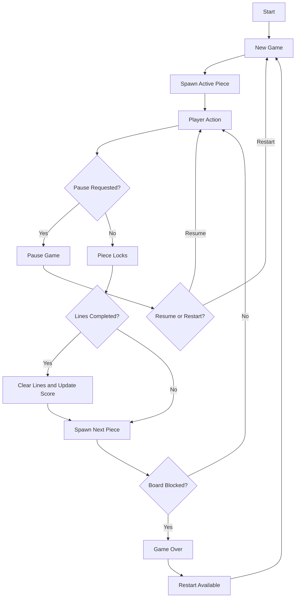

# Feature Specification: Tetris

**Feature Branch**: `[028-tetris]`
**Created**: 2026-05-01
**Status**: Draft
**Input**: User description: "make tetris"

## One-Line Purpose *(mandatory)*

A player plays a classic single-player Tetris game that rewards line clears, tracks progress, and ends cleanly when the board fills.

## Consumer & Context *(mandatory)*

A player in a browser session consumes the game directly in the viewport while the game owns input focus.

## User Scenarios & Testing *(mandatory)*

### User Story 1 - Start and play a round (Priority: P1)

A player can start a fresh game, move and rotate the active piece, and keep placing pieces until the round ends.

**Why this priority**: The core Tetris loop is the main value of the feature; without it there is no playable game.

**Independent Test**: Start a new game, use the documented controls to move, rotate, soft-drop, and hard-drop pieces, and verify that the round progresses from first piece to game over.

**Acceptance Scenarios**:

1. **Given** no active game, **When** the player starts a new round, **Then** the board resets and a playable piece appears with a visible next-piece preview.
2. **Given** an active piece, **When** the player moves, rotates, soft-drops, or hard-drops it within legal bounds, **Then** the piece responds correctly and locks when it can no longer fall.

---

### User Story 2 - Clear lines and advance progress (Priority: P2)

A player can complete lines, see them clear, and watch score and level progress change as the board becomes more difficult.

**Why this priority**: Line clears and progression are the main feedback loop that makes Tetris feel complete.

**Independent Test**: Set up a nearly complete row, complete it, and verify that the line clears and the visible progress indicators update.

**Acceptance Scenarios**:

1. **Given** one or more nearly complete rows, **When** the player fills the final cells, **Then** the completed rows clear, the stack drops into place, and the score and cleared-line count update.
2. **Given** repeated successful clears, **When** the player reaches the next progression threshold, **Then** the game pace increases according to the level rules.

---

### User Story 3 - Pause and recover sessions (Priority: P3)

A player can pause a live game, resume from the same state, or restart after a loss without corrupting the session.

**Why this priority**: Players need a reliable way to stop and restart a run, especially in a browser session.

**Independent Test**: Start a game, pause it, resume it, and restart from game over while confirming that the board state behaves as expected.

**Acceptance Scenarios**:

1. **Given** an active game, **When** the player pauses it, **Then** the fall timer stops and the visible board state does not change until resume.
2. **Given** a paused or game-over state, **When** the player resumes or restarts, **Then** gameplay continues from the saved live state or resets to a clean new board.

---

### User Story 4 - See status at a glance (Priority: P4)

A player can always see the current score, cleared lines, level, next piece, and game-over state.

**Why this priority**: Clear status information makes the game understandable and satisfying to play.

**Independent Test**: Play through several piece placements and verify that the on-screen status stays in sync with the game state.

**Acceptance Scenarios**:

1. **Given** an in-progress game, **When** the active piece or board changes, **Then** the visible score, line count, level, and next-piece indicators stay in sync.
2. **Given** a game-over state, **When** the round ends, **Then** the player sees a clear restart path and an unmistakable end-of-round message.

---

### Edge Cases

- A new piece cannot spawn because the stack reaches the top of the board.
- A rotation or drop near a wall or stack should not corrupt the board state or place pieces outside the playfield.
- Completing multiple rows at once should clear every completed row in the same resolution step.
- Pausing during a fast fall should freeze the round immediately and preserve the current position.
- Restarting after game over should clear all locked cells, score, and progression state.

## Flowchart *(mandatory)*



## Data & State Preconditions *(mandatory)*

- A player has an active browser session with input focus available for the game.
- The game can represent the active piece, locked cells, score, cleared lines, level, pause state, and game-over state consistently.
- A new round can begin from a clean board without depending on prior session data.

## Inputs & Outputs *(mandatory)*

| Direction | Description | Format |
| :-- | :-- | :-- |
| Input | Player actions and round-control requests during a game session | Caller-defined |
| Output | Live board state, status indicators, and round state feedback for the player | Caller-defined |

## Constraints & Non-Goals *(mandatory)*

**Must NOT**:
- Must not advance the round while the game is paused or after game over.
- Must not require sign-in, network access, or a remote service to play the game.
- Must not allow pieces to occupy invalid positions outside the playfield or through locked blocks.

**Adopted dependencies** *(include if feature uses external tools/packages to deliver capability)*:
- None. The feature is expected to rely on the repo's existing runtime and UI foundations.

**Out of scope** *(things this feature genuinely does not do, even via external tools)*:
- Multiplayer or head-to-head battle mode.
- Online leaderboards, cloud sync, or user accounts.
- Cosmetic skins, monetization, or other non-gameplay extras.

## Requirements *(mandatory)*

### Functional Requirements

- **FR-001**: The system MUST let a player start a new single-player game that resets the board and begins piece generation.
- **FR-002**: The system MUST let the player move, rotate, soft-drop, and hard-drop the active piece using documented controls.
- **FR-003**: The system MUST lock pieces when they land, merge them into the board, and clear completed lines according to standard Tetris rules.
- **FR-004**: The system MUST show score, cleared lines, level or progression, and next-piece information during play.
- **FR-005**: The system MUST pause, resume, and restart an active game without corrupting the current session state.
- **FR-006**: The system MUST detect game over when no new piece can enter play and must provide a clear restart path from that state.

### Key Entities *(include if feature involves data)*

- **Game Session**: Represents one round, including the current state, score, cleared lines, and round status.
- **Board State**: Represents the occupied cells, active piece, and legal placement space for the current round.
- **Tetromino Piece**: Represents the falling shape, its position, and its orientation.
- **Progress HUD**: Represents the visible score, line count, level, next piece, and end-of-round messaging.

## Success Criteria *(mandatory)*

### Measurable Outcomes

- **SC-001**: A new game reaches an interactive playable state with a visible next-piece indicator every time it is started.
- **SC-002**: Completed line clears update the visible score and cleared-line count immediately after the locking move that caused them.
- **SC-003**: Players can pause, resume, and restart a round without losing or corrupting the current game state.
- **SC-004**: The game shows a clear game-over state whenever a new piece cannot spawn, and restart is available from that state.

## Definition of Done *(mandatory)*

The Tetris feature is shipped in production, and players can start a round, play through line clears, pause or resume, and restart from game over with all documented game states working reliably in the browser.

## Delivery Routing & Rough Size *(mandatory)*

### Item Classification

| Field | Value | Notes |
|-------|-------|-------|
| Work type | `New feature` | This is a standalone new gameplay feature. |
| Existing spec coverage | `None` | No existing spec covers Tetris in this repo. |
| Required spec action | `New spec` | The request is broad enough to warrant a new feature spec. |

### Rough Size

T-shirt size: `L`

Reasoning:
- This is a new interactive game loop with multiple states, input handling, score progression, and failure recovery, so it is larger than a small repo-local change even though it does not require external dependencies.

### Risk / Uncertainty

| Dimension | Level | Reason |
|-----------|-------|--------|
| Requirement clarity | `Medium` | The request is clear at the headline level, but details such as exact controls and optional extras need to be fixed in the downstream design. |
| Repo uncertainty | `Medium` | The implementation surface is not yet grounded in an existing Tetris module or adjacent game UI. |
| External dependency uncertainty | `Low` | No external services or packages are required to define the feature. |
| State / data / migration risk | `Low` | The feature is session-local and does not require migration of existing data. |
| Runtime / side-effect risk | `Medium` | The game introduces a live state machine and input timing that must stay consistent. |
| Human/operator dependency | `Low` | No operator workflow is needed for normal play. |

### Phase Routing

| Downstream Phase | Decision | Reason |
|------------------|----------|--------|
| Research | `Skip` | Tetris is a standard, well-understood game loop with no external dependency question. |
| Plan | `Full` | The feature introduces a new interactive state model and should be designed before tasking. |
| Sketch | `Required` | Every implementation item that reaches tasking needs at least the core sketch. |
| Tasking | `Required` | The work should be broken into implementation slices before execution. |
| Estimate | `Required after tasking` | Size should be refined after the design slices exist. |

### Routing Contract

Fill this block with the same routing and risk decisions above. Downstream automation reads this block.
Use the exact routing vocabulary from `scripts/spec_routing.py`:
- `research_route`: `skip` or `required`
- `plan_profile`: `skip`, `lite`, or `full`
- `sketch_profile`: `core` or `expanded`
- `tasking_route`: `required` or `attach_to_existing_feature`
- `estimate_route`: `required_after_tasking` or `reuse_existing_estimate`
If conditional sketch sections are needed, use the canonical names from `scripts/spec_routing.py`:
- `Repo Grounding`
- `Contract / Artifact / Event Impact`
- `Runtime / State / Failure Notes`
- `Human / Operator Boundaries`
- `Design Gaps and Repo Contradictions`
- `Decomposition-Ready Design Slices`

```json
{
  "routing": {
    "research_route": "skip",
    "plan_profile": "full",
    "sketch_profile": "expanded",
    "tasking_route": "required",
    "estimate_route": "required_after_tasking",
    "routing_reason": "Classic Tetris is a standard feature, but the repo still needs a full design pass because the feature introduces a new interactive state machine with scoring, pause/resume, and game-over behavior.",
    "conditional_sketch_sections": [
      "Repo Grounding",
      "Contract / Artifact / Event Impact",
      "Runtime / State / Failure Notes",
      "Decomposition-Ready Design Slices"
    ]
  },
  "risk": {
    "requirement_clarity": "Medium",
    "repo_uncertainty": "Medium",
    "external_dependency_uncertainty": "Low",
    "state_data_migration_risk": "Low",
    "runtime_side_effect_risk": "Medium",
    "human_operator_dependency": "Low"
  }
}
```

### Existing-Spec Attachment

- Existing feature/spec: `N/A`
- Attach as: `New spec`
- New spec required? `Yes`
- Rationale: This is a brand-new standalone feature request rather than a delta on an existing spec.

### Routing Gate

- [x] Work type is classified.
- [x] Existing spec coverage is checked.
- [x] Rough size is assigned.
- [x] Risk/uncertainty dimensions are assigned.
- [x] Research route is justified.
- [x] Plan route is justified.
- [x] Sketch is required and right-sized.
- [x] Tasking/estimate route is justified.

## Open Questions *(include if any unresolved decisions exist)*

- None.
