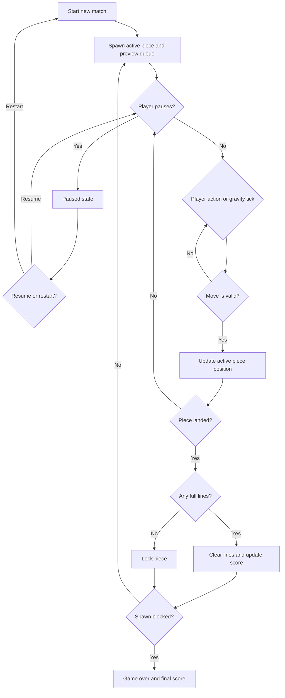

# Feature Specification: Tetris

**Feature Branch**: `[028-tetris]`
**Created**: 2026-05-01
**Status**: Draft
**Input**: User description: "make teris"

## One-Line Purpose *(mandatory)*

A player can play a browser-based Tetris match that responds to input, clears lines, tracks score, and ends when the stack reaches the top.

## Consumer & Context *(mandatory)*

A browser session on the app receives player keyboard or touch input and renders the live match state on screen.

## User Scenarios & Testing *(mandatory)*

### User Story 1 - Start and Play a Match (Priority: P1)

A player starts a new match, moves and rotates falling pieces, clears lines, and sees score updates as the game progresses.

**Why this priority**: This is the core playable loop and the minimum value the feature must deliver.

**Independent Test**: Start a match in the browser, play until at least one line clears, and verify that the board, score, and active piece update correctly.

**Acceptance Scenarios**:

1. **Given** the game is on the start screen, **When** the player starts a new match, **Then** the board resets and a falling piece appears.
2. **Given** a piece is falling, **When** the player moves, rotates, or hard drops it into place, **Then** the board updates according to collision rules and the next piece appears.
3. **Given** one or more rows are completed, **When** the current piece locks, **Then** the full rows clear and the score increases.

---

### User Story 2 - Pause, Resume, and Restart (Priority: P2)

A player can pause an in-progress match, resume it later, and restart after a game over without refreshing the page.

**Why this priority**: Pausing and restarting are the main control and recovery actions after the core loop.

**Independent Test**: Start a match, pause it, confirm the board stops advancing, resume it, and restart from a finished match.

**Acceptance Scenarios**:

1. **Given** a match is in progress, **When** the player pauses the game, **Then** gravity and input-driven board changes stop.
2. **Given** the game is paused, **When** the player resumes, **Then** the match continues from the same state.
3. **Given** the match has ended, **When** the player selects restart, **Then** a new empty board and fresh piece queue appear.

---

### User Story 3 - Play on Desktop and Mobile (Priority: P3)

A player can understand and control the game on both keyboard-first desktop and smaller mobile viewports.

**Why this priority**: The game should remain usable across the app's supported browsing contexts, but this is secondary to the core loop.

**Independent Test**: Open the game on a narrow mobile viewport and on a desktop viewport, then verify the match remains readable and controllable.

**Acceptance Scenarios**:

1. **Given** the game is rendered in a narrow viewport, **When** the player views the match, **Then** the playfield, score, and controls remain visible.
2. **Given** the player uses keyboard controls on desktop, **When** they press the documented actions, **Then** the expected movement, rotation, drop, pause, and restart behaviors occur.

---

### Edge Cases

- If the spawn position is blocked by locked blocks, the match ends immediately instead of creating an invalid active piece.
- If a lock completes multiple rows at once, all completed rows clear together and the score reflects the multi-line clear.
- If a rotation or movement would collide with the wall or stack, the board must remain valid and the action should fail cleanly.
- If focus leaves the game surface, stray keyboard input must not alter the match state.

## Flowchart *(mandatory)*



## Data & State Preconditions *(mandatory)*

- The browser game surface is loaded and ready to accept focus.
- The match begins from a clean board with an active piece, a queued preview piece, and score and line counters at their starting values.
- If the player is resuming an in-progress match, the stored game state must still match the visible board state.

## Inputs & Outputs *(mandatory)*

| Direction | Description | Format |
| :-- | :-- | :-- |
| Input | Player actions and match lifecycle events | Caller-defined |
| Output | Updated board state, score, line count, level, piece preview, and pause or game-over state | Caller-defined |

## Constraints & Non-Goals *(mandatory)*

- The game must be playable without network connectivity or external services.
- The game must remain usable with keyboard-only controls on desktop and a responsive layout on smaller screens.
- The initial release does not include multiplayer, online leaderboards, account sync, or cosmetic customization.
- The initial release does not require a tutorial, sound design, or tournament mode.

## Requirements *(mandatory)*

### Functional Requirements

- The game must start a new match with an empty board, a fresh piece queue, and a visible active piece.
- The game must support moving left and right, rotating, soft dropping, hard dropping, pausing, resuming, and restarting.
- The game must apply gravity over time and lock a piece when it can no longer descend.
- The game must clear completed rows and update score, cleared lines, and level consistently.
- The game must end when a new piece cannot spawn without colliding with the locked stack.
- The UI must show the current score, cleared lines, level, active state, and next-piece preview during play.
- The game must preserve valid state transitions when actions arrive in rapid succession.

### Key Entities *(include if feature involves data)*

- **Match State**: The current board, active piece, next-piece queue, pause flag, game-over flag, score, lines, and level.
- **Board**: The playfield grid that stores locked blocks and determines collision outcomes.
- **Piece**: A falling tetromino with shape, position, rotation, and placement state.
- **Piece Queue**: The upcoming piece order shown to the player as a preview.
- **Score Snapshot**: The visible score, cleared line total, and level displayed during the match.

## Success Criteria *(mandatory)*

### Measurable Outcomes

- A player can start a match, clear at least one line, and see the score update without developer intervention.
- A player can pause and resume a match, and the board state remains unchanged while paused.
- A player can restart after game over and immediately begin a new match.
- The game remains legible and controllable in both desktop and narrow mobile browser viewports.

## Definition of Done *(mandatory)*

- All required sections in this spec are populated and contain no placeholder text.
- The acceptance scenarios cover the full playable loop, pause and restart flow, and supported viewport behavior.
- The flowchart matches every acceptance scenario with no orphaned branches.
- Routing validation passes for the spec file.
- Any unresolved decisions that would change acceptance criteria are explicitly listed in this document.

## Delivery Routing & Rough Size *(mandatory)*

### Item Classification

| Field | Value | Notes |
|-------|-------|-------|
| Work type | `New feature` | This introduces a new browser game rather than a small delta to an existing capability. |
| Existing spec coverage | `None` | No existing repo match was found for "teris" during discovery. |
| Required spec action | `New spec` | The request needs a dedicated feature spec with its own routing contract. |

### Rough Size

T-shirt size: `L`

Reasoning:
- This is a new interactive gameplay loop with stateful controls, scoring, line clears, game over handling, and responsive presentation, so it needs full planning and expanded sketching even though it remains repo-local and dependency-free.

Use this calibration:

| Size | Meaning | Typical Routing |
|------|---------|-----------------|
| XS | One obvious repo-local change, usually one seam, no new architecture or research | Research skip, Plan skip, Sketch core only |
| S | Small repo-local change using existing architecture, small contract/test detail | Research skip, Plan skip or lite, Sketch core plus any triggered sections |
| M | Multiple seams or one meaningful design decision, existing architecture mostly applies | Research skip unless unknowns, Plan lite, Sketch expanded |
| L | New or materially changed architecture, state, interface, workflow, or artifact/event lifecycle | Research as needed, Plan full, Sketch expanded with slices |
| XL | Cross-cutting, external, security/data-heavy, unclear feasibility, or likely multi-feature work | Research required, Plan full, Sketch expanded; consider splitting spec |

### Risk / Uncertainty

| Dimension | Level | Reason |
|-----------|-------|--------|
| Requirement clarity | `medium` | The request implies a Tetris game, but the initial prompt leaves gameplay scope details open. |
| Repo uncertainty | `medium` | The app structure for the playable surface needs to be confirmed during implementation. |
| External dependency uncertainty | `low` | The feature does not depend on third-party services or external APIs. |
| State / data / migration risk | `low` | The feature can start from a clean, local match state without migration. |
| Runtime / side-effect risk | `medium` | The game loop, input handling, and collision rules must stay internally consistent. |
| Human/operator dependency | `low` | The feature should be self-serve once implemented. |

### Phase Routing

| Downstream Phase | Decision | Reason |
|------------------|----------|--------|
| Research | `Skip` | No external dependency or prior-art investigation is required to define the feature. |
| Plan | `Full` | The feature introduces a new interactive state loop and needs a deliberate design pass. |
| Sketch | `Required` | The implementation will reach tasking and needs expanded decomposition. |
| Tasking | `Required` | The feature is new work, not an attachment to an existing feature. |
| Estimate | `Required after tasking` | Size should be rechecked once the design slices are defined. |

### Routing Contract

Fill this block with the same routing and risk decisions above. Downstream automation reads this block.
Use the exact routing vocabulary from `scripts/spec_routing.py`:
- `research_route`: `skip` or `required`
- `plan_profile`: `skip`, `lite`, or `full`
- `sketch_profile`: `core` or `expanded`
- `tasking_route`: `required` or `attach_to_existing_feature`
- `estimate_route`: `required_after_tasking` or `reuse_existing_estimate`
If conditional sketch sections are needed, use the canonical names from `scripts/spec_routing.py`:
- `Repo Grounding`
- `Contract / Artifact / Event Impact`
- `Runtime / State / Failure Notes`
- `Human / Operator Boundaries`
- `Design Gaps and Repo Contradictions`
- `Decomposition-Ready Design Slices`

```json
{
  "routing": {
    "research_route": "skip",
    "plan_profile": "full",
    "sketch_profile": "expanded",
    "tasking_route": "required",
    "estimate_route": "required_after_tasking",
    "routing_reason": "This is a new browser game with a stateful gameplay loop, so it needs full design and expanded decomposition even though it has no external dependency.",
    "conditional_sketch_sections": [
      "Runtime / State / Failure Notes",
      "Decomposition-Ready Design Slices"
    ]
  },
  "risk": {
    "requirement_clarity": "medium",
    "repo_uncertainty": "medium",
    "external_dependency_uncertainty": "low",
    "state_data_migration_risk": "low",
    "runtime_side_effect_risk": "medium",
    "human_operator_dependency": "low"
  }
}
```

### Existing-Spec Attachment

- Existing feature/spec: `N/A`
- Attach as: `New spec`
- New spec required? `Yes`
- Rationale: No matching repo spec was found during discovery, so this is a distinct feature rather than a clarification of existing behavior.

### Routing Gate

- [x] Work type is classified.
- [x] Existing spec coverage is checked.
- [x] Rough size is assigned.
- [x] Risk/uncertainty dimensions are assigned.
- [x] Research route is justified.
- [x] Plan route is justified.
- [x] Sketch is required and right-sized.
- [x] Tasking/estimate route is justified.

## Open Questions *(include if any unresolved decisions exist)*

- None.
