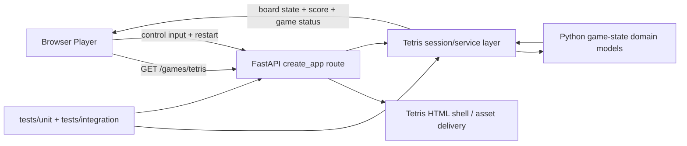

# Combined Plan - 029-make-tetris

_Feature: `029-make-tetris`_
_Source Spec: `spec.md`_
_Artifact: `plan.md`_

[This template documents every section the combined `speckit.plan` step may keep. `scripts/speckit_plan_step.py` prunes unused sections after triage so the emitted `plan.md` contains only the sections required by strategy.]

## Triage

- duplicate: false
- t_shirt_size: l
- risk_level: high
- reason: No current in-repo implementation or complete spec/plan artifact for a playable Tetris feature exists in the live worktree.

## Strategy Contract

```json
{
  "domains": {
    "reasoning": {
      "client/UI": "The feature is an interactive game experience with keyboard controls, visible score, game-over state, and restart flow.",
      "code patterns": "Tetris needs a deterministic game-state engine with explicit transitions for spawn, move, lock, clear, score, and restart.",
      "edge delivery": "The repo has no existing browser app, so the feature needs an intentional route/static-asset delivery seam from the existing FastAPI runtime.",
      "testing": "Gameplay rules, edge collisions, line clears, and restart/game-over transitions need deterministic regression coverage."
    },
    "relevant": [
      "client/UI",
      "edge delivery",
      "testing",
      "code patterns"
    ]
  },
  "risk": {
    "external_dependency_uncertainty": "low",
    "human_operator_dependency": "low",
    "overall": "high",
    "repo_uncertainty": "high",
    "requirement_clarity": "low",
    "runtime_side_effect_risk": "medium",
    "state_data_migration_risk": "low"
  },
  "strategy": {
    "architecture_diagram": true,
    "architecture_strategy": true,
    "expanded_design_notes": true,
    "external_research": false,
    "strategy_reason": "This feature is not a small patch in an existing UI. It needs a deliberate browser delivery seam, a maintainable game-state architecture, and explicit testing strategy while staying compatible with a Python-first repo."
  },
  "triage": {
    "duplicate": false,
    "duplicate_matches": [],
    "duplicate_reason": "No current in-repo implementation or complete spec/plan artifact for a playable Tetris feature exists in the live worktree.",
    "risk_level": "high",
    "tshirt_size": "l"
  }
}
```

## Internal Discovery

### Term: specification

- matches: true
- exit_code: 0
- files:
  - `/Users/andreborczuk/app-foundation/quickstart.md`

### Term: tetris

- matches: true
- exit_code: 0
- files:
  - `/Users/andreborczuk/app-foundation/specs/032-make-tetris/discovery.md`

### Term: branch

- matches: true
- exit_code: 0
- files:
  - `/Users/andreborczuk/app-foundation/.specify/scripts/python/common.py`

### Term: 029-make-tetris

- matches: true
- exit_code: 0
- files:
  - `/Users/andreborczuk/app-foundation/tests/unit/test_specify_fastpath.py`

### Term: created

- matches: true
- exit_code: 0
- files:
  - `/Users/andreborczuk/app-foundation/.specify/templates/data-model-template.md`

## Relevant Domains

- `client/UI`: The user-facing value is a keyboard-driven play session with visible score, game-over handling, and restart, so responsiveness and explicit UI states are core, not incidental.
- `edge delivery`: The repo currently exposes a FastAPI service rather than a browser app, so the feature needs a deliberate route/static-delivery seam instead of assuming an existing frontend host.
- `testing`: Tetris is a deterministic state machine with many edge cases, so correctness depends on transition-focused regression tests rather than ad hoc manual play only.
- `code patterns`: The gameplay loop needs explicit typed state transitions and a clean split between delivery glue and authoritative rule logic.

## Summary

This is a non-duplicate, `L`-sized feature with `high` planning risk because the request is for a browser-playable game inside a codebase that currently ships Python services, not a web client. The plan should therefore introduce Tetris as an isolated surface hosted from the existing FastAPI runtime, keep gameplay rules in explicit Python modules where possible, and limit browser-side code to the thinnest rendering/input layer that can make the feature playable.

The preferred path is to add a dedicated Tetris route under the existing `clickup_control_plane` app, isolate the game-session/rule engine into new typed modules, and drive verification from deterministic gameplay-state tests plus one integration seam that proves the browser surface can start, play, lose, and restart. No external research is required to choose that direction, but feasibility pressure remains high because the repo has no existing browser stack and the governance preference is Python-first.

## Internal Research

- [README.md](/Users/andreborczuk/app-foundation/README.md:47) describes the repo as Python application code plus MCP/control-plane services; it does not describe an existing frontend application or Node-based browser build.
- [README.md](/Users/andreborczuk/app-foundation/README.md:14) shows Python/`uv` bootstrap and service startup only, which means the feature should not assume an established browser asset pipeline.
- [app.py](/Users/andreborczuk/app-foundation/src/clickup_control_plane/app.py:162) is the current runtime entrypoint and already owns HTTP routing. That is the cleanest seam for adding a new browser-facing route without inventing a second top-level runtime.
- The current FastAPI app only exposes health and control-plane webhook/completion endpoints, so any playable Tetris surface will be new code rather than an extension of an existing UI module. [app.py](/Users/andreborczuk/app-foundation/src/clickup_control_plane/app.py:166)
- `specs/028-make-tetris/` exists only as an empty directory, and the vector-index references to `specs/032-make-tetris/...` are stale or absent in the current worktree. That is related history, not a live duplicate implementation.

## Architecture Strategy

Host the feature inside the existing FastAPI service rather than introducing a separate app runtime. The first architectural seam should be a dedicated Tetris surface under `src/clickup_control_plane/` with route wiring in [app.py](/Users/andreborczuk/app-foundation/src/clickup_control_plane/app.py:162) and a new focused package for gameplay state, rule transitions, and route helpers.

Keep authoritative gameplay logic in Python modules with explicit typed state transitions for spawn, move, rotate, lock, clear, score, game over, and restart. The browser surface should be treated as delivery glue that renders state and captures input, not as the primary source of truth for game rules. That direction aligns best with the repo's Python-first constraint and makes deterministic testing realistic.

Do not introduce a full SPA stack or broad build-tool migration in the first cut. If the thin browser shell needed for playability cannot stay meaningfully small, implementation should stop and treat that as the feasibility pressure already signaled by this plan rather than silently converting the repo into a separate frontend project.

## Architecture Diagram

[Kept only when strategy requires an explicit architecture view. Prefer a compact mermaid diagram.]



## Expanded Design Notes

- The UI needs at least three explicit states: active play, game over, and restart-ready. Score must remain visible during active play and after loss.
- Input handling should assume keyboard-first interaction and must avoid illegal board mutation during rapid repeated commands or after game over.
- The state model should be explicit about when a piece is active, when it locks, when rows clear, and when a new piece fails to spawn. Hidden mutation across helpers will make both testing and gameplay bugs much harder to control.
- Because there is no existing browser stack in the repo, the first implementation should bias toward correctness and isolation over animation complexity. Fancy presentation is optional; deterministic gameplay and clean restart semantics are not.
- The plan assumes a narrow browser-delivery layer is acceptable to make the feature playable inside the existing app surface. If that assumption is rejected during implementation, the work should pivot to a small feasibility checkpoint before deeper UI work proceeds.

## Design Slices

### Slice PL-01 - Tetris Runtime Surface

- Estimate: medium
- Why this slice exists: The repo has no existing browser app, so the feature first needs a deliberate hosting seam before gameplay code can land cleanly.
- File/Symbol Seams: [app.py](/Users/andreborczuk/app-foundation/src/clickup_control_plane/app.py:162), new `src/clickup_control_plane/tetris/` package, route/static asset registration seam
- Implementation Directive: Extend the FastAPI runtime with an isolated Tetris route and supporting delivery helpers without perturbing existing control-plane endpoints.

### Slice PL-02 - Authoritative Game-State Engine

- Estimate: high
- Why this slice exists: Gameplay correctness depends on explicit, testable state transitions rather than UI event code.
- File/Symbol Seams: new `src/clickup_control_plane/tetris/` domain/service modules for board state, tetromino state, line clear/scoring, and restart/game-over transitions
- Implementation Directive: Create typed Python symbols for gameplay state and transition operations so spawn, move, rotate, lock, clear, score, and restart can be verified deterministically.

### Slice PL-03 - Playable Browser Shell

- Estimate: high
- Why this slice exists: The user-visible feature requires a rendered board, keyboard controls, score display, and restart UX.
- File/Symbol Seams: new Tetris page/template/static asset seam mounted from the FastAPI route, browser input/rendering layer tied to the Tetris runtime surface
- Implementation Directive: Build the thinnest browser shell that can render board state, collect keyboard input, display score/game-over state, and synchronize with the authoritative gameplay flow.

### Slice PL-04 - Deterministic Verification Gates

- Estimate: medium
- Why this slice exists: The feature is a rule-heavy state machine and needs regression protection across gameplay transitions.
- File/Symbol Seams: `tests/unit/` gameplay-rule coverage, `tests/integration/` route/runtime coverage, plan-to-task trace for start/play/clear/lose/restart scenarios
- Implementation Directive: Add deterministic tests for rule transitions and at least one integration seam proving the Tetris surface can start, progress, reach game over, and restart without corrupting state.

## Plan Completion Summary

Selected a high-rigor plan because the feature is conceptually simple to explain but structurally non-trivial in this repo: it introduces a browser-facing game surface into a Python service codebase. The chosen sections are enough because they cover the real uncertainty drivers: repo fit, domain impact, architecture host choice, and the required implementation slices.

Next phase should treat this as a solution/tasking handoff from a domain-driven plan, not as a lightweight UI tweak. The first implementation task should anchor the hosting seam in the existing FastAPI app, then build the authoritative game-state engine before polishing the browser shell.
