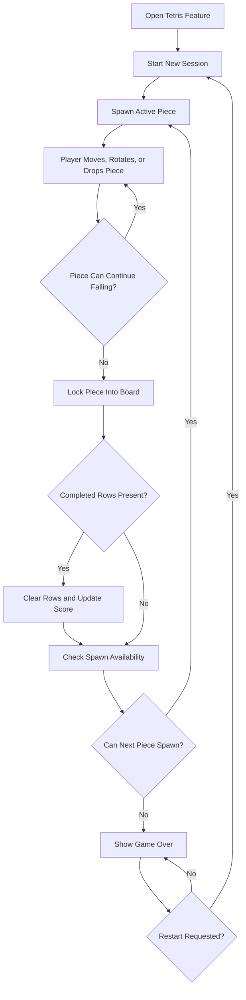

# Feature Specification: Make Tetris

**Feature Branch**: `029-make-tetris`
**Created**: 2026-05-06
**Status**: Draft
**Input**: User description: "make tetris"

## One-Line Purpose *(mandatory)*

Let a user play a complete single-player game of Tetris in the app with responsive controls, visible scoring, line clears, game over handling, and restart.

## Consumer & Context *(mandatory)*

- **Primary user**: A person opening the app who wants a playable arcade-style Tetris experience without setup or authentication.
- **Usage context**: The feature is launched directly in the app and should feel self-contained, immediately understandable, and playable in one session.
- **User goal**: Start a game quickly, control falling pieces reliably, clear lines, track score, and restart after losing.

## User Scenarios & Testing *(mandatory)*

### User Story 1 - Start and Play a Tetris Game (Priority: P1)

A user opens the Tetris feature and begins playing immediately with standard movement and rotation controls.

**Why this priority**: Without core gameplay, the feature has no value.

**Independent Test**: Open the feature, begin a session, move and rotate pieces, and confirm the board updates correctly until play continues without blocking errors.

**Acceptance Scenarios**:

1. **Given** the user opens the Tetris feature, **When** the game loads, **Then** a new playable session is shown with an empty board and an active falling piece.
2. **Given** a piece is falling, **When** the user presses movement or rotation controls, **Then** the piece responds correctly within board boundaries and collision rules.
3. **Given** active gameplay, **When** time advances, **Then** the current piece continues to fall until it lands or locks.

### User Story 2 - Clear Lines and Track Score (Priority: P2)

A user clears completed rows and sees the score update during the same session.

**Why this priority**: Line clearing and scoring are core feedback loops that make the game recognizable and rewarding.

**Independent Test**: Play until a row is completed, confirm the row is removed, confirm the board collapses correctly, and verify the score increases.

**Acceptance Scenarios**:

1. **Given** a row becomes fully occupied, **When** the active piece locks, **Then** the completed row is cleared before normal play resumes.
2. **Given** one or more rows are cleared, **When** scoring is recalculated, **Then** the player sees an updated score in the game UI.
3. **Given** the session continues after a clear, **When** the next piece enters play, **Then** the board state reflects the cleared rows accurately.

### User Story 3 - Reach Game Over and Restart (Priority: P3)

A user can recognize a lost game and immediately start a fresh one.

**Why this priority**: A complete play loop requires a terminal condition and a clear recovery path.

**Independent Test**: Play until no new piece can spawn, confirm a game-over state appears, and restart into a fresh session.

**Acceptance Scenarios**:

1. **Given** the stack reaches the spawn area, **When** a new piece cannot be placed legally, **Then** the session enters a game-over state.
2. **Given** the session is over, **When** the user views the end state, **Then** the score remains visible and active controls no longer mutate the ended board.
3. **Given** the session is over, **When** the user chooses restart, **Then** a new session begins with reset board state and reset score.

### Edge Cases

- Rapid repeated input must not move pieces outside board bounds or through locked blocks.
- Rotation attempts that would overlap walls or occupied cells must resolve predictably without corrupting board state.
- Clearing multiple rows at once must update the board and score consistently.
- Game over must trigger only when a new piece cannot spawn legally, not during normal stacking.
- Restart must fully reset the play session and not carry over stale board or score state.

## Flowchart *(mandatory)*

## Data & State Preconditions *(mandatory)*

- No account, backend, or prior saved state is required to start a session.
- A new play session starts from a clean board with score reset to zero.
- The game must manage enough local session state to represent the board, active piece, upcoming gameplay progression, score, and terminal state.

## Inputs & Outputs *(mandatory)*

- **Inputs**:
  - Start or restart interaction
  - Keyboard gameplay controls for move, rotate, soft drop, and hard drop
  - Passage of time that advances falling pieces
- **Outputs**:
  - Visible game board
  - Active falling piece and locked blocks
  - Current score
  - Game-over indication
  - Restart affordance

## Constraints & Non-Goals *(mandatory)*

### Constraints

- The feature must be playable as a self-contained experience inside the existing app.
- The gameplay loop must be understandable without reading instructions outside the feature UI.
- The spec should stay focused on a complete single-player Tetris loop rather than expansion features.

### Non-Goals

- Multiplayer or competitive play
- Online leaderboards or matchmaking
- User accounts or cross-session persistence
- Custom piece sets or non-standard Tetris rule variants
- Mobile-specific gesture controls
- Cosmetic customization beyond what is needed for a usable default play experience

## Requirements *(mandatory)*

### Functional Requirements

- **FR-001**: The system MUST present a new playable Tetris session when the feature is opened.
- **FR-002**: The system MUST render a bounded game board that represents empty cells, locked cells, and the active falling piece.
- **FR-003**: The system MUST allow the player to move and rotate the active piece using standard gameplay controls.
- **FR-004**: The system MUST enforce board boundaries and collision rules for movement, falling, locking, and rotation.
- **FR-005**: The system MUST advance the active piece downward over time until it locks.
- **FR-006**: The system MUST detect completed rows and clear them from the board.
- **FR-007**: The system MUST maintain and display the player score within the session.
- **FR-008**: The system MUST detect when a new piece can no longer spawn and mark the session as game over.
- **FR-009**: The system MUST provide a restart path that creates a fresh session with reset board and score state.
- **FR-010**: The system MUST prevent post-gameplay controls from mutating the ended session until restart occurs.

### Key Entities *(include if feature involves data)*

- **Game Session**: The active local play state for one run of Tetris, including whether play is active or over.
- **Board State**: The grid of cells representing empty space, locked blocks, and placement rules.
- **Tetromino**: The active falling shape with position and orientation during play.
- **Score State**: The running score shown to the player during a session.

## Success Criteria *(mandatory)*

### Measurable Outcomes

- **SC-001**: A user can begin playing within one interaction after opening the feature.
- **SC-002**: A user can complete a full play loop from session start to game over to restart without leaving the feature.
- **SC-003**: Line clears visibly remove completed rows and update the score in the same session.
- **SC-004**: A session never allows a piece to occupy out-of-bounds cells or overlap locked blocks during normal play.

## Definition of Done *(mandatory)*

- All P1 acceptance scenarios are implemented and manually verifiable.
- Row clearing, scoring, game over, and restart behavior are present and consistent with the spec.
- The feature supports a complete single-player play loop without requiring backend services or authentication.
- No clarification markers remain in the spec.
- The spec is ready for the next pipeline phase.

## Open Questions *(include if any unresolved decisions exist)*

- None at this time.
