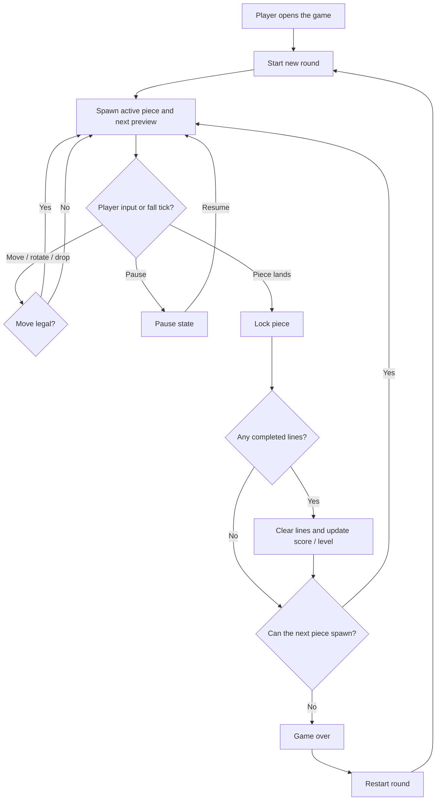

# Feature Specification: Tetris

**Feature Branch**: `030-tetris`
**Created**: 2026-04-30
**Status**: Draft
**Input**: User description: "make tetris"

## One-Line Purpose *(mandatory)*

A player can start and play a complete Tetris round that rewards line clears and ends cleanly when the board fills.

## Consumer & Context *(mandatory)*

A player using the product in a browser session with live game controls and visible board state receives this feature.

## User Scenarios & Testing *(mandatory)*

### User Story 1 - Start and Survive a Round (Priority: P1)

A player can start a new game, move and rotate falling pieces, and use soft drop, hard drop, and pause/resume during active play.

**Why this priority**: The game is only valuable if the core play loop works from the first move.

**Independent Test**: Start a fresh session and verify the player can control an active piece without needing scoring, line clears, or a completed game.

**Acceptance Scenarios**:

1. **Given** a new game has started, **When** the player moves, rotates, or drops the active piece, **Then** the piece responds immediately and stays within legal board bounds.
2. **Given** a game is in progress, **When** the player pauses and resumes, **Then** the falling piece, timers, and controls freeze and restore without losing state.

---

### User Story 2 - Clear Lines and Track Progress (Priority: P2)

A player can clear one or more complete lines and see score, line count, level, and next-piece feedback update in a predictable way.

**Why this priority**: Scoring and progression give the game its payoff and make continued play meaningful.

**Independent Test**: Set up a board state that guarantees line clears and verify the displayed progress updates without needing game-over behavior.

**Acceptance Scenarios**:

1. **Given** the active piece completes one or more rows, **When** the piece locks, **Then** the completed lines clear and the score and line count update.
2. **Given** a round is active, **When** a new piece is spawned, **Then** the next-piece preview updates so the player can plan ahead.

---

### User Story 3 - Finish and Restart Cleanly (Priority: P3)

When the stack reaches the spawn area, the game ends clearly and the player can restart immediately without refreshing the client.

**Why this priority**: A clean end state and fast restart keep the feature usable across repeated rounds.

**Independent Test**: Fill the board to the spawn area and verify that game over appears and restart returns to a clean playfield.

**Acceptance Scenarios**:

1. **Given** no legal spawn position remains, **When** the next piece would appear, **Then** the game enters a clear game-over state.
2. **Given** the game is over, **When** the player restarts, **Then** the board, score, and status reset to a fresh round.

### Edge Cases

- A rotation near a wall or stack should fail cleanly or fit legally without corrupting the board state.
- Multiple lines cleared by a single lock should update score and line count once for that event, not as separate partial states.
- Rapid repeated inputs should not let a piece pass through occupied cells or skip collision handling.
- Pausing during a drop should preserve the active piece position and resume timing exactly where it left off.
- A spawn that is blocked immediately after line clear should still produce a deterministic game-over result.

## Flowchart *(mandatory)*



## Data & State Preconditions *(mandatory)*

- The interactive client is available with a visible playfield and a single active input focus.
- The round begins from a clean board, an empty score, and a defined piece queue state.
- The session can advance on a stable play cadence without another modal or workflow claiming the same controls.

## Inputs & Outputs *(mandatory)*

| Direction | Description | Format |
| :-- | :-- | :-- |
| Input | Player control events, timer ticks, start actions, and restart actions | Caller-defined |
| Output | Updated board state, active piece state, next-piece preview, score, line count, level, and game status | Caller-defined |

## Constraints & Non-Goals *(mandatory)*

**Must NOT**:
- Must not depend on network access, external services, or player accounts.
- Must not allow the board state, score, or game status to become inconsistent during piece lock or line-clear transitions.
- Must not block other product workflows while the game is active.

**Out of scope** *(things this feature genuinely does not do, even via external tools)*:
- Multiplayer or competitive matchmaking.
- Online leaderboards, cloud save, or replay sharing.
- Custom level editors or alternate rulesets.

## Requirements *(mandatory)*

### Functional Requirements

- **FR-001**: System MUST provide a single-player Tetris playfield with a clear way to start a new round and restart after game over.
- **FR-002**: System MUST accept the core gameplay controls: move left, move right, rotate, soft drop, hard drop, and pause/resume.
- **FR-003**: System MUST lock falling pieces against the board, clear every completed line set, and update score, line count, and level consistently.
- **FR-004**: System MUST show the current active piece, the next piece preview, and the current game status during play.
- **FR-005**: System MUST detect game over when a new piece cannot spawn and make the final state obvious to the player.
- **FR-006**: System MUST keep gameplay readable and controllable in the supported interactive client without requiring a page refresh or external assistance.

### Key Entities *(include if feature involves data)*

- **GameSession**: one play attempt from start to game over or restart.
- **BoardState**: the occupied cells and active-piece placement on the playfield.
- **PieceQueue**: the ordered upcoming pieces visible to the player.
- **ScoreState**: score, line count, and level values for the current session.
- **GameStatus**: the current mode such as ready, playing, paused, or game over.

## Success Criteria *(mandatory)*

### Measurable Outcomes

- **SC-001**: A new player can start a round and make a legal move within 5 seconds of loading the feature.
- **SC-002**: Clearing one or more lines always updates the displayed score and line count in automated verification.
- **SC-003**: Game over is unmistakable and restart works without refreshing the client in automated verification.
- **SC-004**: The core control loop is usable with keyboard-only interaction in the supported client.

## Definition of Done *(mandatory)*

The Tetris feature is shipped in production and a player can start, play, clear lines, lose, and immediately restart a full round in the supported interactive client without unresolved control, scoring, or game-over defects.

## Delivery Routing & Rough Size *(mandatory)*

### Item Classification

| Field | Value | Notes |
|-------|-------|-------|
| Work type | `New feature` | A new interactive game feature is being added. |
| Existing spec coverage | `None` | No current spec covers a Tetris game. |
| Required spec action | `New spec` | The request is a fresh standalone feature spec. |

### Rough Size

T-shirt size: `M`

Reasoning:
- The feature is bounded but stateful, with multiple user journeys, control paths, scoring rules, and game-over handling, but no external services or data migration.

### Risk / Uncertainty

| Dimension | Level | Reason |
|-----------|-------|--------|
| Requirement clarity | `Medium` | The request is clear at a high level, but the implementation surface is a new interactive game. |
| Repo uncertainty | `Medium` | The repo has no existing Tetris surface, so the exact host context must be discovered downstream. |
| External dependency uncertainty | `Low` | No external services or packages are required by the feature definition. |
| State / data / migration risk | `Low` | The feature is session-scoped and does not require persisted migrations. |
| Runtime / side-effect risk | `Medium` | Real-time input, timing, and state transitions can fail in visible ways if not handled carefully. |
| Human/operator dependency | `Low` | The feature is self-contained and should be testable locally. |

### Phase Routing

| Downstream Phase | Decision | Reason |
|------------------|----------|--------|
| Research | `Skip` | No external dependency or unfamiliar technology needs investigation to define the feature. |
| Plan | `Lite` | The feature needs some design decisions, but it remains a bounded local game loop. |
| Sketch | `Required` | Tasking will need a decomposed view of the game state, controls, and render/update flow. |
| Tasking | `Required` | The implementation needs discrete tasks for the game loop, controls, and state presentation. |
| Estimate | `Required after tasking` | The estimate should be produced once the task breakdown exists. |

### Routing Contract

```json
{
  "routing": {
    "research_route": "skip",
    "plan_profile": "lite",
    "sketch_profile": "expanded",
    "tasking_route": "required",
    "estimate_route": "required_after_tasking",
    "routing_reason": "A new but bounded single-player game feature with local state, scoring, and clear control paths; it needs some planning and a multi-slice sketch, but no external research.",
    "conditional_sketch_sections": [
      "Runtime / State / Failure Notes",
      "Decomposition-Ready Design Slices"
    ]
  },
  "risk": {
    "requirement_clarity": "medium",
    "repo_uncertainty": "medium",
    "external_dependency_uncertainty": "low",
    "state_data_migration_risk": "low",
    "runtime_side_effect_risk": "medium",
    "human_operator_dependency": "low"
  }
}
```

### Existing-Spec Attachment

- Existing feature/spec: `N/A`
- Attach as: `New spec`
- New spec required? `Yes`
- Rationale: No existing spec covers the Tetris game loop, player controls, or scoring contract.

### Routing Gate

- [x] Work type is classified.
- [x] Existing spec coverage is checked.
- [x] Rough size is assigned.
- [x] Risk/uncertainty dimensions are assigned.
- [x] Research route is justified.
- [x] Plan route is justified.
- [x] Sketch is required and right-sized.
- [x] Tasking/estimate route is justified.

## Open Questions *(include if any unresolved decisions exist)*

- None at this time.
