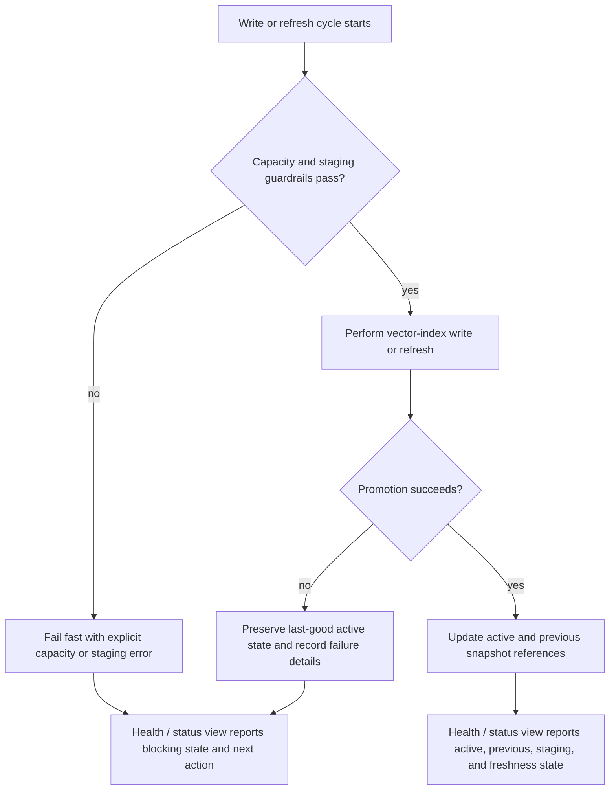

# Feature Specification: Vector DB Observability

## One-Line Purpose *(mandatory)*

Agents and maintainers observe vector-database health, freshness, capacity, and failure conditions clearly enough to detect and correct index problems before they block normal repo workflows.

## Consumer & Context *(mandatory)*

Codex and human maintainers consume this observability during local repository sessions where the vector index supports discovery, planning, and implementation workflows.

## User Scenarios & Testing *(mandatory)*

### User Story 1 - Detect unhealthy vector index state fast (Priority: P1)

A maintainer or agent can immediately tell whether the vector index is healthy, stale, capacity-constrained, or structurally broken without inspecting raw directories or guessing from secondary symptoms.

**Why this priority**: If index health is opaque, every downstream workflow degrades and failures are discovered only after they block work.

**Independent Test**: Simulate healthy, stale, low-disk, and staging-growth states and confirm a single supported health view reports the correct status, reason, and next action for each.

**Acceptance Scenarios**:

1. **Given** the vector index is healthy, **When** a maintainer checks its health view, **Then** they see an explicit healthy state with the active snapshot reference and no warning state.
2. **Given** the vector index is stale or structurally broken, **When** a maintainer checks its health view, **Then** they see the failing condition, the reason, and the specific next corrective action.
3. **Given** the index has abnormal staging growth or dangerously low free disk, **When** a maintainer checks its health view, **Then** they see that capacity risk called out as a first-class problem rather than as an indirect symptom.
4. **Given** `cgc` already exposes graph health checks, **When** a maintainer checks vector DB health, **Then** the vector DB follows the same general interaction pattern rather than inventing a separate ad hoc inspection workflow.

---

### User Story 2 - Surface actionable alerts before index growth becomes catastrophic (Priority: P2)

A maintainer receives clear warnings when staging snapshots, disk usage, or promotion behavior cross unsafe thresholds so the problem is caught long before the index consumes critical disk capacity.

**Why this priority**: Silent growth is what allowed the existing failure to reach a catastrophic state.

**Independent Test**: Drive staging-count and staging-size conditions above configured thresholds and confirm the system emits an actionable warning or failure with threshold values and current measurements.

**Acceptance Scenarios**:

1. **Given** staging count exceeds the configured warning threshold, **When** the vector index performs a write or refresh cycle, **Then** it emits a warning that includes current count, threshold, and staging root.
2. **Given** staging size exceeds the configured warning threshold, **When** the vector index performs a write or refresh cycle, **Then** it emits a warning that includes current bytes, threshold, and affected storage path.
3. **Given** free disk drops below the configured hard floor, **When** the vector index attempts a write or refresh, **Then** it fails fast with a clear capacity error before making the situation worse.
4. **Given** the repo already has dashboard and alert pathways for adjacent health signals, **When** vector DB warnings or failures occur, **Then** they travel through those same dashboard and alert pathways rather than through vector-only hidden logs.

---

### User Story 3 - Visualize index lifecycle and promotion state (Priority: P3)

A maintainer can inspect a concise dashboard status view that shows active snapshot, previous snapshot, staging population, and recent lifecycle actions without reading raw logs or scanning the filesystem.

**Why this priority**: Text warnings alone are insufficient for ongoing inspection, debugging, and trend tracking.

**Independent Test**: Perform normal build and incremental refresh flows, then confirm the supported status view exposes active, previous, and staging state accurately enough to explain what happened.

**Acceptance Scenarios**:

1. **Given** the vector index has completed one or more writes, **When** a maintainer opens the supported status view, **Then** they can see the active snapshot identity, the previous snapshot identity, and whether either one is missing or invalid.
2. **Given** the vector index has performed several refreshes, **When** a maintainer opens the supported status view, **Then** they can see staging count, staging size, and whether staging has been pruned.
3. **Given** a promotion or refresh failure occurs, **When** a maintainer opens the supported status view, **Then** they can see the last known failure condition and the state that was preserved.
4. **Given** `cgc` health is already surfaced in a dashboard or status pathway, **When** vector DB lifecycle state is visualized, **Then** it appears in the same shared view rather than in a separate one-off screen.

### Edge Cases

- The health/status view must still return a meaningful result if the vector index has never been built.
- The health/status view must still return a meaningful result if manifest files exist but referenced snapshot paths are missing.
- Alerts must not rely on broad directory inspection outside the configured vector-index root.
- A failed refresh must not hide the last-good active snapshot state.
- Warning and failure messages must remain actionable even when the underlying backend raises low-level storage or client errors.
- If `cgc` health lacks fields needed for vector DB parity, those shared health pathways must be extended rather than bypassed.

## Flowchart *(mandatory)*

## Data & State Preconditions *(mandatory)*

- A repo-local vector index root exists or can be initialized inside `.codegraphcontext/global/db/vector-index`.
- The vector index maintains an active snapshot concept and a staging area for new or refreshed data.
- The observability feature may rely on existing manifest and lifecycle metadata if present, but must still report meaningful status when those artifacts are absent or invalid.
- The last-good active snapshot must remain queryable or at least diagnosable after a failed refresh attempt.

## Inputs & Outputs *(mandatory)*

- **Inputs**
- Vector-index lifecycle state, including active snapshot reference, previous snapshot reference, staging contents, and capacity measurements.
- Guardrail thresholds for staging count, staging size, and minimum free space.
- Runtime failures emitted during vector-index build, refresh, or promotion flows.

- **Outputs**
- A supported health/status view for the vector DB lifecycle that follows the same general health pattern as `cgc`.
- Actionable warnings and hard-failure messages when thresholds are crossed.
- Visible reporting of active, previous, and staging state for maintainers and agents through the same dashboard and alert pathways used by related repo health surfaces.

## Constraints & Non-Goals *(mandatory)*

### Constraints

- The feature MUST observe the existing repo-local vector-index lifecycle rather than replacing the vector backend.
- The feature MUST preserve the last-good active snapshot when refresh or promotion fails.
- The feature MUST expose threshold values and measured values in warnings and failures.
- The feature MUST support both human-readable inspection and machine-consumable status output.
- The feature MUST remain useful in local agent sessions without requiring a separate external monitoring stack.
- The feature MUST be parallel to the established `cgc` health pattern wherever that pattern already exists.
- If `cgc` is missing health, visualization, or alert fields needed for parity, the shared `cgc` pathway MUST be extended to carry them rather than creating a vector-only side path.

### Non-Goals

- This feature does not redesign vector ranking or embedding quality.
- This feature does not change the primary purpose of codegraph health reporting beyond extending shared health surfaces for parity.
- This feature does not require a hosted metrics platform as the first release.
- This feature does not introduce unrelated indexing behavior changes beyond what is required for safe observability and promotion correctness.

## Requirements *(mandatory)*

### Functional Requirements

- **FR-001**: The system MUST expose a supported vector-index health/status view separate from raw filesystem inspection.
- **FR-002**: The system MUST report whether the vector index is healthy, stale, capacity-constrained, structurally invalid, or blocked by a failed lifecycle step.
- **FR-003**: The system MUST report the active snapshot reference and previous snapshot reference when available.
- **FR-004**: The system MUST report staging snapshot count and total staging size.
- **FR-005**: The system MUST emit actionable warnings when staging count or staging size crosses configured warning thresholds.
- **FR-006**: The system MUST fail fast before new writes when available disk space falls below the configured hard floor.
- **FR-007**: The system MUST record enough structured status data for other repo tools to consume the vector-index state programmatically.
- **FR-008**: The system MUST indicate whether the active snapshot reference is invalid, missing, or incorrectly pointed at non-promoted state.
- **FR-009**: The system MUST preserve and surface the last-good state when refresh or promotion fails.
- **FR-010**: The system MUST make the next corrective action explicit for each blocking or warning condition.
- **FR-011**: The system MUST surface vector DB health through the same shared health pattern used by `cgc`, not through a separate ad hoc inspection contract.
- **FR-012**: The system MUST place vector DB warnings and failures onto the same dashboard pathway used for related repo health signals.
- **FR-013**: The system MUST place vector DB warnings and failures onto the same alert pathway used for related repo health signals.
- **FR-014**: The system MUST extend the existing `cgc` health payload or shared health payload when additional vector-specific fields are needed for parity.
- **FR-015**: The system MUST clearly distinguish graph health from vector DB health while still presenting both through a shared top-level health experience.

### Key Entities *(include if feature involves data)*

- **Active Snapshot State**: The currently authoritative vector-index snapshot and its health metadata.
- **Previous Snapshot State**: The immediately prior last-known-good snapshot retained for diagnosis or rollback context.
- **Staging Snapshot Set**: The in-progress or orphaned snapshot directories created during writes and refreshes.
- **Vector Index Health Report**: The structured and human-readable representation of current lifecycle, capacity, and failure state.

## Success Criteria *(mandatory)*

### Measurable Outcomes

- **SC-001**: A maintainer can identify active snapshot state, staging count, blocking condition, and next action from one supported shared health surface in under 30 seconds.
- **SC-002**: Staging growth above configured thresholds produces a visible warning on the shared dashboard and alert pathway before disk free space drops into a blocking state.
- **SC-003**: A failed refresh or promotion leaves the last-good active snapshot intact and explicitly reported as preserved state.
- **SC-004**: The vector-index lifecycle no longer accumulates unbounded staging snapshots under normal repeated refresh usage.

## Definition of Done *(mandatory)*

In production-like local repo use, maintainers and agents can inspect one shared health experience aligned with `cgc` that shows vector DB active, previous, staging, freshness, and capacity state, and the system warns or fails through the shared dashboard and alert pathways before runaway staging growth can exhaust disk without preserving a last-good active snapshot.

## Open Questions *(include if any unresolved decisions exist)*

- None at this time.
