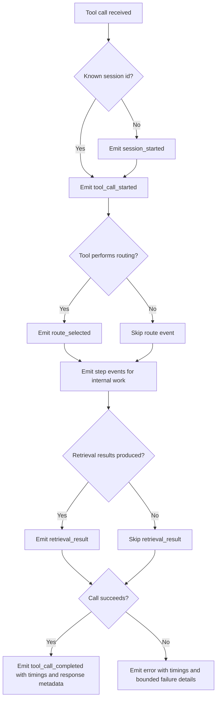

# Feature Specification: JSONL Observability for the Read-Code Daemon

**Feature Branch**: `033-jsonl-observability-read`
**Created**: 2026-05-21
**Status**: Draft
**Input**: User description: "JSONL observability for the read-code daemon, including dashboard-ready tracing of daemon lifecycle, transport child attach/warmup, long-running processes, route selection, retrieval timings, and OpenTelemetry-compatible trace metadata"

## One-Line Purpose *(mandatory)*

Operators inspect structured daemon traces to understand what the read-code system is doing, why it is slow or failing, and whether the persistent daemon or the session transport is responsible.

## Consumer & Context *(mandatory)*

This output is consumed by engineers and agents debugging read-code behavior from local daemon logs and later dashboard views during normal MCP-backed repository work.

## User Scenarios & Testing *(mandatory)*

### User Story 1 - Explain Active and Slow Calls (Priority: P1)

An operator needs to see when a read-code call started, which daemon handled it, which step it is currently in, and whether it is still running or completed slowly.

**Why this priority**: Without call lifecycle visibility, the team cannot tell whether the system is stuck, simply warming up, or legitimately doing expensive retrieval work.

**Independent Test**: Can be fully tested by invoking a traced read-code call and verifying that the emitted JSONL shows call start, step progression, elapsed timings, and terminal status for that single call.

**Acceptance Scenarios**:

1. **Given** a traced read-code tool call begins, **When** the daemon starts processing it, **Then** the trace log records a start event with stable session, trace, call, and daemon identity values.
2. **Given** a traced call takes multiple internal steps, **When** the daemon advances through routing and retrieval work, **Then** the trace log records step-level timing events that allow an operator to identify which step consumed the time.
3. **Given** a traced call completes successfully or fails, **When** processing ends, **Then** the trace log records one terminal event with total elapsed time, status, and bounded response metadata.

---

### User Story 2 - Distinguish Daemon Health from Session Transport Failure (Priority: P2)

An operator needs to tell whether a failed MCP interaction means the persistent daemon stopped working or only that the current session transport child was detached and had to be recreated.

**Why this priority**: Recent failures showed that `Transport closed` can happen while the daemon is still healthy, and that distinction is operationally important.

**Independent Test**: Can be fully tested by creating fresh traced sessions against a stable daemon and verifying that daemon identity remains stable while per-session trace metadata changes across attaches.

**Acceptance Scenarios**:

1. **Given** multiple traced tool calls are handled by the same daemon instance, **When** they are emitted to JSONL, **Then** the events expose stable daemon identity fields that let an operator group those calls under one persistent backend.
2. **Given** separate sessions attach to the daemon over time, **When** the events are reviewed, **Then** the operator can distinguish logical session and call identifiers from daemon identity without inferring from free-form logs.

---

### User Story 3 - Prepare Dashboard and OpenTelemetry Correlation (Priority: P3)

An engineer needs the trace stream to be structured enough that a future dashboard or OpenTelemetry adapter can visualize routes, retrieval stages, errors, and response capping without re-parsing raw text logs.

**Why this priority**: The team wants long-process visualization and later dashboarding, but this task should deliver the stable telemetry contract first.

**Independent Test**: Can be fully tested by emitting traces for representative read-code calls and verifying the JSONL contains normalized fields for route, timings, result counts, error status, and response capping.

**Acceptance Scenarios**:

1. **Given** a routed retrieval call such as `read_code_context`, **When** the daemon emits trace events, **Then** the route choice and bounded retrieval-result metadata appear as structured fields suitable for charting.
2. **Given** a traced response is capped or an error occurs, **When** the daemon returns the tool result, **Then** the emitted trace and the returned metadata both expose the cap or error state with trace identifiers that can be correlated later.

---

### Edge Cases

- What happens when trace writing fails because the log directory is unavailable or the file cannot be appended?
- How does the system handle tools that do not perform routing or retrieval but still need consistent trace metadata?
- What happens when the caller omits all trace metadata and the daemon must generate session, trace, and call identifiers?
- What happens when a long-running step never reaches a terminal success path because the tool raises an exception?

## Flowchart *(mandatory)*

## Data & State Preconditions *(mandatory)*

- The read-code daemon is running in a repository context with a resolvable project root.
- The daemon can determine or derive stable daemon identity data for the running backend process.
- The caller can invoke public MCP tools with or without optional trace metadata.
- The local environment permits append-only writes to the configured observability log directory when tracing is enabled.

## Inputs & Outputs *(mandatory)*

| Direction | Description | Format |
| :-- | :-- | :-- |
| Input | Public read-code and backend MCP tool calls, optionally including caller-supplied trace context and normal tool arguments | Caller-defined |
| Output | Tool responses augmented with trace metadata plus append-only JSONL trace events that describe lifecycle, timings, results, and errors | Caller-defined |

## Constraints & Non-Goals *(mandatory)*

**Must NOT**:
- Must NOT break existing read-code tool behavior when tracing is enabled or disabled.
- Must NOT require a dashboard, external collector, or OpenTelemetry backend to make the daemon observable.
- Must NOT emit uncapped full response bodies or unbounded internal logs into the trace stream.

**Adopted dependencies** *(include if feature uses external tools/packages to deliver capability)*:
- Existing read-code daemon and MCP tool surface — provides the runtime boundary that must emit and return trace metadata consistently.
- Existing local JSONL metadata pattern in `read_code.py` — provides precedent for append-only local inspection records that should remain compatible with the new observability contract.

**Out of scope** *(things this feature genuinely does not do, even via external tools)*:
- Building a UI dashboard in this feature.
- Shipping external OpenTelemetry export or collector infrastructure in this feature.
- Replacing the daemon's existing business logic, retrieval strategy, or transport architecture.

## Requirements *(mandatory)*

### Functional Requirements

- **FR-001**: The system MUST emit append-only JSONL trace events for every public read-code daemon tool call when tracing is enabled.
- **FR-002**: The system MUST use one stable event envelope across all emitted trace events, including schema version, event type, timestamp, session identifier, trace identifier, call identifier, repository identity, agent identity, and event payload.
- **FR-003**: The system MUST accept optional caller-provided trace metadata on every public daemon tool call and preserve provided session, trace, agent, and parent-call values while generating any missing identifiers.
- **FR-004**: The system MUST return trace metadata in every public daemon tool response so callers can correlate returned results with emitted trace events.
- **FR-005**: The system MUST emit lifecycle events that let an operator reconstruct when a logical session first appeared, when a tool call started, which internal steps ran, whether retrieval results were produced, and how the call terminated.
- **FR-006**: The system MUST emit bounded timing metadata for long-running internal work so operators can identify slow routing, vector search, reranking, codegraph expansion, lexical fallback, warmup, or rendering steps without parsing free-form logs.
- **FR-007**: The system MUST expose stable daemon identity data in trace payloads so operators can distinguish persistent backend reuse from per-session transport or call identifiers.
- **FR-008**: The system MUST represent route choice, retrieval-result summaries, response-size/capping state, and bounded error details as structured trace fields suitable for later dashboard visualization.
- **FR-009**: The system MUST continue operating normally if trace writing fails, emit a normal Python warning for the trace-write failure, and avoid surfacing that tracing failure as the tool-call error returned to the caller.
- **FR-010**: The system MUST support disabling tracing through configuration or environment without requiring callers to change their normal tool arguments.
- **FR-011**: The system MUST make the emitted trace schema compatible with future OpenTelemetry correlation by preserving stable end-to-end identifiers and normalized status/timing fields.

### Key Entities *(include if feature involves data)*

- **Trace Event**: One append-only JSONL record describing a lifecycle transition, internal step, retrieval result, or error for a daemon-handled tool call.
- **Trace Context**: The logical session, trace, call, parent-call, and agent identifiers that correlate one caller interaction with emitted events and returned metadata.
- **Daemon Identity**: The persistent backend process identity used to separate long-lived daemon reuse from disposable session transport children.
- **Retrieval Summary**: A bounded description of route choice, result counts, selected candidate data, and capping status that is safe to log and later visualize.

## Success Criteria *(mandatory)*

### Measurable Outcomes

- **SC-001**: Operators can determine from the JSONL trace stream alone whether a read-code call is currently running, completed successfully, or terminated with an error.
- **SC-002**: Operators can identify which internal step consumed the most time for a representative slow read-code call without inspecting free-form stderr logs.
- **SC-003**: Operators can distinguish stable daemon identity from logical session and call identifiers across repeated attaches to the same backend.
- **SC-004**: Every public daemon tool response carries correlation metadata that matches the identifiers written to the JSONL trace stream.

## Definition of Done *(mandatory)*

In production-like daemon use, every public read-code tool call emits correlatable JSONL lifecycle events and response metadata that let operators distinguish daemon reuse, session-level transport activity, slow internal steps, retrieval behavior, and bounded errors without needing a dashboard or external tracing backend.

## Open Questions *(include if any unresolved decisions exist)*

None.
