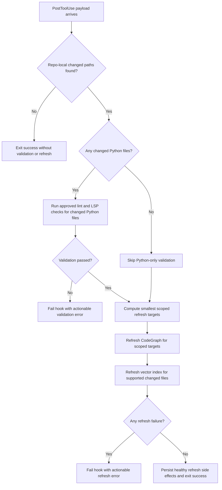

# Feature Specification: PostToolUse Edit Validation And Refresh

**Feature Branch**: `[034-post-tool-edit-validation-refresh]`
**Created**: 2026-07-07
**Status**: Draft
**Input**: User description: "add so a post tool use hook that when an edit happens, it forces a linter/lsp check and an appropriate scoped refresh for both vector and codegraph database"

## One-Line Purpose *(mandatory)*

<!--
  REQUIRED: Exactly one sentence. Subject = actor. Verb = behavior. Object = outcome.
  No implementation language. If it requires a second sentence, it is not done yet.
-->

The repository runtime validates edited files and refreshes only the affected read-code indexes so post-edit state stays trustworthy.

## Consumer & Context *(mandatory)*

<!--
  REQUIRED: Exactly one sentence identifying who or what receives the output and in what
  environment (browser session, API client, batch job, pipeline stage, etc.).
  This drives architecture decisions without prescribing them.
-->

Codex and human operators consume this behavior inside the local edit workflow after `Edit` or `Write` tool actions in this repository.

## User Scenarios & Testing *(mandatory)*

<!--
  IMPORTANT: User stories should be PRIORITIZED as user journeys ordered by importance.
  Each user story/journey must be INDEPENDENTLY TESTABLE - meaning if you implement just ONE of them,
  you should still have a viable MVP (Minimum Viable Product) that delivers value.
  
  Assign priorities (P1, P2, P3, etc.) to each story, where P1 is the most critical.
  Think of each story as a standalone slice of functionality that can be:
  - Developed independently
  - Tested independently
  - Deployed independently
  - Demonstrated to users independently
-->

### User Story 1 - Block stale post-edit state (Priority: P1)

As an operator editing repository files through Codex, I need every edit hook to run the required static checks and scoped index refreshes so I do not continue from stale diagnostics or stale read-code search state.

**Why this priority**: The repo relies on post-edit health to keep subsequent code reads, graph lookups, and validation decisions trustworthy.

**Independent Test**: Can be fully tested by simulating an edit-hook payload for changed files and verifying that lint/LSP checks and both refresh paths run only for the edited scope.

**Acceptance Scenarios**:

1. **Given** a post-edit hook payload that names a changed Python file, **When** the hook runs, **Then** it must execute the repository-approved lint and LSP checks for that file before reporting success.
2. **Given** a post-edit hook payload that names repo-local changed files, **When** the hook runs, **Then** it must refresh both CodeGraph and vector state only for the smallest affected repo-local scope.

---

### User Story 2 - Skip irrelevant checks without losing safety (Priority: P2)

As an operator editing mixed file types, I need the hook to skip checks that do not apply to the changed files while still running the required refreshes, so post-edit latency stays bounded without silently weakening validation.

**Why this priority**: The hook should stay fast enough for repeated edits while preserving the repo’s deterministic safety rules.

**Independent Test**: Can be tested by sending payloads for Python and non-Python files and asserting that only the relevant validation commands are dispatched.

**Acceptance Scenarios**:

1. **Given** a payload that contains only Markdown or shell edits, **When** the hook runs, **Then** it must skip Python-only validation steps and still refresh the applicable vector and codegraph scopes.

---

### User Story 3 - Surface actionable failures from the hook (Priority: P3)

As an operator investigating edit failures, I need the hook to stop the workflow with compact, actionable failure output when validation or refresh fails, so I can correct the changed files without guessing which guard failed.

**Why this priority**: Failure clarity matters after correctness and scoping are already in place.

**Independent Test**: Can be tested by forcing one validation step and one refresh step to fail and asserting that the hook exits non-zero with bounded failure messages.

**Acceptance Scenarios**:

1. **Given** a changed Python file with a lint, LSP, or refresh failure, **When** the hook runs, **Then** it must fail the post-edit action and report which step failed.

---

[Add more user stories as needed, each with an assigned priority]

### Edge Cases

<!--
  ACTION REQUIRED: The content in this section represents placeholders.
  Fill them out with the right edge cases.
-->

- What happens when the hook payload contains deleted paths or paths outside the repo root?
- How does the hook behave when only some refresh types apply to the changed files?
- How does the hook behave when validation succeeds but a scoped refresh fails?

## Flowchart *(mandatory)*

<!--
  REQUIRED: Generate a Mermaid flowchart covering the happy path and every decision branch.
  Rules:
  - Every branch must correspond to at least one acceptance scenario above
  - Every acceptance scenario must appear as at least one branch
  - No orphaned branches (branches with no corresponding acceptance scenario)
  - Use flowchart TD (top-down) direction
-->

## Data & State Preconditions *(mandatory)*

<!--
  REQUIRED: What data must exist and in what state before this feature can execute.
  Cover: required upstream records, session/auth state, consistency constraints.
  Do NOT describe how data is stored or retrieved — only what must be true.
-->

- The hook receives a JSON payload describing at least one changed path from an `Edit` or `Write` action.
- The changed paths resolve inside the active repository root before validation or refresh work is dispatched.
- The repo-local validation and refresh helper scripts are available in the current checkout.

## Inputs & Outputs *(mandatory)*

<!--
  REQUIRED: Two-row table only. Set Format to "Caller-defined" — do not specify
  field names, types, or transport layer. That is for the technical plan.
-->

| Direction | Description | Format |
| :-- | :-- | :-- |
| Input | Post-edit hook payload describing changed repository files and optional refresh controls | Caller-defined |
| Output | Hook success or compact failure output covering validation and refresh outcomes | Caller-defined |

## Constraints & Non-Goals *(mandatory)*

<!--
  REQUIRED: Up to three sub-sections.
  Must NOT = hard behavioral limits the implementation cannot violate.
  Adopted dependencies = external tools/packages that deliver part of the feature's capability.
    These are IN SCOPE — they require integration work (install, configure, verify, test, document).
    Do NOT list adopted dependencies under "Out of scope" — that erases them from tasks and testing.
  Out of scope = things this feature genuinely does NOT do, even via external tools.
-->

**Must NOT**:
- Must NOT run broad full-repo refreshes when a narrower changed-file scope is available.
- Must NOT silently report success when lint, LSP, or required refresh work fails.

**Adopted dependencies** *(include if feature uses external tools/packages to deliver capability)*:
- CodeGraphContext refresh helpers — provide scoped codegraph refresh for post-edit read-code accuracy.
- Vector index refresh helpers — provide scoped semantic refresh for changed supported files.
- Repository lint/LSP guards — provide approved lint and LSP validation commands for changed Python files.

**Out of scope** *(things this feature genuinely does not do, even via external tools)*:
- Full test-suite execution after every single edit.
- Multi-repository edit-hook orchestration.

## Requirements *(mandatory)*

<!--
  ACTION REQUIRED: The content in this section represents placeholders.
  Fill them out with the right functional requirements.
-->

### Functional Requirements

- **FR-001**: The PostToolUse edit hook MUST resolve changed repo-local paths from the tool payload before dispatching validation or refresh work.
- **FR-002**: The PostToolUse edit hook MUST run the repository-approved lint check for changed Python files.
- **FR-003**: The PostToolUse edit hook MUST run the repository-approved LSP or diagnostics check for changed Python files.
- **FR-004**: The PostToolUse edit hook MUST refresh CodeGraph for the smallest repo-local scope that covers the changed paths.
- **FR-005**: The PostToolUse edit hook MUST refresh the vector index only for changed files that the vector indexer can ingest.
- **FR-006**: The PostToolUse edit hook MUST skip validation or refresh sub-steps that do not apply to the changed files without widening scope.
- **FR-007**: The PostToolUse edit hook MUST exit non-zero and report bounded actionable errors when any required validation or refresh step fails.

### Key Entities *(include if feature involves data)*

- **PostToolUse payload**: The hook event input that identifies changed files and optional refresh controls.
- **Changed path set**: The normalized repo-local files derived from the payload and used to scope validation and refresh work.
- **Scoped refresh target**: The minimal CodeGraph or vector refresh boundary derived from the changed path set.

## Success Criteria *(mandatory)*

<!--
  ACTION REQUIRED: Define measurable success criteria.
  These must be technology-agnostic and measurable.
-->

### Measurable Outcomes

- **SC-001**: A post-edit payload for a changed Python file triggers both the approved lint check and the approved LSP check before success is reported.
- **SC-002**: A post-edit payload for changed repo-local files refreshes both CodeGraph and vector state without widening to a full-repo refresh when a narrower scope exists.
- **SC-003**: Failure in any required validation or refresh step causes the hook to exit non-zero with a bounded message naming the failed step.
- **SC-004**: Payloads containing non-Python files avoid Python-only validation work while still refreshing applicable index state.

## Definition of Done *(mandatory)*

<!--
  REQUIRED: Exactly one sentence. Describes the observable product-level state
  that means this is shipped in production — not just "ACs pass."
  Must reference production environment. Must reference any latency or quality
  threshold stated in the acceptance scenarios if one exists.
-->

In production use of this repository, every successful post-edit hook run has already completed the required scoped lint, LSP, CodeGraph, and vector refresh work for the edited files, and every failure stops the workflow with actionable output.

## Open Questions *(include if any unresolved decisions exist)*

<!--
  List unresolved decisions that would materially change the ACs if assumed wrong.
  Format: OQ-N: [Question] Stakes: [what goes wrong if assumed incorrectly]
  Do NOT answer OQs here — surface only.
-->
