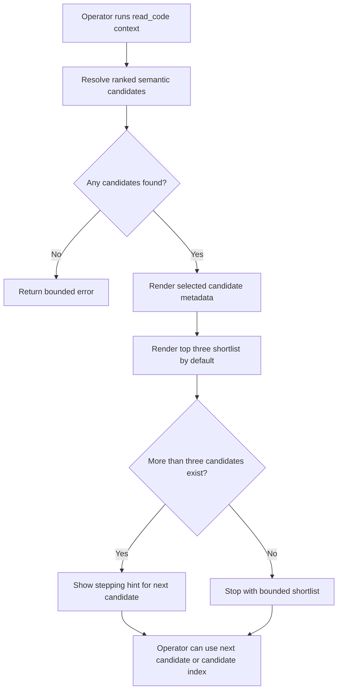

# Feature Specification: Read Code Context Top 3

**Feature Branch**: `[035-read-code-context-top3]`
**Created**: 2026-07-08
**Status**: Draft
**Input**: User description: "make read_code context return 3 items instead of 1 by default, and document that default plus the response payload in governance"

## One-Line Purpose *(mandatory)*

<!--
  REQUIRED: Exactly one sentence. Subject = actor. Verb = behavior. Object = outcome.
  No implementation language. If it requires a second sentence, it is not done yet.
-->

`read_code context` returns the selected semantic match plus the top three ranked candidates by default so operators can step through likely seams without rerunning discovery blind.

## Consumer & Context *(mandatory)*

<!--
  REQUIRED: Exactly one sentence identifying who or what receives the output and in what
  environment (browser session, API client, batch job, pipeline stage, etc.).
  This drives architecture decisions without prescribing them.
-->

Codex agents and human operators consume this output in local repo discovery flows where they need a bounded first response before deciding whether to step to another candidate.

## User Scenarios & Testing *(mandatory)*

<!--
  IMPORTANT: User stories should be PRIORITIZED as user journeys ordered by importance.
  Each user story/journey must be INDEPENDENTLY TESTABLE - meaning if you implement just ONE of them,
  you should still have a viable MVP (Minimum Viable Product) that delivers value.
  
  Assign priorities (P1, P2, P3, etc.) to each story, where P1 is the most critical.
  Think of each story as a standalone slice of functionality that can be:
  - Developed independently
  - Tested independently
  - Deployed independently
  - Demonstrated to users independently
-->

### User Story 1 - See Top Candidates Immediately (Priority: P1)

As an operator running `read_code context`, I want the initial response to include the selected match and nearby ranked candidates so I can inspect or step to the next seam without guessing whether another result exists.

**Why this priority**: The first read is where agents currently lose confidence and fall back to worse search behavior if they only see one candidate.

**Independent Test**: Run one context read with a ranked candidate list longer than three items and verify the default stdout includes the selected match metadata plus a three-item shortlist and stepping hint.

**Acceptance Scenarios**:

1. **Given** a context query with multiple ranked candidates, **When** the operator runs `read_code context` without shortlist flags, **Then** the response includes the selected candidate and the top three ranked candidates.
2. **Given** more than three ranked candidates, **When** the operator reads the default context response, **Then** the shortlist stays capped at three and includes a step-through hint for deeper candidates.

---

### User Story 2 - Preserve Stepping Workflow (Priority: P2)

As an operator stepping through ranked seams, I want the initial top-three payload to stay compatible with `--next-candidate` and `--candidate-index` so the shortlist does not replace the existing bounded exploration flow.

**Why this priority**: The output change only helps if it reinforces the existing sequential dig workflow instead of encouraging broad dumps.

**Independent Test**: Run one first context read and one `--next-candidate` read against the same session and verify the second read still selects the next candidate from scratchpad state.

**Acceptance Scenarios**:

1. **Given** a cached shortlist from an initial context read, **When** the operator reruns with `--next-candidate`, **Then** the next candidate is selected from the cached shortlist rather than recomputing a new candidate list.

---

### User Story 3 - Understand The Payload Contract (Priority: P3)

As an operator maintaining governance docs, I want the default context payload and shortlist shape described explicitly so tool consumers know what the first response contains.

**Why this priority**: The behavior should be predictable across agent runs and easy to audit when discovery flows change.

**Independent Test**: Read the governance document and confirm it describes the selected match block, the default top-three shortlist, and the bounded stepping hints.

**Acceptance Scenarios**:

1. **Given** the governance documentation, **When** an operator looks up `read_code_context` response behavior, **Then** the document states that the default response includes one selected match plus a three-item shortlist and names the key payload fields.

---

[Add more user stories as needed, each with an assigned priority]

### Edge Cases

<!--
  ACTION REQUIRED: The content in this section represents placeholders.
  Fill them out with the right edge cases.
-->

- What happens when fewer than three candidates exist?
- What happens when the selected candidate has no body and the operator still wants to step to another candidate?

## Flowchart *(mandatory)*

<!--
  REQUIRED: Generate a Mermaid flowchart covering the happy path and every decision branch.
  Rules:
  - Every branch must correspond to at least one acceptance scenario above
  - Every acceptance scenario must appear as at least one branch
  - No orphaned branches (branches with no corresponding acceptance scenario)
  - Use flowchart TD (top-down) direction
-->

## Data & State Preconditions *(mandatory)*

<!--
  REQUIRED: What data must exist and in what state before this feature can execute.
  Cover: required upstream records, session/auth state, consistency constraints.
  Do NOT describe how data is stored or retrieved — only what must be true.
-->

- The vector index and reranker-backed context resolution path must be available for the current repo state.
- The current session scratchpad must be able to retain the ranked candidate list when operators step to later candidates.

## Inputs & Outputs *(mandatory)*

<!--
  REQUIRED: Two-row table only. Set Format to "Caller-defined" — do not specify
  field names, types, or transport layer. That is for the technical plan.
-->

| Direction | Description | Format |
| :-- | :-- | :-- |
| Input | A context query, optional file path scope, and optional stepping flags for ranked candidate selection. | Caller-defined |
| Output | A bounded response containing one selected match block and a default top-three shortlist for the same ranked candidate set. | Caller-defined |

## Constraints & Non-Goals *(mandatory)*

<!--
  REQUIRED: Up to three sub-sections.
  Must NOT = hard behavioral limits the implementation cannot violate.
  Adopted dependencies = external tools/packages that deliver part of the feature's capability.
    These are IN SCOPE — they require integration work (install, configure, verify, test, document).
    Do NOT list adopted dependencies under "Out of scope" — that erases them from tasks and testing.
  Out of scope = things this feature genuinely does NOT do, even via external tools.
-->

**Must NOT**:
- Must NOT dump the full ranked candidate set in the default response.
- Must NOT break `--next-candidate`, `--candidate-index`, or `--inline-body` flows.

**Adopted dependencies** *(include if feature uses external tools/packages to deliver capability)*:
- CodeGraphContext and the local reranker-backed vector index — provide the ranked semantic candidates that feed the selected match and shortlist output.

**Out of scope** *(things this feature genuinely does not do, even via external tools)*:
- Changing the ranking algorithm or candidate ordering itself.
- Returning more than three shortlist rows by default.

## Requirements *(mandatory)*

<!--
  ACTION REQUIRED: The content in this section represents placeholders.
  Fill them out with the right functional requirements.
-->

### Functional Requirements

- **FR-001**: `read_code context` MUST include the selected semantic match in the default response exactly as it does today.
- **FR-002**: `read_code context` MUST include a ranked shortlist in the default response without requiring an explicit shortlist flag.
- **FR-003**: The default shortlist MUST be capped at three candidates.
- **FR-004**: When additional candidates exist beyond the default shortlist, the response MUST include a stepping hint directing the operator to `--next-candidate` or `--candidate-index`.
- **FR-005**: Governance documentation MUST describe the default context payload shape, including the selected match block and shortlist fields.

### Key Entities *(include if feature involves data)*

- **Selected match block**: The primary context payload for the chosen candidate, including file path, signature, optional docstring, similarity score, and exploration hints.
- **Shortlist row**: One ranked candidate summary containing similarity, file path, unit id, line span, symbol type, body/docstring presence, and raw score.

## Success Criteria *(mandatory)*

<!--
  ACTION REQUIRED: Define measurable success criteria.
  These must be technology-agnostic and measurable.
-->

### Measurable Outcomes

- **SC-001**: A default `read_code context` response with at least three candidates shows exactly one selected match block and exactly three shortlist rows.
- **SC-002**: A default `read_code context` response with fewer than three candidates shows all available shortlist rows without error.
- **SC-003**: The documented governance contract matches the live default payload fields emitted by the implementation.

## Definition of Done *(mandatory)*

<!--
  REQUIRED: Exactly one sentence. Describes the observable product-level state
  that means this is shipped in production — not just "ACs pass."
  Must reference production environment. Must reference any latency or quality
  threshold stated in the acceptance scenarios if one exists.
-->

In production, default `read_code context` calls return one selected match plus a bounded top-three shortlist and the governance docs describe that payload well enough for operators to use stepping without trial and error.

## Open Questions *(include if any unresolved decisions exist)*

<!--
  List unresolved decisions that would materially change the ACs if assumed wrong.
  Format: OQ-N: [Question] Stakes: [what goes wrong if assumed incorrectly]
  Do NOT answer OQs here — surface only.
-->

- **OQ-1**: Should the explicit `--show-shortlist` flag remain accepted even though shortlist output becomes the default? Stakes: Removing it would change existing operator habits and scripts.
