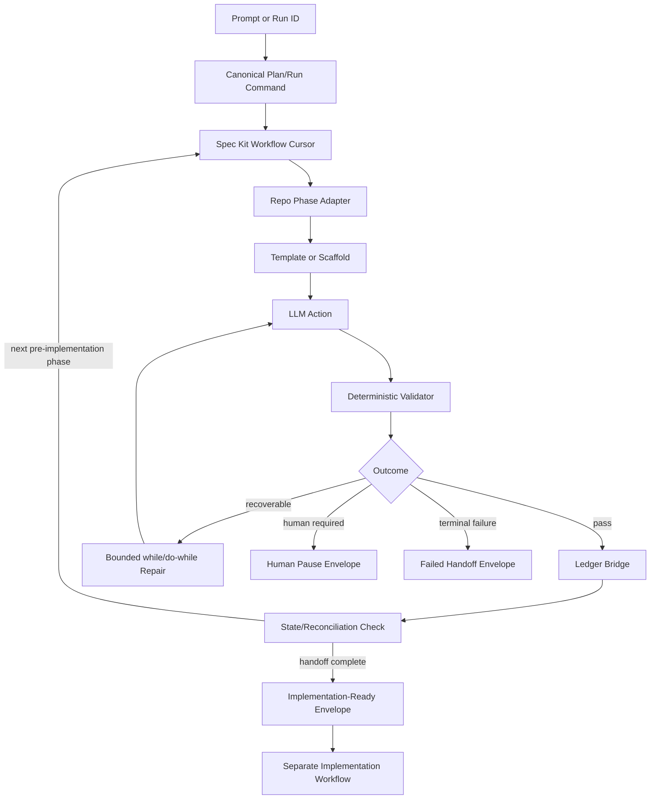

# Combined Plan - 039-autonomous-spec-pipeline-upgrade

_Feature: `039-autonomous-spec-pipeline-upgrade`_
_Source Spec: `spec.md`_
_Artifact: `plan.md`_

[This template documents every section the combined `speckit.plan` step may keep. `scripts/speckit_plan_step.py` prunes unused sections after triage so the emitted `plan.md` contains only the sections required by strategy.]

## Triage

- duplicate: false
- t_shirt_size: xl
- risk_level: high
- reason: Feature 023 is a prerequisite and baseline, not a duplicate; this feature upgrades the engine and makes autonomous pre-implementation continuation, pause, resume, and implementation-ready handoff executable.

## Strategy Contract

```json
{
  "domains": {
    "reasoning": {
      "build pipeline": "The feature changes command orchestration, manifest ownership, generated artifacts, and the pre-implementation handoff route.",
      "code patterns": "The workflow must preserve Python-owned adapters, bounded command contracts, and existing repo helper patterns rather than embedding behavior in ad hoc prompts.",
      "environment": "Pinned Spec Kit CLI, project scaffolding, Codex integration paths, and clean-checkout reproduction depend on explicit environment and install contracts.",
      "observability": "Status, diagnostics, rehydration envelopes, stderr/stdout contracts, and artifact pointers are core behavior rather than optional logging.",
      "ops governance": "Ledger authority, human pause policy, approval boundaries, branch/cwd inference, and implementation handoff are governance-owned decisions.",
      "resilience": "Crash recovery, idempotent replay, loop exhaustion, leases, rollback, and resume compatibility determine whether the workflow is safe to run unattended.",
      "security": "Upstream shell runs without a capability sandbox, so allowlisting, input validation, redaction, permission classes, and protected-effect boundaries are first-class.",
      "testing": "The feature requires live engine verification, fault injection, clean-checkout rehearsal, contract tests, and clear separation between fake-only and live tests."
    },
    "relevant": [
      "build pipeline",
      "code patterns",
      "environment",
      "observability",
      "ops governance",
      "resilience",
      "security",
      "testing"
    ]
  },
  "risk": {
    "external_dependency_uncertainty": "high",
    "human_operator_dependency": "medium",
    "overall": "high",
    "repo_uncertainty": "high",
    "requirement_clarity": "medium",
    "runtime_side_effect_risk": "high",
    "state_data_migration_risk": "high"
  },
  "strategy": {
    "architecture_diagram": true,
    "architecture_strategy": true,
    "expanded_design_notes": true,
    "external_research": true,
    "net_new_surface": true,
    "strategy_reason": "The feature adds a net-new operator-facing workflow surface and spans upstream Spec Kit capabilities, repo adapters, ledgers, manifests, leases, human gates, and handoff state. Risk is high because command routing, shell safety, state recovery, upgrade reproduction, and live verification all need explicit ownership before implementation."
  },
  "triage": {
    "duplicate": false,
    "duplicate_matches": [
      "023-deterministic-phase-orchestration"
    ],
    "duplicate_reason": "Feature 023 is a prerequisite and baseline, not a duplicate; this feature upgrades the engine and makes autonomous pre-implementation continuation, pause, resume, and implementation-ready handoff executable.",
    "risk_level": "high",
    "tshirt_size": "xl"
  }
}
```

## Internal Discovery

### Term: specification

- matches: true
- exit_code: 0
- files:
  - `/Users/andreborczuk/app-foundation/src/mcp_clickup/artifact_parser.py`

stderr:
```text
[07/10/26 12:07:21] INFO     Processing request of type            server.py:727
                             CallToolRequest                                    
                    INFO     Processing request of type            server.py:727
                             ListToolsRequest                                   
                    INFO     Processing request of type            server.py:727
                             CallToolRequest                                    
                    INFO     vector-index: embedding 1 texts in    chroma.py:580
                             batches of 1                                       
                    INFO     vector-index: embedded 1/1 texts in   chroma.py:586
                             0.00s                                              
                    INFO     vector-index: embedding backend       chroma.py:592
                             returned 1 vectors in 0.01s                        
[07/10/26 12:07:22] INFO     Processing request of type            server.py:727
                             CallToolRequest                                    

Loading weights:   0%|          | 0/393 [00:00<?, ?it/s]
Loading weights: 100%|██████████| 393/393 [00:00<00:00, 9617.27it/s]
```

### Term: autonomous

- matches: true
- exit_code: 0
- files:
  - `/Users/andreborczuk/app-foundation/tests/unit/test_speckit_end_to_end_doc.py`

stderr:
```text
[07/10/26 12:07:21] INFO     Processing request of type            server.py:727
                             CallToolRequest                                    
                    INFO     Processing request of type            server.py:727
                             ListToolsRequest                                   
                    INFO     Processing request of type            server.py:727
                             CallToolRequest                                    
                    INFO     vector-index: embedding 1 texts in    chroma.py:580
                             batches of 1                                       
                    INFO     vector-index: embedded 1/1 texts in   chroma.py:586
                             0.00s                                              
                    INFO     vector-index: embedding backend       chroma.py:592
                             returned 1 vectors in 0.01s                        
[07/10/26 12:07:22] INFO     Processing request of type            server.py:727
                             CallToolRequest                                    

Loading weights:   0%|          | 0/393 [00:00<?, ?it/s]
Loading weights: 100%|██████████| 393/393 [00:00<00:00, 9278.96it/s]
```

### Term: resumable

- matches: true
- exit_code: 0
- files:
  - `/Users/andreborczuk/app-foundation/scripts/speckit_codex_handoff_runner.py`

stderr:
```text
[07/10/26 12:07:21] INFO     Processing request of type            server.py:727
                             CallToolRequest                                    
                    INFO     Processing request of type            server.py:727
                             ListToolsRequest                                   
                    INFO     Processing request of type            server.py:727
                             CallToolRequest                                    
                    INFO     vector-index: embedding 1 texts in    chroma.py:580
                             batches of 1                                       
                    INFO     vector-index: embedded 1/1 texts in   chroma.py:586
                             0.01s                                              
                    INFO     vector-index: embedding backend       chroma.py:592
                             returned 1 vectors in 0.01s                        
[07/10/26 12:07:22] INFO     Processing request of type            server.py:727
                             CallToolRequest                                    

Loading weights:   0%|          | 0/393 [00:00<?, ?it/s]
Loading weights: 100%|██████████| 393/393 [00:00<00:00, 8071.34it/s]
```

### Term: spec

- matches: true
- exit_code: 0
- files:
  - `/Users/andreborczuk/app-foundation/tests/unit/test_speckit_plan_gate_routing.py`

stderr:
```text
[07/10/26 12:07:21] INFO     Processing request of type            server.py:727
                             CallToolRequest                                    
                    INFO     Processing request of type            server.py:727
                             ListToolsRequest                                   
                    INFO     Processing request of type            server.py:727
                             CallToolRequest                                    
                    INFO     vector-index: embedding 1 texts in    chroma.py:580
                             batches of 1                                       
                    INFO     vector-index: embedded 1/1 texts in   chroma.py:586
                             0.00s                                              
                    INFO     vector-index: embedding backend       chroma.py:592
                             returned 1 vectors in 0.01s                        
[07/10/26 12:07:22] INFO     Processing request of type            server.py:727
                             CallToolRequest                                    

Loading weights:   0%|          | 0/393 [00:00<?, ?it/s]
Loading weights: 100%|██████████| 393/393 [00:00<00:00, 8902.65it/s]
```

### Term: pipeline

- matches: true
- exit_code: 0
- files:
  - `/Users/andreborczuk/app-foundation/scripts/e2e/e2e_002_watchlist_research.sh`

stderr:
```text
[07/10/26 12:07:21] INFO     Processing request of type            server.py:727
                             CallToolRequest                                    
                    INFO     Processing request of type            server.py:727
                             ListToolsRequest                                   
                    INFO     Processing request of type            server.py:727
                             CallToolRequest                                    
                    INFO     vector-index: embedding 1 texts in    chroma.py:580
                             batches of 1                                       
                    INFO     vector-index: embedded 1/1 texts in   chroma.py:586
                             0.00s                                              
                    INFO     vector-index: embedding backend       chroma.py:592
                             returned 1 vectors in 0.01s                        
[07/10/26 12:07:22] INFO     Processing request of type            server.py:727
                             CallToolRequest                                    

Loading weights:   0%|          | 0/393 [00:00<?, ?it/s]
Loading weights: 100%|██████████| 393/393 [00:00<00:00, 8614.11it/s]
```

## Relevant Domains

### build pipeline
- Why it matters: The feature changes command orchestration, manifest ownership, generated artifacts, and the pre-implementation handoff route.
- Required checklist prompts:
  - [ ] Are builds reproducible with pinned dependencies and tool versions?
  - [ ] Are artifacts immutable and traceable to commit SHA + build ID?
  - [ ] Is the same artifact promoted across environments (no env-specific builds)?
  - [ ] Are dependency/vulnerability scans run for release builds (and results reviewed/blocked as needed)?
  - [ ] Is an SBOM/provenance artifact produced for production releases (where applicable)?
  - [ ] Are deploy permissions/approvals defined for production-impacting releases, and is the deploy actor attributable?
  - [ ] Are infrastructure/deployment config changes versioned and reviewed as code (where applicable)?
  - [ ] Is rollback documented and tested?
  - [ ] Are schema migrations safe with rollout sequencing (old+new compatibility / expand-contract) or explicitly coordinated?
  - [ ] Is there a post-deploy verification step (smoke/health checks)?
  - [ ] If E2E verification exists for critical flows, is it automated and executed as a release gate (not manual-only)?
  - [ ] Are rollback triggers defined (what signals cause rollback)?
  - [ ] Is a monitoring window defined (what signals, how long) before declaring success?
  - [ ] If change is high-risk, is progressive delivery used (canary/gradual rollout) or explicitly justified if not?

### code patterns
- Why it matters: The workflow must preserve Python-owned adapters, bounded command contracts, and existing repo helper patterns rather than embedding behavior in ad hoc prompts.
- Required checklist prompts:
  - [ ] Does every new public symbol have its signature (not just a comment) defined in the sketch before the task is implemented?
  - [ ] Are all new modules placed in the correct layer (domain, service, or adapter)? No cross-layer placement?
  - [ ] Does any single function in the sketch exceed 40 lines? If yes, split into smaller sub-tasks first.
  - [ ] Are there any circular imports introduced by this sketch?
  - [ ] Is any business logic (conditionals, decision-making) present in an adapter or file-IO layer? (prohibited)
  - [ ] Is any external IO (database, API, file system) called from domain or service layers? (prohibited)
  - [ ] Do all public functions have complete type hints (parameters and return type)?
  - [ ] Do all service-layer functions return typed objects, not raw dicts or tuples?
  - [ ] Are state transitions explicit and confined to named operations?
  - [ ] Are side effects isolated from decision logic?
  - [ ] Are public failure modes represented with meaningful typed errors/results?
  - [ ] Are public symbols documented (docstrings with inputs/outputs/errors and examples where non-trivial)?
  - [ ] Is formatting/lint enforcement configured as a gate (not advisory)?
  - [ ] Are error-handling conventions consistent within a module boundary (or explicitly documented if mixed)?

### environment
- Why it matters: Pinned Spec Kit CLI, project scaffolding, Codex integration paths, and clean-checkout reproduction depend on explicit environment and install contracts.
- Required checklist prompts:
  - [ ] Are all secrets loaded from the environment (not files)?
  - [ ] Are setting defaults safe for local-only development?
  - [ ] Is `config.yaml` or equivalent versioned without secrets?
  - [ ] Does startup fail on missing/invalid required configuration?
  - [ ] Is config precedence documented and deterministic?
  - [ ] Are secrets sourced from environment variables (or secret provider) and never logged?
  - [ ] Are defaults safe and environment-appropriate?
  - [ ] Do feature flags have an owner and expiry?
  - [ ] Is production behavior controlled via explicit config (not hardcoded forks)?
  - [ ] Do critical secrets/tokens have an owner and rotation expectations (cadence/trigger)?
  - [ ] Is there a safe, non-secret config fingerprint/version visible at runtime for drift detection?
  - [ ] Are old/rotated secrets revoked or invalidated where applicable?

### observability
- Why it matters: Status, diagnostics, rehydration envelopes, stderr/stdout contracts, and artifact pointers are core behavior rather than optional logging.
- Required checklist prompts:
  - [ ] Does the application emit its `run_id` on startup?
  - [ ] Is logging structured (JSON/JSONL)?
  - [ ] Do logs include enough context to diagnose a silent failure?
  - [ ] Do logs include run_id/request_id/operation_id for correlation?
  - [ ] Are key business events emitted as structured events (where applicable)?
  - [ ] Are alerts actionable and linked to a runbook/response?
  - [ ] Can stalls/missing signals be detected?
  - [ ] Do long-running build/index/embed/write paths emit stage markers, batch counts, and completion timing?
  - [ ] Are default success logs concise, with full command/path detail emitted only in explicit verbose mode?
  - [ ] Are secrets and sensitive values redacted?
  - [ ] Can critical flows be reconstructed from logs/metrics?
  - [ ] Do critical paths emit latency + error rate + throughput metrics?
  - [ ] Are saturation signals emitted for constrained resources (queues, DB locks, worker pools) where applicable?
  - [ ] Are log/metric retention windows explicit and access controlled?

### ops governance
- Why it matters: Ledger authority, human pause policy, approval boundaries, branch/cwd inference, and implementation handoff are governance-owned decisions.
- Required checklist prompts:
  - [ ] Does a complete specification (WHAT) exist before implementation?
  - [ ] Has a reuse-first approach been seriously evaluated?
  - [ ] Is versioned documentation included with the feature?
  - [ ] Is there an Architecture Flow diagram for the change?
  - [ ] Is component ownership clear?
  - [ ] Are runbooks present/updated for critical operations?
  - [ ] Is incident response/on-call responsibility defined for critical systems?
  - [ ] Are escalation and communication paths defined (where applicable)?
  - [ ] Is there an ADR (or equivalent) for major architectural decisions?
  - [ ] Are learnings fed back into specs/tests/checklists?
  - [ ] Are any rule exceptions documented with rationale and expiry?

### resilience
- Why it matters: Crash recovery, idempotent replay, loop exhaustion, leases, rollback, and resume compatibility determine whether the workflow is safe to run unattended.
- Required checklist prompts:
  - [ ] Does the system fail gracefully?
  - [ ] Is there clear observability for failure points?
  - [ ] Are retry mechanisms in place for non-critical transient errors?
  - [ ] Does ambiguous state block side effects?
  - [ ] Are degraded modes explicitly defined?
  - [ ] Are dependency exhaustion scenarios handled (timeouts, rate limits, saturation)?
  - [ ] Are retry storms prevented (bounded retries, backoff, circuit breaker)?
  - [ ] Are recovery steps documented and testable?
  - [ ] Are partial-write scenarios prevented (transactions/idempotency) during failure?
  - [ ] Is there a safe manual intervention/runbook path for stuck states?
  - [ ] Are RTO/RPO expectations stated for critical flows/state?
  - [ ] For each critical dependency, is fallback behavior explicitly defined (fail closed/open/degraded/block)?
  - [ ] Are recovery steps validated in a deterministic test or procedural drill?

### security
- Why it matters: Upstream shell runs without a capability sandbox, so allowlisting, input validation, redaction, permission classes, and protected-effect boundaries are first-class.
- Required checklist prompts:
  - [ ] Does this pull a secret/token from an environment variable (not code, logs, or committed files)?
  - [ ] Is input validation applied to all untrusted data?
  - [ ] Do all inbound webhook endpoints require authentication (no unauthenticated triggers), and are required secrets/tokens sourced from environment variables (not code or logs)?
  - [ ] Does the error message hide internal system secrets and internals?
  - [ ] Are token scopes/IAM permissions explicitly justified (least privilege)?
  - [ ] Are dependencies scanned for known vulnerabilities where applicable?
  - [ ] For new trust boundaries/integrations/privileged capabilities, was a threat model performed and documented?
  - [ ] Are threat mitigations reflected in tests/checklists (not only in prose)?

### testing
- Why it matters: The feature requires live engine verification, fault injection, clean-checkout rehearsal, contract tests, and clear separation between fake-only and live tests.
- Required checklist prompts:
  - [ ] Does a deterministic pass/fail oracle exist for this?
  - [ ] If yes, is it implemented as an automated gate (not manual confirmation)?
  - [ ] Are E2E tests run on real infrastructure where critical paths require it (not mocks)?
  - [ ] Is TDD methodology used (test written first) or explicitly justified if not?
  - [ ] Are tests deterministic (no timing races / hidden randomness / external nondeterminism)?
  - [ ] Are flaky tests tracked with an owner and expiry if temporarily quarantined?
  - [ ] Does every bug fix include a regression test targeting the bug class?
  - [ ] Are state transitions (including retries/duplicates/out-of-order) tested where applicable?
  - [ ] Is there at least one reality-check integration test for critical paths?
  - [ ] Are any gate waivers documented with rationale and expiry?
  - [ ] If E2E gates exist, is the E2E environment production-like or are differences explicitly documented?
  - [ ] Are fixtures/test accounts representative of real edge cases and permission models?

## Summary

Upgrade the repository from the current old Specify/Spec Kit surface to a pinned Spec Kit `v0.12.9` workflow model that autonomously advances pre-implementation phases from prompt to implementation-ready handoff. The plan keeps upstream workflow state as the durable cursor while preserving repository authority for ledgers, phase validation, human decisions, shell safety, and handoff reconciliation.

Implementation should proceed as a staged migration rather than a forced refresh: first inventory and pin upstream/project state, then build repo-owned workflow adapters and safety contracts, then add durable resume/reconciliation, and finally prove the complete prompt-to-handoff path with live engine, fault, security, and clean-checkout verification. The terminal boundary is a governed handoff envelope for a separate implementation workflow, not implementation execution.

## Internal Research

- Feature 023 is the baseline for deterministic phase orchestration, validate-before-emit, idempotency, and ledger authority. This feature extends that baseline with durable upstream workflow state, bounded repair loops, human pauses, and implementation-ready handoff.
- `scripts/pipeline_driver.py` currently resolves one phase and exits with `next_phase`; it should become a repo-owned phase adapter/event bridge beneath the upstream cursor, or be replaced by an equivalently single-owned boundary.
- `scripts/speckit_specify_step.py` currently scaffolds a spec and exits; the new flow must fill and validate the generated artifact before emitting success.
- `command-manifest.yaml` contains deterministic, generative, and legacy route ownership. The plan must consolidate command ownership before enabling routes so direct reruns cannot bypass workflow gates.
- Existing pipeline/task ledgers remain authoritative and must be accessed only through script-owned interfaces. Upstream workflow logs and state are telemetry/cursor evidence, not completion proof.
- Feature locks and runtime result helpers exist but are not yet a complete production lease/result layout for prompt-to-handoff orchestration.
- The generic runner has implementation-specific side effects that are out of scope for this workflow; the new pre-implementation runner contract must prohibit implicit staging, commit, push, deploy, publication, or implementation start.

## External Research

- Pin to GitHub Spec Kit `v0.12.9`; do not float to `main` or `latest` without a reviewed spec amendment.
- Use upstream workflow `command`, `prompt`, `shell`, `gate`, `if`, `switch`, `while`, and `do-while` steps, but wrap `shell` in repo-owned allowlisted Python adapters because upstream shell execution runs with user privileges and no capability sandbox.
- Use upstream status/resume behavior for the durable workflow cursor, while treating repository ledgers as the only phase/task completion authority.
- Treat nested pause/failure resume as replay-prone: nested workflow bodies and repository side effects must be idempotent because parent boundaries may rerun.
- Require deterministic post-loop assertions because reaching a loop cap does not itself prove success or failure.
- Use upstream machine-readable version/capability output and supported customization seams such as presets, custom steps, or bundles to preserve repo customizations without hand-editing upstream core.
- Account for updated Codex integration paths and invocation conventions, because this repository currently uses `.codex/skills` wrappers and retained `.claude/commands`.

## Architecture Strategy

Use a layered orchestration model with one upstream workflow cursor and narrow repository adapters:

- Upstream Spec Kit workflow owns run identity, step cursor, status, resume, structured control flow, and pause mechanics.
- Repository phase adapters own artifact generation, validation, result shaping, event requests, and handoff construction.
- Ledger bridge owns idempotent append/reconciliation through existing pipeline/task ledger scripts only.
- Command adapter owns safe `shell` invocation by translating workflow shell steps into reviewed Python executable/argv contracts with validated inputs, output caps, redaction, timeouts, and permission classes.
- Human policy adapter owns reason-code classification, pause-before-effect rules, resume input validation, and authority checks.
- Lease adapter owns single-flight feature ownership across start, continuation, pause, resume, expiry, and crash recovery.
- Handoff adapter produces one compact implementation-ready envelope with pointers to full artifacts and diagnostics for the separate implementation workflow.

The migration should preserve old behavior until each route has a live-tested equivalent. Enable routes only after their manifest ownership, workflow step, validator, ledger event, result path, and handoff evidence are all reconciled.

## Architecture Diagram



## Expanded Design Notes

- Capability and migration preflight must run before mutation, capture the current CLI/project/customization inventory, verify the pinned upstream version and feature set, and produce deterministic remediation when incompatible.
- Every workflow step that can mutate files, ledgers, or runtime state must declare identity, inputs, output, validator, effect scope, timeout, and idempotency key before execution.
- Repair loops must consume the latest persisted validator/task output, not stale prior loop values, and must end in a deterministic assertion that classifies success, recoverable retry, human pause, or terminal failure.
- Rehydration must not require chat history or direct JSONL inspection. One status call must return identity, phase/attempt, last validated event, pending reason, permitted action, version compatibility, lease state, and artifact pointers.
- Reconciliation must compare workflow state, pipeline ledger, task/planning evidence, runtime results, manifest route, versions, artifacts, and lease before any effectful boundary. Drift blocks execution and returns one non-mutating next action.
- Human pauses must be durable and must happen before dependent mutation or external effect. Resume input must be typed, correlated, authorized, fresh, scoped, and secret-safe.
- Upgrade/reproduction must be staged: inventory, isolated rehearsal, clean checkout reproduction, compatibility proof for active runs, and deterministic rollback without modifying ledger history or feature artifacts.
- The final output of this workflow is an implementation-ready handoff envelope. It must not run implementation tasks, close tasks, stage/commit/push implementation changes, publish, deploy, merge, or contact external systems.

## Design Slices

### Slice PL-01 - Pin and Rehearse Spec Kit Upgrade
- Estimate: high
- Implementation Directive: Build the non-mutating capability and migration preflight for pinned Spec Kit `v0.12.9`, including current CLI/project/customization inventory, isolated checkout rehearsal, clean-checkout reproduction proof, version/capability JSON validation, and rollback plan that preserves feature artifacts and ledger history.

### Slice PL-02 - Define Workflow Ownership and Manifest Routing
- Estimate: high
- Implementation Directive: Convert the command manifest and retained command/skill surfaces into one validated integration-neutral source for pre-implementation lifecycle ownership, route status, workflow step mapping, script adapter, timeout, permission class, artifact, validator, event, version, and provenance.

### Slice PL-03 - Build Safe Command and Shell Adapter Contract
- Estimate: high
- Implementation Directive: Implement the repo-owned deterministic command adapter behind upstream `shell` steps with fixed executable/argv contracts, validated inputs, root cwd, timeouts, output caps, redaction, structured JSON stdout, stderr diagnostics, permission classes, and pre-process rejection for any unreviewed effective command.

### Slice PL-04 - Implement Pre-Implementation Phase Workflow Adapters
- Estimate: high
- Implementation Directive: Wire prompt-to-handoff phases so each generative phase declares template/scaffold, output, mutation scope, runner, validator, diagnostics, success event, and side-effect contract, and ensure scaffold-only or failed generated artifacts cannot emit phase success.

### Slice PL-05 - Add Loop, Outcome, and Human Pause Policy
- Estimate: high
- Implementation Directive: Add structured outcome classification, bounded `while`/`do-while` repair/convergence loops, post-loop assertions, human reason-code policy, pause-before-effect behavior, and typed resume input validation for all protected decisions.

### Slice PL-06 - Add Durable Resume, Reconciliation, Lease, and Handoff Envelope
- Estimate: high
- Implementation Directive: Correlate workflow state, ledgers, runtime results, artifacts, manifest, versions, attempts, actor, and lease; enforce idempotent replay and drift blocking; and emit one compact implementation-ready handoff envelope for the separate implementation workflow.

### Slice PL-07 - Prove Live Prompt-to-Handoff Safety
- Estimate: high
- Implementation Directive: Add deterministic unit/contract tests plus live pinned-engine verification, fault injection, security fixtures, clean-checkout rehearsal, rollback proof, and fake-only test labeling so prompt-to-handoff behavior is proven without starting implementation.

## Plan Completion Summary

Selected the broader high-risk plan path because the feature is non-duplicate, net-new operator-facing workflow surface area, and depends on external Spec Kit workflow behavior plus repository ledger, shell, lease, resume, and handoff contracts. The selected sections are sufficient for tasking because the plan identifies ownership boundaries, risk domains, external dependency assumptions, architecture flow, replay and handoff rules, and seven concrete slices that can become implementation tasks without starting implementation in this workflow.

Next phase should create tasks for the seven design slices, preserving the terminal boundary at implementation-ready handoff and keeping implementation execution in a separate downstream workflow.
