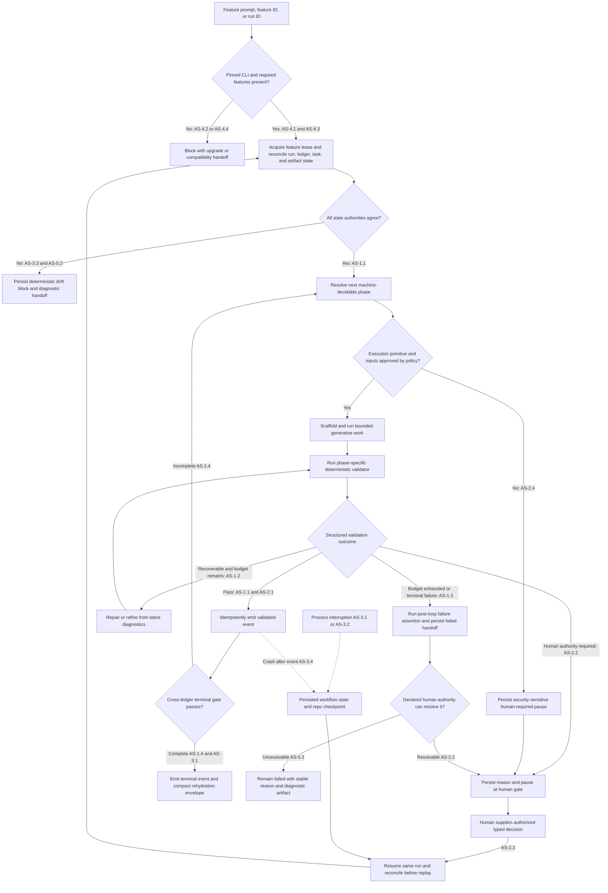

# Feature Specification: Autonomous Resumable Spec Pipeline Upgrade

**Feature Branch**: `039-autonomous-spec-pipeline-upgrade`  
**Created**: 2026-07-09  
**Status**: Draft
**Input**: User description: "Upgrade this repository from its current Spec Kit version to the newest upstream version and design an autonomous, resumable spec pipeline. The pipeline starts from a feature prompt, deterministically scaffolds every phase, runs generative work against governed templates, applies deterministic checks, emits durable phase and task events, and lets a future agent rehydrate and continue after interruption or failure. Investigate and incorporate upstream shell-command support, while-loop support, and any other current Spec Kit features that materially help the pipeline continue autonomously until a decision or condition genuinely requires human intervention. Specify the upstream capabilities needed and every required update to the repository's current commands, scripts, templates, gates, ledgers, state-machine contracts, runtime documentation, tests, and migration path. Do not implement the upgrade in this feature specification."

## One-Line Purpose *(mandatory)*

Repository operators start one governed feature workflow that advances autonomously through validated Spec Kit phases, pauses only for classified human decisions, and can be resumed by a future agent without losing or duplicating work.

## Consumer & Context *(mandatory)*

Human owners and Codex agents consume the workflow's artifacts and run status during repository-local feature delivery from prompt through verified closeout.

## Current and Upstream Baseline

This feature is a migration and completion delta to the existing deterministic phase-orchestration contract in [feature 023](../023-deterministic-phase-orchestration/spec.md), not a replacement for its validate-before-emit, idempotency, and ledger-authority guarantees.

### Verified Upstream Capability Baseline

- The locally installed Specify CLI reports version `0.1.13`, an unknown template version, and no `workflow` command as of 2026-07-09.
- The implementation target is the immutable [`v0.12.9` release](https://github.com/github/spec-kit/releases/tag/v0.12.9), verified as the newest stable release on 2026-07-09; a later release requires an explicit reviewed spec amendment instead of floating to `main` or `latest`.
- The workflow engine first shipped in [`v0.7.0`](https://github.com/github/spec-kit/releases/tag/v0.7.0), but that minimum is unacceptable because [`v0.8.13`](https://github.com/github/spec-kit/releases/tag/v0.8.13) fixed stale `while`/`do-while` condition output and later releases hardened structured workflow output and validation.
- The current [workflow reference](https://github.github.com/spec-kit/reference/workflows.html) provides `command`, `prompt`, `shell`, `gate`, `if`, `switch`, `while`, `do-while`, `fan-out`, and `fan-in` steps plus durable status and resume behavior.
- A `shell` step runs with the user's privileges and no capability sandbox, so this repository requires a stricter repo-owned allowlist and input policy than upstream supplies.
- A pause or failure inside nested control flow can rerun the top-level parent and nested body on resume, so every nested mutation and event write must be idempotent.
- Reaching a loop's maximum iteration count does not itself prove failure or success, so every loop requires a deterministic post-loop assertion.
- [`specify version --features --json`](https://github.github.com/spec-kit/reference/core.html) provides a machine-readable capability preflight, while explicit project and feature targeting avoids unattended branch/cwd inference.
- [Presets](https://github.github.com/spec-kit/reference/presets.html), custom workflow step types, and [bundles](https://github.github.com/spec-kit/reference/bundles.html) can preserve, version, and reinstall this repository's custom commands, templates, scripts, workflow, and governance outside upstream-managed core files.
- The current [Codex integration](https://github.github.com/spec-kit/reference/integrations.html) installs skills under `.agents/skills` and uses hyphenated invocation, so the repository's `.codex/skills` wrappers and `.claude/commands` ownership require an explicit compatibility migration.

### Repository Gap Inventory

| Area | Current baseline | Required migration outcome |
| :-- | :-- | :-- |
| Pipeline vision | `docs/governance/phase-execution.md` and feature 023 already define `orchestrate -> extract -> scaffold -> LLM Action -> validate -> emit/handoff` | Preserve that contract while making continuation, pause, resume, and terminal behavior executable end to end |
| Canonical trigger | `.codex/skills/speckit-run/SKILL.md` invokes `scripts/pipeline_driver.py` and `.claude/commands/speckit.run.md` describes the trigger | Start or resume one durable upstream workflow run without creating a competing orchestration owner |
| Driver | `scripts/pipeline_driver.py` resolves and executes one phase, reports `next_phase`, and exits | Make it the repo-owned phase adapter/event bridge beneath the upstream cursor, or provide an equivalently single-owned boundary |
| New-feature bootstrap | `scripts/speckit_specify_step.py` scaffolds and exits; its fill/validation path is unwired | Execute prompt-to-complete-spec generation and validation, with no success event after scaffold-only or failed work |
| Phase routes | `command-manifest.yaml` contains deterministic, generative, and many `legacy` routes | Register every production phase, remove ambiguous canonical fallbacks, and retain direct reruns only under the same gates |
| Manifest provenance | Top-level version is `1.1.8` while nested manifest version is `1.1.9`, and validation reports only the outer value | Establish one authoritative schema/version/provenance contract and validate mirrors, routes, workflow references, and events together |
| Generative handoff | Phase packages are incomplete or divergent and the generic runner has implementation-specific commit behavior | Give every generative phase a bounded artifact contract and prohibit undeclared staging, commit, or wider mutation |
| Validation | Phase-specific gates exist while the generic artifact check mostly proves file presence/marker shape | Make phase-specific deterministic gates authoritative and expose bounded structured workflow results |
| Command execution | The driver currently uses argv-based subprocess execution without a shell | Preserve that safer argv/allowlist boundary behind any upstream `shell` step |
| Looping | No production loop executes successive phases or bounded repair/convergence cycles | Add explicit phase continuation, artifact repair, task execution, and implementation convergence loops with post-loop assertions |
| Human decisions | One implement breakpoint uses a hardcoded scope token | Define reason codes, required authority, pause semantics, and resume inputs for all human-owned decisions |
| Rehydration | State derives the last successful phase and failure sidecars are not a canonical cursor/checkpoint | Correlate run state, ledgers, artifacts, attempts, and diagnostics so another agent resumes the exact safe boundary |
| Ledgers | Pipeline/task ledgers are success-oriented and lack a shared run/attempt/checkpoint contract | Preserve their authority while adding correlated attempt, pause, resume, failure, and terminal evidence |
| Runtime results | Manifest-advertised paths and phase helper paths disagree | Publish one canonical bounded result/checkpoint layout with full artifacts behind compact pointers |
| Concurrency | Feature lock functions exist but production orchestration does not acquire them | Enforce a renewable single-flight feature lease across run, pause, resume, and crash recovery |
| Agent integration | Canonical procedure lives in Claude command files and Codex wrappers load it indirectly | Establish one integration-neutral source, render supported Codex skills, and test retained compatibility surfaces |
| Implementation ownership | Manifest, command guidance, and governance docs disagree about deterministic versus command-agent ownership | Select and enforce one owner for orchestration, generation, validation, commit, QA, and closeout |
| Feature/task closure | Feature and task ledgers can report divergent completion state | Require cross-ledger terminal reconciliation before workflow completion |
| Documentation | Runtime, operator, and command guidance describe overlapping pipeline generations | Update the governance map, runbook, command contracts, source-of-truth map, and runtime policy from one tested model |
| Verification | Tests cover one-step routing, approvals, locks, and idempotent events, often through fakes | Add contract, fault-injection, security, clean-install, and live Spec Kit/Codex workflow verification |

## User Scenarios & Testing *(mandatory)*

### User Story 1 - Autonomous Validated Progression (Priority: P1)

An operator provides a feature prompt once and the workflow completes every machine-decidable phase, including bounded repair and implementation convergence, without asking for approval merely because a phase boundary was reached.

**Why this priority**: The primary value is reliable end-to-end continuation rather than another command that only reports the next manual step.

**Independent Test**: Run a fixture feature with deterministic generators and validators from prompt to terminal closeout and confirm automatic advancement, validated-only events, and no false loop success.

**Acceptance Scenarios**:

1. **AS-1.1 — Given** a valid feature prompt, compatible pinned toolchain, and no human-required outcome, **When** the canonical workflow starts, **Then** it scaffolds, generates, validates, emits, and hands off each phase automatically until the terminal gate passes.
2. **AS-1.2 — Given** a validator reports a structured recoverable failure, **When** repair budget remains, **Then** the workflow reruns only the bounded repair/generation and validation cycle using the latest output without emitting completion for the failed attempt.
3. **AS-1.3 — Given** a loop reaches its iteration or retry budget while validation still fails, **When** the post-loop assertion runs, **Then** the workflow cannot fall through as successful and persists a failed or human-required handoff with no completion event.
4. **AS-1.4 — Given** implementation has started and deterministic completion checks still find registered work, **When** convergence runs, **Then** the workflow continues implement, verify, closeout, and convergence until cross-ledger gates prove no governed work remains.

---

### User Story 2 - Human Intervention Only When Required (Priority: P2)

The human owner receives a pause only when a structured outcome requires product authority, governance approval, sensitive permission, external authorization, or a decision after safe autonomous recovery is exhausted.

**Why this priority**: Autonomy is useful only if it preserves non-delegable owner decisions and prevents unsafe side effects.

**Independent Test**: Exercise every intervention reason and representative recoverable failures, confirming that only policy-classified outcomes pause and that no forbidden action runs before approval.

**Acceptance Scenarios**:

1. **AS-2.1 — Given** a phase passes deterministic gates and has no human reason, **When** it completes, **Then** the workflow advances without a generic approval gate.
2. **AS-2.2 — Given** material clarification, mandated approval, a sensitive/destructive operation, external side effect, or exhausted recovery requires owner authority, **When** policy classifies it, **Then** the workflow records a durable reason and pauses before dependent mutation.
3. **AS-2.3 — Given** a paused run and authorized typed response, **When** the owner resumes the same run, **Then** the workflow validates the response, reconciles state, reruns the blocked safe boundary, and continues without replaying committed effects.
4. **AS-2.4 — Given** a workflow requests an unapproved command, interpolates untrusted executable input, escapes the project root, or lacks permission, **When** execution is evaluated, **Then** it is blocked before process creation and routed to an actionable security handoff.

---

### User Story 3 - Exact Safe Rehydration (Priority: P3)

A future agent can inspect one compact run envelope and resume from a persisted safe boundary after interruption, failure, or human pause.

**Why this priority**: Durable continuation distinguishes an autonomous workflow from a long interactive session that loses its place.

**Independent Test**: Terminate selected top-level and nested boundaries, start a fresh agent process, and prove the same outcome as an uninterrupted control run.

**Acceptance Scenarios**:

1. **AS-3.1 — Given** the process stops between top-level steps, **When** a future agent requests status and resumes by run ID, **Then** it receives feature, phase, attempt, last validated event, next action, artifact pointers, and reason codes without manual ledger inspection.
2. **AS-3.2 — Given** the process stops or pauses inside nested control flow, **When** upstream resume reruns the parent boundary, **Then** nested file changes and ledger writes are idempotent and the latest iteration output controls the next condition.
3. **AS-3.3 — Given** run state, artifacts, pipeline ledger, and task ledger disagree, **When** reconciliation runs, **Then** execution blocks with explicit drift reasons rather than choosing silently or emitting completion.
4. **AS-3.4 — Given** an event committed immediately before a crash but the workflow cursor did not advance, **When** the run resumes, **Then** the idempotency key recognizes the prior commit and advances without duplication.

---

### User Story 4 - Safe, Reproducible Upgrade (Priority: P4)

Repository maintainers can upgrade the old Spec Kit installation and project scaffolding without losing customized governance or making future upstream updates unreviewable.

**Why this priority**: The features are unavailable locally, while a blind forced refresh would overwrite the commands, scripts, and templates that enforce repository process.

**Independent Test**: Rehearse in an isolated checkout, produce a semantic migration report, install the packaged customization in a clean checkout, and verify rollback/preservation before production changes.

**Acceptance Scenarios**:

1. **AS-4.1 — Given** an inventory and immutable backup, **When** the pinned CLI and project files are staged, **Then** maintainers receive a bounded semantic comparison of additions, preserved behavior, intentional replacements, and conflicts before production application.
2. **AS-4.2 — Given** the CLI, schema, integration, or features do not match the approved pin, **When** preflight runs, **Then** it blocks before mutation with exact remediation and detected-version evidence.
3. **AS-4.3 — Given** a clean checkout with declared configuration, **When** the versioned customization package and workflow are installed, **Then** the approved commands, templates, gates, and lifecycle are reproduced without hand-editing upstream core.
4. **AS-4.4 — Given** nonterminal workflow runs, **When** an engine, workflow, preset, extension, or bundle upgrade is requested, **Then** it is blocked or proven resume-compatible before active runs migrate.

---

### User Story 5 - Auditable Operations (Priority: P5)

Operators and automation receive stable machine-readable outcomes and bounded diagnostics for every transition without exposing secrets or requiring direct JSONL inspection.

**Why this priority**: Autonomous recovery and human handoff both depend on safe, unambiguous evidence.

**Independent Test**: Run success, recoverable failure, human pause, terminal failure, resume, and completion and validate envelopes, correlation, channels, redaction, and pointers.

**Acceptance Scenarios**:

1. **AS-5.1 — Given** any transition, **When** JSON output is requested, **Then** stdout contains one parseable result while progress and bounded diagnostics use stderr or referenced artifacts.
2. **AS-5.2 — Given** a state conflict or invalid checkpoint, **When** status is requested, **Then** the result names each conflicting authority, one non-mutating recovery action, and the full diagnostic path.
3. **AS-5.3 — Given** a failure no declared human authority or automatic policy can resolve, **When** terminal classification runs, **Then** the workflow remains failed with a stable reason and retrieval path rather than looping, pausing ambiguously, or claiming completion.

### Edge Cases

- Validator nonzero exits with valid JSON, malformed JSON, excessive output, no output, or timeout.
- A final loop iteration produces a valid artifact but the condition still reflects stale output.
- Loop-cap fall-through would otherwise execute the next top-level step.
- Nested replay repeats a file mutation, commit, task transition, or event.
- Process death occurs after validation but before append, or after append but before cursor persistence.
- An active run's workflow differs from the installed workflow, CLI, preset, extension, integration, or manifest.
- A human edits an artifact while paused and invalidates stored validation.
- Two agents start/resume the same feature, or a lease expires during a human pause.
- A helper reports success but its phase-specific gate fails.
- Feature and task ledgers disagree about terminal state.
- Branch/cwd inference selects the wrong project or feature.
- Codex integration is absent, stale, or renders different command names.
- Executable input contains traversal, unsafe interpolation, shell metacharacters, secret expansion, or a disallowed executable.
- A runner, code-intelligence backend, validator, or other dependency is temporarily unavailable.
- Persisted state is missing, corrupt, partially written, or points to changed artifacts.
- Forced upstream refresh would overwrite constitution, AGENTS, command, template, script, or user-local configuration.

## Flowchart *(mandatory)*

Every decision branch is tied to an acceptance scenario on the edge; the interruption path covers top-level and nested resume behavior.

## Data & State Preconditions *(mandatory)*

- Approved release tag, source commit, workflow schema, customization versions, and expected capabilities are recorded immutably.
- Project root and feature directory are selected explicitly and resolve inside the authorized repository.
- Command manifest, workflow, customization manifests, and integration state are readable, compatible, and validated.
- Pipeline and task ledgers pass script-owned validators; agents never inspect or mutate ledger JSONL directly.
- Existing Spec Kit infrastructure and customizations have a reproducible inventory, hashes, backup, rollback, and ownership classification.
- A run has one feature ID, run ID, correlation ID, attempt ID, workflow version, and lease owner.
- Templates, scaffolds, helpers, validators, agent runner, and live verification backend are ready or return classified unavailability.
- Each executable primitive has a fixed allowlisted argv, validated inputs, root confinement, timeout, output cap, and permission class.
- Human reasons identify the required authority and a typed resume input without embedding secrets.
- Nonterminal runs retain their executable workflow and compatible runtime until completion, abort, or separately validated migration.

## Inputs & Outputs *(mandatory)*

| Direction | Description | Format |
| :-- | :-- | :-- |
| Input | A feature prompt, existing feature ID, or workflow run ID plus explicit project context and any authorized decision supplied at a pause | Caller-defined |
| Output | Governed artifacts, validated ledger events, durable checkpoint state, and a compact success, pause, failure, or completion envelope with next safe action | Caller-defined |

## Constraints & Non-Goals *(mandatory)*

**Must NOT**:
- Must NOT treat upstream state or `log.jsonl` as phase/task completion proof or a replacement for repository ledgers.
- Must NOT emit success/terminal events before phase-specific and cross-ledger deterministic gates pass.
- Must NOT treat loop exhaustion, `continue_on_error`, agent self-assessment, file existence, or a generic exit as terminal success.
- Must NOT present a human gate solely for crossing a normal phase boundary; each pause requires a stable policy reason and authority.
- Must NOT bypass constitution-mandated review or current human-owned approval without a separate approved governance change.
- Must NOT run arbitrary shell text, unreviewed workflows, dynamic executables, or untrusted interpolated command fragments.
- Must NOT add Bash implementation scripts; repo-owned executable behavior remains Python with required function documentation.
- Must NOT duplicate events, files, commits, tasks, or external effects during replay.
- Must NOT infer unattended project, feature, or run identity from ambiguous cwd/branch state.
- Must NOT blindly overwrite customized Spec Kit, constitution, AGENTS, agent-command, template, script, or user-local configuration.
- Must NOT alter a nonterminal run's engine/workflow without proven resume compatibility.
- Must NOT let a generic runner stage, commit, push, merge, deploy, or contact external systems outside the active authorized contract.

**Adopted dependencies**:

- GitHub Spec Kit `v0.12.9` — pinned workflow engine, Codex integration, feature reporting, run/resume/status, structured output, control flow, presets, custom steps, and bundles.
- Workflow `command`/`prompt` steps — dispatch bounded generation against repo-owned contracts.
- Workflow `shell` with structured JSON output — invokes only reviewed deterministic Python adapters.
- Workflow `while`/`do-while`, `if`/`switch`, and `gate` — implement bounded repair/convergence and classified human pauses.
- Persisted workflow state and JSON outcomes — own execution cursor/rehydration while remaining subordinate to governance ledgers.
- Repo pipeline driver, manifest, phase helpers, validators, locks, runtime results, and ledgers — remain the domain contract and are adapted.
- A versioned project-local preset/extension/bundle or equivalent supported seam — owns customization provenance and clean-install reproduction.

**Out of scope**:

- Performing the upgrade or implementing the workflow during this specification phase.
- Replacing existing artifact, task, HUD, QA, or acceptance semantics except to clarify compatibility/ownership.
- Selecting or replacing the external model/provider.
- Enabling parallel writes before file-disjoint work, leases, and ledger ordering have separate live proof.
- Automatically approving intent, constitution changes, credentials, destructive operations, publication, merges, or deployments.
- Building a general workflow engine outside upstream extension points.

## Requirements *(mandatory)*

### Functional Requirements

- **FR-001**: System MUST pin release, source provenance, workflow schema, integration, and customization versions; moving targets MUST NOT be production baselines.
- **FR-002**: System MUST run a non-mutating, machine-readable capability and upgrade preflight before artifact or ledger mutation; the preflight MUST separate CLI upgrade from project-infrastructure migration, use an immutable inventory, classify repo customizations, and rehearse in an isolated checkout.
- **FR-003**: System MUST provide deterministic rollback and clean-install reproduction without modifying feature artifacts or ledger history; repo customizations MUST be packaged on an upstream-supported seam rather than hand-editing core.
- **FR-004**: One canonical command MUST accept a prompt, feature ID, or run ID; use explicit validated project-root and feature-directory inputs; and choose start, continue, status, or resume without competing orchestration owners.
- **FR-005**: The upstream workflow engine MUST own the durable cursor while repo adapters own domain gates, artifact validation, ledger emission, and repository invariants.
- **FR-006**: System MUST execute `orchestrate -> extract -> scaffold -> LLM Action -> validate -> emit/handoff` for every production phase.
- **FR-007**: System MUST complete and validate generated artifacts before emitting phase success; scaffold-only, failed fill, loop exhaustion, malformed output, or unchecked file existence MUST NOT advance a phase.
- **FR-008**: Every generative phase MUST declare inputs, template or scaffold, output, mutation scope, runner, validator, timeout, diagnostics, success event, and allowed side effects.
- **FR-009**: Deterministic gates MUST be authoritative for success and MUST return structured outcomes containing pass/fail, recoverability, human classification, reason codes, attempt, evidence, and diagnostic pointer.
- **FR-010**: Deterministic command execution MUST use fixed allowlisted executable/argv shapes, validated inputs, root cwd, timeout, output cap, redaction, permission class, and pre-process rejection for any effective `shell` execution that differs from the reviewed command contract.
- **FR-011**: Control-flow command output MUST be structured JSON; empty, malformed, oversized, timed-out, invalid, or nonconforming output MUST fail deterministically.
- **FR-012**: Intermediate failure MAY continue only when explicitly recoverable and a later deterministic assertion still owns terminal success.
- **FR-013**: Declared repair and convergence MUST use upstream `while` or `do-while` with latest persisted validator or task output, finite budgets, deterministic conditions, idempotent bodies, classified exhaustion, and post-loop assertions.
- **FR-014**: Validated machine-decidable phases MUST continue automatically without generic phase-start approval.
- **FR-015**: Terminal implementation MUST continue registered task execution, verification, closeout, convergence, and cross-ledger proof until no governed work remains or a classified stop occurs.
- **FR-016**: Outcomes MUST be classified with stable reason codes as pass, recoverable retry, human pause, transient dependency failure, terminal machine failure, or completed.
- **FR-017**: A versioned human-intervention policy MUST associate each human reason with authority, required information, allowed choices, resume input, prohibited effects, and coverage for material ambiguity, mandated approval, sensitive access, destructive work, external effects, drift, exhausted recovery, and decisions lacking a machine owner.
- **FR-018**: Ambiguous existing approval events MUST remain human-controlled until a separate approved governance change says otherwise.
- **FR-019**: A human-required outcome MUST persist before pause; no dependent mutation or external effect may occur until authorized resume; resumed input MUST be validated for authority, choice, type, scope, freshness, and correlation without exposing secrets.
- **FR-020**: Run state, inputs, logs, and workflow snapshots MUST correlate feature or task, workflow version, run, correlation, attempt, actor, and active engine/workflow compatibility.
- **FR-021**: Pipeline ledger MUST remain phase-completion authority, task ledger task authority, and workflow state cursor or telemetry authority only; all ledger access MUST use script-owned interfaces and MUST NOT inspect or edit ledger JSONL directly.
- **FR-022**: Ledger and manifest contracts MUST expose correlated attempts, pauses, resumes, failures, checkpoints, terminal outcomes, reasons, and idempotency keys without weakening existing transitions.
- **FR-023**: Start, resume, and each effectful boundary MUST reconcile workflow state, both ledgers, runtime results, artifacts, manifest, versions, and lease; reconciliation MUST block rather than guess and return every drift reason plus one non-mutating next action.
- **FR-024**: Every replayable effect MUST be idempotent using persisted run, feature or task, phase, attempt, and effect identity; nested-parent replay MUST be safe for generation, validation, event recording, task transitions, and checkpoints.
- **FR-025**: Production orchestration MUST acquire, renew, release, and recover a single-flight feature lease, including defined behavior during human pause.
- **FR-026**: System MUST return one compact rehydration envelope with identity, status, phase or task attempt, last event, pending reason, permitted action, next step, versions, lease, and diagnostic pointers.
- **FR-027**: Machine JSON mode MUST emit one stdout object, route progress and diagnostics to stderr, persist full output behind artifact paths, redact secrets, cap output, wrap external errors, and document retention without deleting authoritative evidence.
- **FR-028**: The command manifest and any mirrors MUST become one validated, integration-neutral source for ownership, route, workflow step, script, timeout, permission, artifact, validator, event, version, and provenance across Codex skills, retained Claude commands, manifests, workflows, scripts, command agents, subagents, QA, commit/closeout, and docs.
- **FR-029**: Every canonical lifecycle phase MUST resolve non-legacy; direct reruns MUST NOT advance out of order, bypass workflow gates or events, or let a generic runner exceed declared mutation and side-effect scope by staging, committing, pushing, merging, deploying, publishing, or contacting external systems outside the active authorized contract.
- **FR-030**: Migration MUST update the affected driver, state, contracts, phase helpers, gates, ledgers, locks, result layout, manifest, commands and skills, templates, architecture catalog where applicable, runtime governance docs, and related operator diagnostics.
- **FR-031**: Verification MUST include deterministic unit and contract coverage for schema, conditions, budgets, assertions, reason routing, allowlisting, path and output validation, reconciliation, idempotency, leases, manifest consistency, rollback, and runtime documentation contracts.
- **FR-032**: Integration, fault, clean-checkout, and upgrade-rehearsal tests MUST use the pinned live engine and a live supported runner or backend; fake-only tests MUST be labeled contract or simulation; tests MUST prove prompt-to-terminal behavior, preservation, reproducibility, pinning, rollback, safe fresh-process resume, and no duplicate transitions around validation, append, cursor persistence, task closeout, loop iteration, and human pause.
- **FR-033**: Fan-out, fan-in, and parallel writes MUST remain disabled until separate live proof covers disjoint files, concurrency, leases, and ledger ordering.

### Key Entities

- **Workflow Definition**: Versioned pipeline declaration of capabilities, integration, inputs, steps, budgets, conditions, gates, and provenance.
- **Workflow Run**: Durable instance with run and feature identity, workflow snapshot, versions, status, cursor, inputs, and log.
- **Phase Attempt**: Replay-safe generation or validation attempt with declared effects.
- **Validation Outcome**: Deterministic pass or fail, recoverability, human reason, evidence, and diagnostics.
- **Human Intervention Request**: Durable pause naming decision, authority, choices, resume input, and prohibited effects.
- **Rehydration Envelope**: Compact status sufficient for a new agent's next safe action.
- **Event Bridge Record**: Correlation and idempotency evidence connecting workflow transition to ledger effect.
- **Feature Lease**: Single-flight ownership across start, continuation, pause, resume, expiry, and recovery.
- **Upgrade Baseline**: Immutable old CLI, project, and customization inventory with hashes and rollback.
- **Customization Package**: Versioned supported package that reproduces repo-owned behavior.

## Success Criteria *(mandatory)*

### Measurable Outcomes

- **SC-001**: A no-human fixture advances through 100% of machine-decidable phases after one start request with zero generic phase-boundary prompts.
- **SC-002**: 100% of completion events follow required gates, and zero are emitted for failed validation, loop exhaustion, invalid output, or drift.
- **SC-003**: Every recoverable fixture converges within budget or exits through explicit failure or human assertion; no cap falls through as success.
- **SC-004**: Fault injection resumes to the uninterrupted control state with zero duplicate events, task transitions, commits, or corruption.
- **SC-005**: 100% of human outcomes pause before protected effects while all ordinary successful and recoverable outcomes continue unattended.
- **SC-006**: A fresh agent gets complete next-action context from one status request and resumes without direct JSONL inspection or chat reconstruction.
- **SC-007**: A clean checkout reproduces commands, templates, workflow, gates, and integration from pins with zero manual core edits.
- **SC-008**: Staged upgrade preserves 100% of repo-owned and user-local customization, feature artifacts, and ledger history and restores the old baseline deterministically.
- **SC-009**: 100% of canonical phases resolve non-legacy with one orchestration owner and one result contract.
- **SC-010**: Live engine and runner verification passes prompt bootstrap, command validation, bounded repair, pause and resume, crash recovery, convergence, and terminal reconciliation.
- **SC-011**: Security tests execute zero unapproved commands and detect 100% of traversal, interpolation, cwd, executable, secret, output, and timeout fixtures.
- **SC-012**: Every transition exposes one parseable envelope correlated to run, feature, attempt, ledger evidence, and full diagnostic path.

## Definition of Done *(mandatory)*

The pinned Spec Kit workflow runs in the production repository from one prompt or run ID through terminal governed closeout, continuing every machine-decidable phase without generic approvals, pausing before every protected effect, and allowing a fresh agent to resume from one compact status envelope with no duplicate ledger, task, artifact, or external effect.
