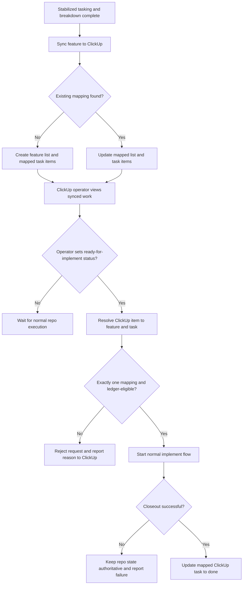

# Feature Specification: Composio ClickUp Trigger Sync

**Feature Branch**: `048-composio-clickup-trigger-sync`
**Created**: 2026-07-12
**Status**: Draft
**Input**: User description: "Use Composio as the ClickUp transport layer while keeping tasks.md and the task ledger as the source of truth. After stabilized tasking/breakdown, sync the spec and stabilized tasks into ClickUp. Support ClickUp-triggered implement starts only through repo-side ledger gating. On successful implement closeout, update the mapped ClickUp task to done. Include task-level acceptance criteria, user story tags, parallel tags, and estimates in the ClickUp representation."

## One-Line Purpose *(mandatory)*

The speckit pipeline publishes stabilized feature and task contracts to ClickUp and accepts gated ClickUp start requests so operators can coordinate work without moving source-of-truth out of the repository.

## Consumer & Context *(mandatory)*

Repository operators and speckit implement orchestration consume the synced ClickUp list/task view and dedicated ClickUp ready-for-implement status changes during tasking stabilization and task closeout in the local repository workflow.

## User Scenarios & Testing *(mandatory)*

### User Story 1 - Sync stabilized feature work to ClickUp (Priority: P1)

After solution tasking has stabilized, the operator needs the feature to appear in ClickUp as a list with enough spec and task context to understand the work without rereading the repo.

**Why this priority**: Without a correct ClickUp projection after stabilization, ClickUp cannot serve as an operator surface or a trigger surface.

**Independent Test**: Can be fully tested by stabilizing one feature with multiple executable tasks and verifying that one ClickUp list and the expected task set appear with the required metadata.

**Acceptance Scenarios**:

1. **Given** a feature has completed stabilized tasking/breakdown, **When** the sync runs, **Then** exactly one ClickUp list is created or updated for that feature and it includes the feature identity plus spec/plan/slice context.
2. **Given** a stabilized executable task in `tasks.md`, **When** the sync runs, **Then** a mapped ClickUp task is created or updated with the task title, acceptance criteria, story relationship, parallel indicator, estimate, and links back to the canonical repo artifacts.
3. **Given** stabilized task metadata changes before implement starts, **When** the sync re-runs, **Then** the existing mapped ClickUp items are updated in place instead of duplicated.

---

### User Story 2 - Start implement work from ClickUp without bypassing repo gates (Priority: P2)

An operator needs to trigger implement work from ClickUp by moving a mapped task into a dedicated ready-for-implement status, but the repo must still decide whether the selected task is eligible to start.

**Why this priority**: ClickUp-triggered work is the main operator convenience, but it cannot be allowed to override task ordering or dependency rules.

**Independent Test**: Can be fully tested by issuing a ClickUp start request for one eligible task and one ineligible task and verifying that only the eligible task enters implement flow.

**Acceptance Scenarios**:

1. **Given** a mapped ClickUp task is moved into the dedicated ready-for-implement status and the repo task is ledger-eligible to start, **When** the trigger is received, **Then** the repo starts normal implement flow for that feature/task pair.
2. **Given** a mapped ClickUp task is moved into the dedicated ready-for-implement status and the repo task is not ledger-eligible to start, **When** the trigger is received, **Then** no work starts and ClickUp receives a clear rejection reason.
3. **Given** a ClickUp ready-for-implement request cannot be resolved to exactly one repo feature/task mapping, **When** the trigger is received, **Then** the request is rejected without changing ledger state.

---

### User Story 3 - Reflect successful closeout back to ClickUp (Priority: P3)

After a task closes out successfully in the repo, the operator needs ClickUp to reflect that completion so the external coordination surface matches the repo outcome.

**Why this priority**: ClickUp is not useful as an operator surface if it lags behind successful repo closeout.

**Independent Test**: Can be fully tested by closing out one synced task and verifying that the mapped ClickUp item transitions to done with the expected completion metadata.

**Acceptance Scenarios**:

1. **Given** a mapped repo task finishes closeout successfully, **When** closeout completes, **Then** the mapped ClickUp task is updated to done.
2. **Given** ClickUp update transport fails during closeout reflection, **When** the repo completes the task, **Then** repo completion remains authoritative and the ClickUp update failure is surfaced for retry rather than rolling back repo state.

---

### User Story 4 - Preserve repo authority when ClickUp and repo drift (Priority: P4)

An operator needs the system to remain safe when ClickUp state drifts from repo state so that external edits do not silently corrupt execution order.

**Why this priority**: Drift is inevitable once ClickUp becomes a trigger surface, and the system must fail safely.

**Independent Test**: Can be fully tested by manually changing ClickUp state to conflict with ledger state and verifying that sync/trigger paths report drift instead of accepting invalid work.

**Acceptance Scenarios**:

1. **Given** ClickUp marks a task ready or done while the repo ledger disagrees, **When** sync or trigger evaluation runs, **Then** the repo state wins and the mismatch is reported.
2. **Given** a previously synced task no longer exists in the stabilized repo task graph, **When** sync runs again, **Then** the mapping is reconciled without creating a second authoritative task source.

### Edge Cases

- What happens when the Composio ClickUp connection is authorized in Codex but unavailable at runtime for a sync or closeout update?
- How does the system handle a ready-for-implement status request for a task whose acceptance criteria or estimate changed after the ClickUp item was first created?
- What happens when multiple ClickUp items appear to map to the same repo task?
- How does the system handle a feature whose stabilized task graph contains only human tasks or no executable tasks?

## Flowchart *(mandatory)*

## Data & State Preconditions *(mandatory)*

- A feature spec exists in `specs/<feature>/` and the feature has reached stabilized tasking/breakdown before first ClickUp publication.
- The repository task ledger and `tasks.md` agree on the executable task set and ordering for the feature at sync time.
- A valid ClickUp connection is available through the authorized Composio bridge for the environment running the sync or trigger path.
- The existing repo ClickUp mapping record can persist and update the relationship between ClickUp items and repo feature/task identifiers.

## Inputs & Outputs *(mandatory)*

| Direction | Description | Format |
| :-- | :-- | :-- |
| Input | Stabilized feature/task artifacts, ClickUp-triggered start intents, and successful task closeout events | Caller-defined |
| Output | Synchronized ClickUp feature/task projections, gated implement-start decisions, and ClickUp completion updates | Caller-defined |

## Constraints & Non-Goals *(mandatory)*

**Must NOT**:
- Must NOT treat ClickUp as the canonical source of task order, dependency state, or completion truth.
- Must NOT start implement work from ClickUp unless the repo-side ledger gate says the mapped task is eligible.
- Must NOT let a failed ClickUp update roll back a repo task that already passed closeout.

**Adopted dependencies** *(include if feature uses external tools/packages to deliver capability)*:
- Composio ClickUp bridge — provides authenticated ClickUp transport for creating, updating, and reading ClickUp items. Requires: live connection verification, operation mapping, failure handling, and documentation.
- Speckit task ledger and `tasks.md` contracts — provide the authoritative repo task graph and eligibility rules that ClickUp-triggered execution must honor.

**Out of scope** *(things this feature genuinely does not do, even via external tools)*:
- Full bidirectional editing where arbitrary ClickUp field edits rewrite repo task definitions.
- Replacing the repo ledgers with ClickUp statuses or ClickUp workflow automations as the execution authority.
- Multi-repository task orchestration from a single ClickUp workspace.

## Requirements *(mandatory)*

### Functional Requirements

- **FR-001**: System MUST create or update one ClickUp list per feature only after tasking/breakdown stabilization has settled the task graph.
- **FR-002**: System MUST project feature-level context into the ClickUp list as compact summaries plus canonical links to the repo spec, plan, and design-slice artifacts for that feature.
- **FR-003**: System MUST create or update one mapped ClickUp task representation for every stabilized executable repo task and preserve a durable mapping back to the repo feature ID and task ID.
- **FR-004**: Each mapped ClickUp task MUST use the repo task title as its operator-visible title.
- **FR-005**: Each mapped ClickUp task MUST expose task acceptance criteria in a ClickUp custom field named exactly `acceptance criteria`.
- **FR-006**: Each mapped ClickUp task MUST expose the related user story, whether the task is parallel-capable, and the current estimate in ClickUp-visible metadata.
- **FR-007**: Re-running sync after stabilized task metadata changes MUST update the existing mapped ClickUp items in place instead of creating duplicate lists or tasks.
- **FR-008**: System MUST treat a transition of a mapped ClickUp task into a dedicated `ready-for-implement` status as the only ClickUp-side implement trigger.
- **FR-009**: System MUST reject any ClickUp-triggered implement request that cannot be resolved to exactly one mapped repo feature/task pair.
- **FR-010**: System MUST evaluate every ClickUp-triggered implement request against the repo task ledger before starting work.
- **FR-011**: If the mapped task is not eligible to start, system MUST leave repo execution state unchanged and report a human-readable rejection reason back to ClickUp.
- **FR-012**: If the mapped task is eligible to start, system MUST enter the normal repo implement flow for that feature/task pair rather than a special ClickUp-only execution path.
- **FR-013**: After successful repo closeout for a mapped task, system MUST update the corresponding ClickUp task to done.
- **FR-014**: If ClickUp transport fails during sync, trigger reporting, or closeout reflection, system MUST preserve repo authority and surface the failure for retry.
- **FR-015**: System MUST preserve existing ClickUp mapping continuity for already-synced repo items by extending the current repo mapping record rather than creating a second independent mapping authority.
- **FR-016**: System MUST detect mapping drift between stabilized repo tasks and previously synced ClickUp items and MUST not silently create a second authoritative task source.

### Key Entities *(include if feature involves data)*

- **Feature ClickUp Projection**: The operator-visible ClickUp list for one repo feature, including feature identity, compact synced summaries, and canonical links to repo artifacts.
- **Task ClickUp Projection**: The mapped ClickUp task for one executable repo task, including title, acceptance criteria, story relationship, parallel indicator, estimate, and the repo mapping back to feature/task identifiers.
- **ClickUp Start Request**: An operator-originated ready-for-implement status transition for one mapped ClickUp task, subject to repo-side ledger gating.
- **Projection Mapping Record**: The persisted continuation of the repo ClickUp mapping that relates feature/task identifiers to ClickUp list/task identifiers for idempotent sync and trigger resolution.

## Success Criteria *(mandatory)*

### Measurable Outcomes

- **SC-001**: For a stabilized feature with executable tasks, 100% of executable repo tasks appear in ClickUp with the required title, `acceptance criteria`, story, parallel, and estimate metadata after sync completes.
- **SC-002**: 100% of ready-for-implement status requests are either routed into normal implement flow for an eligible mapped task or rejected with an explicit reason; none bypass ledger gating.
- **SC-003**: 100% of successfully closed-out mapped repo tasks are reflected back to ClickUp as done without changing repo completion state.
- **SC-004**: Re-running sync for an unchanged stabilized feature creates zero duplicate ClickUp lists or duplicate mapped task items.

## Definition of Done *(mandatory)*

In production, stabilized speckit features are visible in ClickUp as mapped operator lists and tasks, only ready-for-implement status changes can trigger work, and successful repo closeout updates the corresponding ClickUp tasks to done without making ClickUp the execution authority.
