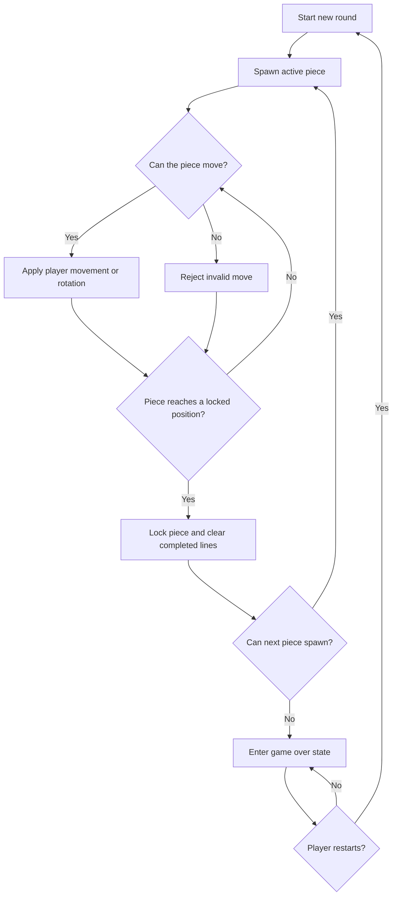

# Feature Specification: Tetris Direct

**Feature Branch**: `[048-tetris-direct]`
**Created**: 2026-05-05
**Status**: Draft
**Input**: User description: "048-tetris-direct"

## One-Line Purpose *(mandatory)*

Provide a direct-play Tetris game that lets a player start instantly, control falling pieces reliably, and score by clearing lines in a browser session.

## Consumer & Context *(mandatory)*

A browser-based player consumes this feature in a single-session game screen on desktop or mobile.

## User Scenarios & Testing *(mandatory)*

### User Story 1 - Start and Play Instantly (Priority: P1)

As a player, I can open the game, begin a new round immediately, and control falling pieces with predictable movement so I can play without setup friction.

**Why this priority**: Starting a round and controlling pieces is the core value of the feature; nothing else matters if play cannot begin and respond correctly.

**Independent Test**: Launch the game, confirm a board appears with an active piece, and verify that left, right, rotate, soft drop, and hard drop actions change the piece state as expected.

**Acceptance Scenarios**:

1. **Given** the game is open and no round is running, **When** the player starts a new round, **Then** a fresh board appears with an active piece and an empty score.
2. **Given** an active round, **When** the player moves or rotates the piece, **Then** the piece updates within the board rules and does not pass through occupied cells or the board edges.
3. **Given** an active round, **When** the player triggers a hard drop, **Then** the piece locks immediately in the lowest valid position and the next piece becomes active.

---

### User Story 2 - Clear Lines and Score Progress (Priority: P2)

As a player, I can clear completed lines and see score progress so I can measure performance during the round.

**Why this priority**: Line clears and scoring are the primary reward loop after basic movement works.

**Independent Test**: Fill a row or multiple rows, lock a piece that completes the line(s), and confirm the board clears the rows and updates score and line count.

**Acceptance Scenarios**:

1. **Given** a row is filled except for one cell, **When** the player drops the required piece into place, **Then** the completed row clears and the stack above it falls into the emptied space.
2. **Given** multiple rows are completed by one lock event, **When** the lines resolve, **Then** all completed rows clear in the same resolution step and the score reflects the multi-line clear.

---

### User Story 3 - End and Restart Cleanly (Priority: P3)

As a player, I can reach game over when the stack blocks new pieces and restart a new round from a clean state.

**Why this priority**: Clear end-of-round behavior prevents ambiguous game states and supports repeat play.

**Independent Test**: Fill the board to the spawn zone, verify game over occurs on the next spawn attempt, and confirm restart resets score, board state, and active piece.

**Acceptance Scenarios**:

1. **Given** the stack reaches the spawn zone, **When** the next piece cannot enter the board, **Then** the round ends and the player sees a game-over state.
2. **Given** a game-over state, **When** the player restarts, **Then** the board clears, the score resets, and a new round begins with a fresh active piece.

---

### Edge Cases

- The game must ignore movement commands after a piece has locked until the next active piece spawns.
- Rotation near a wall or stack must resolve by keeping the piece inside the board or rejecting the rotation if no valid placement exists.
- A piece that soft-drops or hard-drops into a filled area must lock on the last valid cell without overlapping occupied cells.
- A restart during game over must clear any residual board state from the prior round.

## Flowchart *(mandatory)*

## Data & State Preconditions *(mandatory)*

- A player is able to open the game in a browser session.
- The game board must be initialized to an empty, consistent grid before the first piece spawns.
- A round must not start with any preexisting locked cells in the active board state.

## Inputs & Outputs *(mandatory)*

| Direction | Description | Format |
| :-- | :-- | :-- |
| Input | Player actions that control the current round and lifecycle. | Caller-defined |
| Output | Updated board state, score progression, and round status. | Caller-defined |

## Constraints & Non-Goals *(mandatory)*

**Must NOT**:
- Must NOT allow a piece to occupy the same cell as an existing locked block.
- Must NOT require account creation, login, or saved profile state to play.
- Must NOT leave the board in a partially reset state after restart.

**Adopted dependencies** *(include if feature uses external tools/packages to deliver capability)*:
- None.

**Out of scope** *(things this feature genuinely does not do, even via external tools)*:
- Multiplayer play.
- Online leaderboards.
- Cosmetic customization beyond the playable game screen.

## Requirements *(mandatory)*

### Functional Requirements

- **FR-001**: System MUST let a player start a new Tetris round from an empty board without account setup.
- **FR-002**: System MUST spawn and advance one active piece at a time according to the round state.
- **FR-003**: System MUST accept left, right, rotate, soft drop, and hard drop actions for the active piece.
- **FR-004**: System MUST reject any piece placement that would move outside the board or overlap locked cells.
- **FR-005**: System MUST lock a piece when it can no longer move downward.
- **FR-006**: System MUST clear every completed horizontal line immediately after a piece locks.
- **FR-007**: System MUST update score and cleared-line counts when line clears occur.
- **FR-008**: System MUST end the round when a new piece cannot spawn in the board entry area.
- **FR-009**: System MUST allow the player to restart after game over and return to a clean round state.
- **FR-010**: System MUST present the current round status clearly as active, paused only if pause is later introduced, or game over.

### Key Entities *(include if feature involves data)*

- **Board**: The playable grid that holds locked cells and the current active piece position.
- **Piece**: The falling shape defined by its block layout, orientation, and spawn state.
- **Round**: The current play session, including score, cleared lines, active piece, and end state.

## Success Criteria *(mandatory)*

### Measurable Outcomes

- **SC-001**: A new player can begin a playable round in under 5 seconds from loading the game screen.
- **SC-002**: Valid movement and rotation actions update the active piece on every attempt without corrupting the board state.
- **SC-003**: Completed lines clear correctly in 100% of verified single-line and multi-line clear cases.
- **SC-004**: Restart returns the player to a clean round state with zero carried-over score, locked cells, or game-over lockout.

## Definition of Done *(mandatory)*

The feature is shipped when the production browser game lets a player start, play, score, reach game over, and restart a direct Tetris round without manual recovery or setup.

## Delivery Routing & Rough Size *(mandatory)*

### Item Classification

| Field | Value | Notes |
|-------|-------|-------|
| Work type | `New feature` | This introduces a playable game flow rather than modifying an existing one. |
| Existing spec coverage | `None` | No prior feature spec covers this direct-play Tetris scope. |
| Required spec action | `New spec` | The feature needs a dedicated specification with acceptance scenarios and routing. |

### Rough Size

T-shirt size: `M`

Reasoning:
- This is a single-user browser game with a clear core loop, but it still needs movement rules, line-clear logic, end-state handling, and restart behavior that must work together.

Use this calibration:

| Size | Meaning | Typical Routing |
|------|---------|-----------------|
| XS | One obvious repo-local change, usually one seam, no new architecture or research | Research skip, Plan skip, Sketch core only |
| S | Small repo-local change using existing architecture, small contract/test detail | Research skip, Plan skip or lite, Sketch core plus any triggered sections |
| M | Multiple seams or one meaningful design decision, existing architecture mostly applies | Research skip unless unknowns, Plan lite, Sketch expanded |
| L | New or materially changed architecture, state, interface, workflow, or artifact/event lifecycle | Research as needed, Plan full, Sketch expanded with slices |
| XL | Cross-cutting, external, security/data-heavy, unclear feasibility, or likely multi-feature work | Research required, Plan full, Sketch expanded; consider splitting spec |

### Risk / Uncertainty

| Dimension | Level | Reason |
|-----------|-------|--------|
| Requirement clarity | `Medium` | The core Tetris loop is clear, but timing, rotation behavior, and pause behavior can vary by product choice. |
| Repo uncertainty | `Low` | The request is localized to a single browser game feature. |
| External dependency uncertainty | `Low` | No external services or packages are required for the user-visible scope. |
| State / data / migration risk | `Low` | The feature uses ephemeral round state with no migration path. |
| Runtime / side-effect risk | `Medium` | The game must maintain consistent board state across many rapid input events. |
| Human/operator dependency | `Low` | No manual operational step is required after launch. |

### Phase Routing

| Downstream Phase | Decision | Reason |
|------------------|----------|--------|
| Research | `Skip` | The feature does not depend on external APIs, unfamiliar tools, or unresolved platform choices. |
| Plan | `Lite` | The round state and gameplay flow are straightforward, but timing and collision rules still benefit from a short plan. |
| Sketch | `Required` | The feature reaches tasking and needs the core sketch for implementation slices and test coverage. |
| Tasking | `Required` | The gameplay loop has enough scope to benefit from task decomposition. |
| Estimate | `Required after tasking` | Implementation sizing should follow the sketch and task breakdown. |

### Existing-Spec Attachment

If this item is covered by an existing spec, state how it should attach:

- Existing feature/spec: `N/A`
- Attach as: `New spec`
- New spec required? `Yes`
- Rationale: This is a standalone direct-play Tetris feature with its own user journeys, acceptance scenarios, and success criteria.

### Routing Gate

- [x] Work type is classified.
- [x] Existing spec coverage is checked.
- [x] Rough size is assigned.
- [x] Risk/uncertainty dimensions are assigned.
- [x] Research route is justified.
- [x] Plan route is justified.
- [x] Sketch is required and right-sized.
- [x] Tasking/estimate route is justified.

## Open Questions *(include if any unresolved decisions exist)*

- None.
