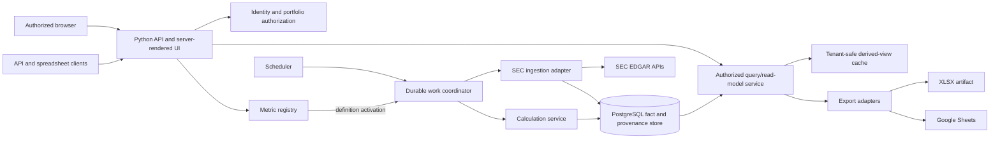

# Combined Plan - 049-financial-acceleration-tracker

_Feature: `049`_
_Source Spec: `spec.md`_
_Artifact: `plan.md`_

[This template documents every section the combined `speckit.plan` step may keep. `scripts/speckit_plan_step.py` prunes unused sections after triage so the emitted `plan.md` contains only the sections required by strategy.]

## Triage

- duplicate: false
- t_shirt_size: xl
- risk_level: high
- reason: No existing feature provides filing-driven financial analytics or a related runtime implementation. Current matched repository modules are governance, control-plane, and Tetris surfaces, not an application foundation for this product.

## Strategy Contract

```json
{
  "domains": {
    "reasoning": {
      "api integration": "The product exposes authorized browser and API reads, ingests SEC data, and synchronizes Google Sheets with explicit external return paths.",
      "client/UI": "Dashboards, filters, charts, data-quality visibility, and a constrained metric-definition surface are user-facing and authorization-aware.",
      "compute": "Filing discovery, extraction, recomputation, and exports are background work with retry, idempotency, resource, and restart concerns.",
      "data modeling": "Immutable filings, fiscal periods, facts, definition versions, observations, analysis runs, and exports require explicit schemas and invariants.",
      "identity": "Metric-definition mutations, watchlists, portfolios, API access, and export destinations require server-enforced roles and scopes.",
      "observability": "Analysts and operators need correlation, bounded error states, refresh visibility, and audit evidence for external and calculation failures.",
      "security": "The feature accepts user-authored declarative definitions and Google authorization, so it requires strict input validation, least privilege, and secret isolation.",
      "storage": "The product needs durable provenance, idempotent refresh records, version-pinned observations, migrations, and queryable dashboard state.",
      "testing": "Financial calculations, definition validation, data migrations, authorization, retries, and at least one live SEC path need deterministic and live-backed verification."
    },
    "relevant": [
      "api integration",
      "data modeling",
      "storage",
      "client/UI",
      "compute",
      "observability",
      "testing",
      "identity",
      "security"
    ]
  },
  "risk": {
    "external_dependency_uncertainty": "high",
    "human_operator_dependency": "medium",
    "overall": "high",
    "repo_uncertainty": "high",
    "requirement_clarity": "medium",
    "runtime_side_effect_risk": "high",
    "state_data_migration_risk": "high"
  },
  "strategy": {
    "architecture_diagram": true,
    "architecture_strategy": true,
    "expanded_design_notes": true,
    "external_research": true,
    "net_new_surface": false,
    "strategy_reason": "This is a net-new product surface. Existing repository code provides governance tooling but no reusable filing, finance, dashboard, job, authorization, or export implementation; the plan must establish safe boundaries and verify live dependency, license, and external-service assumptions."
  },
  "triage": {
    "duplicate": false,
    "duplicate_matches": [],
    "duplicate_reason": "No existing feature provides filing-driven financial analytics or a related runtime implementation. Current matched repository modules are governance, control-plane, and Tetris surfaces, not an application foundation for this product.",
    "risk_level": "high",
    "tshirt_size": "xl"
  }
}
```

## Plan Routing

| Downstream Phase | Decision | Reason |
|---|---|---|
| Research | `Required` | SEC, EdgarTools, spreadsheet, and licensing assumptions affect the architecture. |
| Plan | `Full` | The feature is net-new, XL, high risk, and introduces durable financial data and external integrations. |
| Sketch | `Expanded` | The task seams need explicit contracts for ingress, state ownership, provenance, and delivery boundaries. |
| Tasking | `Required` | Five implementation slices and cross-cutting acceptance work must be assigned to seam-sized tasks. |
| Estimate | `Required after tasking` | Every task must be estimated after the remediation seams are settled and broken down if needed. |

## Routing Contract

```json
{
  "routing": {
    "research_route": "required",
    "plan_profile": "full",
    "sketch_profile": "expanded",
    "tasking_route": "required",
    "estimate_route": "required_after_tasking",
    "routing_reason": "Net-new filing analytics with SEC and spreadsheet integrations, tenant authorization, durable work, and versioned financial history requires full planning and expanded downstream contracts.",
    "conditional_sketch_sections": [
      "Repo Grounding",
      "Contract / Artifact / Event Impact",
      "Runtime / State / Failure Notes",
      "Human / Operator Boundaries",
      "Design Gaps and Repo Contradictions",
      "Decomposition-Ready Design Slices"
    ]
  },
  "risk": {
    "requirement_clarity": "medium",
    "repo_uncertainty": "high",
    "external_dependency_uncertainty": "high",
    "state_data_migration_risk": "high",
    "runtime_side_effect_risk": "high",
    "human_operator_dependency": "medium"
  }
}
```

## Internal Discovery

### Term: specification

- matches: true
- exit_code: 0
- files:
  - `/Users/andreborczuk/app-foundation/scripts/validate_command_script_coverage.py`

stderr:
```text
Loading weights:   0%|          | 0/393 [00:00<?, ?it/s]
Loading weights: 100%|██████████| 393/393 [00:00<00:00, 18174.18it/s]
/Users/andreborczuk/.local/share/uv/python/cpython-3.12-macos-aarch64-none/lib/python3.12/multiprocessing/resource_tracker.py:279: UserWarning: resource_tracker: There appear to be 1 leaked semaphore objects to clean up at shutdown
  warnings.warn('resource_tracker: There appear to be %d '
```

### Term: financial

- matches: true
- exit_code: 0
- files:
  - `/Users/andreborczuk/app-foundation/tests/integration/test_codebase_vector_index_performance.py`

stderr:
```text
Loading weights:   0%|          | 0/393 [00:00<?, ?it/s]
Loading weights: 100%|██████████| 393/393 [00:00<00:00, 10121.40it/s]
/Users/andreborczuk/.local/share/uv/python/cpython-3.12-macos-aarch64-none/lib/python3.12/multiprocessing/resource_tracker.py:279: UserWarning: resource_tracker: There appear to be 1 leaked semaphore objects to clean up at shutdown
  warnings.warn('resource_tracker: There appear to be %d '
```

### Term: acceleration

- matches: true
- exit_code: 0
- files:
  - `/Users/andreborczuk/app-foundation/scripts/e2e/e2e_019_token_efficiency_docs.sh`

stderr:
```text
Loading weights:   0%|          | 0/393 [00:00<?, ?it/s]
Loading weights: 100%|██████████| 393/393 [00:00<00:00, 23494.65it/s]
/Users/andreborczuk/.local/share/uv/python/cpython-3.12-macos-aarch64-none/lib/python3.12/multiprocessing/resource_tracker.py:279: UserWarning: resource_tracker: There appear to be 1 leaked semaphore objects to clean up at shutdown
  warnings.warn('resource_tracker: There appear to be %d '
```

### Term: tracker

- matches: true
- exit_code: 0
- files:
  - `/Users/andreborczuk/app-foundation/scripts/e2e/e2e_008.sh`

stderr:
```text
Loading weights:   0%|          | 0/393 [00:00<?, ?it/s]
Loading weights: 100%|██████████| 393/393 [00:00<00:00, 8947.84it/s]
/Users/andreborczuk/.local/share/uv/python/cpython-3.12-macos-aarch64-none/lib/python3.12/multiprocessing/resource_tracker.py:279: UserWarning: resource_tracker: There appear to be 1 leaked semaphore objects to clean up at shutdown
  warnings.warn('resource_tracker: There appear to be %d '
```

### Term: branch

- matches: true
- exit_code: 0
- files:
  - `/Users/andreborczuk/app-foundation/scripts/speckit_implement_step.py`

stderr:
```text
Loading weights:   0%|          | 0/393 [00:00<?, ?it/s]
Loading weights: 100%|██████████| 393/393 [00:00<00:00, 4997.64it/s]
/Users/andreborczuk/.local/share/uv/python/cpython-3.12-macos-aarch64-none/lib/python3.12/multiprocessing/resource_tracker.py:279: UserWarning: resource_tracker: There appear to be 1 leaked semaphore objects to clean up at shutdown
  warnings.warn('resource_tracker: There appear to be %d '
```

## Relevant Domains

### api integration
- Why it matters: The product exposes authorized browser and API reads, ingests SEC data, and synchronizes Google Sheets with explicit external return paths.
- Required checklist prompts:
  - [ ] Does the integration discover the valid set via metadata first?
  - [ ] Are error response formats defined for all failure modes?
  - [ ] Are rate limiting requirements quantified with specific thresholds?
  - [ ] For each async external service: does the callback endpoint exist, is auth enforced on it, and is the incoming payload validated before processing?
  - [ ] Does every outbound call define explicit timeout behavior?
  - [ ] Is retry behavior defined per operation, including max attempts and backoff policy?
  - [ ] For any retried or replayable write, is idempotency explicitly enforced?
  - [ ] Are duplicate, delayed, stale, or out-of-order callbacks/responses handled safely?
  - [ ] Does ambiguous or partial external state block downstream side effects until reconciliation?
  - [ ] Are request/response and callback contracts versioned with compatibility expectations documented?
  - [ ] Is a correlation ID propagated across outbound requests and inbound callbacks/events?
  - [ ] Are non-idempotent operations explicitly marked, with duplicate-prevention behavior defined?
  - [ ] Is callback/webhook authentication explicitly defined and enforced before payload processing?
  - [ ] For any workflow/webhook integration (e.g., n8n), are the required secret(s)/token(s) explicitly named in the integration contract and enforced at the boundary (and not hardcoded)?
  - [ ] Are inbound and outbound payloads validated against explicit schemas rather than parsed loosely?
  - [ ] Is the source of truth for externally produced status/result state explicitly identified?

### data modeling
- Why it matters: Immutable filings, fiscal periods, facts, definition versions, observations, analysis runs, and exports require explicit schemas and invariants.
- Required checklist prompts:
  - [ ] Does every field have an explicit source of truth or owner?
  - [ ] Are nullable or optional fields explicitly justified?
  - [ ] Are finite-state fields represented with enums or constrained literals instead of free text?
  - [ ] Are derived fields clearly separated from authoritative stored fields?
  - [ ] Are money, price, quantity, and ratio values modeled with precision-safe types and explicit units?
  - [ ] Does this schema change define compatibility and migration expectations?
  - [ ] Are immutable identity fields separated from mutable operational fields?
  - [ ] Is validation performed at ingress/egress boundaries rather than deferred downstream?
  - [ ] Are mirrored or copied fields documented with reconciliation expectations?
  - [ ] Is this schema scoped to a clear purpose instead of acting as a catch-all model?
  - [ ] Are inbound API/tool/integration payloads validated by Pydantic (or an explicitly approved equivalent) before use?
  - [ ] Are persisted-record reads decoded/validated into a schema model before domain/service logic uses them?
  - [ ] Are outbound integration payloads produced from validated schema models rather than hand-built dicts?

### storage
- Why it matters: The product needs durable provenance, idempotent refresh records, version-pinned observations, migrations, and queryable dashboard state.
- Required checklist prompts:
  - [ ] Is the source of truth for every persisted lifecycle/risk/financial field explicitly documented?
  - [ ] If external reconciliation applies, is it performed before risk/scoring/side-effect decisions?
  - [ ] Are all multi-table or multi-row mutations wrapped in an explicit transaction?
  - [ ] For any concurrently written records, is concurrency control defined (locking/versioning/constraints)?
  - [ ] For any retried/replayed flows, are writes idempotent and enforced by constraints or guards?
  - [ ] Are persistence failures surfaced (not swallowed) and do they fail the active operation?
  - [ ] Are migrations planned with forward + rollback behavior (or an explicit recovery plan)?
  - [ ] Can critical state be rebuilt (from external truth or append-only history), or is backup/restore explicitly defined?
  - [ ] Are orphan/stale local records transitioned out of active states deterministically?
  - [ ] Are retention windows and archival/deletion rules explicitly defined for critical persisted data?
  - [ ] If critical state is not rebuildable, is there an explicit backup cadence + retention window + restore procedure?
  - [ ] Is restore tested periodically (or as part of a deterministic gate) for any non-rebuildable critical state?

### client/UI
- Why it matters: Dashboards, filters, charts, data-quality visibility, and a constrained metric-definition surface are user-facing and authorization-aware.
- Required checklist prompts:
  - [ ] Are loading/empty/error/success states clearly implemented (no ambiguous spinners)?
  - [ ] Are destructive/high-impact actions confirmed?
  - [ ] If optimistic updates exist, is rollback + reconciliation implemented?
  - [ ] Does the UI reconcile with server truth after refresh/reconnect?
  - [ ] Are permission constraints enforced server-side (not only hidden in UI)?
  - [ ] Are key flows accessible (labels, focus management, keyboard navigation)?
  - [ ] Is the UI responsive across supported breakpoints (mobile/tablet/desktop) or explicitly marked out of scope?
  - [ ] Are tokens treated as public and scoped appropriately (no secrets stored on client)?
  - [ ] Are client failures actionable (clear retry/recovery paths)?
  - [ ] Is client-side validation present for UX but not relied on for security?
  - [ ] Are client-side errors captured (where applicable) with redaction (no secrets/PII)?
  - [ ] Are user-visible failures traceable to backend events via correlation identifiers when applicable?

### compute
- Why it matters: Filing discovery, extraction, recomputation, and exports are background work with retry, idempotency, resource, and restart concerns.
- Required checklist prompts:
  - [ ] Does the task have an explicit timeout?
  - [ ] Are all spawned tasks registered for graceful shutdown?
  - [ ] Is `await` used correctly for all async operations?
  - [ ] Does every task/process have a clear owner and shutdown path?
  - [ ] Are readiness, timeouts, and cancellation behavior explicit?
  - [ ] Is concurrency bounded (TaskGroup limits / queue limits / semaphore)?
  - [ ] Are background tasks tracked (no fire-and-forget)?
  - [ ] Is work idempotent or guarded for retries/replays?
  - [ ] Are crash/restart semantics defined for long-running workflows?
  - [ ] Are orphan tasks/processes prevented and detected?
  - [ ] Are CPU/memory limits (or equivalent) and concurrency caps explicitly defined?
  - [ ] Is there an explicit retry budget for failing tasks/workflows?
  - [ ] Is poison work handled (dead-letter, quarantine, or abort+alert) to prevent infinite loops?

### observability
- Why it matters: Analysts and operators need correlation, bounded error states, refresh visibility, and audit evidence for external and calculation failures.
- Required checklist prompts:
  - [ ] Does the application emit its `run_id` on startup?
  - [ ] Is logging structured (JSON/JSONL)?
  - [ ] Do logs include enough context to diagnose a silent failure?
  - [ ] Do logs include run_id/request_id/operation_id for correlation?
  - [ ] Are key business events emitted as structured events (where applicable)?
  - [ ] Are alerts actionable and linked to a runbook/response?
  - [ ] Can stalls/missing signals be detected?
  - [ ] Do long-running build/index/embed/write paths emit stage markers, batch counts, and completion timing?
  - [ ] Are default success logs concise, with full command/path detail emitted only in explicit verbose mode?
  - [ ] Are secrets and sensitive values redacted?
  - [ ] Can critical flows be reconstructed from logs/metrics?
  - [ ] Do critical paths emit latency + error rate + throughput metrics?
  - [ ] Are saturation signals emitted for constrained resources (queues, DB locks, worker pools) where applicable?
  - [ ] Are log/metric retention windows explicit and access controlled?

### testing
- Why it matters: Financial calculations, definition validation, data migrations, authorization, retries, and at least one live SEC path need deterministic and live-backed verification.
- Required checklist prompts:
  - [ ] Does a deterministic pass/fail oracle exist for this?
  - [ ] If yes, is it implemented as an automated gate (not manual confirmation)?
  - [ ] Are E2E tests run on real infrastructure where critical paths require it (not mocks)?
  - [ ] Is TDD methodology used (test written first) or explicitly justified if not?
  - [ ] Are tests deterministic (no timing races / hidden randomness / external nondeterminism)?
  - [ ] Are flaky tests tracked with an owner and expiry if temporarily quarantined?
  - [ ] Does every bug fix include a regression test targeting the bug class?
  - [ ] Are state transitions (including retries/duplicates/out-of-order) tested where applicable?
  - [ ] Is there at least one reality-check integration test for critical paths?
  - [ ] Are any gate waivers documented with rationale and expiry?
  - [ ] If E2E gates exist, is the E2E environment production-like or are differences explicitly documented?
  - [ ] Are fixtures/test accounts representative of real edge cases and permission models?

### identity
- Why it matters: Metric-definition mutations, watchlists, portfolios, API access, and export destinations require server-enforced roles and scopes.
- Required checklist prompts:
  - [ ] Is authentication mandatory for every external-facing resource?
  - [ ] Is authorization enforced separately from authentication?
  - [ ] Is default deny enforced when scope/role is missing?
  - [ ] Are all API keys and tokens scoped correctly (least privilege)?
  - [ ] Are machine identities scoped and rotated?
  - [ ] Are failed access attempts logged?
  - [ ] Are access decisions logged (actor/resource/outcome)?
  - [ ] Are token expiry/rotation/revocation expectations defined and testable?
  - [ ] Do privileged roles require MFA (where applicable)?
  - [ ] Are session lifetimes and revocation behavior defined and tested (where applicable)?

### security
- Why it matters: The feature accepts user-authored declarative definitions and Google authorization, so it requires strict input validation, least privilege, and secret isolation.
- Required checklist prompts:
  - [ ] Does this pull a secret/token from an environment variable (not code, logs, or committed files)?
  - [ ] Is input validation applied to all untrusted data?
  - [ ] Do all inbound webhook endpoints require authentication (no unauthenticated triggers), and are required secrets/tokens sourced from environment variables (not code or logs)?
  - [ ] Does the error message hide internal system secrets and internals?
  - [ ] Are token scopes/IAM permissions explicitly justified (least privilege)?
  - [ ] Are dependencies scanned for known vulnerabilities where applicable?
  - [ ] For new trust boundaries/integrations/privileged capabilities, was a threat model performed and documented?
  - [ ] Are threat mitigations reflected in tests/checklists (not only in prose)?

## Summary

Build a Python-first, filing-driven analytics service with a canonical relational fact store, immutable provenance, a durable work queue, authenticated query/export APIs, and a server-rendered dashboard. SEC submission and XBRL data become append-only source facts; all financial outputs are reproducible observations linked to an analysis run, filing snapshot, quality state, and metric-definition version.

The product is deliberately split into source ingestion, fact normalization, metric-definition governance, calculation, read models, and delivery. This avoids coupling a user-facing dashboard to SEC transport, lets filing corrections trigger bounded recalculation, and keeps portfolio/watchlist authorization separate from public-company data.

User-defined metrics are a first-class capability, not dashboard formulas. A user creates a governed metric definition from approved fact selectors and a constrained expression language. Activating a change creates a new immutable definition version; it never rewrites prior observations. Queries may request the current active version or an explicit historical version, and responses always identify the version and source facts used.

The first implementation will not add market prices, options, brokerage execution, or real-time P&L. The browser experience remains server-rendered to honor the repository's Python-only code policy; the React/Table/chart options in the supplied research are deferred unless that policy changes explicitly.

## Internal Research

Repository discovery found workflow, governance, and control-plane tooling but no reusable financial-tracker product seam, data model, web application, background-worker runtime, or portfolio authorization layer. This is therefore a net-new, isolated Python package and deployment surface rather than an extension of existing application code.

The supplied [spec.md](spec.md) establishes the product boundary and acceptance outcomes. [research.md](research.md) supplies the initial stack options, while this plan narrows them to a Python-first path and makes the missing operational contracts explicit: durable work ownership, source provenance, historical metric-definition semantics, tenant authorization, and failure visibility.

The existing Speckit workflow remains the delivery mechanism: each implementation slice must be independently taskable, red-green verified, and recorded in the task ledger. No existing runtime service should be modified to host financial data or scheduled ingestion.

## Existing Coverage and Reuse

The repository provides governance, task-format, plan, estimate, ledger, and bounded-read tooling that this feature reuses. It does not provide a financial data model, SEC runtime, dashboard, worker, portfolio authorization, or export implementation. The implementation therefore creates an isolated `src/financial_tracker/` package while using the existing deterministic gates and real-backend verification conventions rather than modifying unrelated runtime services.

## External Research

External dependencies are decisions with explicit controls, checked on 2026-07-19:

- [SEC Developer Resources](https://www.sec.gov/about/developer-resources) confirms JSON submission and extracted XBRL APIs, asks clients to download only required data, and limits aggregate automation to 10 requests per second. The ingestion client must send an identifiable User-Agent, enforce a lower internal rate limit, use request timeouts, and treat 429/5xx responses as retryable bounded failures rather than silently missing data.
- [EdgarTools](https://github.com/dgunning/edgartools) is an MIT-licensed Python library for SEC EDGAR filings and XBRL financials. It is the primary adapter candidate, but the implementation must pin a reviewed version, retain raw SEC identifiers independently of library objects, and keep a direct SEC-client seam for compatibility tests and fallback.
- [XlsxWriter](https://xlsxwriter.readthedocs.io/introduction.html) is BSD 2-Clause and writes XLSX files but cannot read or modify existing workbooks. It fits deterministic export generation only; existing-workbook modification is out of scope.
- [gspread](https://docs.gspread.org/en/master/) provides a Python interface to Google Sheets API v4. The project must verify its dependency posture and Google OAuth/service-account model at adoption because its upstream maintenance status is a delivery risk. Spreadsheet delivery is a replaceable adapter behind the export boundary.

The plan deliberately defers Arelle until fixture coverage shows a taxonomy or validation gap that EdgarTools plus the direct SEC adapter cannot handle. Any future dependency must be license-reviewed, version-pinned, and covered by an integration test against a real public SEC response before it becomes a production path.

## Architecture Strategy

### Bounded Components

1. **Identity and portfolio boundary**: owns users, API clients, roles, portfolios, watchlists, and authorization checks. It never grants access from a client-supplied owner or portfolio identifier.
2. **Issuer and filing registry**: owns CIK/ticker resolution, filing identity, accession numbers, form types, amendment/restatement relationships, and the raw-fetch audit record.
3. **SEC ingestion adapter**: owns classified SEC requests, rate budgets, timeouts, retry policy, source-payload validation, and idempotent handoff into durable work. It is the only component allowed to call SEC endpoints.
4. **Fact and provenance store**: owns normalized exact-decimal facts, fiscal periods, source selectors, raw document references, extraction quality, and supersession state. Source facts are append-only; a corrected filing adds records and relationships rather than mutating history.
5. **Metric registry**: owns built-in and user-defined metric definitions, immutable versions, restricted expression ASTs, dependency graphs, validation status, activation state, and owner/audit metadata.
6. **Calculation service**: owns pure calculation over a frozen fact snapshot plus a metric-definition version. It writes immutable observations and analysis runs, is idempotent on `(company, filing snapshot, definition version, as-of policy)`, and never calls the network.
7. **Durable work coordinator**: owns scheduled discovery, ingestion, normalization, recalculation, exports, retry budgets, leases, dead-letter state, and recovery after worker failure. The initial implementation uses a transactional work-item table and Python worker rather than an unbounded in-process scheduler.
8. **Query/read-model service**: owns authorized dashboard/API projections, freshness metadata, provenance drill-down data, and tenant-safe derived-view caching. It never treats cache contents as financial truth.
9. **Export adapters**: own deterministic XLSX generation and optional Google Sheets delivery. An export is a durable request with an immutable result manifest and is recoverable through status polling; no external callback is required in v1.

### Persistence and Recalculation Policy

PostgreSQL is the system of record for identity, portfolio ownership, filing metadata, normalized facts, definition versions, analysis runs, observations, work items, and audit events. Use exact numeric/decimal types for authoritative amounts and ratios; floats may appear only in presentation payloads. Raw filing artifacts may be retained in object storage only when policy requires them, always referenced by a content hash and source URL.

Metric definition activation is transactional: validate the expression, selectors, units, cycle-free dependencies, scope, and authorization; persist a new version; mark it active; enqueue affected recalculation work; then invalidate only affected derived views. Definition edits are append-only. Historical observations retain their producing version, while explicit rebuilds create parallel analysis runs and a documented supersession relationship. The default dashboard can use the latest active version only when it labels the version and recomputation state; it may not silently blend values from different versions.

### API, UI, and Security Contract

Version all public API responses and validate every request at the server boundary. Each observation response must include company identity, fiscal period, metric ID and version/hash, definition state, result/quality state, analysis-run ID, source fact IDs/selectors, filing accession, calculated timestamp, and freshness timestamp. Standard failures are structured: `unauthorized`, `forbidden`, `invalid_definition`, `source_unavailable`, `quality_unavailable`, `recalculation_pending`, and `export_failed`, each with a correlation ID.

The initial dashboard is server-rendered from Python endpoints with progressive enhancement only if it preserves server-side authorization and accessible state. It must show loading, empty, stale, partial-quality, validation-error, and recalculation-pending states. API clients, scheduled workers, and interactive users receive separate identities with least-privilege scopes; secrets reside in environment-backed secret storage and are never sent to browsers or stored in user-defined metric definitions.

### Runtime and Operational Policy

Every SEC request has a connection/read timeout, classified retry policy with jitter, global rate budget below SEC limits, and a circuit-open/degraded state. Every background item has a stable idempotency key, lease, attempt count, bounded retry schedule, terminal reason, and correlation ID. Recovery can resume leased/expired work without rerunning completed observation writes.

Emit structured events and metrics for filing discovery lag, SEC rate-limit/error rate, normalized-fact quality, queue age, calculation latency, cache freshness, definition validation failures, recalculation backlog, export outcomes, and authorization denials. Alerts must be actionable and include feature/run/correlation identifiers. The operational runbook must define source outage, malformed filing, queue saturation, failed export, and definition rollout recovery procedures before scheduled production refresh is enabled.

## External Ingress and Runtime Readiness

| Ingress | Status | Readiness Contract |
|---|---|---|
| Browser and authenticated API requests | Conditional | Server-side authentication, authorization, structured errors, request validation, and real API authorization tests must pass before dashboard/API exposure. |
| Google Sheets delivery | Conditional | Destination and credential scope must be explicit, OAuth/service credentials must remain server-side, and parity plus authorization tests must pass before enablement. |
| Scheduled SEC discovery | Conditional | Scheduler registration, rate budget, User-Agent, retry/circuit policy, lease recovery, and live compatibility/outage tests must pass before production scheduling. |
| Runtime readiness | Conditional | PostgreSQL migrations, worker readiness, feature flags, health checks, correlation IDs, and operator recovery procedures must be verified in the rollout order below. |

### Readiness Blocking Summary

| Blocker | Status | Required Evidence |
|---|---|---|
| New external source dependency | Conditional | Bounded live SEC compatibility and outage-path tests. |
| New durable storage and migrations | Conditional | Real-PostgreSQL migration, uniqueness, rollback, and idempotency evidence. |
| External delivery credentials | Conditional | Server-side credential scoping and API/XLSX/Sheets parity and authorization evidence. |
| Production scheduled refresh | Conditional | Runbook, alert coverage, feature-flag rollback, and recovery evidence from PL-05. |

Production scheduled refresh and spreadsheet delivery remain disabled until all preceding slice checkpoints and the listed readiness evidence pass.

## Architecture Diagram



Trust boundaries are explicit: SEC is an untrusted external source; browser and spreadsheet clients are untrusted requesters; the calculation service consumes only normalized, validated facts and approved metric-definition versions; PostgreSQL is authoritative; cache and export artifacts are derived outputs only.

## Expanded Design Notes

### Metric Definition Contract

Each definition has a stable `metric_id`; human-readable name/description; scope (`company` or `portfolio`); output unit/scale; owner; status (`draft`, `active`, `retired`, `invalid`); and one or more immutable versions. A version contains its canonical expression AST, referenced approved fact selectors or metric-version dependencies, typed parameters with bounded defaults, calculation policy, effective time, author, validation report, and content hash. User input is parsed into a small allowlisted expression language, not executed as Python and never evaluated with `eval`.

Validation rejects unknown selectors, cross-tenant references, cycles, incompatible units/scales, unbounded lookbacks, undefined periods, unsafe division, unsupported portfolio aggregation, and unauthorized dependencies. A dry run exposes the resolved facts, dependency graph, result or validation errors, and the exact version that activation would create. Activation requires the definition owner plus the appropriate portfolio scope; retirement prevents new calculations but preserves historical queries.

### Financial Data and Quality State

Fact identity is the source authority plus CIK, accession, taxonomy/concept, period boundaries, dimensions, unit, and source context. Normalized facts retain the original value as a decimal-compatible representation, the selected/derived state, extraction timestamp, parser version, and source pointer. Observations use a finite quality taxonomy such as `verified`, `derived`, `ambiguous`, `incomplete`, `stale`, `superseded`, and `failed`; UI and API responses must not reduce these to a silent null.

Filing amendments or restatements trigger a new filing snapshot and targeted work for metric versions whose selectors may resolve differently. The prior observation remains queryable with its original provenance. A read endpoint accepts `as_of`, `analysis_run_id`, and `metric_definition_version` to make historical comparison explicit.

### Work and Failure State

Work-item states are `queued`, `leased`, `running`, `succeeded`, `retry_wait`, `dead_letter`, and `cancelled`. The only legal state transition owner is the coordinator. Ingestion and calculation writes use database uniqueness constraints and transactional outbox-style handoff so retried work cannot duplicate source facts or observations. A failure is compactly recorded with category, retryability, bounded excerpt, full artifact pointer, source/accession, and correlation ID.

SEC outage, rate limiting, and malformed filings put affected companies into a visible degraded or incomplete state while preserving their last successful observations with freshness metadata. Queue saturation rejects or defers new non-critical work rather than allowing unlimited memory growth. Export delivery failure does not alter financial results and remains retryable from the export request.

### Read Models, Cache, and Delivery

Cache keys include tenant/authorization scope, company or portfolio, metric-definition version, filing/analysis snapshot, sort/filter inputs, and schema version. Invalidate after a new analysis run, definition activation/retirement, portfolio authorization change, or export schema change. Cached views have a documented maximum age and expose `fresh`, `stale`, or `recalculation_pending` status; no cached value is written back as a fact or observation.

XLSX and Google Sheets exports use the same authorized query contract as the dashboard. Every export captures query parameters, result schema version, metric-definition versions, source/analysis identifiers, generated timestamp, requester, and a content hash. Spreadsheet credentials are service-owned and restricted to the requested destination; user-entered spreadsheet URLs are validated and never used as arbitrary credential targets.

### Verification and Rollout

Start with fixture-backed red tests for selector resolution, exact-decimal calculations, fiscal-period derivation, definition parsing/validation, version activation, historical query behavior, idempotent work transitions, and provenance completeness. Add contract tests for API/export parity and a live SEC compatibility test using a bounded known public filing. Integration coverage must use a real PostgreSQL instance and a real SEC fetch path; mocked SEC tests alone are insufficient.

Roll out in this order: internal fixture data; built-in metrics; user-defined metric dry runs; definition activation and targeted recalculation; authenticated dashboard/API; deterministic XLSX; optional Google Sheets delivery; finally scheduled SEC refresh behind an operator-controlled feature flag. Each stage needs migration, rollback, and observability evidence before the next stage opens.

## Design Slices

### Slice PL-01 - Financial Foundation and Provenance
- Estimate: high
- Why this slice exists: Establish the isolated Python package, PostgreSQL schema, authorization primitives, immutable filing/fact/provenance model, and fixture-only ingestion path that every later capability depends on.
- File/Symbol Seams: `src/financial_tracker/domain/`, `src/financial_tracker/persistence/`, `src/financial_tracker/identity/`, `src/financial_tracker/ingestion/`, `tests/financial_tracker/`
- Implementation Directive: Create migrations and typed Python domain services for users, portfolios, issuers, filings, fiscal periods, exact-decimal facts, provenance, analysis runs, and durable work items. Implement CIK/ticker identity resolution and fixture ingestion with transactional idempotency constraints, structured audit events, and red-green tests against a real PostgreSQL test instance.

### Slice PL-02 - Calculation and Built-In Metric Observations
- Estimate: high
- Why this slice exists: Deliver trusted filing-backed acceleration analysis before exposing user-authored formulas.
- File/Symbol Seams: `src/financial_tracker/calculation/`, `src/financial_tracker/selectors/`, `src/financial_tracker/quality/`, `tests/financial_tracker/calculation/`
- Implementation Directive: Implement approved fact selectors, fiscal-period classification/derivation, margin/streak/acceleration calculations, finite quality states, and immutable observation writes keyed by source snapshot and calculation version. Add fixture tests for expected values, amended filings, incomplete facts, and complete provenance for every observation.

### Slice PL-03 - Versioned User-Defined Metric Registry
- Estimate: high
- Why this slice exists: Provide the requested way to define additional metrics over time without compromising reproducibility or tenant isolation.
- File/Symbol Seams: `src/financial_tracker/metrics/`, `src/financial_tracker/recalculation/`, `src/financial_tracker/api/metric_definitions.py`, `tests/financial_tracker/metrics/`
- Implementation Directive: Build a restricted typed metric-expression parser and validator, immutable definition/version persistence, definition authorization, dry-run evaluation, activation/retirement transitions, dependency-cycle checks, and targeted recalculation enqueueing. Ensure historical observations keep their producing version and API responses require or report the selected definition version/hash.

### Slice PL-04 - Authorized Dashboard, API, and Deterministic Exports
- Estimate: high
- Why this slice exists: Deliver one coherent read contract to browser users, API clients, Excel, and Google Sheets without exposing unauthorized portfolios or stale results as current.
- File/Symbol Seams: `src/financial_tracker/web/`, `src/financial_tracker/api/`, `src/financial_tracker/query/`, `src/financial_tracker/exports/`, `tests/financial_tracker/api/`
- Implementation Directive: Implement versioned authenticated query endpoints and server-rendered dashboard pages with quality/provenance/freshness states. Generate XLSX from the identical read model, persist an immutable export manifest, and add contract tests proving dashboard/API/export parity, authorization boundaries, and explicit stale/recalculation-pending behavior. Keep Google Sheets as a separately tested adapter behind the export service.

### Slice PL-05 - SEC Refresh, Operations, and Continuity
- Estimate: high
- Why this slice exists: Safely move from controlled fixtures to repeatable live filing refreshes and recoverable production operations.
- File/Symbol Seams: `src/financial_tracker/sec/`, `src/financial_tracker/work/`, `src/financial_tracker/observability/`, `docs/financial-tracker-operations.md`, `tests/integration/financial_tracker/`
- Implementation Directive: Implement the direct SEC adapter and reviewed EdgarTools adapter, rate budget, User-Agent, timeout/retry/circuit policy, scheduled discovery, amendment detection, worker lease recovery, metrics/logs/alerts, and operator runbook. Add a bounded live-SEC compatibility test plus failure-path tests for 429, source outage, malformed filings, duplicate delivery, queue recovery, and export retry.

## Handoff Contract to Sketch

### Settled by Plan

- Financial facts and observations are immutable and linked to filing provenance, analysis runs, and metric-definition versions.
- PostgreSQL is authoritative; cache and export artifacts are derived and tenant-scoped.
- SEC access is isolated behind one adapter with bounded retry, rate budget, User-Agent, circuit, and live compatibility evidence.
- Browser/API, Google Sheets, and scheduled SEC ingress remain conditional until their readiness rows pass.
- User-defined metrics use a restricted typed declarative language and never execute user code, SQL, or `eval`.

### Sketch Must Preserve

| Constraint | Why |
|---|---|
| One authorized read model for dashboard, API, XLSX, and Sheets | Prevents parity and authorization drift. |
| Coordinator-owned work transitions and transactional handoff | Prevents duplicate facts, observations, and retry corruption. |
| Explicit quality, stale, and recalculation-pending states | Prevents silent nulls and misleading current values. |
| Feature-flagged live SEC scheduling and spreadsheet delivery | Makes rollout and rollback reversible. |

### Sketch May Refine

- Concrete Python module boundaries, SQL migration layout, scheduler trigger mechanism, and chart library selection may be refined without changing the contracts above.

### Sketch Must Not Re-Decide

- Whether financial history is immutable, whether metric definitions are versioned, whether external boundaries are authorized server-side, or whether production refresh is gated by the readiness contract.

## Plan Completion Summary

This is a non-duplicate, XL, high-risk plan with external research, explicit architecture, diagram, expanded design notes, and five tasking-ready slices. That depth is necessary because the feature introduces regulated-source ingestion, durable financial facts, tenant-owned portfolio data, background work, output integrations, and a user-authored metric system whose changes must remain historically reproducible.

The next phase should turn the slices into ordered tasks, starting with PL-01 and its real PostgreSQL/fixture tests. It must retain the metric-definition rules from this plan: constrained expressions, immutable versions, activation validation, targeted recalculation, and version/provenance in every result. Do not schedule live SEC refresh or enable spreadsheet delivery until the prior slices have passed their integration, audit, and operational readiness gates.
