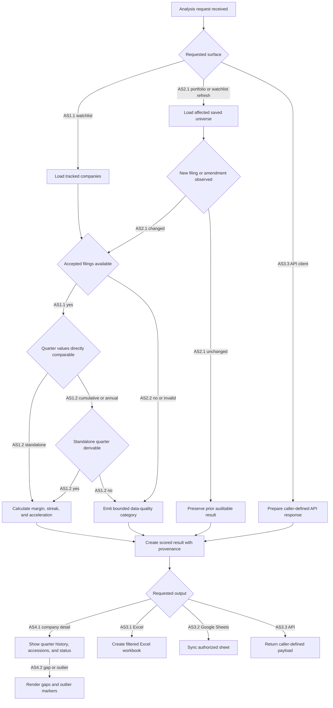

# Feature Specification: Financial Acceleration Tracker

**Feature Branch**: `049-financial-acceleration-tracker`
**Created**: 2026-07-20
**Status**: Draft
**Input**: User description: "Financial Acceleration Tracker: filing-driven analytics product for stock and portfolio analysis."

## One-Line Purpose *(mandatory)*

Portfolio analysts identify accelerating filing-based financial performance across watched companies and portfolios.

## Consumer & Context *(mandatory)*

Analysts, API clients, scheduled jobs, Excel users, and Google Sheets users consume scored company and portfolio trend outputs in browser sessions, APIs, exports, and batch refreshes.

## User Scenarios & Testing *(mandatory)*

### User Story 1 - Identify Filing-Backed Acceleration (Priority: P1)

An analyst reviews a watchlist or portfolio universe and sees quarter-aligned revenue, operating income, operating margin, improvement streak, and acceleration indicators for each company.

**Why this priority**: This is the smallest product slice that delivers the core financial acceleration signal without requiring exports or advanced visualization.

**Independent Test**: Can be tested with a fixed set of companies and filings by running the analysis and verifying the displayed metrics, acceleration flags, and filing provenance.

**Acceptance Scenarios**:

1. **AS1.1 Given** a saved company universe with accepted quarterly filings, **When** the analyst runs filing-backed analysis, **Then** each company shows revenue, operating income, operating margin, improvement streak, acceleration status, and source accession provenance for each calculated quarter.
2. **AS1.2 Given** a filing reports cumulative interim or annual values instead of standalone quarterly values, **When** the system needs a comparable quarter, **Then** it derives the standalone quarter only when the fiscal-period evidence supports the derivation and otherwise marks the metric unavailable with a plain-language reason.

---

### User Story 2 - Refresh Watchlists and Portfolios from New Filings (Priority: P2)

An analyst relies on saved watchlists and portfolios to update automatically when new filings, amendments, or restatements affect tracked companies.

**Why this priority**: The product must be useful after the first analysis run by keeping tracked universes current and preserving restatement history.

**Independent Test**: Can be tested by introducing a new filing or amendment fixture for a tracked company and verifying that affected watchlist or portfolio rows refresh while prior filing-derived values remain auditable.

**Acceptance Scenarios**:

1. **AS2.1 Given** a saved watchlist or portfolio contains a company with a newly accepted filing or amendment, **When** the filing detector observes the filing, **Then** the affected metrics refresh and the result records whether the value is new, amended, restated, or unchanged.
2. **AS2.2 Given** a tracked company has missing, ambiguous, invalid, or zero-denominator data, **When** the analyst views results, **Then** the dashboard and API display gaps and bounded data-quality categories instead of interpolated values or raw technical errors.

---

### User Story 3 - Export and Integrate Results (Priority: P3)

An analyst sends filtered acceleration results to Excel, Google Sheets, or an API client without losing calculation status, provenance, or chart context.

**Why this priority**: Spreadsheet and API delivery turn the analysis into an operational workflow rather than a dashboard-only report.

**Independent Test**: Can be tested by filtering a known result set, exporting it through each destination, and verifying that rows, values, status labels, and provenance match the source dashboard.

**Acceptance Scenarios**:

1. **AS3.1 Given** an analyst has filtered a dashboard view, **When** they export to Excel, **Then** the workbook contains the same companies, metrics, filters, data-quality statuses, source accessions, formatting, and sparklines expected for the visible result set.
2. **AS3.2 Given** an analyst has authorized a Google Sheets destination, **When** they sync a result set, **Then** the sheet receives the same rows, values, status labels, and provenance as the dashboard.
3. **AS3.3 Given** an API client requests a company, watchlist, portfolio, or metric history result, **When** the request is valid for the caller, **Then** the API returns the same scored metrics, histories, data-quality categories, and provenance available in the browser.

---

### User Story 4 - Inspect Company-Level Trend History (Priority: P4)

An analyst opens a company detail view to understand why an acceleration score changed and whether visual history is trustworthy.

**Why this priority**: Company-level inspection helps analysts trust the ranked output, especially around restatements, missing facts, and outlier quarters.

**Independent Test**: Can be tested with a company fixture containing complete quarters, missing quarters, an outlier, and a restatement by verifying the detail view and charts preserve those distinctions.

**Acceptance Scenarios**:

1. **AS4.1 Given** an analyst selects a company, **When** the company detail view loads, **Then** it shows quarter-aligned metric history, filing accessions, amendment or restatement status, and calculation status for each displayed quarter.
2. **AS4.2 Given** a company has a missing quarter, invalid quarter, or outlier quarter, **When** the sparkline or metric history renders, **Then** the visualization preserves the gap or outlier marker and does not smooth, interpolate, or hide the data-quality state.

### Edge Cases

- A filing reports year-to-date facts for Q2 or Q3, requiring standalone-quarter derivation before any trend comparison.
- An annual filing is available but one or more interim quarters needed for Q4 derivation are missing or restated.
- Revenue is zero, negative, missing, or ambiguous, making operating margin unavailable for that quarter.
- Multiple filings, amendments, or restatements exist for the same company and fiscal period.
- A company changes ticker, fiscal year-end, reporting currency, or segment emphasis across the analyzed history.
- A metric has multiple plausible GAAP concepts or standardized statement lines, and the selector cannot choose one confidently.
- SEC retrieval, XBRL parsing, validation, or rate-limit failures prevent a filing from being processed.
- A watchlist or portfolio contains duplicate companies, stale tickers, inactive companies, or holdings with no available SEC filing history.
- A chart has a single extreme outlier that would visually flatten otherwise meaningful quarter-to-quarter movement.

## Flowchart *(mandatory)*

## Data & State Preconditions *(mandatory)*

- A caller has permission to access the requested watchlist, portfolio, company universe, export destination, or API scope.
- Each analyzed public company can be resolved to a company identity suitable for SEC filing lookup.
- Accepted filings are distinguishable by company, accession, acceptance timestamp, fiscal period, form type, and amendment status.
- Financial facts and statement lines have enough fiscal-period context to identify whether values are standalone quarterly, cumulative interim, or annual.
- Metric definitions exist for revenue, operating income, operating margin, improvement streak, and acceleration.
- A bounded data-quality category exists for every unavailable, ambiguous, invalid, or failed analysis outcome.
- Google Sheets export is available only for callers with a valid authorization state.

## Inputs & Outputs *(mandatory)*

| Direction | Description | Format |
| :-- | :-- | :-- |
| Input | A caller-defined request identifying companies, portfolios or watchlists, requested metrics, filters, refresh mode, export destination, or API scope. | Caller-defined |
| Output | A caller-defined browser, API, Excel, or Google Sheets result containing quarter-aligned metrics, acceleration flags, data-quality statuses, visual history, and filing provenance. | Caller-defined |

## Constraints & Non-Goals *(mandatory)*

**Must NOT**:
- Must NOT fabricate, interpolate, smooth, or silently replace missing financial facts.
- Must NOT use unlicensed or noncommercial market-data sources for price, options, or portfolio performance analytics.
- Must NOT incorporate GPL or AGPL code into the product unless the owner explicitly accepts the license obligations.
- Must NOT treat an amended or restated filing as a destructive overwrite of prior provenance.
- Must NOT expose raw parser traces, stack traces, or unbounded provider errors to analysts or API clients.

**Adopted dependencies** *(include if feature uses external tools/packages to deliver capability)*:
- `dgunning/edgartools` for SEC company lookup, filing discovery, filing metadata, XBRL facts, standardized statements, fiscal-period context, and tabular extraction.
- `Arelle/Arelle` and `Arelle/EDGAR` as validation and failure-diagnosis fallback tools, not as the primary filing path.
- `xang1234/stock-screener` or equivalent existing FastAPI, React, PostgreSQL, Redis, Celery, watchlist, table, chart, and deployment shell patterns.
- `TanStack/table` and `recharts/recharts` for sortable/filterable dashboard tables and visual metric histories.
- `jmcnamara/XlsxWriter` for Excel workbook export.
- `burnash/gspread` for Google Sheets creation, range updates, formatting, worksheet management, and permissions.

**Out of scope** *(things this feature genuinely does not do, even via external tools)*:
- Universal XBRL concept mapping across every company and taxonomy.
- Generic metric dependency engine or manual mapping console before repeated unmapped metrics prove the need.
- Separate lineage platform, generic data-quality framework, or workflow orchestrator beyond the existing job infrastructure.
- Arelle-first processing for every filing when standardized SEC extraction succeeds.
- Cross-company accounting-policy normalization beyond transparent data-quality labeling.
- Price feeds, options feeds, real-time portfolio P&L, brokerage integrations, and market-data redistribution.
- Custom spreadsheet writers, custom chart engines, or custom authentication frameworks when adopted packages cover those needs.

## Requirements *(mandatory)*

### Functional Requirements

- **FR-001**: System MUST let authorized users define and maintain watchlists and portfolio universes for filing-backed company analysis.
- **FR-002**: System MUST resolve tracked companies to identities usable for SEC filing discovery and filing provenance.
- **FR-003**: System MUST detect relevant new filings, amendments, and restatements for tracked companies.
- **FR-004**: System MUST retain immutable filing provenance, including accession, form type, acceptance timestamp, fiscal period, and amendment status for every displayed or exported metric.
- **FR-005**: System MUST extract the financial facts and statement lines required for the supported metric registry.
- **FR-006**: System MUST distinguish standalone quarterly, cumulative interim, and annual values before any quarter-to-quarter comparison.
- **FR-007**: System MUST derive standalone quarterly values from cumulative or annual filings only when the required fiscal-period evidence is present.
- **FR-008**: System MUST select revenue and operating income using a documented priority order and mark the metric unavailable when the selector cannot choose a reliable value.
- **FR-009**: System MUST calculate operating margin as operating income divided by revenue only when the numerator and denominator are valid for the same fiscal quarter.
- **FR-010**: System MUST calculate improvement streaks from quarter-aligned metric histories.
- **FR-011**: System MUST calculate acceleration using first and second differences with materiality thresholds to avoid flagging immaterial changes.
- **FR-012**: System MUST mark unavailable, ambiguous, invalid, missing, amended, restated, and retrieval-failed states with bounded plain-language data-quality categories.
- **FR-013**: System MUST refresh affected watchlist and portfolio results after newly observed filings, amendments, or restatements.
- **FR-014**: System MUST preserve prior filing-derived observations when a newer accepted filing changes the current value.
- **FR-015**: System MUST provide sortable and filterable dashboard views for company, watchlist, portfolio, metric, acceleration, streak, fiscal period, and data-quality status.
- **FR-016**: System MUST provide company-level metric history with sparklines or charts that preserve gaps, outliers, amendments, restatements, and source provenance.
- **FR-017**: System MUST expose caller-authorized API results for companies, watchlists, portfolios, metric histories, acceleration scores, and data-quality categories.
- **FR-018**: System MUST export filtered result sets to Excel while preserving visible rows, metric values, statuses, source accessions, and visual context.
- **FR-019**: System MUST sync filtered result sets to Google Sheets for callers with valid authorization while preserving visible rows, metric values, statuses, and source accessions.
- **FR-020**: System MUST prevent users from seeing or mutating watchlists, portfolios, exports, or API results outside their authorization scope.
- **FR-021**: System MUST expose a bounded operational failure state when SEC retrieval, filing parsing, validation, export, or Google authorization fails.

### Key Entities *(include if feature involves data)*

- **Company**: Public issuer being analyzed; associated with identifiers needed for ticker display, SEC lookup, and portfolio/watchlist membership.
- **Filing**: Accepted SEC filing or amendment; carries accession, form type, acceptance timestamp, fiscal period, and provenance used by every metric observation.
- **Financial Fact**: Filing-derived numeric value with concept, fiscal period, unit, source filing, and data-quality status.
- **Fiscal Period**: Comparable quarterly period used to align standalone, cumulative, and annual filing facts.
- **Metric Definition**: Supported metric rule, selector priority, materiality threshold, and display metadata.
- **Metric Observation**: Calculated or unavailable metric result for a company and fiscal period, including source provenance and quality status.
- **Watchlist**: User-maintained company collection used for analysis, filtering, monitoring, and export.
- **Portfolio**: User-maintained company collection that may include holdings metadata while remaining scoped to filing-backed analytics.
- **Analysis Run**: Refresh or request execution that records which companies, filings, metrics, and statuses were evaluated.
- **Export Request**: User or API request to produce Excel or Google Sheets output for a filtered result set.

## Success Criteria *(mandatory)*

### Measurable Outcomes

- **SC-001**: In a fixture corpus covering standalone quarters, cumulative interim facts, Q4 derivation, amendments, restatements, missing facts, and zero-denominator cases, 100% of revenue, operating income, operating margin, streak, and acceleration outputs match documented expected results.
- **SC-002**: 100% of displayed, exported, and API-returned metric observations include source filing provenance or a bounded data-quality category explaining why the metric is unavailable.
- **SC-003**: For a saved universe of 500 tracked companies with warm analyzed data, at least 95% of dashboard first-page requests return in under two seconds.
- **SC-004**: For a filtered result set of 5,000 rows or fewer, Excel and Google Sheets exports reproduce 100% of visible rows, metric values, status labels, and source accessions from the dashboard.
- **SC-005**: After the filing detector observes a new filing or amendment for a tracked company, affected watchlist and portfolio analysis results become visibly refreshed or explicitly failed within the next scheduled processing cycle.

## Definition of Done *(mandatory)*

This feature is shipped when production users can run filing-backed analysis for saved watchlists and portfolios, view and export quarter-aligned metrics with accession provenance and data-quality gaps, and meet 100% fixture-correctness plus 95% warm-dashboard responses under two seconds.

## Open Questions *(include if any unresolved decisions exist)*

No material open questions block this scoped spec; price feeds, options data, real-time portfolio P&L, and brokerage integrations are explicitly outside this feature until a licensed provider and expanded acceptance criteria are selected.
